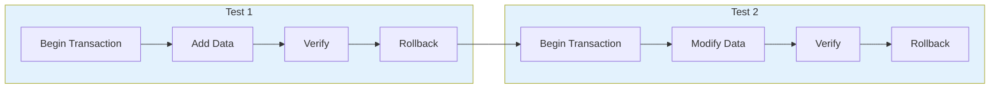

Learn how to isolate tests and prevent data contamination between tests using database transactions.

## What is Database Test Isolation?

Sonamu wraps each test in a **transaction** and **automatically rolls back** when the test ends. This ensures:

- Data doesn't mix between tests
- Always same results regardless of test execution order
- No separate cleanup needed to restore DB to initial state



## Automatic Transaction Management

### bootstrap() Function

Sonamu's `bootstrap()` function automatically manages transactions:

```typescript
import { bootstrap, test } from "sonamu/test";
import { vi } from "vitest";

// Call once at top of test file
bootstrap(vi);

test("create user", async () => {
  // beforeEach: Transaction starts
  const user = await userModel.create({ username: "john" });
  expect(user.id).toBeDefined();
  // afterEach: Transaction rollback → Not actually saved to DB
});

test("query users", async () => {
  // New transaction starts
  // Previous test data doesn't exist
  const users = await userModel.findMany({});
  expect(users.length).toBe(0);
  // Transaction rollback
});
```

### What bootstrap() Does

```typescript
export function bootstrap(vi: VitestUtils) {
  beforeAll(async () => {
    await Sonamu.initForTesting();
  });
  
  beforeEach(async () => {
    await DB.createTestTransaction();  // Start transaction
  });
  
  afterEach(async ({ task }) => {
    vi.useRealTimers();
    await DB.clearTestTransaction();   // Rollback transaction
    
    // Send Naite logs
    await NaiteReporter.reportTestResult({...});
  });
  
  afterAll(() => {});
}
```

**Key points**:
1. `beforeEach`: Create transaction before each test starts
2. `afterEach`: Rollback transaction after each test ends
3. Always rollback regardless of test success/failure

## Test Environment DB Configuration

### sonamu.config.ts

Test DB is configured in `sonamu.config.ts`:

<CodeGroup>

```typescript sonamu.config.ts
import type { SonamuConfig } from "sonamu";

export const config: SonamuConfig = {
  database: {
    name: "myapp",
    defaultOptions: {
      client: "postgresql",
      connection: {
        host: "localhost",
        port: 5432,
        user: "postgres",
        password: "password",
      },
    },
    environments: {
      // Test environment settings
      test: {
        connection: {
          database: "myapp_test",  // Separate test DB
        },
        pool: {
          min: 1,
          max: 1,  // Single connection pool (transaction isolation)
        },
      },
      development: {
        connection: {
          database: "myapp_dev",
        },
      },
      production: {
        connection: {
          database: "myapp_prod",
        },
      },
    },
  },
};
```

```bash Create Test DB
# PostgreSQL
createdb myapp_test

# MySQL
mysql -u root -e "CREATE DATABASE myapp_test;"
```

</CodeGroup>

**Important**:
- Test DB is **completely separate** from development/production DB
- Set `pool.max: 1` to use single connection (guarantees transaction isolation)

### DB Class Test Mode

The `DB` class automatically switches to test mode when `NODE_ENV=test`:

```typescript
// db.ts internal
getDB(which: DBPreset): Knex {
  if (process.env.NODE_ENV === "test") {
    // If test transaction exists, return it
    if (this.testTransaction) {
      return this.testTransaction;
    }
    
    // Otherwise return wdb (single connection pool)
    if (!this.wdb) {
      this.wdb = createKnexInstance({
        ...dbConfig.test,
        pool: { min: 1, max: 1 },
      });
    }
    return this.wdb;
  }
  
  // Development/production environment logic
  // ...
}
```

## Transaction Isolation Mechanism

### createTestTransaction()

Called in `beforeEach` to start a new transaction:

```typescript
// db.ts
public testTransaction: Knex.Transaction | null = null;

async createTestTransaction(): Promise<Knex.Transaction> {
  const db = this.getDB("w");
  this.testTransaction = await db.transaction();
  return this.testTransaction;
}
```

**How it works**:
1. Get Write DB instance
2. Start new transaction
3. Store in `testTransaction` property
4. All subsequent queries execute through this transaction

### clearTestTransaction()

Called in `afterEach` to rollback and clean up transaction:

```typescript
// db.ts
async clearTestTransaction(): Promise<void> {
  await this.testTransaction?.rollback();
  this.testTransaction = null;
}
```

**How it works**:
1. Rollback current transaction (cancel all changes)
2. Initialize `testTransaction` to `null`
3. Ready for next test

## Practical Examples

### Basic CRUD Test

```typescript
import { bootstrap, test } from "sonamu/test";
import { userModel } from "../application/user/user.model";
import { expect, vi } from "vitest";

bootstrap(vi);

test("create and query user", async () => {
  // Create
  const created = await userModel.create({
    username: "john",
    email: "john@example.com",
  });
  expect(created.id).toBeDefined();
  
  // Query
  const found = await userModel.findById(created.id);
  expect(found?.username).toBe("john");
  
  // Auto rollback in afterEach → Not actually saved to DB
});

test("update user", async () => {
  // New transaction starts → No data from previous test
  const user = await userModel.create({ username: "jane" });
  
  // Update
  await userModel.update(user.id, { username: "jane_updated" });
  
  // Verify
  const updated = await userModel.findById(user.id);
  expect(updated?.username).toBe("jane_updated");
  
  // Rollback
});

test("delete user", async () => {
  const user = await userModel.create({ username: "bob" });
  
  await userModel.delete(user.id);
  
  const deleted = await userModel.findById(user.id);
  expect(deleted).toBeNull();
});
```

### Multiple Table Operations

```typescript
test("create post and comments", async () => {
  // Create user
  const user = await userModel.create({ username: "john" });
  
  // Create post
  const post = await postModel.create({
    author_id: user.id,
    title: "Hello World",
  });
  
  // Create comment
  const comment = await commentModel.create({
    post_id: post.id,
    author_id: user.id,
    content: "Nice post!",
  });
  
  // Verify
  const comments = await commentModel.findByPostId(post.id);
  expect(comments.length).toBe(1);
  expect(comments[0].content).toBe("Nice post!");
  
  // Rollback → user, post, comment all deleted
});
```

### Error Handling in Transactions

```typescript
test("duplicate username error", async () => {
  await userModel.create({ username: "john" });
  
  // Try to create with duplicate username
  await expect(
    userModel.create({ username: "john" })
  ).rejects.toThrow("Username already exists");
  
  // Transaction rolls back even on error
});

test("constraint violation", async () => {
  // NOT NULL constraint violation
  await expect(
    userModel.create({ username: null as any })
  ).rejects.toThrow();
  
  // Rollback keeps DB state clean
});
```

### Complex Business Logic Test

```typescript
test("full order creation flow", async () => {
  // 1. Create user
  const user = await userModel.create({ username: "customer" });
  
  // 2. Create product
  const product = await productModel.create({
    name: "Laptop",
    price: 1000000,
    stock: 10,
  });
  
  // 3. Create order (includes stock reduction)
  const order = await orderModel.create({
    user_id: user.id,
    items: [{ product_id: product.id, quantity: 2 }],
  });
  
  // 4. Check stock
  const updatedProduct = await productModel.findById(product.id);
  expect(updatedProduct?.stock).toBe(8);  // 10 - 2
  
  // 5. Check order
  expect(order.total_amount).toBe(2000000);
  
  // Full rollback → user, product, order all deleted, stock restored
});
```

## Test Isolation Verification

### Isolation Check Test

```typescript
import { bootstrap, test } from "sonamu/test";
import { userModel } from "../application/user/user.model";
import { expect, vi } from "vitest";

bootstrap(vi);

test("Test 1: Create data", async () => {
  const user = await userModel.create({ username: "test1" });
  expect(user.id).toBeDefined();
  
  const count = await userModel.count();
  expect(count).toBe(1);
});

test("Test 2: Verify isolation", async () => {
  // Previous test data was rolled back
  // DB should be clean
  const count = await userModel.count();
  expect(count).toBe(0);  // ✅ Passes
  
  // Create new data
  await userModel.create({ username: "test2" });
  const newCount = await userModel.count();
  expect(newCount).toBe(1);
});

test("Test 3: Verify isolation again", async () => {
  const count = await userModel.count();
  expect(count).toBe(0);  // ✅ Passes
});
```

## Manual Transaction Control

You can manually control transactions when needed:

```typescript
import { DB } from "sonamu";

test("manual transaction control", async () => {
  // Get current test transaction
  const trx = DB.testTransaction;
  
  if (!trx) {
    throw new Error("No transaction");
  }
  
  // Execute query directly within transaction
  await trx("users").insert({
    username: "manual",
    email: "manual@example.com",
  });
  
  const users = await trx("users").where({ username: "manual" });
  expect(users.length).toBe(1);
  
  // Auto rollback in afterEach
});
```

## Operations Outside Transaction (Caution)

Some operations execute outside transaction scope, so caution is needed:

<Warning>
**Operations not rolled back by transactions**:

1. **File system operations**
   ```typescript
   test("file upload", async () => {
     await fs.writeFile("/tmp/test.txt", "data");
     // ❌ Not rolled back → Manual deletion needed after test
   });
   ```

2. **External API calls**
   ```typescript
   test("payment API call", async () => {
     await paymentAPI.charge(1000);
     // ❌ Actual payment occurs → Need to use Mock
   });
   ```

3. **DDL statements (exception for PostgreSQL)**
   ```typescript
   test("create table", async () => {
     await DB.getDB("w").schema.createTable("temp", (t) => {
       t.increments("id");
     });
     // PostgreSQL: ✅ Rolled back
     // MySQL: ❌ Not rolled back (DDL commits immediately)
   });
   ```

4. **Time functions (NOW(), CURRENT_TIMESTAMP, etc.)**
   ```typescript
   test("check creation time", async () => {
     const user = await userModel.create({ username: "john" });
     // user.created_at is actual current time
     // Can control with vi.useFakeTimers()
   });
   ```
</Warning>

### File System Mocking

Use Naite Mock for file operations:

```typescript
import { Naite } from "sonamu";
import { access, constants } from "fs/promises";

test("virtual file system", async () => {
  const filePath = "/tmp/virtual-file.txt";
  
  // Register virtual file
  Naite.t("mock:fs/promises:virtualFileSystem", filePath);
  
  // Check file existence
  await expect(access(filePath, constants.F_OK)).resolves.toBeUndefined();
  
  // Delete Mock
  Naite.del("mock:fs/promises:virtualFileSystem");
  
  // File no longer exists
  await expect(access(filePath, constants.F_OK)).rejects.toThrow();
});
```

See [API Mocking](/testing/mocking/api-mocking) for details.

## Performance Optimization

### Single Connection Pool

In test environment, set `pool.max: 1` to use only single connection:

```typescript
// sonamu.config.ts
test: {
  pool: {
    min: 1,
    max: 1,  // Single connection
  },
}
```

**Reason**:
- Same connection must be used to guarantee transaction isolation
- Transactions aren't shared with multiple connections

### Limit Parallel Execution

Running tests sequentially is safer:

```json
// package.json
{
  "scripts": {
    "test": "vitest run --no-threads"
  }
}
```

Or `vitest.config.ts`:

```typescript
export default defineConfig({
  test: {
    pool: "forks",
    poolOptions: {
      forks: {
        singleFork: true,  // Single process
      },
    },
  },
});
```

## Cautions

<Warning>
**Cautions for database testing**:

1. **bootstrap() required**: If `bootstrap(vi)` is not called, transactions are not created and data is actually saved to DB.

2. **Separate test DB**: Always separate development DB and test DB. Development data could be accidentally deleted.

3. **Clean up external resources**: Files, external API calls, etc. must be cleaned up manually.

4. **DDL caution**: In MySQL, DDL statements commit immediately and are not rolled back. Avoid table creation/deletion in tests.

5. **Limit parallel execution**: Sequential test execution is recommended for transaction isolation.
</Warning>

## Next Steps

<CardGroup cols={2}>
  <Card title="runWithMockContext" icon="circle" href="/testing/mocking/run-with-mock-context">
    Testing with Mock Context
  </Card>
  <Card title="API Mocking" icon="code" href="/testing/mocking/api-mocking">
    Mocking external API calls
  </Card>
  <Card title="Naite Logging" icon="pen" href="/testing/naite/recording-logs">
    Recording and tracking test logs
  </Card>
  <Card title="Bootstrap" icon="gear" href="/testing/getting-started/bootstrap">
    Test environment initialization
  </Card>
</CardGroup>
