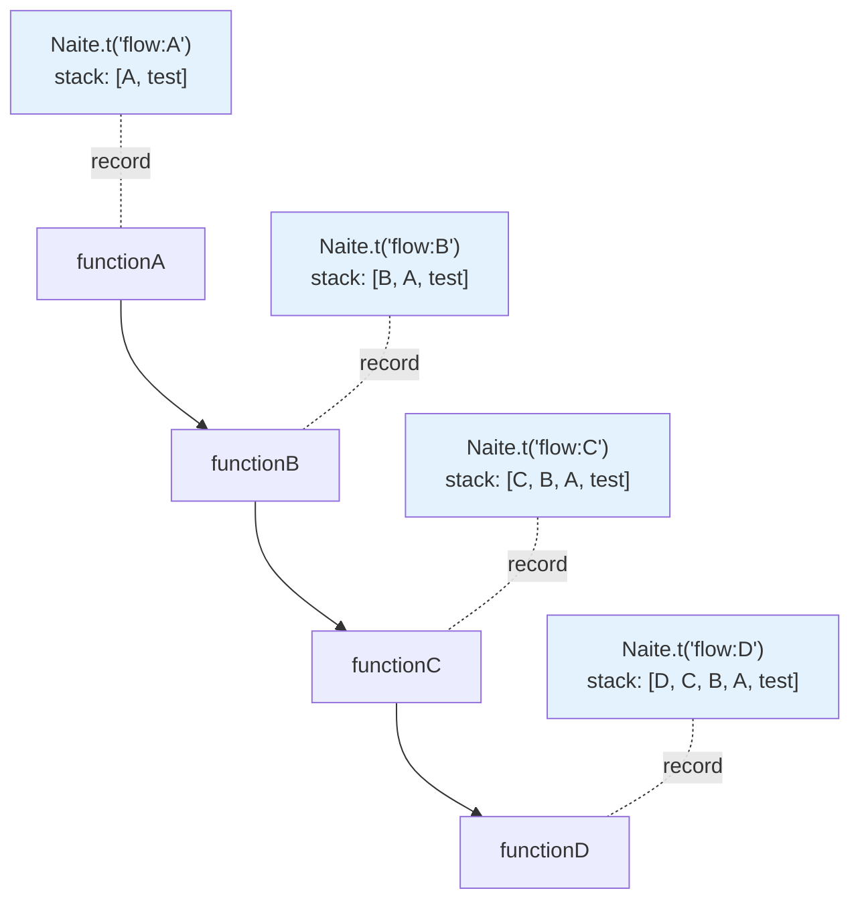

Learn how to effectively debug tests using Naite's callstack tracking feature.

## Callstack Tracking Overview

<CardGroup cols={2}>
  <Card title="Automatic Collection" icon="gears">
    Automatic callstack tracking

    on Naite.t() calls
  </Card>
  <Card title="Call Path" icon="route">
    Function call sequence

    File location info
  </Card>
  <Card title="Debugging Support" icon="bug">
    Identify problem location

    Trace root cause
  </Card>
  <Card title="Viewer Integration" icon="eye">
    Visualize in VSCode

    Click to navigate
  </Card>
</CardGroup>

## What is a Callstack?

A callstack is a data structure that tracks the order of function calls during program execution. Naite automatically collects the callstack at the point of `Naite.t()` calls, allowing you to pinpoint exactly where logs were recorded.

### Why is Callstack Important?

In complex applications, a single operation executes through multiple functions. When problems occur, knowing the path through which functions were called makes debugging much easier.

<Tabs>
  <Tab title="Limitations of console.log">
    ```typescript
    function saveUser() {
      console.log("Saving user..."); // Don't know where it was called from
    }

    // Path A: test1 → createUser → saveUser
    // Path B: test2 → updateUser → saveUser
    // Path C: test3 → importUsers → saveUser

    // Same log comes from three paths
    // Difficult to determine which path
    ```
  </Tab>

  <Tab title="Naite's Solution">
    ```typescript
    function saveUser() {
      Naite.t("user:save", { /* ... */ });
      // Automatically collects callstack:
      // [saveUser → createUser → test1 → runWithMockContext]
    }

    // When querying later
    const logs = Naite.get("user:save")
      .fromFunction("createUser")  // Only path A
      .result();

    // Or
    const logs = Naite.get("user:save")
      .fromFunction("updateUser")  // Only path B
      .result();
    ```
  </Tab>
</Tabs>

### Basic Structure

The callstack information collected by Naite is as follows:

```typescript
interface StackFrame {
  functionName: string | null;  // "createUser"
  filePath: string;              // "/Users/.../user.model.ts"
  lineNumber: number;            // 123
}

interface NaiteTrace {
  key: string;
  data: any;
  stack: StackFrame[];  // Callstack array
  at: Date;
}
```

<Accordion title="Callstack Example">

```typescript
async function createUser() {
  Naite.t("user:create", { username: "john" });
}

test("create user", async () => {
  await createUser();
});
```

**Collected callstack**:
```typescript
[
  {
    functionName: "createUser",
    filePath: "/Users/.../user.model.ts",
    lineNumber: 15
  },
  {
    functionName: "test",
    filePath: "/Users/.../user.model.test.ts",
    lineNumber: 42
  },
  {
    functionName: "runWithMockContext",
    filePath: "/Users/.../bootstrap.ts",
    lineNumber: 58
  }
]
```

**Meaning**:
1. `createUser` (line 15): Location where `Naite.t()` was actually called
2. `test` (line 42): Test code called `createUser`
3. `runWithMockContext`: Sonamu's Context wrapper (ends here)

</Accordion>

## How Callstack Collection Works

### extractCallStack() Behavior

Naite uses JavaScript's `Error` object to collect callstacks.

```typescript
function extractCallStack(): StackFrame[] {
  // Create callstack at current point
  const stack = new Error().stack;
  if (!stack) return [];

  const lines = stack.split("\n");

  // Callstack structure:
  // [0]: "Error"
  // [1]: "at extractCallStack"
  // [2]: "at Naite.t"
  // [3]: Actual call location starts here
  const frames = lines
    .slice(3)  // Exclude above 3
    .map(parseStackFrame)
    .filter((frame): frame is StackFrame => frame !== null);

  // Cut at runWithContext when found
  const contextIndex = frames.findIndex(
    (f) =>
      f.functionName?.includes("runWithContext") ||
      f.functionName?.includes("runWithMockContext")
  );

  return contextIndex >= 0
    ? frames.slice(0, contextIndex + 1)
    : frames;
}
```

<Steps>
  <Step title="Create Error Object">
    Get current callstack as string with `new Error().stack`.
  </Step>

  <Step title="Remove Unnecessary Frames">
    Exclude `Error`, `extractCallStack`, `Naite.t` frames (`slice(3)`).
  </Step>

  <Step title="Parse">
    Parse each line into `StackFrame` objects.
  </Step>

  <Step title="End at Context Boundary">
    Cut at `runWithContext` when encountered. Beyond that is Vitest internal code which is not meaningful.
  </Step>
</Steps>

### parseStackFrame() Logic

Parses two callstack formats:

<Tabs>
  <Tab title="Format 1: With Function Name">
    ```
    at FunctionName (filePath:lineNumber:columnNumber)
    ```

    ```typescript
    const matchWithFunc = line.match(/at\s+(.+?)\s+\((.+?):(\d+):\d+\)/);
    if (matchWithFunc) {
      const functionName = matchWithFunc[1];
      const filePath = matchWithFunc[2];
      const lineNumber = Number.parseInt(matchWithFunc[3], 10);

      return { functionName, filePath, lineNumber };
    }
    ```
  </Tab>

  <Tab title="Format 2: Anonymous Function">
    ```
    at filePath:lineNumber:columnNumber
    ```

    ```typescript
    const matchNoFunc = line.match(/at\s+(.+?):(\d+):\d+$/);
    if (matchNoFunc) {
      const filePath = matchNoFunc[1];
      const lineNumber = Number.parseInt(matchNoFunc[2], 10);

      return {
        functionName: null,  // Anonymous
        filePath,
        lineNumber,
      };
    }
    ```
  </Tab>

  <Tab title="Special Case: node:internal">
    ```typescript
    // If filePath already contains :
    // (e.g., "node:internal/process/task_queues")
    if (filePath.includes(":")) {
      return {
        functionName,
        filePath,
        lineNumber: 0  // No line number
      };
    }
    ```
  </Tab>
</Tabs>

<Info>
**Why End at runWithContext**: Naite keeps only meaningful callstacks. `runWithContext` is Sonamu's Context boundary, and above it is Vitest's internal code which doesn't help with debugging.
</Info>

## Practical Debugging Scenarios

### 1. Tracing Call Paths

Track only specific paths in complex function call chains.

```typescript
async function processOrder(orderId: number) {
  Naite.t("order:process:start", { orderId });

  await validateOrder(orderId);
  await chargePayment(orderId);
  await sendNotification(orderId);

  Naite.t("order:process:done", { orderId });
}

async function chargePayment(orderId: number) {
  Naite.t("payment:charge", { orderId });
  // Payment processing
}

test("order processing", async () => {
  await processOrder(123);

  // Check where payment:charge was called from
  const trace = Naite.get("payment:charge").getTraces()[0];

  // Print callstack
  console.log("Callstack:");
  trace.stack.forEach((frame, i) => {
    console.log(`${i + 1}. ${frame.functionName} (${frame.filePath}:${frame.lineNumber})`);
  });

  // Output:
  // 1. chargePayment (/Users/.../payment.ts:45)
  // 2. processOrder (/Users/.../order.ts:23)
  // 3. test (/Users/.../order.test.ts:15)
  // 4. runWithMockContext (/Users/.../bootstrap.ts:58)
});
```

<Tip>
**Check in VSCode**: When you click a log in Naite Viewer, the callstack is displayed, and clicking each frame navigates directly to that code location.
</Tip>

### 2. Finding Error Locations

Find the exact location when an error occurs.

```typescript
async function createUser(data: UserCreateInput) {
  Naite.t("user:create:start", data);

  try {
    // Validation
    await validateUser(data);

    // Save to DB
    const user = await db.insert("users").values(data);
    Naite.t("user:create:success", { userId: user.id });

    return user;
  } catch (error) {
    // Record with callstack when error occurs
    Naite.t("user:create:error", {
      error: error.message,
      data,
    });
    throw error;
  }
}

test("error tracking", async () => {
  try {
    await createUser({ username: "" }); // Invalid input
  } catch (error) {
    // Check callstack of error log
    const errorTrace = Naite.get("user:create:error").getTraces()[0];

    // Check file and line where error occurred
    expect(errorTrace.stack[0].filePath).toContain("user.model.ts");
    expect(errorTrace.stack[0].lineNumber).toBeGreaterThan(0);

    // Click in VSCode Viewer to navigate to that location
  }
});
```

<Accordion title="Value of Error Tracking">

Regular `console.log` or `console.error` only shows the error message. But with Naite's callstack:

1. **Exact File and Line**: Exact code location where error occurred
2. **Call Path**: Which functions were called leading to the error
3. **VSCode Integration**: Navigate to code location with one click
4. **Context**: Saved along with data at the time of error

For example, if error occurred in `validateUser`:
```
[
  { functionName: "validateUser", filePath: "...", lineNumber: 78 },
  { functionName: "createUser", filePath: "...", lineNumber: 45 },
  { functionName: "test", filePath: "...", lineNumber: 12 }
]
```

This tells you the error occurred at line 78 in `validateUser`, which was called from line 45 in `createUser`, which was started from line 12 in the test.

</Accordion>

### 3. Analyzing Complex Call Chains

Analyze complex chains called in A → B → C → D order.

```typescript
async function functionA() {
  Naite.t("flow:A", { step: "A" });
  await functionB();
}

async function functionB() {
  Naite.t("flow:B", { step: "B" });
  await functionC();
}

async function functionC() {
  Naite.t("flow:C", { step: "C" });
  await functionD();
}

async function functionD() {
  Naite.t("flow:D", { step: "D" });
}

test("call chain analysis", async () => {
  await functionA();

  // Check callstack length of each log
  const traceA = Naite.get("flow:A").getTraces()[0];
  const traceD = Naite.get("flow:D").getTraces()[0];

  console.log("A's callstack length:", traceA.stack.length);  // 2 (A → test)
  console.log("D's callstack length:", traceD.stack.length);  // 5 (D → C → B → A → test)

  // Check if D's callstack contains all functions
  const functions = traceD.stack.map(f => f.functionName);
  expect(functions).toContain("functionD");
  expect(functions).toContain("functionC");
  expect(functions).toContain("functionB");
  expect(functions).toContain("functionA");

  // Can also verify order
  expect(functions[0]).toBe("functionD");  // Innermost
  expect(functions[3]).toBe("functionA");  // Outermost
});
```

**Visualization**:



### 4. Using fromFunction()

Filter only logs called from a specific function.

```typescript
test("logs called from specific function only", async () => {
  await processOrder(123);

  // Logs directly called from chargePayment function only
  const paymentLogs = Naite.get("*")
    .fromFunction("chargePayment", { from: "direct" })
    .result();

  // All logs in chargePayment's call chain
  const allPaymentLogs = Naite.get("*")
    .fromFunction("chargePayment", { from: "both" })
    .result();

  console.log("Direct calls:", paymentLogs.length);
  console.log("Entire chain:", allPaymentLogs.length);
});
```

<Tabs>
  <Tab title="direct (Direct Call)">
    Checks only the first frame of the callstack (`stack[0]`).

    ```typescript
    fromFunction("chargePayment", { from: "direct" })

    // Matches:
    // [chargePayment, processOrder, test]
    //  ^^^^^^^^^^^^^ in first frame

    // Doesn't match:
    // [sendEmail, chargePayment, processOrder, test]
    //  ^^^^^^^^^ not in first frame
    ```
  </Tab>

  <Tab title="indirect (Indirect Call)">
    Checks only second and later frames of the callstack (`stack[1+]`).

    ```typescript
    fromFunction("chargePayment", { from: "indirect" })

    // Matches:
    // [sendEmail, chargePayment, processOrder, test]
    //             ^^^^^^^^^^^^^ in second frame or later

    // Doesn't match:
    // [chargePayment, processOrder, test]
    //  ^^^^^^^^^^^^^ in first frame (direct call)
    ```
  </Tab>

  <Tab title="both (All, default)">
    Checks the entire callstack.

    ```typescript
    fromFunction("chargePayment", { from: "both" })
    fromFunction("chargePayment")  // Same

    // Matches:
    // [chargePayment, ...]         Direct call
    // [sendEmail, chargePayment, ...] Indirect call
    // All match
    ```
  </Tab>
</Tabs>

## VSCode Viewer Integration

Naite Viewer visually displays callstack information and allows you to navigate to code locations with a single click.

### Callstack Visualization

When you click each log in Naite Viewer, it displays like this:

<Accordion title="Viewer Screen Example" defaultOpen>

```text
user:create:start
{ username: "john", email: "john@example.com" }

📍 Direct call location:
  /Users/.../user.model.ts:15
  ↑ Click to navigate to this location

📚 Full callstack:
  1. createUser (user.model.ts:15)
     ↑ Click to navigate to this location
  2. processUser (user.service.ts:45)
  3. test (user.model.test.ts:42)
  4. runWithMockContext (bootstrap.ts:58)
```

**Interaction**:
- Click each frame to have VSCode editor navigate to the exact line in that file
- Immediately see code context
- Reduces debugging time

</Accordion>

### Practical Usage Examples

<Steps>
  <Step title="Check Logs in Viewer">
    After running tests, find suspicious logs in Naite Viewer.
  </Step>

  <Step title="Check Callstack">
    Click the log to view its callstack. Understand which functions it went through.
  </Step>

  <Step title="Navigate to Code Location">
    Click each frame in the callstack to view the actual code.
  </Step>

  <Step title="Identify and Fix Problem">
    Follow the callstack to find and fix the root cause.
  </Step>
</Steps>

<Tip>
**Pro Tip**: Comparing callstacks of multiple logs in Viewer helps quickly identify differences between normal and abnormal paths.
</Tip>

## Advanced Patterns

### 1. Finding Performance Bottlenecks

Combine callstack and timing information to find performance bottlenecks.

```typescript
async function slowOperation() {
  Naite.t("perf:start", { at: Date.now() });

  await step1(); // Slow step
  Naite.t("perf:step1", { at: Date.now() });

  await step2();
  Naite.t("perf:step2", { at: Date.now() });

  await step3();
  Naite.t("perf:step3", { at: Date.now() });

  Naite.t("perf:end", { at: Date.now() });
}

test("performance analysis", async () => {
  await slowOperation();

  const traces = Naite.get("perf:*").getTraces();

  // Output duration and call location for each step
  for (let i = 1; i < traces.length; i++) {
    const prev = traces[i - 1];
    const curr = traces[i];

    const duration = curr.at.getTime() - prev.at.getTime();

    console.log(`${prev.key} → ${curr.key}: ${duration}ms`);
    console.log(`  Call location: ${curr.stack[0].filePath}:${curr.stack[0].lineNumber}`);

    if (duration > 1000) {
      console.log(`  ⚠️ Bottleneck! (over 1 second)`);
    }
  }
});
```

### 2. Debugging Syncer

Track Syncer's complex template generation process.

```typescript
test("Syncer template generation tracking", async () => {
  await Sonamu.syncer.generateTemplate("model", {
    entityId: "User"
  });

  // Where and how renderTemplate was called
  const renderLogs = Naite.get("syncer:*")
    .fromFunction("renderTemplate")
    .getTraces();

  for (const trace of renderLogs) {
    console.log(`\n${trace.key}:`);
    console.log(`  Data:`, trace.data);
    console.log(`  Callstack:`);

    trace.stack.forEach((frame, i) => {
      console.log(`    ${i + 1}. ${frame.functionName} (${frame.filePath.split('/').pop()}:${frame.lineNumber})`);
    });
  }

  // Output example:
  // syncer:renderTemplate:
  //   Data: { template: "model", entityId: "User" }
  //   Callstack:
  //     1. renderTemplate (syncer.ts:145)
  //     2. generateTemplate (syncer.ts:98)
  //     3. generateAll (syncer.ts:45)
  //     4. test (syncer.test.ts:23)
});
```

### 3. Detecting Infinite Loops

Monitor the depth of recursive functions.

```typescript
async function recursiveFunction(depth: number) {
  Naite.t("recursive:call", { depth });

  if (depth > 100) {
    throw new Error("Too deep!");
  }

  if (depth < 10) {
    await recursiveFunction(depth + 1);
  }
}

test("check recursion depth", async () => {
  await recursiveFunction(0);

  const traces = Naite.get("recursive:call").getTraces();

  // Check callstack length for each depth
  for (const trace of traces) {
    console.log(`Depth ${trace.data.depth}:`);
    console.log(`  Callstack length: ${trace.stack.length}`);

    // How many recursiveFunction in callstack
    const recursiveCount = trace.stack.filter(
      f => f.functionName === "recursiveFunction"
    ).length;

    console.log(`  Recursion depth: ${recursiveCount}`);

    if (recursiveCount > 50) {
      console.warn(`  ⚠️ Recursion is too deep!`);
    }
  }
});
```

### 4. Conditional Logging

Enable detailed logging only under certain conditions.

```typescript
async function processData(data: any[]) {
  const TRACE_SUSPICIOUS = process.env.TRACE_SUSPICIOUS === "true";

  for (let i = 0; i < data.length; i++) {
    const item = data[i];

    // Track only suspicious data
    if (TRACE_SUSPICIOUS && item.suspicious) {
      Naite.t("data:suspicious", {
        index: i,
        item,
      });

      // Can trace who created this data via callstack
    }
  }
}

// Usage:
// TRACE_SUSPICIOUS=true pnpm test
```

## Callstack Limitations

### Ends at runWithContext

Naite stops callstack collection when it encounters `runWithContext` or `runWithMockContext`.

```typescript
function extractCallStack(): StackFrame[] {
  // ...

  // Cut at runWithContext family functions when found
  const contextIndex = frames.findIndex(
    (f) =>
      f.functionName?.includes("runWithContext") ||
      f.functionName?.includes("runWithMockContext")
  );

  return contextIndex >= 0
    ? frames.slice(0, contextIndex + 1)
    : frames;
}
```

**Reasons**:
- `runWithContext` is Sonamu's Context boundary
- Above it is Vitest internal code (meaningless)
- Keep only meaningful callstack for better readability

### node:internal Paths

Node.js internal paths have lineNumber set to 0:

```typescript
if (filePath.includes(":")) {
  return { functionName, filePath, lineNumber: 0 };
}
```

**Example**:
```typescript
{
  functionName: "processTicksAndRejections",
  filePath: "node:internal/process/task_queues",
  lineNumber: 0
}
```

These frames are Node.js internal operations and don't help much with debugging.

### Anonymous Functions

Arrow functions and anonymous functions have `functionName` as `null`:

```typescript
// Anonymous function
const handler = async () => {
  Naite.t("handler:call", {});
};

// Callstack:
// [
//   { functionName: null, filePath: "...", lineNumber: 15 }
// ]
```

<Tip>
For easier debugging, give explicit names to important functions:
```typescript
// ✅ Good approach
async function handleUser() { /* ... */ }

// ❌ Bad approach
const handler = async () => { /* ... */ };
```
</Tip>

## Best Practices

<Steps>
  <Step title="Log at Meaningful Locations">
    ```typescript
    // ✅ Good: At important branch points
    async function processUser(user: User) {
      Naite.t("user:process:start", { userId: user.id });

      if (user.isAdmin) {
        Naite.t("user:process:admin", { userId: user.id });
        await processAdmin(user);
      } else {
        Naite.t("user:process:regular", { userId: user.id });
        await processRegular(user);
      }

      Naite.t("user:process:done", { userId: user.id });
    }
    ```
  </Step>

  <Step title="Log on Error Situations">
    ```typescript
    // ✅ Good: Record callstack when error occurs
    async function riskyOperation() {
      try {
        await dangerousCall();
      } catch (error) {
        Naite.t("error", {
          message: error.message,
          // Callstack is automatically collected
          // Can trace where error occurred
        });
        throw error;
      }
    }
    ```
  </Step>

  <Step title="Use Explicit Function Names">
    ```typescript
    // ✅ Good: Explicit function name
    async function createUser() {
      Naite.t("user:create", {});
    }

    // ❌ Bad: Anonymous function
    const create = async () => {
      Naite.t("user:create", {});
    };
    ```
  </Step>

  <Step title="Utilize VSCode Viewer">
    Keep Naite Viewer open during local development and check callstacks by clicking logs. Navigating directly to code locations significantly speeds up debugging.
  </Step>
</Steps>

## Cautions

<Warning>
**Cautions when using callstack tracking**:

1. **Performance**: Callstack collection has cost, so avoid excessive logging.

2. **Depth**: Deep recursion means longer callstacks. Watch out for infinite recursion.

3. **Anonymous Functions**: Anonymous functions have `functionName` as `null`. Give important functions explicit names.

4. **Minified Code**: Function names may be obfuscated in production builds. But Naite is test-only so this isn't an issue.

5. **Test Only**: Not used in production code (only works when `NODE_ENV === "test"`).
</Warning>

## Next Steps

<CardGroup cols={2}>
  <Card title="Naite Viewer" icon="eye" href="/en/testing/naite/naite-viewer">
    Visually check callstacks with VSCode Extension.
  </Card>
  <Card title="Querying Logs" icon="magnifying-glass" href="/en/testing/naite/querying-logs">
    Filter logs from specific functions with fromFunction().
  </Card>
  <Card title="Recording Logs" icon="pen" href="/en/testing/naite/recording-logs">
    Learn effective logging strategies.
  </Card>
  <Card title="What is Naite?" icon="circle-info" href="/en/testing/naite/what-is-naite">
    Return to Naite overview.
  </Card>
</CardGroup>
