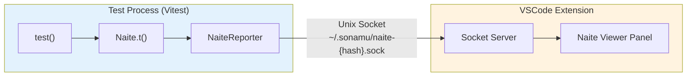
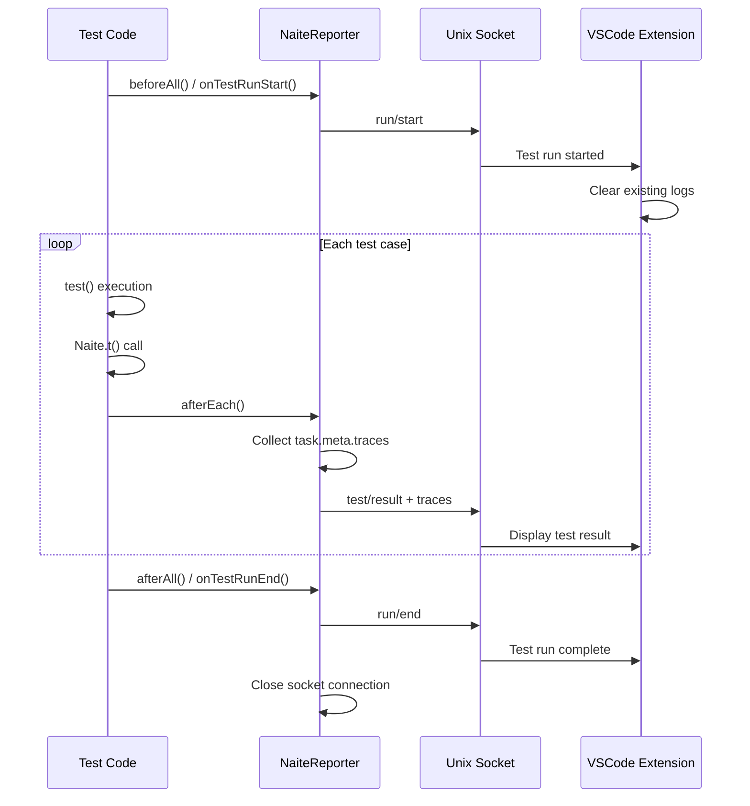

Learn how to use Naite Viewer, the VSCode Extension that visualizes logs recorded during test execution in real-time.

## Naite Viewer Overview

<CardGroup cols={2}>
  <Card title="Real-time Visualization" icon="chart-line">
    During test execution

    Immediate log display
  </Card>
  <Card title="Unix Socket Communication" icon="plug">
    Inter-process communication

    Fast transmission
  </Card>
  <Card title="Project Isolation" icon="folder">
    Separate socket files

    Independent operation
  </Card>
  <Card title="Auto Connection" icon="link">
    On Extension startup

    Automatic socket creation
  </Card>
</CardGroup>

## What is Naite Viewer?

**Naite Viewer** is a feature included in the Sonamu VSCode Extension that visualizes Naite logs recorded during test execution in real-time.

Naite transmits all data recorded with `Naite.t()` during test execution to the VSCode Extension, allowing developers to visually track test flows. This is especially useful for complex business logic or situations involving multiple intertwined function calls.

### Key Features

<Steps>
  <Step title="Real-time Log Display">
    Immediately displays all logs recorded with `Naite.t()` during test execution in the VSCode panel. View structured logs without searching through the console.
  </Step>

  <Step title="Grouping by Test">
    Automatically groups logs by test case. Also categorized by Suite, so you can quickly find desired logs even in large-scale tests.
  </Step>

  <Step title="Callstack Tracking">
    Displays the call location and full callstack information for each log. Click on a log to navigate directly to that code location.
  </Step>

  <Step title="Filtering and Search">
    Filter logs from specific modules using wildcard patterns (`user:*`), or search log contents by keyword.
  </Step>
</Steps>

## Architecture

### 1. Unix Socket Communication

Naite Viewer communicates with the test process through Unix Socket. This method allows direct inter-process communication without using the file system, making it fast and secure.



**Benefits of socket communication**:
- **Fast transmission**: Much faster IPC (Inter-Process Communication) than HTTP or files
- **Real-time**: Logs are delivered to Extension immediately as tests run
- **Isolation**: Independent sockets per project prevent conflicts

**Socket path rules**:
<Tabs>
  <Tab title="macOS / Linux">
    ```bash
    ~/.sonamu/naite-{hash}.sock
    ```
    `{hash}` is the first 8 characters of the MD5 hash of the `sonamu.config.ts` path.
  </Tab>

  <Tab title="Windows">
    ```powershell
    \\.\pipe\naite-{hash}
    ```
    Uses Windows Named Pipe.
  </Tab>
</Tabs>

<Accordion title="See Hash Generation Method in Detail">
Each project generates a unique hash based on the absolute path of the `sonamu.config.ts` file:

```typescript
import { createHash } from "crypto";

const configPath = "/project/api/src/sonamu.config.ts";
const hash = createHash("md5")
  .update(configPath)
  .digest("hex")
  .slice(0, 8);

// Example: "a1b2c3d4"
// Final socket path: ~/.sonamu/naite-a1b2c3d4.sock
```

This way, even when running multiple Sonamu projects simultaneously, each uses an independent socket so logs don't get mixed.
</Accordion>

### 2. Message Protocol

Three types of messages are transmitted between the test process and Extension.

#### run/start - Test Run Start

Sent when a test run starts. The Extension clears all existing logs and prepares for a new test run upon receiving this message.

<CodeGroup>

```typescript Message Format
{
  type: "run/start",
  startedAt: "2025-01-08T12:34:56.789Z"
}
```

```typescript Send Timing
// Vitest Reporter's onTestRunStart()
export const NaiteVitestReporter = {
  async onTestRunStart() {
    await NaiteReporter.startTestRun();
  }
};

// Or beforeAll()
beforeAll(async () => {
  await NaiteReporter.startTestRun();
});
```

</CodeGroup>

<Info>
In watch mode, when you modify a file, tests are re-run, and a `run/start` message is sent each time, reinitializing the Viewer.
</Info>

#### test/result - Test Result

Sent each time a test case completes. Includes the test result along with Naite logs (traces).

<CodeGroup>

```typescript Message Format
{
  type: "test/result",
  receivedAt: "2025-01-08T12:34:57.123Z",
  suiteName: "UserModel",
  suiteFilePath: "/Users/.../user.model.test.ts",
  testName: "create user",
  testFilePath: "/Users/.../user.model.test.ts",
  testLine: 15,
  status: "pass",
  duration: 123,
  traces: [
    {
      key: "user:create:input",
      value: { username: "john" },
      filePath: "/Users/.../user.model.test.ts",
      lineNumber: 20,
      at: "2025-01-08T12:34:57.100Z"
    }
  ]
}
```

```typescript Send Timing
// afterEach in bootstrap.ts
afterEach(async ({ task }) => {
  await NaiteReporter.reportTestResult({
    suiteName: task.suite?.name ?? "(no suite)",
    testName: task.name,
    status: task.result?.state ?? "pass",
    traces: task.meta?.traces ?? [],
    // ... other metadata
  });
});
```

</CodeGroup>

**Included information**:
- **Test metadata**: Suite name, file path, line number
- **Test result**: Pass/fail status, duration, error info
- **Naite traces**: All logs recorded with `Naite.t()`

#### run/end - Test Run End

Sent when all tests complete. The Extension recognizes the test run has ended with this message.

<CodeGroup>

```typescript Message Format
{
  type: "run/end",
  endedAt: "2025-01-08T12:34:58.789Z"
}
```

```typescript Send Timing
// Vitest Reporter's onTestRunEnd()
export const NaiteVitestReporter = {
  async onTestRunEnd() {
    await NaiteReporter.endTestRun();
  }
};
```

</CodeGroup>

### 3. Transmission Flow

Let's look at the order in which messages are sent throughout the test execution process.



<Accordion title="Transmission Flow in Code">

```typescript
// 1. Test start - Socket connection and run/start send
beforeAll(async () => {
  await NaiteReporter.startTestRun();
  // → send({ type: "run/start" })
});

// 2. Test execution - Naite log collection
test("create user", async () => {
  Naite.t("user:create:input", { username: "john" });

  const { user } = await userModel.create({ username: "john" });

  Naite.t("user:create:output", { userId: user.id });

  // afterEach runs after test ends
});

// 3. Test end - traces collection and send
afterEach(async ({ task }) => {
  // Collect all Naite logs with getAllTraces()
  task.meta.traces = Naite.getAllTraces();

  // Send to Extension
  await NaiteReporter.reportTestResult({
    testName: task.name,
    status: task.result?.state,
    traces: task.meta.traces,
    // ...
  });
  // → send({ type: "test/result", traces: [...] })
});

// 4. Full run end - run/end send and socket close
afterAll(() => {
  await NaiteReporter.endTestRun();
  // → send({ type: "run/end" })
  // → socket.end()
});
```

</Accordion>

<Tip>
**Buffering Mechanism**: If the Extension hasn't started yet or socket connection is delayed, NaiteReporter stores messages in a buffer and sends them all at once when connection succeeds. This allows you to see previous test logs even if you start the Extension late.
</Tip>

## Installation and Setup

### 1. Extension Installation

<Steps>
  <Step title="Install from VSCode Marketplace">
    1. Click the Extensions icon in VSCode's left sidebar
    2. Search for "Sonamu"
    3. Click the Install button
  </Step>

  <Step title="Verify Extension Activation">
    After installation, if the Sonamu icon appears in VSCode's bottom status bar, it's properly activated.
  </Step>
</Steps>

### 2. Auto Connection

The Extension automatically starts the socket server when it runs:

<Steps>
  <Step title="Project Detection">
    Finds the `sonamu.config.ts` file in the current workspace.
  </Step>

  <Step title="Hash Calculation">
    Generates an MD5 hash (first 8 characters) from the absolute path of `sonamu.config.ts`.
  </Step>

  <Step title="Socket Server Start">
    Starts a Unix Socket server at `~/.sonamu/naite-{hash}.sock`.
  </Step>

  <Step title="Wait for Test Process">
    NaiteReporter connects to this socket when tests run.
  </Step>
</Steps>

<Info>
The Extension creates sockets based on project path, so you must **open the project folder directly** for it to work properly. Opening a parent folder may result in different socket paths that don't connect.
</Info>

### 3. Running Tests

<Tabs>
  <Tab title="Regular Execution">
    ```bash
    pnpm test
    ```
    Runs all tests once and exits.
  </Tab>

  <Tab title="Watch Mode">
    ```bash
    pnpm test --watch
    ```
    Automatically re-runs related tests when files change. The most commonly used mode during development.
  </Tab>

  <Tab title="Specific File">
    ```bash
    pnpm test user.model.test.ts
    ```
    Runs only specific test files.
  </Tab>
</Tabs>

Tests automatically connect to the Extension and display logs in real-time.

## Usage

### 1. Opening the Naite Viewer Panel

<Frame>
  
  <p>Running 'Naite: Open Viewer' from Command Palette to open the panel</p>
</Frame>

<Tabs>
  <Tab title="Command Palette" icon="keyboard">
    1. `Cmd+Shift+P` (macOS) or `Ctrl+Shift+P` (Windows/Linux)
    2. Type "Naite: Open Viewer"
    3. Enter
  </Tab>

  <Tab title="Sidebar" icon="sidebar">
    1. Click the Sonamu icon in VSCode's left Activity Bar
    2. Select the "Naite Viewer" tab
  </Tab>

  <Tab title="Keyboard Shortcut" icon="bolt">
    Set a keyboard shortcut for faster access:
    1. `Cmd+K Cmd+S` → Keyboard Shortcuts
    2. Search "Naite: Open Viewer"
    3. Set desired key combination (e.g., `Cmd+Shift+N`)
  </Tab>
</Tabs>

### 2. Viewing Logs

Logs automatically appear in Naite Viewer when tests run.

#### Viewer Screen Layout

Naite Viewer displays tests in a 3-level hierarchy:

<Tabs>
  <Tab title="Hierarchy Structure" icon="sitemap">
    ```mermaid
    graph TB
        Suite["📁 Suite Level<br/>(UserModel)"]
        Test1["✓ Test Level<br/>create user (123ms)"]
        Test2["✓ Test Level<br/>update user (98ms)"]
        Trace1["📝 Trace Level<br/>user:create:input"]
        Trace2["📝 Trace Level<br/>user:create:output"]
        Trace3["📝 Trace Level<br/>user:update:input"]
        Trace4["📝 Trace Level<br/>user:update:done"]

        Suite --> Test1
        Suite --> Test2
        Test1 --> Trace1
        Test1 --> Trace2
        Test2 --> Trace3
        Test2 --> Trace4

        style Suite fill:#e3f2fd
        style Test1 fill:#f1f8e9
        style Test2 fill:#f1f8e9
        style Trace1 fill:#fff9c4
        style Trace2 fill:#fff9c4
        style Trace3 fill:#fff9c4
        style Trace4 fill:#fff9c4
    ```
  </Tab>

  <Tab title="Actual Screen" icon="window">
    <AccordionGroup>
      <Accordion title="📁 UserModel (5 tests, 4 passed, 1 failed)" defaultOpen>
        <AccordionGroup>
          <Accordion title="✓ create user (123ms)" defaultOpen>
            <CodeGroup>
              ```json user:create:input
              {
                "username": "john",
                "email": "john@example.com"
              }
              ```

              ```json user:create:output
              {
                "userId": 123
              }
              ```
            </CodeGroup>
          </Accordion>

          <Accordion title="✓ update user (98ms)">
            <CodeGroup>
              ```json user:update:input
              {
                "userId": 123,
                "username": "jane"
              }
              ```

              ```json user:update:done
              {
                "success": true
              }
              ```
            </CodeGroup>
          </Accordion>

          <Accordion title="✓ delete user (45ms)">
            <CodeGroup>
              ```json user:delete:input
              {
                "userId": 123
              }
              ```

              ```json user:delete:done
              {
                "deleted": true
              }
              ```
            </CodeGroup>
          </Accordion>

          <Accordion title="✓ find user (32ms)">
            <CodeGroup>
              ```json user:find:input
              {
                "userId": 123
              }
              ```

              ```json user:find:output
              {
                "user": {
                  "id": 123,
                  "username": "jane"
                }
              }
              ```
            </CodeGroup>
          </Accordion>

          <Accordion title="✗ duplicate user creation fails (67ms)">
            <CodeGroup>
              ```json user:create:input
              {
                "username": "jane"
              }
              ```

              ```json user:create:error
              {
                "errorType": "DuplicateError",
                "errorMessage": "Username already exists"
              }
              ```
            </CodeGroup>
          </Accordion>
        </AccordionGroup>
      </Accordion>
    </AccordionGroup>
  </Tab>

  <Tab title="Structure Explanation" icon="info">
    | Level | Description | Example |
    |-------|-------------|---------|
    | **Suite** | Grouped by test file | `UserModel`, `PostModel` |
    | **Test** | Individual test case | `✓ create user (123ms)` |
    | **Trace** | Logs recorded with `Naite.t()` | `user:create:input` |

    **Status Icons**:
    - ✓ Pass: Test succeeded
    - ✗ Fail: Test failed
    - ⊘ Skip: Test skipped
    - ⌛ Pending: Waiting

    **Interactions**:
    - Click Suite/Test to expand/collapse
    - Click Trace to show callstack info
    - Click each callstack frame to navigate to code location
  </Tab>
</Tabs>

<Frame>
  
  <p>Test logs displayed in actual Naite Viewer (Suite > Test > Trace hierarchy)</p>
</Frame>

<Info>
**Real-time Updates**: In watch mode, when you modify a file, tests auto-rerun and the Viewer updates immediately. This lets you see the impact of code changes right away.
</Info>

### 3. Checking Callstack

Click on a log to see detailed information about that `Naite.t()` call.

<Accordion title="Callstack Information Example">

```text
user:create:input
{ username: "john", email: "john@example.com" }

📍 Direct call location:
  /Users/.../user.model.test.ts:20

📚 Full callstack:
  1. test (user.model.test.ts:20)
     ↑ Click to navigate to this location
  2. createUser (user.model.ts:45)
  3. runWithMockContext (bootstrap.ts:58)
```

**Callstack meaning**:
1. `test` (line 20): Location where `Naite.t()` was called in test code
2. `createUser` (line 45): Actual business logic called by test
3. `runWithMockContext`: Sonamu's Context wrapper (displayed up to here)

</Accordion>

<Frame>
  
  <p>Callstack information and code navigation feature when clicking on a log</p>
</Frame>

<Tip>
Clicking each item in the callstack navigates directly to the exact line in that file. This is especially useful for debugging complex call chains.
</Tip>

### 4. Filtering and Search

In large-scale tests, hundreds of logs can be generated. Use filtering to quickly find desired logs.

<Tabs>
  <Tab title="Key Pattern Filter" icon="filter">
    Show only logs from specific modules with wildcard patterns:

    ```text
    user:*           → user:create, user:update, user:delete
    syncer:*         → syncer:renderTemplate, syncer:writeFile
    *:create         → user:create, post:create
    syncer:*:user    → syncer:renderTemplate:user, syncer:writeFile:user
    ```

    Filtering happens in real-time as you type patterns in the input field.
  </Tab>

  <Tab title="Text Search" icon="magnifying-glass">
    Search by log content, file path, function name:

    - Key search: `user:create`
    - Value search: `"john"`
    - File search: `user.model.test.ts`
    - Function search: `createUser`

    Search results are highlighted.
  </Tab>

  <Tab title="Status Filter" icon="check">
    Filter by test status:

    - ✓ Passed only: Only successful tests
    - ✗ Failed only: Only failed tests
    - ⊘ Skipped: Skipped tests
    - ⌛ Pending: Pending tests
  </Tab>
</Tabs>

## Practical Use Cases

### 1. Debugging Complex Business Logic

When debugging complex logic that goes through multiple steps, you can track the state at each step.

```typescript
test("full order processing flow", async () => {
  // Step 1: Order validation
  Naite.t("order:validate:start", { orderId: 123 });
  await validateOrder(123);
  Naite.t("order:validate:done", { valid: true });

  // Step 2: Inventory check
  Naite.t("order:inventory:check", { productId: 456 });
  await checkInventory(456);
  Naite.t("order:inventory:available", { quantity: 10 });

  // Step 3: Payment processing
  Naite.t("order:payment:start", { amount: 50000 });
  await processPayment({ orderId: 123, amount: 50000 });
  Naite.t("order:payment:done", { transactionId: "tx_789" });

  // Step 4: Start shipping
  Naite.t("order:shipping:start", { orderId: 123 });
  await startShipping(123);
  Naite.t("order:shipping:done", { trackingNumber: "TRK_001" });
});
```

<Accordion title="Viewing in Viewer">

In the Viewer, it displays like this:

```text
✓ full order processing flow (456ms)
  └─ order:validate:start     { orderId: 123 }
  └─ order:validate:done      { valid: true }
  └─ order:inventory:check    { productId: 456 }
  └─ order:inventory:available { quantity: 10 }
  └─ order:payment:start      { amount: 50000 }
  └─ order:payment:done       { transactionId: "tx_789" }
  └─ order:shipping:start     { orderId: 123 }
  └─ order:shipping:done      { trackingNumber: "TRK_001" }
```

If payment step failed:
- Logs only up to `order:payment:start`
- Clearly identify which step succeeded
- Use callstack to confirm exact failure location

**Using filters**:
- `order:payment:*` → Show only payment-related logs
- `order:*:start` → Show only start logs for all steps

</Accordion>

### 2. Syncer Code Generation Tracking

Track which templates Sonamu's Syncer rendered and which files it created.

```typescript
test("User entity full generation", async () => {
  await Sonamu.syncer.generateAll({ entityId: "User" });

  // Check only Syncer-related logs with syncer:* filter
  const syncerLogs = Naite.get("syncer:*").result();

  expect(syncerLogs.length).toBeGreaterThan(0);
});
```

<Accordion title="Syncer Log Example">

Viewer shows all operations performed by Syncer:

```text
✓ User entity full generation (2.3s)
  └─ syncer:generateAll:start     { entityId: "User" }
  └─ syncer:renderTemplate        { template: "model", entityId: "User" }
  └─ syncer:writeFile             { path: "user.model.ts" }
  └─ syncer:renderTemplate        { template: "types", entityId: "User" }
  └─ syncer:writeFile             { path: "user.types.ts" }
  └─ syncer:renderTemplate        { template: "service", entityId: "User" }
  └─ syncer:writeFile             { path: "user.service.ts" }
  └─ syncer:generateAll:done      { filesCreated: 3 }
```

**Analysis**:
- See order of file creation
- Measure each template rendering time
- Filter and check specific templates (`syncer:renderTemplate:*`)

</Accordion>

### 3. API Call Chain Tracking

When calling multiple APIs in sequence, track inputs and outputs of each API.

```typescript
test("create post → add comment → send notification", async () => {
  // 1. Create post
  Naite.t("api:post:create:request", { title: "Hello" });
  const { post } = await postModel.create({ title: "Hello" });
  Naite.t("api:post:create:response", { postId: post.id });

  // 2. Add comment
  Naite.t("api:comment:create:request", { postId: post.id, content: "Nice!" });
  const { comment } = await commentModel.create({
    post_id: post.id,
    content: "Nice!"
  });
  Naite.t("api:comment:create:response", { commentId: comment.id });

  // 3. Notify author
  Naite.t("api:notification:send:request", {
    userId: post.author_id,
    type: "new_comment"
  });
  await notificationService.send({
    userId: post.author_id,
    type: "new_comment",
    data: { commentId: comment.id }
  });
  Naite.t("api:notification:send:response", { sent: true });
});
```

<Tip>
**request/response Pattern**: Logging `:request` and `:response` before and after API calls allows clear tracking of each API's inputs and outputs. This is especially useful in integration tests.
</Tip>

### 4. Identifying Performance Bottlenecks

Find sections that take long and optimize them.

```typescript
test("large data processing performance", async () => {
  Naite.t("perf:start", { timestamp: Date.now() });

  // Measure time for each step
  Naite.t("perf:fetch:start", { timestamp: Date.now() });
  const data = await fetchLargeData();
  Naite.t("perf:fetch:done", {
    timestamp: Date.now(),
    dataSize: data.length
  });

  Naite.t("perf:process:start", { timestamp: Date.now() });
  const processed = await processData(data);
  Naite.t("perf:process:done", {
    timestamp: Date.now(),
    processedCount: processed.length
  });

  Naite.t("perf:save:start", { timestamp: Date.now() });
  await saveToDatabase(processed);
  Naite.t("perf:save:done", { timestamp: Date.now() });

  Naite.t("perf:end", { timestamp: Date.now() });
});
```

<Accordion title="Performance Analysis">

Comparing timestamps for each step in Viewer:

```text
✓ large data processing performance (5.2s)
  perf:start          12:34:56.000
  perf:fetch:start    12:34:56.001
  perf:fetch:done     12:34:57.500  ← 1.5 seconds
  perf:process:start  12:34:57.501
  perf:process:done   12:35:00.800  ← 3.3 seconds (bottleneck!)
  perf:save:start     12:35:00.801
  perf:save:done      12:35:01.200  ← 0.4 seconds
  perf:end            12:35:01.201
```

**Analysis result**:
- `processData` takes longest at 3.3 seconds (bottleneck)
- `fetchLargeData` is acceptable at 1.5 seconds
- `saveToDatabase` is fast at 0.4 seconds

→ Focus optimization on `processData`

</Accordion>

### 5. Error Cause Tracking

Track which step and what data caused an error.

```typescript
test("invalid input handling", async () => {
  try {
    Naite.t("user:create:input", { username: "" }); // Empty value

    await userModel.create({ username: "", email: "test@test.com" });
  } catch (error) {
    Naite.t("user:create:error", {
      errorType: error.constructor.name,
      errorMessage: error.message,
      inputData: { username: "" }
    });

    // The callstack of the error log shows exact failure location
  }
});
```

<Info>
**Importance of Callstack for Errors**: The Viewer's callstack info shows the exact code line where the error occurred. This is especially useful for complex call chains that are hard to figure out with `console.log`.
</Info>

## Understanding Internal Structure

### NaiteReporter Connection Management

NaiteReporter includes buffering and reconnection logic for stable socket connection management.

<Accordion title="Full NaiteReporter Structure">

```typescript
class NaiteReporterClass {
  private socketPath: string | null = null;
  private socket: Socket | null = null;
  private connected = false;
  private buffer: string[] = [];

  /**
   * Ensure socket connection
   * - Return immediately if already connected
   * - Store messages in buffer if connecting
   * - Ignore connection failure (Extension may be off)
   */
  private async ensureConnection(): Promise<void> {
    if (this.connected) return;

    return new Promise((resolve, reject) => {
      this.socketPath = getSocketPath();
      this.socket = connect(this.socketPath);

      this.socket.on("connect", () => {
        this.connected = true;

        // Send buffered messages
        for (const msg of this.buffer) {
          this.socket?.write(msg);
        }
        this.buffer = [];

        resolve();
      });

      this.socket.on("error", () => {
        // Ignore error as Extension may be off
        this.connected = false;
        this.socket = null;
        reject();
      });

      this.socket.on("close", () => {
        this.connected = false;
        this.socket = null;
      });
    });
  }

  /**
   * Send message
   * - Send immediately if connected
   * - Store in buffer if connecting
   */
  private async send(data: NaiteMessage): Promise<void> {
    const msg = `${JSON.stringify(data)}\n`;

    await this.ensureConnection().catch(() => {});

    if (this.connected && this.socket) {
      this.socket.write(msg);
    } else {
      this.buffer.push(msg);
    }
  }

  async startTestRun() {
    if (process.env.CI) return; // Ignore in CI

    await this.send({
      type: "run/start",
      startedAt: new Date().toISOString(),
    });
  }

  async reportTestResult(result: TestResult) {
    if (process.env.CI) return;

    await this.send({
      type: "test/result",
      receivedAt: new Date().toISOString(),
      ...result,
    });
  }

  async endTestRun() {
    if (process.env.CI) return;

    await this.send({
      type: "run/end",
      endedAt: new Date().toISOString(),
    });

    // Close socket
    if (this.socket) {
      this.socket.end();
      this.socket = null;
      this.connected = false;
    }
  }
}
```

**Key mechanisms**:

1. **Buffering**: Stores messages in buffer even if Extension isn't ready
2. **Lazy connection**: Connection failure is not treated as error
3. **Auto resend**: Sends all buffered messages on successful connection
4. **CI detection**: Skips socket communication in CI environment

</Accordion>

### Per-Project Socket Isolation

Isolate logs when working on multiple Sonamu projects simultaneously.

<Tabs>
  <Tab title="Hash Generation">
    ```typescript
    import { createHash } from "crypto";
    import { join } from "path";

    function getProjectHash(configPath: string): string {
      return createHash("md5")
        .update(configPath)
        .digest("hex")
        .slice(0, 8);
    }

    // Example
    const projectA = "/Users/noa/project-a/api/src/sonamu.config.ts";
    const hashA = getProjectHash(projectA);
    // → "a1b2c3d4"

    const projectB = "/Users/noa/project-b/api/src/sonamu.config.ts";
    const hashB = getProjectHash(projectB);
    // → "e5f6g7h8"
    ```
  </Tab>

  <Tab title="Socket Path">
    ```typescript
    function getSocketPath(): string {
      const configPath = join(
        findApiRootPath(),
        "src",
        "sonamu.config.ts"
      );
      const hash = getProjectHash(configPath);

      return process.platform === "win32"
        ? `\\\\.\\pipe\\naite-${hash}`
        : join(homedir(), ".sonamu", `naite-${hash}.sock`);
    }
    ```
  </Tab>

  <Tab title="Result">
    ```bash
    # Project A
    /Users/noa/project-a/api/src/sonamu.config.ts
    → ~/.sonamu/naite-a1b2c3d4.sock

    # Project B
    /Users/noa/project-b/api/src/sonamu.config.ts
    → ~/.sonamu/naite-e5f6g7h8.sock

    # Each uses independent socket
    # Extension connects to different socket per project
    ```
  </Tab>
</Tabs>

**Benefits**:
- Complete isolation of logs between projects
- Simultaneous execution support (test A while testing B)
- Stable operation without conflicts

### Integration with bootstrap.ts

Sonamu's test bootstrap calls `Naite.getAllTraces()` for each test to collect logs.

<Accordion title="Naite Integration in bootstrap.ts">

```typescript
export const test = Object.assign(
  async (title: string, fn: TestFunction<object>, options?: TestOptions) => {
    return vitestTest(title, options, async (context) => {
      await runWithMockContext(async () => {
        try {
          // Run test
          await fn(context);

          // Collect traces on success too
          context.task.meta.traces = Naite.getAllTraces();
        } catch (e: unknown) {
          // Collect traces on failure too (for error tracking)
          context.task.meta.traces = Naite.getAllTraces();
          throw e;
        }
      });
    });
  },
  // ... skip, only, todo handled the same way
);

// Send to Extension in afterEach
afterEach(async ({ task }) => {
  await NaiteReporter.reportTestResult({
    suiteName: task.suite?.name ?? "(no suite)",
    suiteFilePath: task.file?.filepath,
    testName: task.name,
    testFilePath: task.file?.filepath ?? "",
    testLine: task.location?.line ?? 0,
    status: task.result?.state ?? "pass",
    duration: task.result?.duration ?? 0,
    error: task.result?.errors?.[0]
      ? {
          message: task.result.errors[0].message,
          stack: task.result.errors[0].stack,
        }
      : undefined,
    traces: task.meta?.traces ?? [],
  });
});
```

**Key points**:

1. **test() wrapper**: Wraps Vitest's `test()` to auto-collect traces
2. **Both try-catch branches**: Collects traces on both success/failure for error debugging
3. **task.meta usage**: Uses Vitest's metadata system to pass traces
4. **afterEach send**: Sends to Reporter after each test ends

</Accordion>

## Troubleshooting

### Extension Not Receiving Logs

<AccordionGroup>
  <Accordion title="Extension Not Running">
    **Symptoms**:
    - No Sonamu icon in VSCode bottom status bar
    - Can't open Naite Viewer panel

    **Solution**:
    1. Check Sonamu Extension in Extensions tab
    2. Click "Enable" or "Reload" button
    3. Restart VSCode: `Cmd+Shift+P` → "Reload Window"
  </Accordion>

  <Accordion title="Socket Path Mismatch">
    **Symptoms**:
    - Extension is running
    - Tests succeed but logs don't appear
    - "ENOENT" or "ECONNREFUSED" error in console

    **Cause**:
    Socket path differs because parent folder was opened instead of project folder

    **Solution**:
    1. Open project folder directly in VSCode
    2. Restart Extension

    ```bash
    # ❌ Wrong way
    code ~/projects  # Opening parent folder

    # ✅ Correct way
    code ~/projects/my-sonamu-app  # Opening project folder directly
    ```
  </Accordion>

  <Accordion title="Socket File Permission Issue">
    **Symptoms**:
    - "Permission denied" error
    - Socket file exists but can't access

    **Solution**:
    ```bash
    # Check socket files
    ls -la ~/.sonamu/

    # Delete if problematic
    rm ~/.sonamu/naite-*.sock

    # Restart Extension and tests
    ```
  </Accordion>
</AccordionGroup>

### Too Many Logs Causing Slowdown

<Tip>
**Logging Strategy**: Naite is designed for performance, but avoid excessive logging.
</Tip>

<Tabs>
  <Tab title="Bad Example" icon="xmark">
    ```typescript
    // ❌ Logging inside loop
    for (let i = 0; i < 10000; i++) {
      Naite.t("loop:iteration", { i });
      // Creates 10,000 traces!
    }

    // ❌ Logging all intermediate steps
    function processData(data: any[]) {
      for (const item of data) {
        Naite.t("process:step1", item);
        Naite.t("process:step2", item);
        Naite.t("process:step3", item);
        // Too detailed
      }
    }
    ```
  </Tab>

  <Tab title="Good Example" icon="check">
    ```typescript
    // ✅ Only summary information
    Naite.t("loop:start", { count: 10000 });
    for (let i = 0; i < 10000; i++) {
      // No logging
    }
    Naite.t("loop:done", { count: 10000, duration: 123 });

    // ✅ Only meaningful sections
    function processData(data: any[]) {
      Naite.t("process:start", { count: data.length });

      const results = data.map(processItem);

      Naite.t("process:done", {
        successCount: results.filter(r => r.success).length,
        failureCount: results.filter(r => !r.success).length
      });

      return results;
    }
    ```
  </Tab>

  <Tab title="Conditional Logging" icon="toggle-on">
    ```typescript
    // ✅ Only in debug mode
    const DEBUG_NAITE = process.env.DEBUG_NAITE === "true";

    function processItem(item: any) {
      if (DEBUG_NAITE) {
        Naite.t("process:detail", item);
      }

      // Processing logic
    }

    // Usage: DEBUG_NAITE=true pnpm test
    ```
  </Tab>
</Tabs>

### Socket Connection Error in CI Environment

<Info>
**Auto Disable**: NaiteReporter automatically detects CI environment and skips socket communication.
</Info>

```typescript
// Inside NaiteReporter
async startTestRun() {
  if (process.env.CI) {
    return; // Do nothing in CI
  }

  await this.send({ type: "run/start" });
}
```

**CI detection conditions**:
- `process.env.CI === "true"`
- Automatically set in GitHub Actions, GitLab CI, CircleCI, etc.

To test CI mode locally:
```bash
CI=true pnpm test
```

### Logs Accumulating in Watch Mode

When modifying files multiple times in watch mode, previous test logs may remain.

<Tip>
**Auto Clear**: When `run/start` message is sent, Extension automatically clears previous logs. However, manual clearing may be needed when working on multiple projects simultaneously.
</Tip>

**Manual clear methods**:
1. Click "Clear All" button at top of Naite Viewer panel
2. Or Command Palette → "Naite: Clear Logs"

## Cautions

<Warning>
**Cautions when using Naite Viewer**:

1. **Extension required**: VSCode Extension must be running. Running only tests without Extension causes logs to accumulate in buffer and disappear.

2. **Local only**: Socket communication may be restricted on remote servers (SSH, Codespaces, etc.). Use in local development environment.

3. **Auto disable in CI**: Socket communication is automatically disabled in CI environments (`process.env.CI`). No errors occur.

4. **Per-project independence**: Each project uses an independent socket. When working on multiple projects simultaneously, verify you're looking at the correct Viewer window.

5. **Serialization required**: Values sent to Extension are serialized to JSON. Passing functions or circular reference objects to `Naite.t()` will show a warning.

6. **Avoid excessive logging**: Calling `Naite.t()` inside loops can create thousands of logs, degrading performance.
</Warning>

## Next Steps

<CardGroup cols={2}>
  <Card title="Debugging Tests" icon="bug" href="/en/testing/naite/debugging-tests">
    Identify error causes with callstack tracking
  </Card>
  <Card title="Querying Logs" icon="magnifying-glass" href="/en/testing/naite/querying-logs">
    Query logs with Naite.get()
  </Card>
  <Card title="Recording Logs" icon="pen" href="/en/testing/naite/recording-logs">
    Detailed Naite.t() usage
  </Card>
  <Card title="What is Naite?" icon="circle-info" href="/en/testing/naite/what-is-naite">
    Naite overview
  </Card>
</CardGroup>
