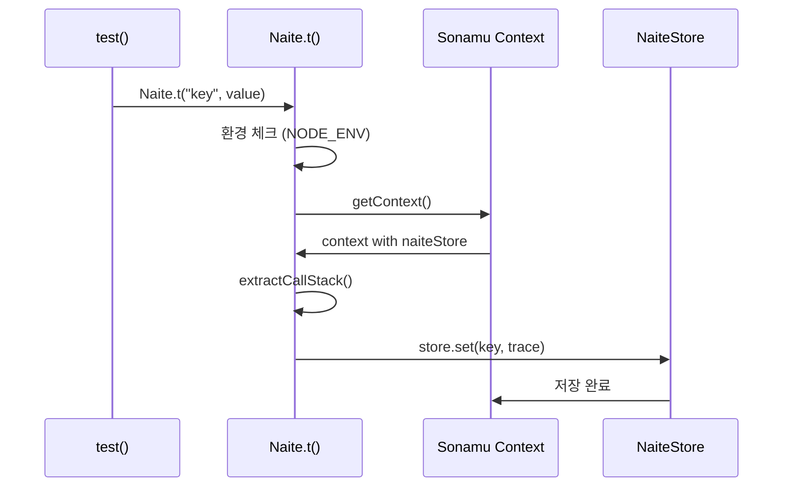
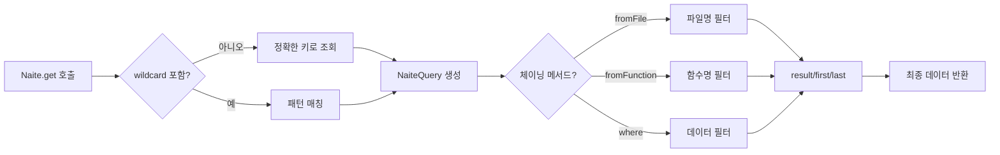
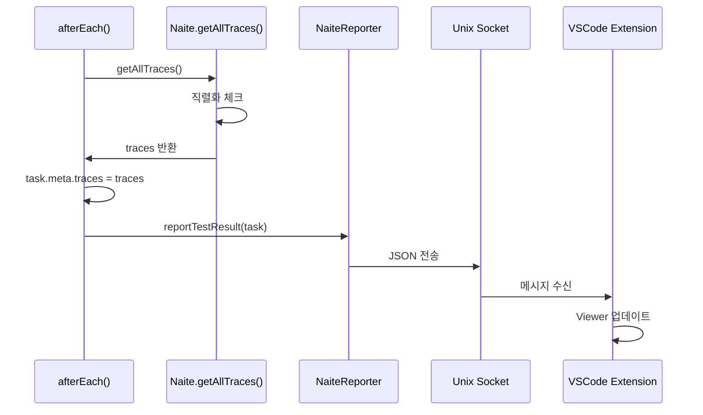

Sonamu의 테스트 로깅 및 디버깅 시스템인 Naite에 대해 알아봅니다.

## Naite 개요

<CardGroup cols={2}>
  <Card title="테스트 로깅" icon="file-lines">
    실행 중 로그 기록
    
    체계적인 추적
  </Card>
  <Card title="조회 시스템" icon="magnifying-glass">
    wildcard 패턴
    
    체이닝 쿼리
  </Card>
  <Card title="콜스택 추적" icon="layer-group">
    호출 경로 추적
    
    디버깅 지원
  </Card>
  <Card title="VSCode 통합" icon="cube">
    실시간 시각화
    
    Extension 지원
  </Card>
</CardGroup>

## Naite란?

**Naite**(나이테)는 Sonamu의 테스트 로깅 시스템입니다. 테스트 실행 중 발생하는 데이터를 체계적으로 기록하고, 이를 조회하여 테스트 디버깅을 돕습니다.

나무의 나이테가 성장 과정을 기록하듯, Naite는 테스트 실행의 전 과정을 기록합니다. 각 단계에서 어떤 데이터가 흘렀는지, 어떤 함수가 호출되었는지를 시간 순서대로 추적할 수 있습니다.

## 왜 Naite가 필요한가?

### 일반적인 디버깅의 한계

테스트를 작성하다 보면 다음과 같은 상황을 자주 마주합니다:

<AccordionGroup>
  <Accordion title="console.log의 혼란">
    여러 테스트가 동시에 실행되면 `console.log` 출력이 뒤섞입니다. 어떤 로그가 어느 테스트에서 나온 것인지 파악하기 어렵습니다.
    
    ```typescript
    test("사용자 생성", async () => {
      console.log("Creating user..."); // 다른 테스트의 로그와 섞임
      const user = await createUser();
      console.log("User created:", user);
    });
    
    test("게시글 생성", async () => {
      console.log("Creating post..."); // 위 테스트와 섞여서 출력
      const post = await createPost();
      console.log("Post created:", post);
    });
    ```
    
    콘솔 출력:
    ```
    Creating user...
    Creating post...
    User created: { id: 1 }
    Post created: { id: 1 }
    ```
    
    어느 것이 먼저 완료되었는지, 순서가 뒤섞여 파악이 어렵습니다.
  </Accordion>
  
  <Accordion title="필터링의 어려움">
    특정 모듈이나 함수의 로그만 보고 싶을 때, `console.log`로는 필터링이 불가능합니다. 모든 로그를 다 봐야 합니다.
    
    ```typescript
    // Syncer의 동작만 보고 싶지만...
    test("전체 엔티티 생성", async () => {
      await syncer.generateAll(); // 내부에서 수십 개의 console.log
      // Syncer 관련 로그만 보는 방법이 없음
    });
    ```
  </Accordion>
  
  <Accordion title="호출 경로를 알 수 없음">
    특정 로그가 어디서 출력되었는지, 어떤 함수를 거쳐 왔는지 추적하기 어렵습니다.
    
    ```typescript
    // 이 로그가 어디서 나왔는지 모름
    console.log("Processing data...");
    
    // A → B → C → D 순서로 호출되었지만
    // 콜스택 정보가 없어 추적 불가
    ```
  </Accordion>
  
  <Accordion title="테스트 출력과 섞임">
    Vitest의 테스트 결과 출력과 `console.log`가 섞여 가독성이 떨어집니다.
    
    ```bash
    ✓ test 1 (123ms)
    Debug: something...
    ✓ test 2 (98ms)
    Debug: another thing...
    ✗ test 3 (45ms)
    ```
  </Accordion>
</AccordionGroup>

### Naite의 해결책

Naite는 이러한 문제들을 체계적으로 해결합니다:

<CardGroup cols={2}>
  <Card title="키 기반 관리" icon="key">
    각 로그에 고유한 키를 부여하여 체계적으로 관리합니다. `user:create`, `syncer:render`처럼 모듈과 기능을 명확히 구분할 수 있습니다.
  </Card>
  
  <Card title="wildcard 필터링" icon="filter">
    `user:*`로 user 관련 로그만, `*:create`로 모든 create 로그만 조회할 수 있습니다. 원하는 정보만 빠르게 찾을 수 있습니다.
  </Card>
  
  <Card title="자동 콜스택 추적" icon="route">
    각 로그가 어디서 호출되었는지 콜스택을 자동으로 수집합니다. 함수 호출 경로를 명확히 파악할 수 있습니다.
  </Card>
  
  <Card title="테스트 격리" icon="box">
    각 테스트는 독립된 로그 저장소를 가집니다. 다른 테스트의 로그와 절대 섞이지 않습니다.
  </Card>
  
  <Card title="VSCode 통합" icon="window">
    VSCode Extension으로 로그를 실시간 시각화합니다. 테스트 출력과 분리되어 깔끔하게 확인할 수 있습니다.
  </Card>
  
  <Card title="쿼리 시스템" icon="magnifying-glass">
    체이닝 쿼리로 복잡한 조건의 로그도 쉽게 찾을 수 있습니다. `fromFile()`, `fromFunction()`, `where()` 등을 조합합니다.
  </Card>
</CardGroup>

## 기본 개념

### 1. Naite.t() - 로그 기록

`Naite.t()`는 테스트 실행 중 데이터를 기록하는 함수입니다. 첫 번째 인자는 키(key), 두 번째 인자는 기록할 값(value)입니다.

```typescript
import { Naite } from "sonamu";

// 사용자 생성 시작
Naite.t("user:create:start", { username: "john" });

const user = await createUser({ username: "john" });

// 사용자 생성 완료
Naite.t("user:create:done", { userId: user.id });
```

**키 네이밍 규칙**:
- 콜론(`:`)으로 계층 구분
- `module:function:action` 형식 권장
- 예: `user:create:start`, `syncer:render:template`, `payment:charge:done`

**장점**:
- wildcard 패턴으로 조회 가능 (`user:*`, `*:create`)
- 모듈별로 그룹화하여 관리
- 직관적인 구조로 가독성 향상

### 2. Naite.get() - 로그 조회

`Naite.get()`은 기록된 로그를 조회하는 함수입니다. 키 또는 wildcard 패턴으로 검색할 수 있습니다.

```typescript
// 정확한 키로 조회
const logs = Naite.get("user:create:start").result();
// [{ username: "john" }]

// wildcard 패턴으로 조회
const allUserLogs = Naite.get("user:*").result();
// user:create:start, user:create:done 모두 조회

// 첫 번째 로그만
const firstLog = Naite.get("user:create:start").first();
// { username: "john" }
```

**쿼리 체이닝**:

여러 조건을 체이닝하여 복잡한 검색도 가능합니다:

```typescript
Naite.get("user:*")
  .fromFile("user.model.test.ts")     // 특정 파일에서만
  .fromFunction("createUser")         // 특정 함수에서만
  .where("data.username", "=", "john") // 특정 값만
  .result();
```

### 3. NaiteStore - 로그 저장소

각 테스트는 독립된 `NaiteStore`를 가집니다. 이는 `Map<string, NaiteTrace[]>` 타입으로, 키를 기준으로 로그를 배열로 저장합니다.

<Accordion title="NaiteStore 구조">

```typescript
type NaiteStore = Map<string, NaiteTrace[]>;

interface NaiteTrace {
  key: string;        // "user:create:start"
  data: any;          // { username: "john" }
  stack: StackFrame[]; // 콜스택 정보
  at: Date;           // 기록 시간
}

interface StackFrame {
  functionName: string | null;  // "createUser"
  filePath: string;              // "/Users/.../user.model.ts"
  lineNumber: number;            // 123
}
```

**예시**:

```typescript
// test() 실행 시 새로운 Store 생성
const store = new Map();

// Naite.t() 호출마다 추가
Naite.t("user:create:start", { username: "john" });
// store.set("user:create:start", [{ key: "user:create:start", data: { username: "john" }, ... }])

Naite.t("user:create:start", { username: "jane" });
// 같은 키에 추가됨
// store.set("user:create:start", [
//   { key: "user:create:start", data: { username: "john" }, ... },
//   { key: "user:create:start", data: { username: "jane" }, ... }
// ])
```

</Accordion>

**테스트 격리**:

```typescript
test("테스트 1", async () => {
  Naite.t("key", "value1");
  const data = Naite.get("key").first();
  expect(data).toBe("value1");
});

test("테스트 2", async () => {
  // 이전 테스트의 로그는 없음
  const data = Naite.get("key").first();
  expect(data).toBeUndefined();
});
```

각 테스트가 독립된 Store를 가지므로 서로 영향을 주지 않습니다.

### 4. 콜스택 자동 추적

Naite는 `Naite.t()` 호출 시점의 콜스택을 자동으로 수집합니다. 이를 통해 로그가 어디서 기록되었는지, 어떤 함수 호출 경로를 거쳤는지 파악할 수 있습니다.

<Tabs>
  <Tab title="단일 호출">
    ```typescript
    test("사용자 생성", async () => {
      Naite.t("test:log", "value");
      // 콜스택: [test → runWithMockContext]
    });
    ```
  </Tab>
  
  <Tab title="함수 체인">
    ```typescript
    async function createUser() {
      Naite.t("user:create", { ... });
      // 콜스택: [createUser → test → runWithMockContext]
    }
    
    test("사용자 생성", async () => {
      await createUser();
    });
    ```
  </Tab>
  
  <Tab title="깊은 호출">
    ```typescript
    async function save() {
      Naite.t("db:save", { ... });
      // 콜스택: [save → validate → create → test → runWithMockContext]
    }
    
    async function validate() {
      await save();
    }
    
    async function create() {
      await validate();
    }
    
    test("생성", async () => {
      await create();
    });
    ```
  </Tab>
</Tabs>

**활용**:
- `fromFunction("createUser")`로 특정 함수에서 기록된 로그만 필터링
- VSCode Extension에서 콜스택 클릭 → 코드 위치로 바로 이동
- 복잡한 호출 체인 디버깅

## 실제 활용 예시

### 기본 사용 - 흐름 추적

가장 기본적인 사용법은 테스트 흐름의 각 단계를 기록하는 것입니다.

```typescript
test("게시글 생성 흐름", async () => {
  const postModel = new PostModel();
  
  // 1. 입력 데이터 기록
  Naite.t("post:create:input", {
    title: "Hello World",
    content: "This is content",
    author_id: 1,
  });
  
  // 2. 게시글 생성
  const { post } = await postModel.create({
    title: "Hello World",
    content: "This is content",
    author_id: 1,
  });
  
  // 3. 결과 기록
  Naite.t("post:create:output", {
    postId: post.id,
    createdAt: post.created_at,
  });
  
  // 4. 전체 흐름 검증
  const logs = Naite.get("post:create:*").result();
  expect(logs).toHaveLength(2);
  expect(logs[0].title).toBe("Hello World");
  expect(logs[1].postId).toBeGreaterThan(0);
});
```

<Tip>
**입출력 패턴**: `:input`과 `:output` 접미사를 사용하면 함수의 입력과 출력을 명확히 구분할 수 있습니다. 이는 데이터 변환 과정을 추적하는 데 유용합니다.
</Tip>

### 중급 사용 - 조건부 추적

비즈니스 로직의 분기를 추적합니다.

```typescript
test("주문 결제 처리", async () => {
  const order = await getOrder(123);
  
  Naite.t("payment:process:start", {
    orderId: order.id,
    amount: order.amount,
    paymentMethod: order.payment_method,
  });
  
  if (order.payment_method === "card") {
    Naite.t("payment:card:charge", { cardNumber: "****1234" });
    await chargeCard(order);
    Naite.t("payment:card:success", { transactionId: "tx_123" });
  } else if (order.payment_method === "bank") {
    Naite.t("payment:bank:transfer", { bankCode: "001" });
    await transferBank(order);
    Naite.t("payment:bank:success", { transferId: "tf_456" });
  }
  
  Naite.t("payment:process:done", { orderId: order.id });
  
  // 카드 결제가 실행되었는지 확인
  const cardLogs = Naite.get("payment:card:*").result();
  expect(cardLogs.length).toBeGreaterThan(0);
});
```

### 고급 사용 - 에러 추적

에러 발생 상황을 상세히 기록합니다.

```typescript
test("잘못된 입력값 처리", async () => {
  try {
    Naite.t("user:create:input", { username: "" }); // 빈 값
    
    await userModel.create({
      username: "",
      email: "test@test.com",
    });
    
    throw new Error("Should have failed");
  } catch (error) {
    Naite.t("user:create:error", {
      errorType: error.constructor.name,
      errorMessage: error.message,
      validationErrors: error.details,
    });
    
    // 에러 로그 확인
    const errorLog = Naite.get("user:create:error").first();
    expect(errorLog.errorType).toBe("ValidationError");
    expect(errorLog.errorMessage).toContain("username");
  }
});
```

<Info>
**에러 추적의 가치**: 에러가 발생했을 때 어떤 입력값으로, 어느 단계에서 실패했는지 명확히 알 수 있습니다. VSCode Extension의 콜스택 기능과 결합하면 에러 위치를 정확히 파악할 수 있습니다.
</Info>

## 작동 원리

### 1. 로그 기록 과정



<Steps>
  <Step title="환경 체크">
    `NODE_ENV === "test"`인지 확인합니다. 테스트 환경이 아니면 즉시 종료합니다.
  </Step>
  
  <Step title="Context 확인">
    `Sonamu.getContext()`로 현재 실행 중인 Context를 가져옵니다. Context가 없으면 무시합니다.
  </Step>
  
  <Step title="콜스택 수집">
    `new Error().stack`으로 현재 콜스택을 수집하여 파싱합니다.
  </Step>
  
  <Step title="Trace 생성">
    키, 값, 콜스택, 시간을 포함한 `NaiteTrace` 객체를 생성합니다.
  </Step>
  
  <Step title="Store에 저장">
    `naiteStore.set(key, [...existing, trace])`로 배열에 추가합니다.
  </Step>
</Steps>

### 2. 로그 조회 과정



### 3. VSCode Extension 전송



<Info>
**직렬화의 중요성**: VSCode Extension으로 전송하기 위해 모든 값은 JSON으로 직렬화됩니다. `Naite.t()`에 함수나 순환 참조 객체를 전달하면 경고가 표시되지만, any 타입으로 받아 사용 편의성을 높였습니다.
</Info>

## 주요 특징

<AccordionGroup>
  <Accordion title="1. 테스트 전용 설계">
    Naite는 테스트 환경에서만 동작하도록 설계되었습니다. 프로덕션 코드에 `Naite.t()`가 있어도 성능 영향이 전혀 없습니다.
    
    ```typescript
    if (process.env.NODE_ENV !== "test") {
      return; // 즉시 종료, 비용 없음
    }
    ```
  </Accordion>
  
  <Accordion title="2. 완전한 테스트 격리">
    각 테스트는 독립된 NaiteStore를 가집니다. `bootstrap.ts`의 `getMockContext()`에서 매번 새로운 Store를 생성합니다.
    
    ```typescript
    function getMockContext(): Context {
      return {
        naiteStore: Naite.createStore(), // 새로운 Map 생성
        // ...
      };
    }
    ```
  </Accordion>
  
  <Accordion title="3. Any 타입 허용">
    `Naite.t(value: any)`는 any 타입을 받습니다. TypeScript의 타입 안정성보다 사용 편의성을 우선했습니다.
    
    ```typescript
    // 모든 타입 허용
    Naite.t("key", "string");
    Naite.t("key", 123);
    Naite.t("key", { nested: { object: true } });
    Naite.t("key", [1, 2, 3]);
    ```
    
    단, Extension 전송 시 직렬화가 불가능한 값은 경고가 표시됩니다.
  </Accordion>
  
  <Accordion title="4. 자동 직렬화">
    `getAllTraces()`는 모든 값을 JSON으로 직렬화하여 반환합니다. 이는 Vitest의 `task.meta`를 통한 프로세스 간 통신을 위한 것입니다.
    
    ```typescript
    return traces.map((trace) => ({
      key: trace.key,
      value: JSON.parse(JSON.stringify(trace.data)), // 강제 직렬화
      filePath: trace.stack[0]?.filePath ?? "",
      lineNumber: trace.stack[0]?.lineNumber ?? 0,
      at: trace.at.toISOString(),
    }));
    ```
  </Accordion>
  
  <Accordion title="5. wildcard 패턴 매칭">
    간단하지만 강력한 패턴 매칭을 지원합니다:
    
    - `user:*`: prefix 매칭 (길이 무관)
    - `*:create`: suffix 매칭 (길이 동일)
    - `user:*:done`: 중간 wildcard (길이 동일)
    
    복잡한 정규식 대신 직관적인 패턴을 사용합니다.
  </Accordion>
</AccordionGroup>

## 주의사항

<Warning>
**Naite 사용 시 주의사항**:

1. **테스트 환경만**: `NODE_ENV === "test"`에서만 동작합니다. 프로덕션에서는 자동으로 비활성화됩니다.

2. **Context 필요**: `Sonamu.getContext()`가 있어야 동작합니다. bootstrap의 `runWithMockContext()` 안에서만 사용하세요.

3. **과도한 로깅 주의**: 루프 안에서 `Naite.t()`를 호출하면 수천 개의 trace가 생성되어 성능이 저하될 수 있습니다.

4. **키 네이밍 규칙**: `module:function:action` 형식을 권장합니다. 일관된 규칙으로 나중에 찾기 쉽습니다.

5. **직렬화 가능한 값 권장**: VSCode Extension으로 전송하려면 JSON으로 직렬화 가능해야 합니다. 함수나 순환 참조는 피하세요.
</Warning>

## 다음 단계

<CardGroup cols={2}>
  <Card title="로그 기록하기" icon="pen" href="/testing/naite/recording-logs">
    Naite.t()의 상세 사용법과 베스트 프랙티스를 알아봅니다.
  </Card>
  <Card title="로그 조회하기" icon="magnifying-glass" href="/testing/naite/querying-logs">
    Naite.get()과 체이닝 쿼리 시스템을 배웁니다.
  </Card>
  <Card title="Naite Viewer" icon="eye" href="/testing/naite/naite-viewer">
    VSCode Extension으로 로그를 실시간 시각화하는 방법을 알아봅니다.
  </Card>
  <Card title="테스트 디버깅" icon="bug" href="/testing/naite/debugging-tests">
    콜스택 추적으로 복잡한 버그를 추적하는 방법을 배웁니다.
  </Card>
</CardGroup>
