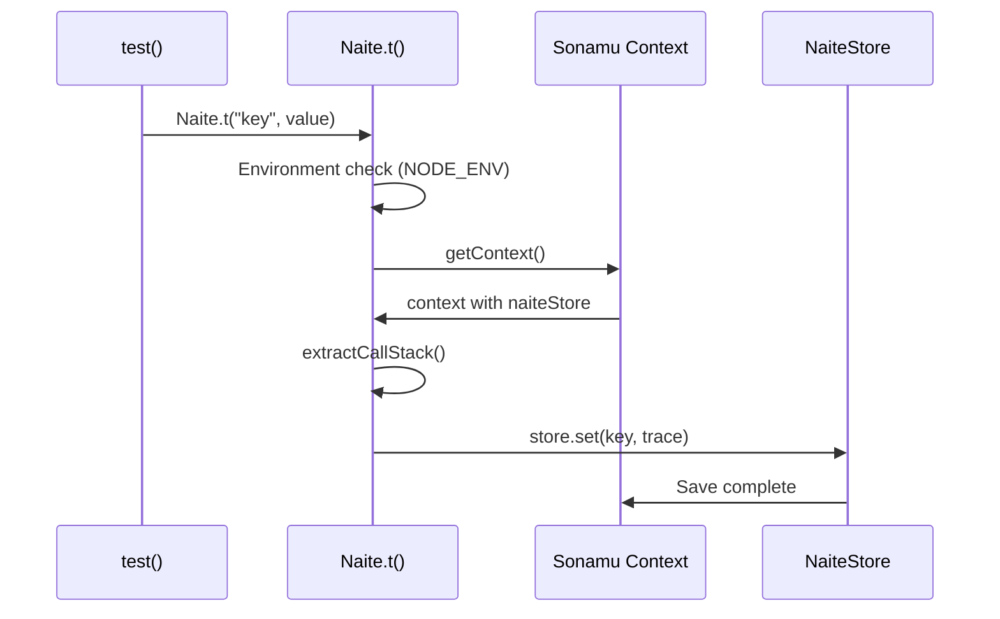
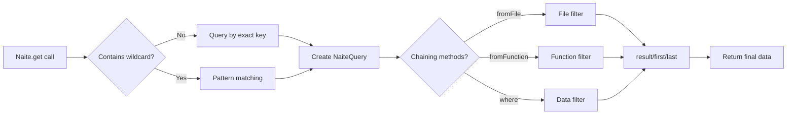
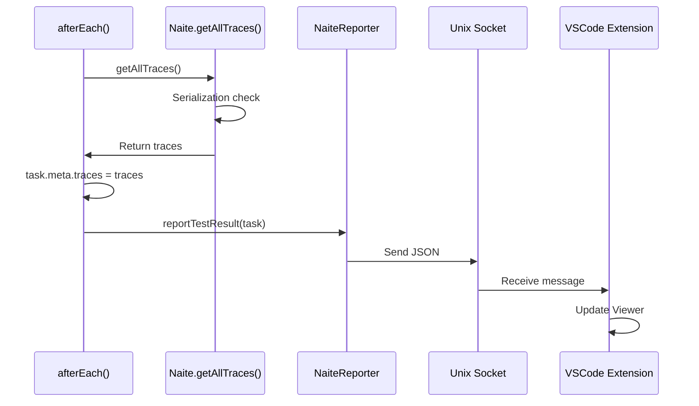

Learn about Naite, Sonamu's test logging and debugging system.

## Naite Overview

<CardGroup cols={2}>
  <Card title="Test Logging" icon="file-lines">
    Record logs during execution

    Systematic tracking

  </Card>
  <Card title="Query System" icon="magnifying-glass">
    Wildcard patterns

    Chaining queries

  </Card>
  <Card title="Callstack Tracking" icon="layer-group">
    Call path tracing

    Debugging support

  </Card>
  <Card title="VSCode Integration" icon="cube">
    Real-time visualization

    Extension support

  </Card>
</CardGroup>

## What is Naite?

**Naite** is Sonamu's test logging system. It systematically records data generated during test execution and allows you to query this data to help with test debugging.

Just as tree rings record the growth process, Naite records the entire process of test execution. You can trace what data flowed at each step and which functions were called, in chronological order.

## Why Do You Need Naite?

### Limitations of Conventional Debugging

When writing tests, you often encounter situations like these:

<AccordionGroup>
  <Accordion title="Confusion with console.log">
    When multiple tests run simultaneously, `console.log` outputs get mixed up. It's difficult to determine which log came from which test.

    ```typescript
    test("create user", async () => {
      console.log("Creating user..."); // Mixed with other test logs
      const user = await createUser();
      console.log("User created:", user);
    });

    test("create post", async () => {
      console.log("Creating post..."); // Mixed with the above test output
      const post = await createPost();
      console.log("Post created:", post);
    });
    ```

    Console output:
    ```
    Creating user...
    Creating post...
    User created: { id: 1 }
    Post created: { id: 1 }
    ```

    It's hard to tell which completed first as the order is mixed up.

  </Accordion>

  <Accordion title="Difficulty with Filtering">
    When you want to see only logs from a specific module or function, filtering is impossible with `console.log`. You have to look at all logs.

    ```typescript
    // Want to see only Syncer's behavior but...
    test("generate all entities", async () => {
      await syncer.generateAll(); // Dozens of console.logs internally
      // No way to see only Syncer-related logs
    });
    ```

  </Accordion>

  <Accordion title="Unknown Call Path">
    It's difficult to trace where a specific log was output from and which functions it went through.

    ```typescript
    // Don't know where this log came from
    console.log("Processing data...");

    // Called in order A → B → C → D but
    // Can't trace without callstack information
    ```

  </Accordion>

  <Accordion title="Mixed with Test Output">
    Vitest's test result output and `console.log` get mixed, reducing readability.

    ```bash
    ✓ test 1 (123ms)
    Debug: something...
    ✓ test 2 (98ms)
    Debug: another thing...
    ✗ test 3 (45ms)
    ```

  </Accordion>
</AccordionGroup>

### Naite's Solution

Naite systematically solves these problems:

<CardGroup cols={2}>
  <Card title="Key-based Management" icon="key">
    Assigns unique keys to each log for systematic management. You can clearly distinguish modules and functions like `user:create`, `syncer:render`.
  </Card>

<Card title="Wildcard Filtering" icon="filter">
  You can query only user-related logs with `user:*` or all create logs with `*:create`. Find the
  information you want quickly.
</Card>

<Card title="Automatic Callstack Tracking" icon="route">
  Automatically collects the callstack for each log recording. You can clearly understand the
  function call path.
</Card>

<Card title="Test Isolation" icon="box">
  Each test has an independent log store. Logs never get mixed with other tests.
</Card>

<Card title="VSCode Integration" icon="window">
  Visualize logs in real-time with VSCode Extension. View them cleanly, separated from test output.
</Card>

  <Card title="Query System" icon="magnifying-glass">
    Easily find logs with complex conditions using chaining queries. Combine `fromFile()`, `fromFunction()`, `where()` and more.
  </Card>
</CardGroup>

## Basic Concepts

### 1. Naite.t() - Recording Logs

`Naite.t()` is a function that records data during test execution. The first argument is the key, and the second argument is the value to record.

```typescript
import { Naite } from "sonamu";

// User creation start
Naite.t("user:create:start", { username: "john" });

const user = await createUser({ username: "john" });

// User creation complete
Naite.t("user:create:done", { userId: user.id });
```

**Key Naming Rules**:

- Use colons (`:`) to separate hierarchies
- Recommended format: `module:function:action`
- Examples: `user:create:start`, `syncer:render:template`, `payment:charge:done`

**Benefits**:

- Queryable with wildcard patterns (`user:*`, `*:create`)
- Group and manage by module
- Improved readability with intuitive structure

### 2. Naite.get() - Querying Logs

`Naite.get()` is a function that queries recorded logs. You can search by key or wildcard pattern.

```typescript
// Query by exact key
const logs = Naite.get("user:create:start").result();
// [{ username: "john" }]

// Query with wildcard pattern
const allUserLogs = Naite.get("user:*").result();
// Queries both user:create:start and user:create:done

// Only the first log
const firstLog = Naite.get("user:create:start").first();
// { username: "john" }
```

**Query Chaining**:

You can chain multiple conditions for complex searches:

```typescript
Naite.get("user:*")
  .fromFile("user.model.test.ts") // Only from specific file
  .fromFunction("createUser") // Only from specific function
  .where("data.username", "=", "john") // Only specific value
  .result();
```

### 3. NaiteStore - Log Storage

Each test has an independent `NaiteStore`. This is of type `Map<string, NaiteTrace[]>`, storing logs as arrays based on keys.

<Accordion title="NaiteStore Structure">

```typescript
type NaiteStore = Map<string, NaiteTrace[]>;

interface NaiteTrace {
  key: string; // "user:create:start"
  data: any; // { username: "john" }
  stack: StackFrame[]; // Callstack information
  at: Date; // Recording time
}

interface StackFrame {
  functionName: string | null; // "createUser"
  filePath: string; // "/Users/.../user.model.ts"
  lineNumber: number; // 123
}
```

**Example**:

```typescript
// New Store created when test() runs
const store = new Map();

// Added on each Naite.t() call
Naite.t("user:create:start", { username: "john" });
// store.set("user:create:start", [{ key: "user:create:start", data: { username: "john" }, ... }])

Naite.t("user:create:start", { username: "jane" });
// Added to the same key
// store.set("user:create:start", [
//   { key: "user:create:start", data: { username: "john" }, ... },
//   { key: "user:create:start", data: { username: "jane" }, ... }
// ])
```

</Accordion>

**Test Isolation**:

```typescript
test("test 1", async () => {
  Naite.t("key", "value1");
  const data = Naite.get("key").first();
  expect(data).toBe("value1");
});

test("test 2", async () => {
  // Previous test's logs are not present
  const data = Naite.get("key").first();
  expect(data).toBeUndefined();
});
```

Each test has an independent Store so they don't affect each other.

### 4. Automatic Callstack Tracking

Naite automatically collects the callstack at the time of `Naite.t()` call. This allows you to understand where the log was recorded and which function call path was taken.

<Tabs>
  <Tab title="Single Call">
    ```typescript
    test("create user", async () => {
      Naite.t("test:log", "value");
      // Callstack: [test → runWithMockContext]
    });
    ```
  </Tab>

  <Tab title="Function Chain">
    ```typescript
    async function createUser() {
      Naite.t("user:create", { ... });
      // Callstack: [createUser → test → runWithMockContext]
    }

    test("create user", async () => {
      await createUser();
    });
    ```

  </Tab>

  <Tab title="Deep Call">
    ```typescript
    async function save() {
      Naite.t("db:save", { ... });
      // Callstack: [save → validate → create → test → runWithMockContext]
    }

    async function validate() {
      await save();
    }

    async function create() {
      await validate();
    }

    test("create", async () => {
      await create();
    });
    ```

  </Tab>
</Tabs>

**Usage**:

- Filter logs recorded in a specific function with `fromFunction("createUser")`
- Click on callstack in VSCode Extension → navigate directly to code location
- Debug complex call chains

## Practical Examples

### Basic Usage - Flow Tracking

The most basic usage is recording each step of the test flow.

```typescript
test("post creation flow", async () => {
  const postModel = new PostModel();

  // 1. Record input data
  Naite.t("post:create:input", {
    title: "Hello World",
    content: "This is content",
    author_id: 1,
  });

  // 2. Create post
  const { post } = await postModel.create({
    title: "Hello World",
    content: "This is content",
    author_id: 1,
  });

  // 3. Record result
  Naite.t("post:create:output", {
    postId: post.id,
    createdAt: post.created_at,
  });

  // 4. Verify entire flow
  const logs = Naite.get("post:create:*").result();
  expect(logs).toHaveLength(2);
  expect(logs[0].title).toBe("Hello World");
  expect(logs[1].postId).toBeGreaterThan(0);
});
```

<Tip>
  **Input/Output Pattern**: Using `:input` and `:output` suffixes helps clearly distinguish function
  inputs and outputs. This is useful for tracking data transformation processes.
</Tip>

### Intermediate Usage - Conditional Tracking

Track business logic branches.

```typescript
test("order payment processing", async () => {
  const order = await getOrder(123);

  Naite.t("payment:process:start", {
    orderId: order.id,
    amount: order.amount,
    paymentMethod: order.payment_method,
  });

  if (order.payment_method === "card") {
    Naite.t("payment:card:charge", { cardNumber: "****1234" });
    await chargeCard(order);
    Naite.t("payment:card:success", { transactionId: "tx_123" });
  } else if (order.payment_method === "bank") {
    Naite.t("payment:bank:transfer", { bankCode: "001" });
    await transferBank(order);
    Naite.t("payment:bank:success", { transferId: "tf_456" });
  }

  Naite.t("payment:process:done", { orderId: order.id });

  // Verify card payment was executed
  const cardLogs = Naite.get("payment:card:*").result();
  expect(cardLogs.length).toBeGreaterThan(0);
});
```

### Advanced Usage - Error Tracking

Record detailed information when errors occur.

```typescript
test("invalid input handling", async () => {
  try {
    Naite.t("user:create:input", { username: "" }); // Empty value

    await userModel.create({
      username: "",
      email: "test@test.com",
    });

    throw new Error("Should have failed");
  } catch (error) {
    Naite.t("user:create:error", {
      errorType: error.constructor.name,
      errorMessage: error.message,
      validationErrors: error.details,
    });

    // Check error log
    const errorLog = Naite.get("user:create:error").first();
    expect(errorLog.errorType).toBe("ValidationError");
    expect(errorLog.errorMessage).toContain("username");
  }
});
```

<Info>
  **Value of Error Tracking**: When an error occurs, you can clearly see what input values caused it
  and at which step it failed. Combined with VSCode Extension's callstack feature, you can pinpoint
  the exact error location.
</Info>

## How It Works

### 1. Log Recording Process



<Steps>
  <Step title="Environment Check">
    Checks if `NODE_ENV === "test"`. Immediately terminates if not in test environment.
  </Step>

<Step title="Context Check">
  Gets the currently running Context with `Sonamu.getContext()`. Ignores if no Context exists.
</Step>

<Step title="Callstack Collection">
  Collects the current callstack with `new Error().stack` and parses it.
</Step>

<Step title="Trace Creation">
  Creates a `NaiteTrace` object containing key, value, callstack, and time.
</Step>

  <Step title="Store Save">
    Adds to the array with `naiteStore.set(key, [...existing, trace])`.
  </Step>
</Steps>

### 2. Log Query Process



### 3. VSCode Extension Transmission



<Info>
  **Importance of Serialization**: All values are serialized to JSON for transmission to VSCode
  Extension. If you pass functions or circular reference objects to `Naite.t()`, a warning is
  displayed, but it accepts any type for ease of use.
</Info>

## Key Features

<AccordionGroup>
  <Accordion title="1. Test-Only Design">
    Naite is designed to only work in test environments. Even if `Naite.t()` exists in production code, there's no performance impact.

    ```typescript
    if (process.env.NODE_ENV !== "test") {
      return; // Immediate return, no cost
    }
    ```

  </Accordion>

  <Accordion title="2. Complete Test Isolation">
    Each test has an independent NaiteStore. A new Store is created each time in `getMockContext()` in `bootstrap.ts`.

    ```typescript
    function getMockContext(): Context {
      return {
        naiteStore: Naite.createStore(), // Create new Map
        // ...
      };
    }
    ```

  </Accordion>

  <Accordion title="3. Any Type Allowed">
    `Naite.t(value: any)` accepts any type. Ease of use was prioritized over TypeScript type safety.

    ```typescript
    // All types allowed
    Naite.t("key", "string");
    Naite.t("key", 123);
    Naite.t("key", { nested: { object: true } });
    Naite.t("key", [1, 2, 3]);
    ```

    However, values that cannot be serialized will show a warning when transmitted to the Extension.

  </Accordion>

  <Accordion title="4. Automatic Serialization">
    `getAllTraces()` returns all values serialized to JSON. This is for inter-process communication through Vitest's `task.meta`.

    ```typescript
    return traces.map((trace) => ({
      key: trace.key,
      value: JSON.parse(JSON.stringify(trace.data)), // Force serialization
      filePath: trace.stack[0]?.filePath ?? "",
      lineNumber: trace.stack[0]?.lineNumber ?? 0,
      at: trace.at.toISOString(),
    }));
    ```

  </Accordion>

  <Accordion title="5. Wildcard Pattern Matching">
    Supports simple but powerful pattern matching:

    - `user:*`: prefix matching (any length)
    - `*:create`: suffix matching (same length)
    - `user:*:done`: middle wildcard (same length)

    Uses intuitive patterns instead of complex regular expressions.

  </Accordion>
</AccordionGroup>

## Cautions

<Warning>
**Cautions when using Naite**:

1. **Test environment only**: Only works when `NODE_ENV === "test"`. Automatically disabled in production.

2. **Context required**: `Sonamu.getContext()` must exist. Only use within bootstrap's `runWithMockContext()`.

3. **Avoid excessive logging**: Calling `Naite.t()` inside loops can create thousands of traces, degrading performance.

4. **Key naming convention**: The `module:function:action` format is recommended. Consistent rules make finding things easier later.

5. **Serializable values recommended**: Values must be JSON serializable to transmit to VSCode Extension. Avoid functions and circular references.
   </Warning>

## Next Steps

<CardGroup cols={2}>
  <Card title="Recording Logs" icon="pen" href="/en/testing/naite/recording-logs">
    Learn detailed usage and best practices for Naite.t().
  </Card>
  <Card title="Querying Logs" icon="magnifying-glass" href="/en/testing/naite/querying-logs">
    Learn about Naite.get() and the chaining query system.
  </Card>
  <Card title="Naite Viewer" icon="eye" href="/en/testing/naite/naite-viewer">
    Learn how to visualize logs in real-time with VSCode Extension.
  </Card>
  <Card title="Debugging Tests" icon="bug" href="/en/testing/naite/debugging-tests">
    Learn how to track complex bugs with callstack tracing.
  </Card>
</CardGroup>
