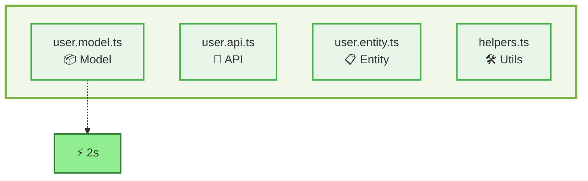
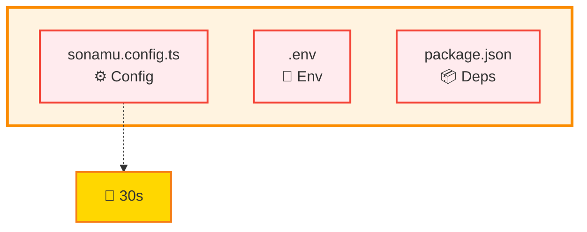

import { FileTree, FileItem } from "../../../snippets/FileTree.jsx";

Boundaries define the limits where the HMR system can safely replace modules. Understanding Boundaries properly when developing with Sonamu allows you to maximize HMR benefits.

## What is a Boundary?

A Boundary means a "reloadable limit". The HMR system operates by the following rules:

- **Boundary files**: Files that can be reloaded on change (Model, API, Entity, etc.)
- **Non-boundary files**: Files that require a full server restart on change (config, environment variables, etc.)

**✅ Boundary files**: Changes are instantly reflected via HMR



**❌ Non-boundary files**: Require server restart on change



### Why are Boundaries Necessary?

Static imports execute only once when Node.js starts, so they cannot be replaced at runtime:

```typescript
// ❌ Static import - HMR not possible
import { UserModel } from "./user.model";

// ✅ Dynamic import - HMR possible
const { UserModel } = await import("./user.model");
```

Files designated as Boundaries **must be imported dynamically**, so that the latest code can be fetched on change.

## Sonamu's Boundary Configuration

By default, Sonamu sets all TypeScript files in the project as Boundaries:

```typescript
// hmr-hook-register.ts
await hot.init({
  rootDirectory: process.env.API_ROOT_PATH,
  boundaries: [`./src/**/*.ts`], // All .ts files are boundaries
});
```

With this configuration, all files under `src/` are HMR-capable and automatically reload on change.

### Boundary File Examples

**Boundary files (HMR capable):**

- `user.model.ts` - Model file
- `user.api.ts` - API file
- `user.entity.ts` - Entity definition
- `helpers.ts` - Utility functions
- `constants.ts` - Constants definition

**Non-boundary files (restart required):**

- `sonamu.config.ts` - Sonamu configuration
- `.env` - Environment variables
- `package.json` - Dependencies

## Boundary Rules

### 1. Dynamic Import Required

Boundary files must be imported dynamically.

**❌ Wrong: Static import**

```typescript
// server.ts
import { UserModel } from "./application/user/user.model";

// Changes to UserModel won't be reflected!
app.get("/users", async (req, res) => {
  const users = await UserModel.findMany();
  res.json(users);
});
```

**✅ Correct: Dynamic import**

```typescript
// server.ts
app.get("/users", async (req, res) => {
  const { UserModel } = await import("./application/user/user.model");

  // When UserModel is modified, latest code is loaded on next request!
  const users = await UserModel.findMany();
  res.json(users);
});
```

### Sonamu Handles This Automatically

Fortunately, Sonamu's Syncer automatically handles dynamic imports for Entity-based files:

```typescript
// syncer.ts - autoloadModels()
async autoloadModels() {
  for (const entity of entities) {
    const modelPath = `${entity.path}/${entity.id}.model`;

    // Loaded via dynamic import ✅
    const module = await import(modelPath);
    this.models[entity.id] = module[`${entity.id}Model`];
  }
}
```

**In other words, you don't need to worry about this in typical Sonamu development!**

### 2. Static Imports Between Boundaries Allowed

Static imports between Boundary files are allowed (Sonamu's enhancement):

```typescript
// user.model.ts (boundary)
import { PostModel } from "./post.model"; // ✅ OK - both are boundaries

export class UserModel extends BaseModelClass {
  async getPosts() {
    return PostModel.findMany({ where: { userId: this.id } });
  }
}
```

This works because:

- Both files are Boundaries
- Both are dynamically loaded by Syncer
- HMR works correctly even when they reference each other

### 3. Non-boundary to Boundary Import Restriction

HMR won't work if a non-boundary file statically imports a Boundary:

```typescript
// server.ts (non-boundary)
import { UserModel } from "./user.model"; // ❌ Full restart required

// server.ts (non-boundary) - correct approach
async function loadModels() {
  const { UserModel } = await import("./user.model"); // ✅ OK
}
```

## Practical Scenarios

### Using HMR in User-Post Relationship

**Situation**: Adding a `role` field to User Entity and adding author permission check in Post API.

**Step 1: Modify Entity**

```typescript
// Add role to User in Sonamu UI
role: EnumProp<"admin" | "user">;
```

On save, HMR automatically:

- Updates `user.entity.ts`
- Regenerates `user.types.ts`
- Reloads `UserModel`

Console output:

```bash
🔄 Invalidated:
- src/application/user/user.entity.ts
- src/application/user/user.model.ts
```

**Step 2: Add Model Logic**

```typescript
// user.model.ts
export class UserModel extends BaseModelClass {
  isAdmin(): boolean {
    return this.role === "admin";
  }

  canCreatePost(): boolean {
    return this.isAdmin() || this.role === "user";
  }
}
```

On save, HMR:

- Reloads `UserModel`
- Reloads all APIs that use `UserModel`

**Step 3: Add Permission Check to API**

```typescript
// post.api.ts
import { UserModel } from "../user/user.model";  // ✅ Both are boundaries

@api({ httpMethod: "POST" })
async create(body: PostForm) {
  const user = await UserModel.findById(body.userId);

  if (!user.canCreatePost()) {  // 👈 Use the method just added!
    throw new UnauthorizedException("You don't have permission to create posts");
  }

  return PostModel.save(body);
}
```

On save, HMR:

- Re-registers `PostApi.create`
- **Testable immediately without server restart!**

```bash
🔄 Invalidated:
- src/application/post/post.api.ts

✨ API re-registered: POST /api/post/create
```

---

**Traditional approach:**

1. Modify Entity
2. Manually generate Types file
3. Modify Model file
4. Server restart (30 seconds)
5. Modify API file
6. Server restart (30 seconds)
7. Test

**Sonamu + HMR:**

1. Modify Entity (auto-generated)
2. Modify Model file (auto-reload)
3. Modify API file (auto-reload)
4. Test ✅

**3 restarts (90 seconds) reduced to 0!**

### Complex Business Logic Development

**Situation**: Implementing inventory check, payment processing, and notification on order creation.

**File structure:**

<Card>
  <FileTree>
    <FileItem name="src/application/">
      <FileItem name="product/">
        <FileItem name="product.model.ts" description="Inventory check" />
      </FileItem>
      <FileItem name="order/">
        <FileItem name="order.model.ts" description="Order creation" />
        <FileItem name="order.api.ts" description="API endpoint" />
      </FileItem>
      <FileItem name="payment/">
        <FileItem name="payment.service.ts" description="Payment processing" />
      </FileItem>
      <FileItem name="notification/">
        <FileItem name="notification.service.ts" description="Send notifications" />
      </FileItem>
    </FileItem>
  </FileTree>
</Card>

**Step 1: Inventory Check Logic**

```typescript
// product.model.ts
export class ProductModel extends BaseModelClass {
  hasStock(quantity: number): boolean {
    return this.stock >= quantity;
  }

  async reserveStock(quantity: number) {
    if (!this.hasStock(quantity)) {
      throw new BadRequestException("Out of stock");
    }

    await this.update({ stock: this.stock - quantity });
  }
}
```

Save → 2 seconds later → Instantly reflected ✅

**Step 2: Order Creation Logic**

```typescript
// order.model.ts
import { ProductModel } from "../product/product.model"; // ✅ OK
import { PaymentService } from "../payment/payment.service";

export class OrderModel extends BaseModelClass {
  static async createOrder(productId: number, quantity: number, userId: number) {
    const product = await ProductModel.findById(productId);

    // Can use ProductModel.reserveStock() immediately!
    await product.reserveStock(quantity);

    const order = await this.save({
      productId,
      quantity,
      userId,
      totalPrice: product.price * quantity,
      status: "pending",
    });

    return order;
  }
}
```

Save → ProductModel dependency also auto-reloaded ✅

**Step 3: API Endpoint**

```typescript
// order.api.ts
import { OrderModel } from "./order.model";

@api({ httpMethod: "POST" })
async create(body: { productId: number; quantity: number }) {
  const userId = getSonamuContext().userId!;

  // Can use OrderModel.createOrder() immediately!
  const order = await OrderModel.createOrder(
    body.productId,
    body.quantity,
    userId
  );

  return order;
}
```

Save → API re-registered → **Test immediately in Postman!**

**HMR log:**

```bash
🔄 Invalidated:
- src/application/product/product.model.ts
- src/application/order/order.model.ts
- src/application/order/order.api.ts (with 3 APIs)

✨ API re-registered: POST /api/order/create

✅ All files are synced!
```

## import.meta.hot API

In Boundary files, you can use the `import.meta.hot` API to finely control HMR behavior.

### dispose() - Resource Cleanup

Perform cleanup before module reload:

```typescript
// notification.service.ts
export class NotificationService {
  private static timer: NodeJS.Timeout;

  static startPolling() {
    this.timer = setInterval(() => {
      console.log("Checking notifications...");
    }, 5000);
  }
}

// Cleanup timer before reload
import.meta.hot?.dispose(() => {
  clearInterval(NotificationService.timer);
  console.log("Cleaned up notification polling timer");
});
```

**Cases requiring resource cleanup:**

- Clear timers/intervals
- Remove event listeners
- Close WebSocket connections
- Clean up database connection pools
- Close file handles

**Practical usage example:**

```typescript
// websocket-manager.ts
class WebSocketManager {
  private static connections = new Map<string, WebSocket>();

  static connect(url: string) {
    const ws = new WebSocket(url);
    this.connections.set(url, ws);
    return ws;
  }
}

import.meta.hot?.dispose(() => {
  // Close all WebSocket connections
  for (const [url, ws] of WebSocketManager.connections) {
    ws.close();
    console.log(`Closed WebSocket: ${url}`);
  }
  WebSocketManager.connections.clear();
});
```

### decline() - Require Full Restart

Exclude specific modules from HMR and require full restart:

```typescript
// config.ts
export const config = {
  database: {
    host: process.env.DB_HOST,
    port: parseInt(process.env.DB_PORT),
  },
  redis: {
    host: process.env.REDIS_HOST,
    port: parseInt(process.env.REDIS_PORT),
  },
};

// Full restart when this file changes
import.meta.hot?.decline();
```

**When to use decline():**

- Global configuration files
- Database connection settings
- Singletons with complex initialization
- Modules with difficult state management

**Practical usage example:**

```typescript
// database.config.ts
export const dbPool = new Pool({
  host: process.env.SONAMU_DB_HOST,
  port: parseInt(process.env.SONAMU_DB_PORT ?? "5432"),
  user: process.env.SONAMU_DB_USER,
  password: process.env.SONAMU_DB_PASSWORD,
  database: process.env.SONAMU_DB_NAME,
});

// DB connection config changes require restart
import.meta.hot?.decline();
```

### boundary Object - State Sharing

Share data between Boundaries to maintain state after reload:

```typescript
// cache-manager.ts
const cache = import.meta.hot?.boundary.userCache || new Map();

export class CacheManager {
  static set(key: string, value: any) {
    cache.set(key, value);
  }

  static get(key: string) {
    return cache.get(key);
  }
}

// Maintain cache even after reload
import.meta.hot?.boundary.userCache = cache;
```

**Practical usage example:**

```typescript
// rate-limiter.ts
const requestCounts = import.meta.hot?.boundary.requestCounts || new Map<string, number>();

export class RateLimiter {
  static check(userId: string): boolean {
    const count = requestCounts.get(userId) || 0;

    if (count >= 100) {
      return false; // Rate limit exceeded
    }

    requestCounts.set(userId, count + 1);
    return true;
  }
}

// Maintain request counts after HMR
import.meta.hot?.boundary.requestCounts = requestCounts;
```

<Warning>
  The `boundary` object maintains data between HMR cycles, but is reset on server restart. Use
  database or Redis for data requiring persistent storage.
</Warning>

## Type Definitions

To use `import.meta.hot` in TypeScript, type definitions are needed:

```typescript
// src/types/import-meta.d.ts
interface ImportMeta {
  readonly hot?: {
    dispose(callback: () => Promise<void> | void): void;
    decline(): void;
    boundary: Record<string, any>;
  };
}
```

Sonamu projects already include type definitions, so no separate configuration is needed.

## Debugging

### Check Boundary Configuration

Verify if a specific file is configured as a Boundary:

```typescript
const dump = await hot.dump();
const userModel = dump.find((d) => d.nodePath.includes("user.model.ts"));

console.log(`Boundary: ${userModel?.boundary}`); // true
console.log(`Reloadable: ${userModel?.reloadable}`); // true
console.log(`Children:`, userModel?.children); // Dependent files
```

Output example:

```json
{
  "nodePath": "/project/src/application/user/user.model.ts",
  "boundary": true,
  "reloadable": true,
  "children": [
    "/project/src/application/user/user.api.ts",
    "/project/src/application/post/post.api.ts",
    "/project/src/application/admin/admin.api.ts"
  ]
}
```

### Visualize Dependency Tree

```typescript
const dump = await hot.dump();

for (const node of dump) {
  if (node.boundary) {
    console.log(`📦 ${node.nodePath}`);

    for (const child of node.children || []) {
      console.log(`   └─ ${child}`);
    }
  }
}
```

Output:

```
📦 /project/src/application/user/user.model.ts
   └─ /project/src/application/user/user.api.ts
   └─ /project/src/application/post/post.api.ts

📦 /project/src/application/post/post.model.ts
   └─ /project/src/application/post/post.api.ts
```

<Tip>
  If HMR isn't working during development: 1. Verify the file is designated as a Boundary 2. Check
  if it's being imported dynamically 3. Check for circular dependencies
</Tip>

## Performance Optimization

### Exclude Unnecessary Boundaries

Setting all files as Boundaries can slow things down due to a large dependency tree:

```typescript
// hmr-hook-register.ts
await hot.init({
  rootDirectory: process.env.API_ROOT_PATH,
  boundaries: [
    // Only frequently changed files as Boundaries
    "./src/**/*.model.ts",
    "./src/**/*.api.ts",
    "./src/**/*.service.ts",
  ],
});
```

### Minimize Dependencies

Avoid circular references between Models and only import what's needed:

```typescript
// ❌ Bad example
import { UserModel } from "../user/user.model";
import { PostModel } from "../post/post.model";
import { CommentModel } from "../comment/comment.model";
// ... many imports

// ✅ Good example
import { UserModel } from "../user/user.model"; // Only what's actually used
```

## Summary

Sonamu's Boundary system:

✅ **Automatic handling**: Syncer automatically handles dynamic imports for Entity-based files
✅ **Cross-boundary references allowed**: Static imports between Models permitted
✅ **Fine-grained control**: Resource cleanup and state maintenance via `import.meta.hot` API
✅ **Debugging tools**: Check dependency tree with `hot.dump()`

In most cases, you don't need to worry about Boundaries - Sonamu handles it automatically!
