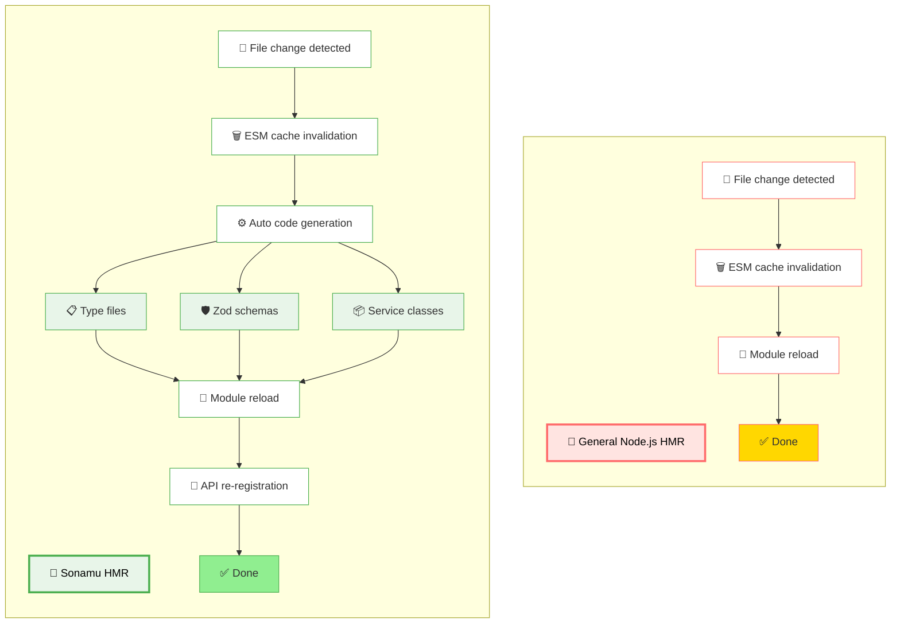
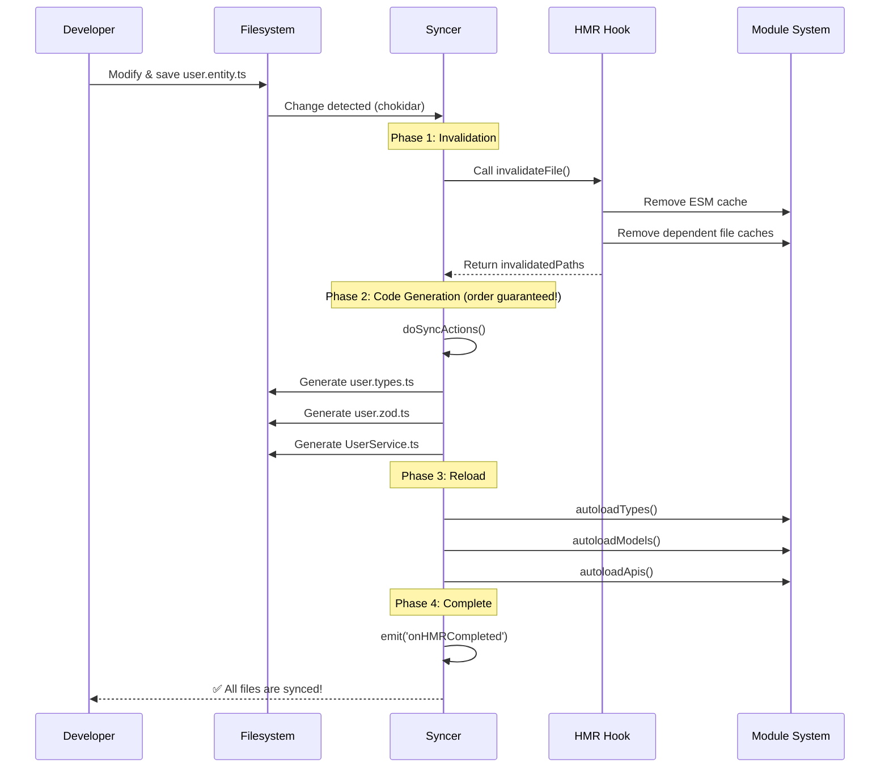
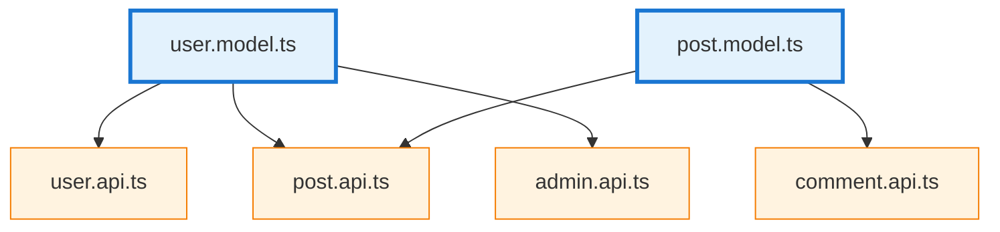

## Developing Without Server Restart

Developing with Sonamu is like this:

1. Modify code
2. Save (Cmd+S)
3. **Done!** 👈 Instantly reflected

No need to refresh the browser, restart the server, or run build commands.

### Actual Development Speed Difference

**Without HMR (Traditional approach):**

```bash
# Entity modification → Server restart → Test
1. Modify Entity in Sonamu UI
2. Ctrl+C (stop server)
3. pnpm dev (restart server)
4. Wait 20-30 seconds...
5. Test

30 seconds wasted each iteration 😫
```

**With HMR (Sonamu approach):**

```bash
# Entity modification → Instant reflection
1. Modify Entity in Sonamu UI
2. 🔄 Invalidated log appears in console after 2 seconds
3. Test

2 seconds is enough even with iterations 🚀
```

**If you modify Entity/API 50 times a day?**

- Without HMR: 50 × 30 seconds = **25 minutes wasted**
- With HMR: 50 × 2 seconds = **1.7 minutes**

## Difference from Other Frameworks

| Framework  | HMR Support         | Auto-generated Code Sync | Entity Change Reflection  |
| ---------- | ------------------- | ------------------------ | ------------------------- |
| NestJS     | ❌ None             | -                        | Manual restart required   |
| Express    | ❌ None             | -                        | nodemon restart           |
| Fastify    | ⚠️ Partial support  | -                        | Manual restart required   |
| **Sonamu** | **✅ Full support** | **✅ Automatic**         | **✅ Instant reflection** |

### What Makes Sonamu Special

Typical Node.js HMR:

- Simply reloads files
- Auto-generated code needs manual management
- Multiple files need manual modification on Entity change

**Sonamu HMR:**

- File reload + automatic Syncer execution
- Entity change → All related code auto-generated/updated
- All dependent files auto-reloaded
- APIs auto-re-registered



## Real Development Scenarios

### Scenario 1: Adding Entity Field

Adding a `nickname` field to User Entity:

**Step 1: Add field in Sonamu UI**

```typescript
// Add nickname to User Entity
nickname: StringProp({ maxLength: 50 });
```

**Step 2: Instantly on save**

- `user.entity.ts` auto-updated
- `user.types.ts` types auto-generated
- `user.zod.ts` Zod schema auto-generated
- `UserModel` auto-reloaded
- All UserApi methods auto-re-registered
- Frontend `UserService` auto-updated

**Step 3: Check console**

```bash
🔄 Invalidated:
- src/application/user/user.entity.ts
- src/application/user/user.model.ts (with 8 APIs)
- src/application/user/user.api.ts

✅ All files are synced!
```

**Step 4: Test**

```bash
# API call without server restart
curl http://localhost:3000/api/user/1
{
  "id": 1,
  "name": "John",
  "nickname": null  // 👈 New field instantly reflected!
}
```

⏱️ **With HMR**: 2 seconds
⏱️ **Without HMR**: 30 seconds (server restart + recompile)

### Scenario 2: Modifying API Logic

Adding pagination and search to `UserApi.list()`:

```typescript
// user.api.ts before modification
@api({ httpMethod: "GET" })
async list() {
  return UserModel.findMany();
}
```

```typescript
// user.api.ts after modification
@api({ httpMethod: "GET" })
async list(listParams: ListParams & { keyword?: string }) {
  const where = listParams.keyword
    ? { name: { $like: `%${listParams.keyword}%` } }
    : undefined;

  return UserModel.findMany({
    where,
    limit: listParams.num,
    offset: (listParams.page - 1) * listParams.num,
  });
}
```

On save:

```bash
🔄 Invalidated:
- src/application/user/user.api.ts

✨ API re-registered: GET /api/user/list
```

**Testable immediately in Postman/Thunder Client!**

```bash
GET /api/user/list?keyword=john&page=1&num=10
# Works immediately ✅
```

### Scenario 3: Adding Model Business Logic

Adding user active status check logic:

```typescript
// user.model.ts
export class UserModel extends BaseModelClass {
  static async findActive() {
    return this.findMany({
      where: { status: "active", deletedAt: null },
    });
  }

  isActive(): boolean {
    return this.status === "active" && !this.deletedAt;
  }
}
```

Save → 2 seconds later → Available in other APIs immediately:

```typescript
// post.api.ts
@api({ httpMethod: "POST" })
async create(body: PostForm) {
  const user = await UserModel.findById(body.userId);

  if (!user.isActive()) {  // 👈 Use the method just added!
    throw new BadRequestException("User is not active");
  }

  return PostModel.save(body);
}
```

## Sonamu HMR's Innovation: Syncer Integration

Typical Node.js HMR is simply "File changed? Let's reload it."

But Sonamu is different.

### Problem: The Auto-generated Code Dilemma

Sonamu auto-generates numerous code from Entities:

- TypeScript type files (`*.types.ts`)
- Zod schemas (`*.zod.ts`)
- API route registration
- Frontend Service classes

**If Syncer and HMR operated separately:**

```
User Entity modified
  ↓
Syncer starts generating files...
  ↓
HMR detects and starts reloading... ← 🚨 Still generating!
  ↓
Timing mismatch → Errors occur
```

### Sonamu's Solution

The Watcher batches file events and hands them to a single Syncer entry point (`hmrAndSync`),
which splits the work into HMR and sync concerns:

```typescript
// syncer.ts
async hmrAndSync(fileEvents: Map<AbsolutePath, "change" | "add">) {
  // 1. HMR concern: invalidate the api/src module graph
  //    (independent of the cpg — checksum pattern group — match)
  for (const [filePath, event] of fileEvents) {
    await hot.invalidateFile(filePath, event);
  }

  // 2. Sync concern: run doSyncActions for files matching the cpg
  //    (auto-generated code sync completes — order guaranteed!)
  await this.doSyncActions(matchedFiles);

  // 3. Now safely reload modules
  await this.autoloadTypes();
  await this.autoloadModels();
  await this.autoloadApis();
  await this.autoloadWorkflows();

  // 4. Done!
  this.eventEmitter.emit("onHMRCompleted");
}
```

**Because order is guaranteed:**

1. Code generation completes fully
2. Then reload begins
3. Latest code is always loaded ✅

This is why Sonamu HMR is not just "fast" but **safe and reliable**.

<Note>
  The watcher coalesces change events with a 100ms global trailing debounce before invoking
  `hmrAndSync` once. Only one cycle runs at a time — cycles are serialized.
</Note>



## HMR Architecture

### Key Components

Sonamu's HMR system consists of three core components:

**1. @sonamu-kit/hmr-hook**

A package forked from [hot-hook](https://github.com/Julien-R44/hot-hook) and customized for Sonamu.

```typescript
// hmr-hook-register.ts
if (process.env.HOT === "yes" && process.env.API_ROOT_PATH) {
  const { hot } = await import("@sonamu-kit/hmr-hook");

  await hot.init({
    rootDirectory: process.env.API_ROOT_PATH,
    boundaries: [`./src/**/*.ts`], // All .ts files are HMR targets
  });

  console.log("🔥 HMR-hook initialized");
}
```

Uses Node.js's Module Loader API to intercept the module loading process.

**2. Dependency Tree**

Tracks dependencies between files in a tree structure:

```
user.model.ts
  ├─ user.api.ts
  ├─ post.api.ts
  └─ admin.api.ts
```

When `user.model.ts` changes, 3 dependent files are also reloaded.



**Example**: When `user.model.ts` changes, 3 dependent files (`user.api.ts`, `post.api.ts`, `admin.api.ts`) are also reloaded.

**3. Watcher + Syncer**

`syncer/watcher.ts` (the chokidar glue) filters file events through a four-step first-pass guard,
then queues them with a 100ms global batch and hands the collected events to the Syncer's
`hmrAndSync` in a single call:

```typescript
// First-pass guard: drop irrelevant events at the watcher entry
//   - isWantedEvent: only "change" | "add" pass through (no unlink)
//   - isConfigChange: sonamu.config.ts is routed separately
//   - isOutOfScope: cut unless it lives in api/src or matches the cpg
//   - isLastChangedByMe: filter out self-write echoes (mtime check)
const fileEvents = await collectBatch(); // 100ms global trailing debounce

await syncer.hmrAndSync(fileEvents);
```

## HMR Process Details

When a developer modifies a file, the following process runs automatically:

### 1. File Change Detection

```typescript
// Monitor filesystem with chokidar
watcher.on("change", (filePath) => {
  console.log(`File changed: ${filePath}`);
});
```

### 2. Module Invalidation

```typescript
// Remove ESM cache
const invalidatedPaths = await hot.invalidateFile(diffFilePath, "change");
// ["src/user/user.model.ts", "src/user/user.api.ts", ...]
```

Removes ESM import cache for the changed file and traverses the Dependency Tree to remove caches for all dependent files.

### 3. Auto-generated Code Sync

When Entity or Model changes, Syncer auto-generates related code:

```typescript
await this.doSyncActions([diffFilePath]);
```

Generated files:

- TypeScript type file (`user.types.ts`)
- Zod schema (`user.zod.ts`)
- Frontend Service (`UserService.ts`)

### 4. Module Reload

```typescript
await this.autoloadTypes();
await this.autoloadModels();
await this.autoloadApis();
await this.autoloadWorkflows();
```

Invalidated modules have their caches removed, so the latest code is loaded.

### 5. API Re-registration

When a Model file changes, all APIs for that Model are re-registered:

```typescript
removeInvalidatedRegisteredApis(invalidatedPath: AbsolutePath) {
  const entityId = EntityManager.getEntityIdFromPath(invalidatedPath);
  const toRemove = registeredApis.filter((api) => api.modelName === `${entityId}Model`);

  for (const api of toRemove) {
    registeredApis.splice(registeredApis.indexOf(api), 1);
  }

  return toRemove;
}
```

Console output:

```bash
🔄 Invalidated:
- src/user/user.model.ts (with 8 APIs)
```

## Differences from Original hot-hook

Sonamu's `@sonamu-kit/hmr-hook` forked the original hot-hook with the following improvements:

### 1. Allow Variable-based Dynamic Import

```typescript
// Original hot-hook: ❌ Not possible
const modelPath = `./models/${entityId}.model`;
await import(modelPath); // Error!

// Sonamu hmr-hook: ✅ Possible
const modelPath = `./models/${entityId}.model`;
await import(modelPath); // Works
```

Essential for Sonamu's Entity-based structure where paths must be dynamically generated.

### 2. Allow Static Import Between Boundaries

```typescript
// user.model.ts (boundary)
import { PostModel } from "./post.model"; // Original: ❌ / Sonamu: ✅

export class UserModel extends BaseModelClass {
  async getPosts() {
    return PostModel.findMany({ where: { userId: this.id } });
  }
}
```

Static imports allowed since references between Models are frequent.

### 3. Filesystem Watcher Disabled

The original uses its own file watcher, but Sonamu uses only Syncer's watcher:

```typescript
// When Syncer detects file change, notify HMR directly
await hot.invalidateFile(filePath, "change");
```

This **precisely controls the order** of code generation and module invalidation.

### 4. Improved Integration with ts-loader

Resolved path mismatches between compiled `dist/*.js` paths and original `src/*.ts` paths.

## Performance Optimization

### Selective Invalidation

Only the changed file and its dependencies are invalidated, preventing unnecessary reloads:

```typescript
// user.types.ts change → only user.model.ts reloads
// Not the entire project, just affected files!
```

### Checksum-based Change Detection

Only files with actual content changes are processed:

```typescript
const changedFiles = await findChangedFilesUsingChecksums();
if (changedFiles.length === 0) {
  console.log(chalk.black.bgGreen("All files are synced!"));
  return;
}
```

Even if a file is saved, no sync occurs if content is unchanged.

### Graceful Shutdown Handling

Prevents process termination during sync operations:

```typescript
await runWithGracefulShutdown(
  async () => {
    await this.doSyncActions(changedFiles);
    await renewChecksums();
  },
  { whenThisHappens: "SIGUSR2", waitForUpTo: 20000 },
);
```

Waits up to 20 seconds for sync completion even when receiving Nodemon restart signal.

## Enabling HMR

Automatically enabled in development mode:

```bash
pnpm dev  # HOT=yes is auto-set
```

Can also be controlled via environment variables:

```bash
# Enable HMR
HOT=yes pnpm dev

# Disable HMR (for debugging)
HOT=no pnpm dev
```

<Note>HMR is automatically disabled in production builds, and static builds are generated.</Note>

## Development Tips

### Check HMR Status

```typescript
// Check logs printed in terminal
🔥 HMR-hook initialized

// On file change
🔄 Invalidated:
- src/user/user.model.ts (with 8 APIs)
- src/user/user.api.ts

✅ All files are synced!
```

### If It Seems Slow

If changes seem slow to reflect after file modification:

```bash
# Check dependency tree
const dump = await hot.dump();
console.log(`Total modules: ${dump.length}`);
console.log(`Boundaries: ${dump.filter(d => d.boundary).length}`);
```

Improve import structure if there are too many dependencies.

### Changes Requiring Restart

Server restart is required when modifying these files:

- `sonamu.config.ts` - Configuration file
- `.env` - Environment variables
- `package.json` - Dependencies

These files are marked with `import.meta.hot?.decline()` and automatically require restart on change.
