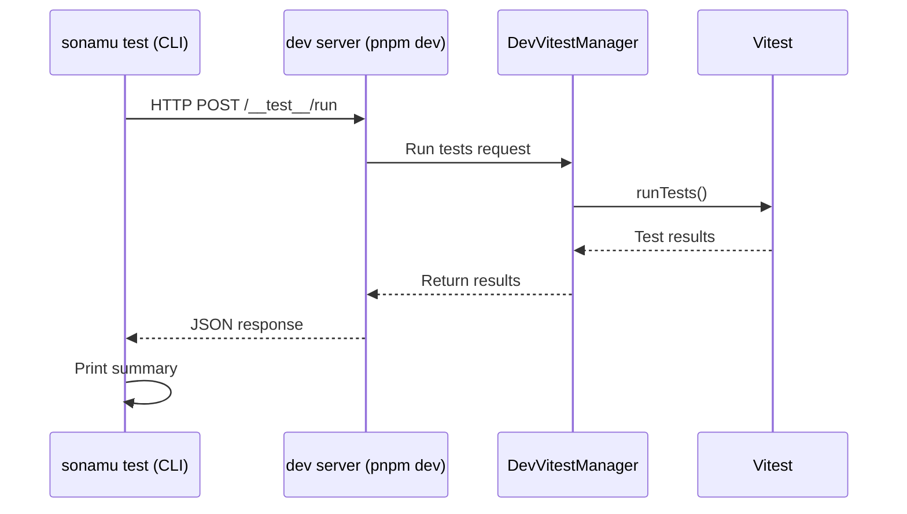

The `pnpm sonamu test` command runs tests through the **Vitest instance hosted in the dev server**. Since the dev server reuses already-loaded modules, you get faster feedback compared to `pnpm test`, which initializes everything from scratch each time.

## Prerequisites

Two things are required to use this command:

1. Enable `devRunner` in `sonamu.config.ts`
2. Have the dev server running via `pnpm dev`

### sonamu.config.ts Configuration

```typescript title="api/src/sonamu.config.ts"
export default defineConfig({
  // ... other settings
  test: {
    devRunner: {
      enabled: true,
      routePrefix: "/__test__",            // optional, default
      vitestConfigPath: "vitest.config.ts", // optional, relative to api-root
    },
  },
});
```

### Configuration Options

| Option | Type | Default | Description |
|--------|------|---------|-------------|
| `enabled` | `boolean` | `false` | Whether to enable DevRunner |
| `routePrefix` | `string` | `"/__test__"` | Path prefix for test endpoints |
| `vitestConfigPath` | `string` | - | Path to vitest.config.ts (relative to api-root) |

## Basic Usage

```bash
# Run all tests
pnpm sonamu test

# Run a specific file
pnpm sonamu test src/application/user/user.test.ts

# Filter by test name pattern
pnpm sonamu test --pattern "findMany"

# Combine file and pattern
pnpm sonamu test src/application/user/user.test.ts --pattern "findById"
```

### Options

| Option | Short | Description |
|--------|-------|-------------|
| `--pattern <name>` | `-p <name>` | Filter tests by name pattern |

<Tip>
You can specify multiple file paths:
```bash
pnpm sonamu test src/application/user/user.test.ts src/application/post/post.test.ts
```
</Tip>

## How It Works

`pnpm sonamu test` invokes the resident Vitest instance inside the dev server via an HTTP request.



1. The CLI sends a POST request to the dev server's `/__test__/run` endpoint.
2. The dev server's `DevVitestManager` runs the tests using the resident Vitest instance.
3. Results are returned as JSON, and the CLI prints a summary.

## Comparison with `pnpm test`

| | `pnpm test` | `pnpm sonamu test` |
|---|---|---|
| Server required | No | `pnpm dev` must be running |
| Execution speed | Re-initializes each time | Reuses Vitest instance (fast) |
| HMR integration | None | Code changes reflected immediately |
| Use case | CI, full test suite | Quick feedback during development |

<Info>
**When to use which?**

- **During development**: Use `pnpm sonamu test` for quick feedback. You can modify code and immediately run tests.
- **CI/CD**: Use `pnpm test`. It runs the full test suite in an isolated environment.
</Info>

## Status Check

To check the DevRunner status on the dev server, use the `/__test__/status` endpoint:

```bash
curl http://localhost:3000/__test__/status
```

```json
{
  "ready": true,
  "running": false,
  "lastRunAt": "2026-02-23T10:30:00.000Z"
}
```

| Field | Description |
|-------|-------------|
| `ready` | Whether the Vitest instance is ready |
| `running` | Whether tests are currently running |
| `lastRunAt` | Timestamp of the last test run |

## Troubleshooting

### Cannot connect to dev server

```
dev 서버에 연결할 수 없습니다. sonamu dev가 실행 중인지 확인하세요
```

**Solution**: Start the dev server first with `pnpm dev`.

### DevRunner not enabled

```
devRunner가 활성화되지 않았습니다. sonamu.config.ts에서 test.devRunner.enabled: true 설정이 필요합니다
```

**Solution**: Set `test.devRunner.enabled` to `true` in `sonamu.config.ts` and restart the dev server.

## Next Steps

<CardGroup cols={2}>
  <Card title="Test Structure" icon="vial" href="/testing/writing-tests/test-structure">
    Learn about the Vitest-based test system
  </Card>
  <Card title="dev" icon="code" href="/tools-and-cli/sonamu-cli/dev">
    Learn more about the development server
  </Card>
</CardGroup>
