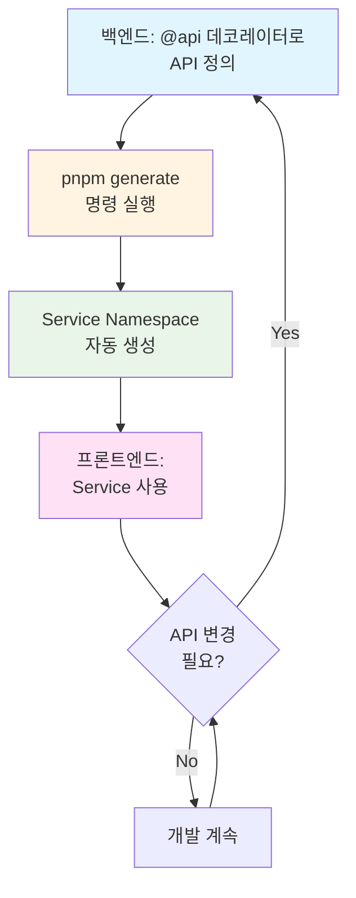

Sonamu가 백엔드 API로부터 타입 안전한 클라이언트 Service를 자동 생성하는 방식을 이해합니다.

## 자동 생성 Service 개요

<CardGroup cols={2}>
  <Card title="타입 안전성" icon="shield-check">
    백엔드와 동기화
    
    컴파일 타임 검증
  </Card>
  <Card title="Namespace 기반" icon="cube">
    정적 함수
    
    간결한 호출
  </Card>
  <Card title="TanStack Query" icon="arrows-rotate">
    React Hook 자동 생성
    
    캐싱과 재검증
  </Card>
  <Card title="Subset 지원" icon="layer-group">
    필요한 필드만
    
    성능 최적화
  </Card>
</CardGroup>

## 왜 자동 생성인가?

### 문제: 수동 API 클라이언트의 한계

전통적인 프론트엔드 개발에서는 백엔드 API를 호출하기 위해 **수동으로 클라이언트 코드**를 작성합니다.

**수동 클라이언트 예시**:
```typescript
// ❌ 수동 작성 - 문제가 많음
async function getUser(userId: number) {
  const response = await axios.get(`/api/user/${userId}`);
  return response.data;
}

async function updateUser(userId: number, data: any) {
  const response = await axios.put(`/api/user/${userId}`, data);
  return response.data;
}
```

**이 방식의 문제점**:
1. **타입 안전성 부재**: `any` 타입 남발, 런타임 에러 발생
2. **백엔드 변경 추적 불가**: API가 변경되어도 프론트엔드는 모름
3. **중복 코드**: 모든 API마다 비슷한 코드 반복
4. **실수 가능성**: URL 오타, 잘못된 파라미터 등
5. **유지보수 어려움**: API 변경 시 모든 호출 지점 수정 필요

### 해결: 자동 생성의 장점

Sonamu는 백엔드의 `@api` 데코레이터를 분석하여 **타입 안전한 클라이언트를 자동 생성**합니다.

**자동 생성 클라이언트 예시**:
```typescript
// ✅ 자동 생성 - 타입 안전 (Namespace 기반)
export namespace UserService {
  // Subset으로 필요한 필드만 조회
  export async function getUser<T extends UserSubsetKey>(
    subset: T,
    id: number
  ): Promise<UserSubsetMapping[T]> {
    return fetch({
      method: "GET",
      url: `/api/user/findById?${qs.stringify({ subset, id })}`,
    });
  }
  
  export async function updateUser(
    id: number,
    params: { username?: string; email?: string }
  ): Promise<User> {
    return fetch({
      method: "PUT",
      url: `/api/user/update`,
      data: { id, ...params },
    });
  }
}
```

**장점**:
1. ✨ **완전한 타입 안전성**: 백엔드 타입이 프론트엔드에 그대로 반영
2. ✨ **즉각적인 에러 발견**: 컴파일 타임에 API 변경 감지
3. ✨ **자동 완성**: IDE가 API 파라미터와 응답 타입 자동 제안
4. ✨ **Namespace 기반**: 깔끔한 구조, import 간편
5. ✨ **단일 진실 공급원**: 백엔드가 API 명세의 유일한 소스

<Info>
**단일 진실 공급원 (Single Source of Truth)**이란 시스템의 모든 정보가 하나의 소스에서 파생되는 원칙입니다. Sonamu에서는 백엔드의 `@api` 데코레이터가 유일한 API 명세이며, 프론트엔드는 이를 따라갑니다.
</Info>

## Service 생성 과정

### 1단계: 백엔드 API 정의

백엔드에서 `@api` 데코레이터로 API를 정의합니다.

```typescript
// backend/models/user.model.ts
import { BaseModelClass, api } from "sonamu";

class UserModel extends BaseModelClass {
  modelName = "User";
  
  /**
   * 사용자 프로필 조회
   */
  @api({ httpMethod: "GET" })
  async getProfile(userId: number): Promise<{
    user: {
      id: number;
      email: string;
      username: string;
      createdAt: Date;
    };
  }> {
    const rdb = this.getPuri("r");
    const user = await rdb
      .table("users")
      .where("id", userId)
      .first();
    
    return { user };
  }
  
  /**
   * 사용자 프로필 수정
   */
  @api({ httpMethod: "PUT", guards: ["user"] })
  async updateProfile(params: {
    username?: string;
    bio?: string;
  }): Promise<{
    user: {
      id: number;
      username: string;
      bio: string;
    };
  }> {
    // 구현...
  }
}
```

이 API 정의가 **모든 것의 시작점**입니다. 타입 정보, 파라미터, 응답 형식 모두 여기에 정의되어 있습니다.

### 2단계: TypeScript AST 파싱

Sonamu는 TypeScript 컴파일러 API를 사용하여 코드를 분석합니다.

**분석 과정**:
```typescript
// Sonamu의 내부 동작 (의사 코드)
const sourceFile = ts.createSourceFile(
  "user.model.ts",
  fileContent,
  ts.ScriptTarget.Latest
);

// @api 데코레이터가 있는 메서드 찾기
const apiMethods = findDecorators(sourceFile, "api");

for (const method of apiMethods) {
  const apiInfo = {
    name: method.name.text,                    // "getProfile"
    httpMethod: getDecoratorOption("httpMethod"), // "GET"
    path: `/api/user/${method.name.text}`,    // "/api/user/getProfile"
    parameters: extractParameters(method),     // [{ name: "userId", type: "number" }]
    returnType: extractReturnType(method),     // Promise<{ user: User }>
  };
  
  // Service 코드 생성
  generateServiceMethod(apiInfo);
}
```

**핵심 개념**:
- **AST (Abstract Syntax Tree)**: 코드를 트리 구조로 표현한 것
- **타입 추출**: TypeScript의 타입 시스템에서 정확한 타입 정보 획득
- **메타데이터 수집**: 데코레이터 옵션, Guards, 주석 등 모든 정보 수집

### 3단계: Namespace Service 생성

수집된 정보를 바탕으로 **Namespace 기반 Service**를 생성합니다.

**생성되는 코드 (services.generated.ts)**:
```typescript
import qs from "qs";

// Subset 타입 정의
export type UserSubsetKey = "A" | "B" | "C";

// Subset 별 타입 매핑
export type UserSubsetMapping = {
  A: { id: number; email: string; username: string };           // 기본 필드
  B: { id: number; email: string; username: string; bio: string }; // + bio
  C: User; // 전체 필드 (createdAt, updatedAt 등 포함)
};

/**
 * User Service Namespace
 * 
 * 모든 User 관련 API 호출을 담당하는 namespace입니다.
 */
export namespace UserService {
  /**
   * 사용자 조회 (Subset 지원)
   * 
   * @param subset - 조회할 필드 범위 ("A" | "B" | "C")
   * @param id - 사용자 ID
   * @returns Subset에 따른 타입 안전한 사용자 정보
   */
  export async function getUser<T extends UserSubsetKey>(
    subset: T,
    id: number
  ): Promise<UserSubsetMapping[T]> {
    // qs.stringify로 쿼리 파라미터 직렬화
    return fetch({
      method: "GET",
      url: `/api/user/findById?${qs.stringify({ subset, id })}`,
    });
  }
  
  /**
   * 사용자 프로필 수정
   * 
   * @param params - 수정할 필드
   * @returns 수정된 사용자 정보
   */
  export async function updateProfile(params: {
    username?: string;
    bio?: string;
  }): Promise<{
    user: {
      id: number;
      username: string;
      bio: string;
    };
  }> {
    return fetch({
      method: "PUT",
      url: "/api/user/updateProfile",
      data: params, // POST/PUT은 body로 전송
    });
  }
}
```

**Namespace 구조의 장점**:
- **간결함**: 클래스보다 간단 (new 불필요)
- **정적 메서드**: 상태 관리 불필요
- **Tree-shaking**: 사용하지 않는 함수는 번들에서 제외
- **Import 간편**: `import { UserService } from "./services.generated"`

### 4단계: TanStack Query Hook 생성

React에서 바로 사용할 수 있는 Hook도 자동 생성됩니다.

```typescript
// services.generated.ts (계속)
import { useQuery, queryOptions } from "@tanstack/react-query";

export namespace UserService {
  // ... 위의 함수들
  
  /**
   * TanStack Query Options
   * 
   * queryKey와 queryFn을 포함한 재사용 가능한 옵션입니다.
   */
  export const getUserQueryOptions = <T extends UserSubsetKey>(
    subset: T,
    id: number
  ) =>
    queryOptions({
      queryKey: ["User", "getUser", subset, id],
      queryFn: () => getUser(subset, id),
    });
  
  /**
   * React Hook (TanStack Query)
   * 
   * 자동 캐싱, 재검증, 로딩 상태를 제공하는 Hook입니다.
   */
  export const useUser = <T extends UserSubsetKey>(
    subset: T,
    id: number,
    options?: { enabled?: boolean }
  ) =>
    useQuery({
      ...getUserQueryOptions(subset, id),
      ...options,
    });
}
```

**TanStack Query 통합의 장점**:
- 자동 캐싱
- 자동 재검증
- 로딩/에러 상태 자동 관리
- 조건부 페칭 지원
- 낙관적 업데이트 지원

## 생성된 Service의 구조

### fetch 유틸리티 함수

모든 Service가 사용하는 공통 fetch 함수입니다.

```typescript
// sonamu.shared.ts
import axios, { AxiosRequestConfig } from "axios";
import { z } from "zod";

/**
 * 공통 fetch 함수
 * 
 * 모든 API 호출이 이 함수를 통해 이루어집니다.
 * Axios를 래핑하여 에러 처리와 응답 변환을 담당합니다.
 */
export async function fetch(options: AxiosRequestConfig) {
  try {
    const res = await axios({
      ...options,
    });
    return res.data;
  } catch (e: unknown) {
    // Axios 에러를 SonamuError로 변환
    if (axios.isAxiosError(e) && e.response && e.response.data) {
      const d = e.response.data as {
        message: string;
        issues: z.ZodIssue[];
      };
      throw new SonamuError(e.response.status, d.message, d.issues);
    }
    throw e;
  }
}

/**
 * Sonamu 에러 클래스
 * 
 * HTTP 상태 코드와 Zod 유효성 검사 이슈를 포함합니다.
 */
export class SonamuError extends Error {
  isSonamuError: boolean;

  constructor(
    public code: number,        // HTTP 상태 코드 (401, 403, 422 등)
    public message: string,     // 에러 메시지
    public issues: z.ZodIssue[] // Zod 유효성 검사 이슈
  ) {
    super(message);
    this.isSonamuError = true;
  }
}

/**
 * 에러 타입 가드
 */
export function isSonamuError(e: any): e is SonamuError {
  return e && e.isSonamuError === true;
}
```

**fetch 함수의 역할**:
- **Axios 호출 래핑**: `options`를 Axios에 전달
- **자동 응답 추출**: `res.data`를 바로 반환
- **에러 변환**: Axios 에러 → `SonamuError`
- **Zod 이슈 처리**: 유효성 검사 에러를 타입 안전하게 처리

**AxiosRequestConfig 파라미터**:
```typescript
{
  method: "GET" | "POST" | "PUT" | "DELETE",
  url: string,
  params?: Record<string, any>,  // GET 쿼리 파라미터
  data?: any,                     // POST/PUT body
  headers?: Record<string, string>,
}
```

### Subset 시스템

Sonamu의 독특한 기능인 Subset 시스템입니다.

**Subset이란?**

엔티티의 여러 변형(subset)을 정의하여 **필요한 필드만 조회**할 수 있는 시스템입니다.

```typescript
// Subset 정의 (자동 생성)
export type UserSubsetKey = "A" | "B" | "C";

export type UserSubsetMapping = {
  A: { id: number; email: string; username: string },           // 기본 정보
  B: { id: number; email: string; username: string; bio: string }, // + bio
  C: User, // 전체 필드 (createdAt, updatedAt, deletedAt 등 포함)
};

// 사용 예시
const basicUser = await UserService.getUser("A", 123);  
// 타입: { id: number; email: string; username: string }

const fullUser = await UserService.getUser("C", 123);   
// 타입: User (전체 필드)
```

**Subset의 장점**:
1. **성능**: 필요한 필드만 조회하여 네트워크 비용 절감
2. **타입 안전**: 각 Subset마다 정확한 타입 반환
3. **명시성**: 어떤 데이터가 필요한지 코드에서 명확히 표현
4. **데이터베이스 최적화**: SELECT 절에 필요한 컬럼만 포함

**Subset 네이밍 규칙**:
- **A**: 기본 필드 (id, 핵심 정보)
- **B**: 중간 필드 (A + 추가 정보)
- **C**: 전체 필드 (모든 컬럼, 타임스탬프 포함)

## 타입 안전성의 실제

### 컴파일 타임 검증

백엔드 API가 변경되면 **컴파일 타임에 즉시 에러**가 발생합니다.

**백엔드 변경**:
```typescript
// 백엔드에서 username -> displayName으로 변경
@api({ httpMethod: "PUT" })
async updateProfile(params: {
  displayName?: string;  // username에서 변경됨
  bio?: string;
}): Promise<{ user: User }> {
  // ...
}
```

**프론트엔드 에러**:
```typescript
// pnpm generate 후 자동으로 Service 타입 업데이트됨

// ❌ 컴파일 에러 발생!
await UserService.updateProfile({
  username: "newname",  // Error: 'username' does not exist in type
});

// ✅ 수정 후 정상 동작
await UserService.updateProfile({
  displayName: "newname",  // OK
});
```

이는 **런타임 에러를 컴파일 타임으로 끌어올려** 버그를 사전에 방지합니다.

### IDE 자동 완성

타입 정보 덕분에 IDE가 강력한 자동 완성을 제공합니다.

```typescript
// 타입을 입력하면...
UserService.up  // IDE가 "updateProfile" 자동 제안

// 파라미터를 입력하면...
await UserService.updateProfile({
  // IDE가 가능한 필드를 모두 제안:
  // - displayName?: string
  // - bio?: string
});

// Subset도 자동 완성
await UserService.getUser(
  "A" // IDE가 "A" | "B" | "C" 제안
  , 123
);
```

## 개발 워크플로우

### 백엔드 우선 개발

Sonamu의 자동 생성은 **백엔드 우선(Backend-First)** 개발을 권장합니다.

**일반적인 워크플로우**:



**장점**:
- 백엔드와 프론트엔드의 계약(Contract)이 명확
- 타입 불일치로 인한 버그 원천 차단
- API 문서 자동 생성 (Service가 곧 문서)
- 협업 효율성 향상

### 개발 시 재생성

API가 변경될 때마다 Service를 재생성해야 합니다.

```bash
# Service 재생성
pnpm generate

# 또는 watch 모드로 자동 재생성
pnpm generate:watch
```

<Warning>
**주의사항**:
- 생성된 Service 파일(`services.generated.ts`)은 **절대 수동 수정 금지**
- 수정이 필요하면 백엔드에서 수정 후 재생성
- 생성 파일을 `.gitignore`에 추가할지 팀에서 결정
  - 추가하면: 각자 로컬에서 생성
  - 추가 안하면: Git으로 공유 (빌드 시간 단축)
</Warning>

## 실제 사용 예시

### 기본 사용

```typescript
import { UserService } from "@/services/services.generated";

// Subset "A"로 기본 정보만 조회
const user = await UserService.getUser("A", 123);
console.log(user.username); // OK
console.log(user.bio); // ❌ 컴파일 에러 (Subset A에 bio 없음)

// Subset "B"로 bio 포함 조회
const userWithBio = await UserService.getUser("B", 123);
console.log(userWithBio.bio); // OK

// 프로필 수정
await UserService.updateProfile({
  username: "newname",
  bio: "Hello, World!",
});
```

### React에서 사용 (TanStack Query Hook)

```typescript
import { UserService } from "@/services/services.generated";

function UserProfile({ userId }: { userId: number }) {
  // 자동 생성된 Hook 사용
  const { data: user, isLoading, error } = UserService.useUser("A", userId);
  
  if (isLoading) return <div>Loading...</div>;
  if (error) return <div>Error: {error.message}</div>;
  if (!user) return <div>User not found</div>;
  
  return (
    <div>
      <h1>{user.username}</h1>
      <p>{user.email}</p>
    </div>
  );
}
```

### 조건부 페칭

```typescript
function UserProfile({ userId }: { userId: number | null }) {
  const { data: user } = UserService.useUser(
    "A", 
    userId!, // TypeScript non-null assertion
    { enabled: userId !== null } // userId가 null이면 호출 안함
  );
  
  if (!userId) return <div>Please select a user</div>;
  
  return <div>{user?.username}</div>;
}
```

## 고급 기능

### qs.stringify 사용

GET 요청의 쿼리 파라미터를 직렬화할 때 `qs` 라이브러리를 사용합니다.

```typescript
import qs from "qs";

// 복잡한 객체도 쿼리 스트링으로 변환
const queryString = qs.stringify({ 
  subset: "A", 
  id: 123,
  filters: { status: "active" } 
});
// "subset=A&id=123&filters[status]=active"

// Service에서 사용
export async function getUser<T extends UserSubsetKey>(
  subset: T,
  id: number
): Promise<UserSubsetMapping[T]> {
  return fetch({
    method: "GET",
    url: `/api/user/findById?${qs.stringify({ subset, id })}`,
  });
}
```

**qs를 사용하는 이유**:
- 중첩 객체 지원 (`filters[status]=active`)
- 배열 직렬화 지원 (`ids[]=1&ids[]=2`)
- 백엔드의 파싱 방식과 일치

### 에러 처리

SonamuError를 타입 안전하게 처리합니다.

```typescript
import { UserService } from "@/services/services.generated";
import { isSonamuError } from "@/lib/sonamu.shared";

try {
  await UserService.updateProfile({
    username: "newname",
  });
} catch (error) {
  if (isSonamuError(error)) {
    // Sonamu 에러
    console.log("Status:", error.code);
    console.log("Message:", error.message);
    console.log("Validation Issues:", error.issues);
    
    // Zod 유효성 검사 에러 처리
    error.issues.forEach((issue) => {
      console.log(`${issue.path.join(".")}: ${issue.message}`);
    });
  } else {
    // 일반 에러
    console.error(error);
  }
}
```

### Query Options 재사용

```typescript
import { UserService } from "@/services/services.generated";
import { useQueryClient } from "@tanstack/react-query";

function SomeComponent() {
  const queryClient = useQueryClient();
  
  async function handleUpdate() {
    // 수정 후 캐시 무효화
    await UserService.updateProfile({ username: "newname" });
    
    // Query Options로 특정 쿼리 무효화
    queryClient.invalidateQueries(
      UserService.getUserQueryOptions("A", 123)
    );
  }
}
```

### Prefetching

```typescript
import { UserService } from "@/services/services.generated";
import { useQueryClient } from "@tanstack/react-query";

function UserList({ userIds }: { userIds: number[] }) {
  const queryClient = useQueryClient();
  
  // 호버 시 미리 로드
  function handleMouseEnter(userId: number) {
    queryClient.prefetchQuery(
      UserService.getUserQueryOptions("A", userId)
    );
  }
  
  return (
    <ul>
      {userIds.map((id) => (
        <li
          key={id}
          onMouseEnter={() => handleMouseEnter(id)}
        >
          User {id}
        </li>
      ))}
    </ul>
  );
}
```

## 주의사항

<Warning>
**Service 사용 시 주의사항**:
1. 생성된 Service 파일(`services.generated.ts`)은 **절대 수동 수정 금지**
2. **Subset 파라미터 필수**: `getUser("A", id)` 처럼 subset 지정 필요
3. Namespace이므로 **new 불필요**: `UserService.getUser()` 직접 호출
4. TanStack Query Hook은 **컴포넌트 내부**에서만 호출
5. 에러 처리 시 `isSonamuError()` 타입 가드 사용
6. `qs.stringify()`는 복잡한 객체 직렬화 시 사용
</Warning>

## 다음 단계

<CardGroup cols={2}>
  <Card title="Service 사용하기" icon="code" href="/frontend-integration/generated-services/using-services">
    생성된 Service 활용법
  </Card>
  <Card title="TanStack Query Hook" icon="arrows-rotate" href="/frontend-integration/generated-services/tanstack-query">
    React에서 사용하기
  </Card>
  <Card title="Creating APIs" icon="at" href="/api-development/creating-apis/api-decorator">
    @api 데코레이터
  </Card>
  <Card title="Subset System" icon="layer-group" href="/core-concepts/entity-system/subset-system">
    Subset 시스템
  </Card>
</CardGroup>
