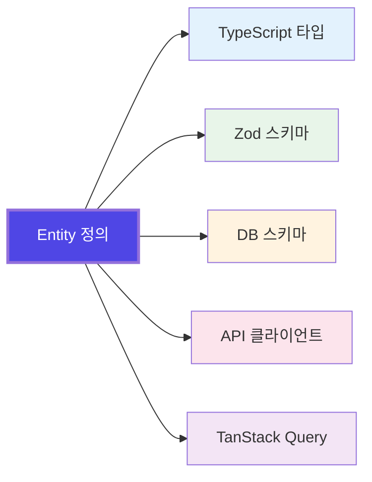

TypeScript는 강력한 타입 시스템을 가지고 있습니다. 하지만 많은 프레임워크들이 이 강점을 온전히 활용하지 못하고 있습니다.

Sonamu는 TypeScript의 타입 시스템을 중심에 두고 설계되었습니다.

## Sonamu가 다른 이유

많은 프레임워크들은 익숙한 패턴을 제공합니다. 데코레이터, 의존성 주입, 풍부한 설정 파일들... 친숙하지만, 정작 TypeScript가 제공하는 컴파일 타임 타입 안전성과 자동 완성의 이점은 충분히 누리지 못합니다.

Sonamu는 다릅니다. **Entity 하나를 정의하면, 나머지는 TypeScript가 알아서 합니다.**

<Frame caption="🎬 필요: Entity 저장 → 타입/스키마/API 자동 생성 → 프론트엔드 Service 생성까지 전체 플로우 (10초 타임랩스 영상)">
</Frame>

## 핵심 철학: 단일 진실 공급원



Entity를 한 곳에 정의하면, 시스템 전체가 동기화됩니다. 수동으로 타입을 맞추거나, API 스펙을 문서화하거나, 프론트엔드 클라이언트를 작성할 필요가 없습니다.

## 백엔드와 프론트엔드의 타입 동기화

일반적으로 백엔드 API를 만들고 프론트엔드에서 사용할 때는 타입 동기화가 어렵습니다:

<Tabs>
  <Tab title="수동 작성 시">
    ```typescript
    // 백엔드 API
    router.get('/api/users/:id', async (req, res) => {
      const user = await db.users.findById(req.params.id);
      res.json(user);
    });
    
    // 프론트엔드 클라이언트 (수동으로 작성)
    async function getUser(id: number): Promise<any> {  // ← any!
      const res = await fetch(`/api/users/${id}`);
      return res.json();
    }
    
    // 컴포넌트에서 사용
    const user = await getUser(123);
    console.log(user.username);  // 런타임 에러 가능성
    console.log(user.email);     // 필드가 있는지 컴파일 타임에 알 수 없음
    ```
    
    **문제점**:
    - 백엔드 타입과 프론트엔드 타입이 별도로 관리됨
    - API 응답 구조가 변경되어도 컴파일 타임에 알 수 없음
    - 수동으로 타입을 맞춰야 하므로 실수 가능성
  </Tab>
  
  <Tab title="Sonamu 방식">
    ```typescript
    // 백엔드 Model
    @api({ httpMethod: "GET" })
    async findById(id: number): Promise<User> {
      return this.puri()
        .where("id", id)
        .first();
    }
    
    // 프론트엔드 Service (자동 생성)
    export namespace UserService {
      export async function findById(id: number): Promise<User> {
        return fetch({ method: "GET", url: `/api/user/findById?id=${id}` });
      }
    }
    
    // 컴포넌트에서 사용 (완벽한 타입 안전성)
    const user = await UserService.findById(123);
    console.log(user.username);    // ✅ 타입 체크됨
    console.log(user.email);       // ✅ 타입 체크됨
    console.log(user.nonExistent); // ❌ 컴파일 에러
    ```
    
    **장점**:
    - 백엔드 타입이 프론트엔드에 자동으로 동기화
    - API 변경 시 컴파일 타임에 즉시 감지
    - 수동 작업 없이 항상 최신 상태 유지
  </Tab>
</Tabs>

<Frame caption="📸 필요: VS Code에서 타입 에러가 빨간 줄로 표시되는 스크린샷 (user.nonExistent에 빨간 밑줄)">
</Frame>

백엔드에서 필드명을 변경하면? **컴파일 에러로 즉시 알 수 있습니다.** 런타임까지 기다릴 필요가 없습니다.

## 개발자 경험: 생각하는 속도로 개발하기

### 즉각적인 피드백

코드를 저장하면 2초 안에 모든 것이 반영됩니다. 서버 재시작도, 빌드도, 타입 재생성도 필요 없습니다.

<Frame caption="🎬 필요: Entity 필드 추가 → 저장 → HMR 로그 → 프론트엔드에서 즉시 사용 (실시간 화면 녹화 15초)">
</Frame>

**HMR이 단순히 파일을 재로드하는 것이 아닙니다.** Sonamu의 Syncer는 변경된 Entity를 감지하고, 필요한 모든 파일을 자동으로 재생성한 뒤, 관련된 모듈만 정확히 교체합니다.

```bash
🔄 Invalidated:
- src/application/user/user.entity.ts
- src/application/user/user.model.ts (with 8 APIs)

✨ Generated:
- user.types.ts (TypeScript types)
- user.zod.ts (Runtime validation)
- UserService.ts (Frontend client)

✅ All files are synced! (1.8s)
```

### Subset으로 정확한 데이터만

필요한 필드만 조회하세요. 네트워크 비용을 줄이고, 성능을 높이고, 의도를 명확히 표현할 수 있습니다.

```typescript
// 목록 화면: 최소 정보만
const users = await UserService.findMany("A", { page: 1 });
// { id, email, username }

// 상세 화면: 전체 정보
const user = await UserService.findById("C", userId);
// { id, email, username, bio, createdAt, updatedAt, ... }
```

<Info>
Subset은 단순한 필드 선택이 아닙니다. 각 Subset마다 **정확한 TypeScript 타입**이 자동으로 생성되어, 어떤 필드를 사용할 수 있는지 컴파일 타임에 알 수 있습니다.
</Info>

## 복잡한 데이터도 간단하게

관계형 데이터를 다루는 것은 어렵습니다. 특히 트랜잭션 안에서 여러 테이블에 순차적으로 데이터를 넣어야 할 때는 더욱 그렇습니다.

<Tabs>
  <Tab title="전통적인 방식">
    ```typescript
    // 복잡하고 오류가 발생하기 쉬운 코드
    await db.transaction(async (trx) => {
      // 1. Company 생성
      const [company] = await trx
        .insert({ name: "Tech Corp" })
        .into("companies")
        .returning("id");
      
      // 2. Department 생성 (company_id 필요)
      const [dept] = await trx
        .insert({ 
          name: "Engineering", 
          company_id: company.id  // ← 수동으로 ID 연결
        })
        .into("departments")
        .returning("id");
      
      // 3. User 생성
      const [user] = await trx
        .insert({ email: "john@test.com", ... })
        .into("users")
        .returning("id");
      
      // 4. Employee 생성 (user_id, department_id 필요)
      await trx
        .insert({
          user_id: user.id,       // ← 수동으로 ID 연결
          department_id: dept.id, // ← 수동으로 ID 연결
          ...
        })
        .into("employees");
    });
    ```
  </Tab>
  
  <Tab title="Sonamu 방식">
    ```typescript
    // 간결하고 명확한 코드
    await db.transaction(async (trx) => {
      // 1. 데이터 등록 (UBRef로 관계 정의)
      const companyRef = trx.ubRegister("companies", {
        name: "Tech Corp",
      });
      
      const deptRef = trx.ubRegister("departments", {
        name: "Engineering",
        company_id: companyRef,  // ← UBRef 참조
      });
      
      const userRef = trx.ubRegister("users", {
        email: "john@test.com",
        ...
      });
      
      trx.ubRegister("employees", {
        user_id: userRef,         // ← UBRef 참조
        department_id: deptRef,   // ← UBRef 참조
        ...
      });
      
      // 2. 순서대로 저장 (자동으로 ID 연결됨)
      await trx.ubUpsert("companies");
      await trx.ubUpsert("departments");
      await trx.ubUpsert("users");
      await trx.ubUpsert("employees");
    });
    ```
  </Tab>
</Tabs>

**UBRef**는 실제 ID가 생성되기 전에 관계를 정의할 수 있게 해주는 Sonamu만의 독특한 방식입니다. 코드가 간결해지고, 실수할 여지가 줄어듭니다.

## SQL도 타입 안전하게

ORM이 느리다고요? Raw SQL을 쓰면 타입 안전성을 포기해야 한다고요? Sonamu의 **Puri 쿼리 빌더**는 둘 다 해결합니다.

```typescript
// 타입 안전하면서도 명확한 쿼리
const users = await this.puri()
  .select({
    userId: "id",
    userName: "username",
    userEmail: "email",
  })
  .where("role", "admin")
  .where("age", ">=", 18)
  .orderBy("created_at", "desc")
  .limit(10)
  .many();

// users의 타입이 자동으로 추론됨:
// Array<{ userId: number; userName: string; userEmail: string; }>
```

<Check>
Puri는 메서드 체이닝으로 쿼리를 작성하지만, 최종적으로는 **최적화된 SQL 하나**로 실행됩니다. N+1 문제도, 불필요한 쿼리도 없습니다.
</Check>

<Frame caption="📸 필요: 복잡한 Puri 쿼리 코드와 그것이 생성하는 실제 SQL 쿼리를 나란히 보여주는 스크린샷">
</Frame>

## 누구를 위한 프레임워크인가

Sonamu는 다음과 같은 분들에게 적합합니다:

<CardGroup cols={2}>
  <Card title="생산성을 중시하는 개발자" icon="rocket">
    반복 작업에 시간을 낭비하지 않고, 비즈니스 로직에 집중하고 싶은 분
  </Card>
  
  <Card title="타입 안전성을 신뢰하는 팀" icon="shield-check">
    런타임 에러보다 컴파일 에러를 선호하고, IDE의 도움을 최대한 활용하는 팀
  </Card>
  
  <Card title="프론트엔드와 협업하는 백엔드" icon="handshake">
    API 스펙 문서화와 클라이언트 작성의 이중 작업에서 벗어나고 싶은 분
  </Card>
  
  <Card title="빠른 프로토타이핑이 필요한 스타트업" icon="gauge-high">
    MVP를 빠르게 만들면서도 기술 부채를 최소화하고 싶은 팀
  </Card>
</CardGroup>

## 간단한 예시로 보는 Sonamu

### 1. Entity 정의 (Sonamu UI)

<Frame caption="📸 필요: Sonamu UI에서 User Entity를 정의하는 화면 (필드, Subset, Enum 등 입력된 상태)">
</Frame>

```json
{
  "id": "User",
  "table": "users",
  "props": [
    { "name": "email", "type": "string", "length": 255 },
    { "name": "username", "type": "string", "length": 100 },
    { "name": "role", "type": "enum", "id": "UserRole" }
  ],
  "subsets": {
    "A": ["id", "email", "username"],
    "C": ["id", "email", "username", "role", "created_at"]
  },
  "enums": {
    "UserRole": {
      "admin": "관리자",
      "user": "일반 사용자"
    }
  }
}
```

### 2. 자동 생성되는 것들

저장 버튼을 누르는 순간:

✅ **TypeScript 타입** (`user.types.ts`)
```typescript
export type User = {
  id: number;
  email: string;
  username: string;
  role: "admin" | "user";
  created_at: Date;
};
```

✅ **Zod 스키마** (런타임 검증)
```typescript
export const UserRole = z.enum(["admin", "user"]);
export const User = z.object({
  id: z.number(),
  email: z.string().max(255),
  username: z.string().max(100),
  role: UserRole,
  created_at: z.date(),
});
```

✅ **데이터베이스 마이그레이션**
```sql
CREATE TABLE users (
  id INTEGER PRIMARY KEY,
  email VARCHAR(255) NOT NULL,
  username VARCHAR(100) NOT NULL,
  role TEXT NOT NULL,
  created_at TIMESTAMP DEFAULT CURRENT_TIMESTAMP
);
```

✅ **프론트엔드 Service** (TanStack Query 포함)
```typescript
export namespace UserService {
  export async function findById(
    subset: "A" | "C",
    id: number
  ): Promise<UserSubsetMapping[typeof subset]> {
    // ...
  }
  
  export const useUser = (subset: "A" | "C", id: number) =>
    useQuery({
      queryKey: ["User", "findById", subset, id],
      queryFn: () => findById(subset, id),
    });
}
```

### 3. Model에서 비즈니스 로직 작성

```typescript
class UserModelClass extends BaseModelClass {
  @api({ httpMethod: "POST" })
  @transactional()
  async register(params: {
    email: string;
    username: string;
    password: string;
  }): Promise<{ user: User }> {
    // 중복 체크
    const existing = await this.puri()
      .where("email", params.email)
      .first();
    
    if (existing) {
      throw new BadRequestException("이미 사용 중인 이메일입니다");
    }
    
    // 비밀번호 해싱
    const hashed = await bcrypt.hash(params.password, 10);
    
    // 저장
    const wdb = this.getPuri("w");
    wdb.ubRegister("users", {
      email: params.email,
      username: params.username,
      password: hashed,
      role: "user",
    });
    
    const [userId] = await wdb.ubUpsert("users");
    const user = await this.findById("C", userId);
    
    return { user };
  }
}
```

### 4. React에서 즉시 사용

```tsx
import { UserService } from "@/services/services.generated";

function RegisterForm() {
  const registerMutation = useMutation({
    mutationFn: UserService.register,
  });
  
  const handleSubmit = async (e: React.FormEvent) => {
    e.preventDefault();
    const formData = new FormData(e.currentTarget);
    
    try {
      const { user } = await registerMutation.mutateAsync({
        email: formData.get("email") as string,
        username: formData.get("username") as string,
        password: formData.get("password") as string,
      });
      
      console.log("Registered:", user.username);  // ✅ 타입 안전
    } catch (error) {
      if (isSonamuError(error)) {
        alert(error.message);  // "이미 사용 중인 이메일입니다"
      }
    }
  };
  
  return <form onSubmit={handleSubmit}>...</form>;
}
```

<Frame caption="🎬 필요: 위 전체 플로우를 실제로 시연하는 영상 (Entity 생성 → Model 작성 → React에서 사용까지, 30초 타임랩스)">
</Frame>

## 그 외의 강력한 기능들

<AccordionGroup>
  <Accordion title="Relation과 DataLoader">
    Entity 간 관계를 정의하면, JOIN 쿼리가 자동으로 생성됩니다. N+1 문제는 DataLoader 패턴으로 자동 해결됩니다.
    
    ```typescript
    // Subset에 관계 포함
    "posts.title",
    "posts.author.username",
    "posts.tags.name"
    
    // 자동으로 최적화된 쿼리 실행
    ```
  </Accordion>
  
  <Accordion title="AI Agent 통합">
    Sonamu UI의 AI 채팅으로 Entity를 자연어로 생성할 수 있습니다.
    
    "이커머스 주문 시스템을 만들어줘. 사용자, 상품, 주문, 주문 아이템 테이블이 필요해."
    
    → Entity 4개가 관계까지 포함해서 자동 생성됩니다.
  </Accordion>
  
  <Accordion title="Naite 테스트 시스템">
    테스트 실행 중 모든 데이터 변화를 추적하고 시각화합니다. 디버깅이 훨씬 쉬워집니다.
    
    ```typescript
    test("사용자 생성", async () => {
      Naite.t("before", { count: 0 });
      await UserModel.create({ ... });
      Naite.t("after", { count: 1 });
      // Naite Viewer에서 실시간으로 확인 가능
    });
    ```
  </Accordion>
  
  <Accordion title="Vector Search">
    pgvector를 네이티브로 지원합니다. AI 임베딩 검색을 Entity 필드로 정의하면 끝입니다.
    
    ```json
    {
      "name": "embedding",
      "type": "vector",
      "dimensions": 1536
    }
    ```
  </Accordion>
</AccordionGroup>

## 시작하기

3분이면 충분합니다.

```bash
# 프로젝트 생성
pnpm create sonamu my-project

# 개발 서버 시작
cd my-project/api
pnpm dev

# Sonamu UI 열기
open http://localhost:1028/sonamu-ui
```

<Frame caption="📸 필요: 터미널에서 pnpm create sonamu 실행 후 프로젝트 생성되는 전체 과정 (로그 포함)">
</Frame>

<CardGroup cols={2}>
  <Card title="Quick Start" icon="rocket" href="/getting-started/quick-start">
    5분 만에 첫 API 만들기
  </Card>
  
  <Card title="Installation" icon="download" href="/getting-started/installation">
    자세한 설치 가이드
  </Card>
  
  <Card title="Core Concepts" icon="book" href="/core-concepts/how-sonamu-works">
    Sonamu 작동 원리 이해하기
  </Card>
  
  <Card title="Development Workflow" icon="diagram-project" href="/getting-started/development-workflow">
    개발 워크플로우 알아보기
  </Card>
</CardGroup>

## 커뮤니티

<Card title="GitHub" icon="github" href="https://github.com/cartanova-ai/sonamu">
  이슈 리포트와 기여
</Card>

---

**Sonamu와 함께라면, TypeScript로 개발하는 것이 즐거워집니다.**
