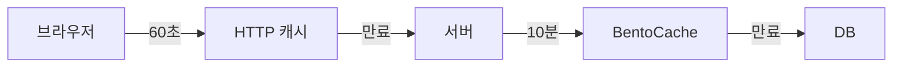

Sonamu의 `@api` 데코레이터에 `cacheControl` 옵션을 추가하여 **API 응답에 Cache-Control 헤더**를 설정할 수 있습니다.

## 기본 사용법

### @api 데코레이터에 추가

```typescript
import { BaseModelClass, api, CachePresets } from "sonamu";

class ProductModelClass extends BaseModelClass {
  @api({
    httpMethod: "GET",
    cacheControl: CachePresets.shortLived, // 1분 캐시
  })
  async findAll() {
    return this.findMany({});
  }
}
```

**결과**:

```http
HTTP/1.1 200 OK
Cache-Control: public, max-age=60
Content-Type: application/json

[{"id": 1, "name": "Product A"}, ...]
```

## 설정 방법

<Tabs>
  <Tab title="프리셋 사용" icon="list">
    **가장 간단한 방법**
    
    ```typescript
    @api({
      httpMethod: 'GET',
      cacheControl: CachePresets.mediumLived,  // 5분 캐시
    })
    async getCategories() {
      return this.categories;
    }
    ```
    
    **사용 가능한 프리셋**:
    - `noStore`: 캐시 금지
    - `noCache`: 매번 재검증
    - `shortLived`: 1분
    - `mediumLived`: 5분
    - `longLived`: 1시간
    - `private`: 개인화 데이터
  </Tab>
  
  <Tab title="커스텀 설정" icon="screwdriver-wrench">
    **세밀한 제어가 필요할 때**
    
    ```typescript
    @api({
      httpMethod: 'GET',
      cacheControl: {
        visibility: 'public',
        maxAge: 120,  // 2분
        staleWhileRevalidate: 300,  // 5분간 Stale 사용
      }
    })
    async getData() {
      return this.findMany({});
    }
    ```
  </Tab>
  
  <Tab title="전역 핸들러" icon="globe">
    **모든 API에 일괄 적용**
    
    ```typescript
    // sonamu.config.ts
    export const config: SonamuConfig = {
      server: {
        apiConfig: {
          cacheControlHandler: (req) => {
            if (req.type !== 'api') return undefined;
            
            // GET 요청만 캐싱
            if (req.method === 'GET') {
              return CachePresets.shortLived;
            }
            
            // POST, PUT, DELETE는 no-store
            return CachePresets.noStore;
          }
        }
      }
    };
    ```
  </Tab>
</Tabs>

## 우선순위

Cache-Control 설정은 다음 순서로 적용됩니다:

```mermaid
graph LR
    A[@api 데코레이터] -->|1순위| D[적용]
    B[cacheControlHandler] -->|2순위| D
    C[기본값: 없음] -->|3순위| D
```

1. **@api 데코레이터의 cacheControl** (가장 우선)
2. **cacheControlHandler 반환값**
3. **기본값** (Cache-Control 헤더 없음)

### 예시

```typescript
// sonamu.config.ts
cacheControlHandler: (req) => {
  if (req.type === 'api' && req.method === 'GET') {
    return CachePresets.shortLived;  // 기본 1분
  }
}

// Model
@api({
  httpMethod: 'GET',
  cacheControl: CachePresets.mediumLived,  // 5분으로 오버라이드
})
async getData() { ... }
```

**결과**: `mediumLived` 적용 (데코레이터가 우선)

## HTTP 메서드별 전략

### GET 요청

**조회 API는 캐싱 가능**합니다.

<Tabs>
  <Tab title="자주 변경" icon="bolt">
    ```typescript
    // 게시글 목록 (자주 추가됨)
    @api({
      httpMethod: 'GET',
      cacheControl: CachePresets.shortLived,  // 1분
    })
    async getPosts(page: number) {
      return this.findMany({ page, num: 20 });
    }
    ```
  </Tab>
  
  <Tab title="가끔 변경" icon="clock">
    ```typescript
    // 상품 정보 (가끔 수정)
    @api({
      httpMethod: 'GET',
      cacheControl: CachePresets.mediumLived,  // 5분
    })
    async getProduct(id: number) {
      return this.findOne(['id', id]);
    }
    ```
  </Tab>
  
  <Tab title="거의 변경 안됨" icon="lock">
    ```typescript
    // 카테고리 (거의 변경 안됨)
    @api({
      httpMethod: 'GET',
      cacheControl: CachePresets.longLived,  // 1시간
    })
    async getCategories() {
      return this.categories;
    }
    ```
  </Tab>
</Tabs>

### POST, PUT, DELETE 요청

**Mutation 요청은 캐싱하면 안 됩니다**.

```typescript
// ✅ 올바른 예
@api({
  httpMethod: 'POST',
  cacheControl: CachePresets.noStore,  // 캐시 금지
})
async create(data: ProductSave) {
  return this.saveOne(data);
}

@api({
  httpMethod: 'PUT',
  cacheControl: CachePresets.noStore,
})
async update(id: number, data: Partial<ProductSave>) {
  return this.updateOne(['id', id], data);
}

@api({
  httpMethod: 'DELETE',
  cacheControl: CachePresets.noStore,
})
async delete(id: number) {
  return this.deleteOne(['id', id]);
}
```

<Warning>
**Mutation 요청에 캐싱을 설정하면 안 되는 이유**:

- 같은 POST 요청을 여러 번 보내면 **중복 생성** 발생
- 브라우저가 이전 응답을 재사용 → 실제로는 생성되지 않은 것처럼 보임

```typescript
// ❌ 절대 이렇게 하지 마세요
@api({
  httpMethod: 'POST',
  cacheControl: { maxAge: 60 },  // 위험!
})
async create(data: ProductSave) { ... }
```

</Warning>

## 데이터 특성별 전략

### 공개 데이터 (public)

모든 사용자에게 동일한 응답입니다.

```typescript
class ProductModelClass extends BaseModelClass {
  // 상품 목록
  @api({
    httpMethod: "GET",
    cacheControl: {
      visibility: "public", // CDN 캐싱 가능
      maxAge: 60,
    },
  })
  async findAll() {
    return this.findMany({});
  }
}
```

**특징**:

- 브라우저 + CDN에서 캐싱
- 네트워크 트래픽 최소화
- 서버 부하 감소

### 개인 데이터 (private)

사용자별로 다른 응답입니다.

```typescript
class OrderModelClass extends BaseModelClass {
  // 내 주문 내역
  @api({
    httpMethod: "GET",
    cacheControl: CachePresets.private, // 브라우저만 캐싱
  })
  async getMyOrders(ctx: Context) {
    return this.findMany({
      where: [["user_id", ctx.user.id]],
    });
  }
}
```

**특징**:

- 브라우저에만 캐싱 (CDN 불가)
- 다른 사용자에게 노출 방지

### 민감한 데이터 (no-store)

캐싱하면 안 되는 데이터입니다.

```typescript
class PaymentModelClass extends BaseModelClass {
  // 결제 정보
  @api({
    httpMethod: "GET",
    cacheControl: CachePresets.noStore, // 캐시 금지
  })
  async getPaymentInfo(id: number) {
    return this.findOne(["id", id]);
  }
}
```

## 실전 예제

### 1. 전자상거래 API

```typescript
class ProductModelClass extends BaseModelClass {
  // 상품 목록 (자주 변경, public)
  @api({
    httpMethod: "GET",
    cacheControl: CachePresets.shortLived, // 1분
  })
  async findAll(page: number) {
    return this.findMany({ page, num: 20 });
  }

  // 상품 상세 (가끔 변경, public)
  @api({
    httpMethod: "GET",
    cacheControl: CachePresets.mediumLived, // 5분
  })
  async findById(id: number) {
    return this.findOne(["id", id]);
  }

  // 카테고리 (거의 안 변함, public)
  @api({
    httpMethod: "GET",
    cacheControl: CachePresets.longLived, // 1시간
  })
  async getCategories() {
    return this.categories;
  }

  // 재고 (실시간, no-cache)
  @api({
    httpMethod: "GET",
    cacheControl: CachePresets.noCache, // 매번 재검증
  })
  async getStock(productId: number) {
    return this.checkStock(productId);
  }

  // 장바구니 (개인, private)
  @api({
    httpMethod: "GET",
    cacheControl: CachePresets.private, // 브라우저만
  })
  async getMyCart(ctx: Context) {
    return this.getCart(ctx.user.id);
  }

  // 주문 생성 (Mutation, no-store)
  @api({
    httpMethod: "POST",
    cacheControl: CachePresets.noStore, // 캐시 금지
  })
  async createOrder(data: OrderSave) {
    return this.saveOne(data);
  }
}
```

### 2. 블로그 API

```typescript
class PostModelClass extends BaseModelClass {
  // 게시글 목록 (자주 추가, 5분)
  @api({
    httpMethod: "GET",
    cacheControl: CachePresets.mediumLived,
  })
  async findAll(page: number) {
    return this.findMany({ page, num: 10 });
  }

  // 게시글 상세 (가끔 수정, 10분)
  @api({
    httpMethod: "GET",
    cacheControl: {
      visibility: "public",
      maxAge: 600, // 10분
      staleWhileRevalidate: 1800, // 30분간 Stale 사용
    },
  })
  async findById(id: number) {
    return this.findOne(["id", id]);
  }

  // 인기 게시글 (1시간)
  @api({
    httpMethod: "GET",
    cacheControl: CachePresets.longLived,
  })
  async getPopular() {
    return this.findPopular();
  }
}
```

### 3. 사용자 API

```typescript
class UserModelClass extends BaseModelClass {
  // 공개 프로필 (public, 5분)
  @api({
    httpMethod: "GET",
    cacheControl: CachePresets.mediumLived,
  })
  async getPublicProfile(username: string) {
    return this.findOne(["username", username]);
  }

  // 내 프로필 (private, 재검증)
  @api({
    httpMethod: "GET",
    cacheControl: CachePresets.private,
  })
  async getMyProfile(ctx: Context) {
    return this.findOne(["id", ctx.user.id]);
  }

  // 프로필 업데이트 (no-store)
  @api({
    httpMethod: "PUT",
    cacheControl: CachePresets.noStore,
  })
  async updateProfile(ctx: Context, data: Partial<UserSave>) {
    return this.updateOne(["id", ctx.user.id], data);
  }
}
```

## CDN 최적화

### s-maxage 활용

브라우저와 CDN에 다른 TTL을 적용할 수 있습니다.

```typescript
@api({
  httpMethod: 'GET',
  cacheControl: {
    visibility: 'public',
    maxAge: 60,       // 브라우저: 1분
    sMaxAge: 300,     // CDN: 5분
  }
})
async getData() {
  return this.findMany({});
}
```

**효과**:

- 브라우저: 1분마다 CDN에 요청
- CDN: 5분마다 서버에 요청
- 서버 부하 최소화

### Stale-While-Revalidate

CDN에서 Stale 응답을 즉시 반환하면서 백그라운드 갱신:

```typescript
@api({
  httpMethod: 'GET',
  cacheControl: {
    visibility: 'public',
    maxAge: 60,
    staleWhileRevalidate: 300,  // 5분간 Stale 허용
  }
})
async getProducts() {
  return this.findMany({});
}
```

**CloudFront 지원**: AWS CloudFront는 `stale-while-revalidate`를 지원합니다.

## Vary 헤더

요청 헤더에 따라 다른 캐시를 사용합니다.

```typescript
@api({
  httpMethod: 'GET',
  cacheControl: {
    visibility: 'public',
    maxAge: 300,
    vary: ['Accept-Language'],  // 언어별 캐시 분리
  }
})
async getProducts(ctx: Context) {
  const locale = ctx.locale;  // 'ko' 또는 'en'
  return this.getLocalizedProducts(locale);
}
```

**결과**:

```
GET /api/products (Accept-Language: ko) → 한국어 응답 캐싱
GET /api/products (Accept-Language: en) → 영어 응답 캐싱
```

## 전역 핸들러

모든 API에 일괄적으로 Cache-Control을 적용할 수 있습니다.

```typescript
// sonamu.config.ts
import { CachePresets, type SonamuConfig } from "sonamu";

export const config: SonamuConfig = {
  server: {
    apiConfig: {
      cacheControlHandler: (req) => {
        // API 요청만 처리
        if (req.type !== "api") {
          return undefined;
        }

        // HTTP 메서드별 처리
        if (req.method !== "GET") {
          return CachePresets.noStore; // Mutation은 no-store
        }

        // API 경로별 처리
        if (req.path.includes("/admin/")) {
          return CachePresets.noStore; // 관리자 API는 no-store
        }

        if (req.path.includes("/private/")) {
          return CachePresets.private; // 개인 API는 private
        }

        // 기본값: 1분 캐시
        return CachePresets.shortLived;
      },
    },
  },
};
```

### API 객체 활용

```typescript
cacheControlHandler: (req) => {
  if (req.type !== "api") return undefined;

  // ExtendedApi 정보 활용
  if (req.api) {
    const { modelName, methodName } = req.api;

    // 특정 Model만 긴 캐시
    if (modelName === "ConfigModel") {
      return CachePresets.longLived;
    }

    // 특정 메서드는 캐시 금지
    if (methodName.startsWith("create") || methodName.startsWith("update")) {
      return CachePresets.noStore;
    }
  }

  return CachePresets.shortLived;
};
```

## BentoCache와 함께 사용

서버 캐시와 HTTP 캐시를 조합하면 최대 성능을 얻을 수 있습니다.

```typescript
@cache({ ttl: "10m", tags: ["product"] })  // 서버 캐시: 10분
@api({
  httpMethod: 'GET',
  cacheControl: { maxAge: 60 }  // HTTP 캐시: 1분
})
async getProducts() {
  return this.findMany({});
}
```

**효과**:

1. **0~60초**: 브라우저 캐시 (서버 요청 없음)
2. **60초~10분**: 서버 요청하지만 BentoCache 사용 (DB 조회 없음)
3. **10분 이후**: DB 조회 → 다시 캐싱



## 주의사항

<Warning>
**API Cache-Control 사용 시 주의사항**:

1. **GET만 캐싱**: POST, PUT, DELETE는 반드시 `noStore` 사용

   ```typescript
   // ❌ 위험
   @api({ httpMethod: 'POST', cacheControl: { maxAge: 60 } })

   // ✅ 안전
   @api({ httpMethod: 'POST', cacheControl: CachePresets.noStore })
   ```

2. **개인 데이터는 private**: CDN 캐싱 방지

   ```typescript
   // ❌ 위험: CDN에 개인 데이터 캐싱
   @api({ cacheControl: { visibility: 'public', maxAge: 60 } })
   async getMyOrders(ctx: Context) { ... }

   // ✅ 안전
   @api({ cacheControl: CachePresets.private })
   async getMyOrders(ctx: Context) { ... }
   ```

3. **자주 변경되는 데이터는 짧은 TTL**: 오래된 데이터 방지

   ```typescript
   // ❌ 재고가 실시간인데 1시간 캐싱
   @api({ cacheControl: CachePresets.longLived })
   async getStock() { ... }

   // ✅ 짧은 TTL 또는 no-cache
   @api({ cacheControl: CachePresets.noCache })
   async getStock() { ... }
   ```

4. **인증 필요한 API는 조심**: Authorization 헤더 고려
   ```typescript
   @api({
     cacheControl: {
       visibility: 'private',  // private 필수
       maxAge: 60,
       vary: ['Authorization'],  // 인증 토큰별 캐시 분리
     }
   })
   async getMyData(ctx: Context) { ... }
   ```
   </Warning>

## 다음 단계

<CardGroup cols={2}>
  <Card
    title="Cache-Control이란?"
    icon="circle-question"
    href="/ko/advanced-features/cache-control/what-is-cache-control"
  >
    HTTP 캐싱 기본 개념
  </Card>
  <Card title="Cache Presets" icon="list" href="/ko/advanced-features/cache-control/cache-presets">
    사전 정의된 캐시 설정
  </Card>
  <Card
    title="SSR에서 사용하기"
    icon="window"
    href="/ko/advanced-features/cache-control/using-in-ssr"
  >
    SSR 페이지에 Cache-Control 적용
  </Card>
</CardGroup>
