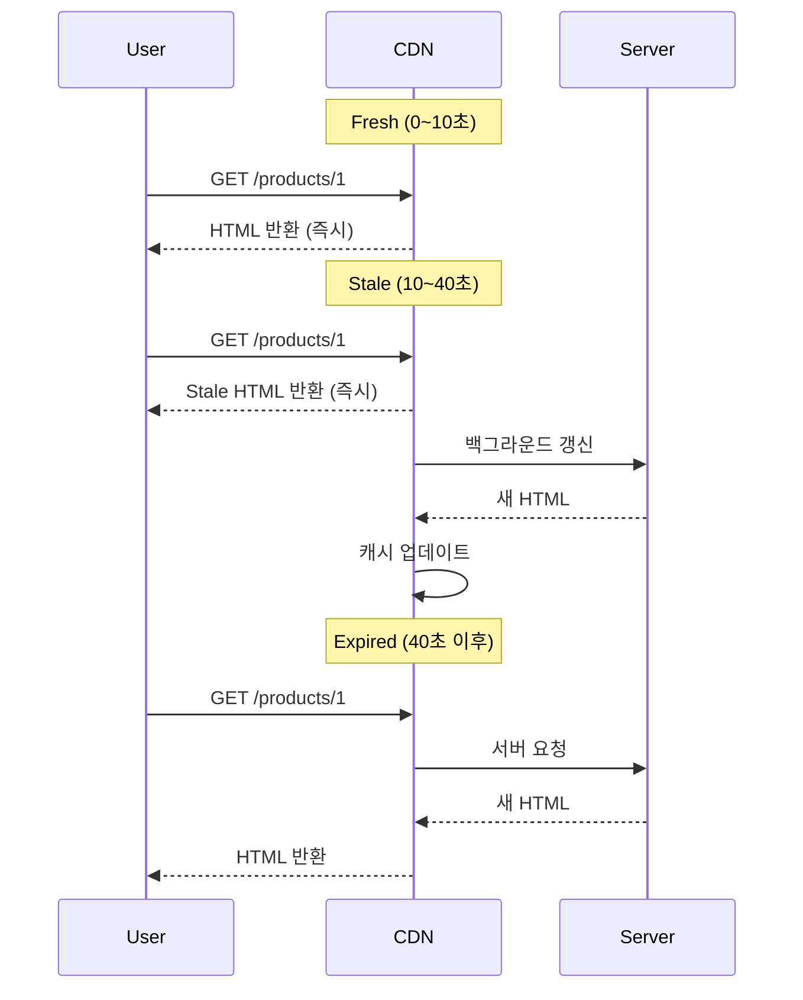
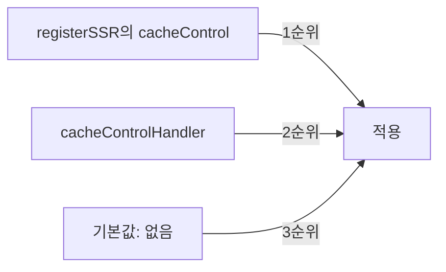

Sonamu의 SSR 라우트에 `cacheControl` 옵션을 추가하여 **SSR 페이지 응답에 Cache-Control 헤더**를 설정할 수 있습니다.

## 기본 사용법

### registerSSR에 추가

```typescript
import { CachePresets } from "sonamu";
import { registerSSR } from "sonamu/ssr";
import ProductList from "./pages/ProductList";

registerSSR({
  path: "/products",
  Component: ProductList,
  cacheControl: CachePresets.ssr, // SSR 최적화
});
```

**결과**:

```http
HTTP/1.1 200 OK
Cache-Control: public, max-age=10, stale-while-revalidate=30
Content-Type: text/html

<!DOCTYPE html>
<html>...</html>
```

## SSR 캐싱 전략

### SSR 프리셋

**가장 권장하는 방법**은 `CachePresets.ssr`을 사용하는 것입니다.

```typescript
registerSSR({
  path: "/products/:id",
  Component: ProductDetail,
  cacheControl: CachePresets.ssr,
});
```

**CachePresets.ssr**:

```typescript
{
  visibility: 'public',
  maxAge: 10,  // 10초 동안 Fresh
  staleWhileRevalidate: 30  // 이후 30초 동안 Stale 사용
}
```

### 작동 방식



**장점**:

- 대부분의 요청이 즉시 응답 (CDN 캐시)
- Stale 기간에도 빠른 응답
- 백그라운드 갱신으로 항상 최신 상태 유지

## 페이지 유형별 전략

<Tabs>
  <Tab title="동적 페이지" icon="bolt">
    **자주 변경되는 콘텐츠**
    
    ```typescript
    // 게시글 목록
    registerSSR({
      path: '/posts',
      Component: PostList,
      cacheControl: CachePresets.shortLived,  // 1분
    });
    
    // 실시간 대시보드
    registerSSR({
      path: '/dashboard',
      Component: Dashboard,
      cacheControl: CachePresets.noCache,  // 매번 재검증
    });
    ```
  </Tab>
  
  <Tab title="준동적 페이지" icon="clock">
    **가끔 변경되는 콘텐츠**
    
    ```typescript
    // 상품 상세
    registerSSR({
      path: '/products/:id',
      Component: ProductDetail,
      cacheControl: CachePresets.ssr,  // 10초 + SWR 30초
    });
    
    // 블로그 글
    registerSSR({
      path: '/blog/:slug',
      Component: BlogPost,
      cacheControl: {
        visibility: 'public',
        maxAge: 300,  // 5분
        staleWhileRevalidate: 900,  // 15분
      }
    });
    ```
  </Tab>
  
  <Tab title="정적 페이지" icon="file">
    **거의 변경되지 않는 콘텐츠**
    
    ```typescript
    // 회사 소개
    registerSSR({
      path: '/about',
      Component: About,
      cacheControl: CachePresets.longLived,  // 1시간
    });
    
    // 이용 약관
    registerSSR({
      path: '/terms',
      Component: Terms,
      cacheControl: {
        visibility: 'public',
        maxAge: 86400,  // 1일
      }
    });
    ```
  </Tab>
  
  <Tab title="개인화 페이지" icon="user">
    **사용자별로 다른 콘텐츠**
    
    ```typescript
    // 마이페이지
    registerSSR({
      path: '/my/profile',
      Component: MyProfile,
      cacheControl: CachePresets.private,  // 브라우저만 캐싱
    });
    
    // 장바구니
    registerSSR({
      path: '/cart',
      Component: Cart,
      cacheControl: CachePresets.noStore,  // 캐시 금지
    });
    ```
  </Tab>
</Tabs>

## 실전 예제

### 1. 전자상거래 사이트

```typescript
// 홈페이지: SSR 최적화
registerSSR({
  path: "/",
  Component: HomePage,
  cacheControl: CachePresets.ssr, // 10초 + SWR 30초
});

// 상품 목록: 짧은 캐시
registerSSR({
  path: "/products",
  Component: ProductList,
  cacheControl: CachePresets.shortLived, // 1분
});

// 상품 상세: SSR 최적화
registerSSR({
  path: "/products/:id",
  Component: ProductDetail,
  cacheControl: CachePresets.ssr,
});

// 카테고리: 긴 캐시
registerSSR({
  path: "/categories/:id",
  Component: CategoryPage,
  cacheControl: CachePresets.mediumLived, // 5분
});

// 장바구니: 개인화
registerSSR({
  path: "/cart",
  Component: Cart,
  cacheControl: CachePresets.private,
});

// 주문 완료: 캐시 금지
registerSSR({
  path: "/orders/:id/complete",
  Component: OrderComplete,
  cacheControl: CachePresets.noStore,
});
```

### 2. 블로그

```typescript
// 홈페이지
registerSSR({
  path: "/",
  Component: HomePage,
  cacheControl: {
    visibility: "public",
    maxAge: 300, // 5분
    staleWhileRevalidate: 900, // 15분
  },
});

// 카테고리별 목록
registerSSR({
  path: "/category/:slug",
  Component: CategoryPosts,
  cacheControl: CachePresets.mediumLived, // 5분
});

// 게시글 상세
registerSSR({
  path: "/posts/:slug",
  Component: PostDetail,
  cacheControl: {
    visibility: "public",
    maxAge: 600, // 10분
    staleWhileRevalidate: 1800, // 30분
  },
});

// 검색 결과
registerSSR({
  path: "/search",
  Component: SearchResults,
  cacheControl: CachePresets.shortLived, // 1분
});
```

### 3. SaaS 대시보드

```typescript
// 공개 랜딩 페이지
registerSSR({
  path: "/",
  Component: Landing,
  cacheControl: CachePresets.longLived, // 1시간
});

// 로그인 후 대시보드
registerSSR({
  path: "/dashboard",
  Component: Dashboard,
  cacheControl: CachePresets.private, // 브라우저만
});

// 사용자 설정
registerSSR({
  path: "/settings",
  Component: Settings,
  cacheControl: CachePresets.noStore, // 캐시 금지
});
```

## CSR Fallback

SSR 라우트에 매칭되지 않는 모든 요청은 CSR fallback으로 처리됩니다.

```typescript
// CSR fallback 라우트 (catch-all)
registerSSR({
  path: "/*",
  Component: App,
  cacheControl: CachePresets.shortLived, // 1분
});
```

**작동 방식**:

```
/products/1 → SSR 라우트 매칭 → 해당 cacheControl 사용
/random-page → SSR 라우트 미매칭 → fallback cacheControl 사용
```

## 전역 핸들러

모든 SSR 페이지에 일괄적으로 Cache-Control을 적용할 수 있습니다.

```typescript
// sonamu.config.ts
import { CachePresets, type SonamuConfig } from "sonamu";

export const config: SonamuConfig = {
  server: {
    apiConfig: {
      cacheControlHandler: (req) => {
        // SSR 요청만 처리
        if (req.type !== "ssr") {
          return undefined;
        }

        // 경로별 처리
        if (req.path === "/") {
          return CachePresets.ssr; // 홈페이지
        }

        if (req.path.startsWith("/admin/")) {
          return CachePresets.noStore; // 관리 페이지
        }

        if (req.path.startsWith("/my/")) {
          return CachePresets.private; // 개인 페이지
        }

        // 기본값: SSR 프리셋
        return CachePresets.ssr;
      },
    },
  },
};
```

### SSRRoute 객체 활용

```typescript
cacheControlHandler: (req) => {
  if (req.type !== "ssr") return undefined;

  // SSRRoute 정보 활용
  if (req.route) {
    const { path } = req.route;

    // 동적 라우트 체크
    if (path.includes(":")) {
      return CachePresets.ssr; // 상세 페이지
    }

    // 정적 라우트
    return CachePresets.mediumLived; // 목록 페이지
  }

  return CachePresets.shortLived;
};
```

## 우선순위

SSR Cache-Control 설정은 다음 순서로 적용됩니다:



1. **registerSSR의 cacheControl** (가장 우선)
2. **cacheControlHandler 반환값**
3. **기본값** (Cache-Control 헤더 없음)

## Vary 헤더

다국어 SSR 페이지에서 Vary 헤더를 사용합니다.

```typescript
registerSSR({
  path: "/products/:id",
  Component: ProductDetail,
  cacheControl: {
    visibility: "public",
    maxAge: 300,
    vary: ["Accept-Language"], // 언어별 캐시 분리
  },
});
```

**결과**:

```
GET /products/1 (Accept-Language: ko) → 한국어 HTML 캐싱
GET /products/1 (Accept-Language: en) → 영어 HTML 캐싱
```

## CDN 최적화

### CloudFront + Stale-While-Revalidate

AWS CloudFront는 `stale-while-revalidate`를 지원합니다.

```typescript
registerSSR({
  path: "/products/:id",
  Component: ProductDetail,
  cacheControl: {
    visibility: "public",
    maxAge: 60, // 1분
    sMaxAge: 300, // CDN: 5분
    staleWhileRevalidate: 600, // 10분간 Stale 사용
  },
});
```

**효과**:

- 브라우저: 1분마다 CDN 요청
- CDN: 5분마다 서버 요청
- Stale: 최대 15분(5분 + 10분) 동안 빠른 응답

### 정적 자산과 조합

```typescript
// SSR 페이지
registerSSR({
  path: "/products/:id",
  cacheControl: CachePresets.ssr, // 10초
});

// 정적 파일 (별도 설정)
server.get("/assets/:filename", (req, reply) => {
  if (req.params.filename.includes("-")) {
    // 해시 포함
    applyCacheHeaders(reply, CachePresets.immutable); // 1년
  }
  return reply.sendFile(req.params.filename);
});
```

**결과**:

- HTML: 10초마다 갱신 (최신 콘텐츠)
- JS/CSS: 1년 캐시 (빠른 로딩)

## 프리로딩과 캐싱

SSR의 `preload` 기능과 Cache-Control을 조합합니다.

```typescript
registerSSR({
  path: "/products/:id",
  Component: ProductDetail,
  preload: (params) => [
    {
      modelName: "ProductModel",
      methodName: "findById",
      params: ["A", Number(params.id)],
      serviceKey: ["Product", "getProduct"],
    },
  ],
  cacheControl: CachePresets.ssr,
});
```

**효과**:

1. **SSR 시**: 서버에서 데이터 프리로드 → HTML 생성 → 캐싱
2. **캐시 히트**: CDN에서 즉시 HTML 반환 (빠름)
3. **Hydration**: 클라이언트에서 프리로드된 데이터 사용

## 개인화 페이지 처리

### 인증 필요한 페이지

```typescript
// 로그인 필요한 페이지
registerSSR({
  path: "/my/profile",
  Component: MyProfile,
  cacheControl: CachePresets.private, // 브라우저만 캐싱
});

// 또는 캐시 금지
registerSSR({
  path: "/my/orders",
  Component: MyOrders,
  cacheControl: CachePresets.noStore,
});
```

### 조건부 SSR

사용자 상태에 따라 다른 페이지를 렌더링하는 경우:

```typescript
registerSSR({
  path: "/dashboard",
  Component: Dashboard,
  cacheControl: {
    visibility: "private", // private 필수
    noCache: true, // 매번 재검증
    vary: ["Cookie"], // 쿠키별 캐시 분리
  },
});
```

## 주의사항

<Warning>
**SSR Cache-Control 사용 시 주의사항**:

1. **개인화 페이지는 private 또는 no-store**: CDN 캐싱 방지

   ```typescript
   // ❌ 위험: 개인 페이지가 CDN에 캐싱
   registerSSR({
     path: "/my/profile",
     cacheControl: { visibility: "public", maxAge: 60 },
   });

   // ✅ 안전
   registerSSR({
     path: "/my/profile",
     cacheControl: CachePresets.private,
   });
   ```

2. **동적 콘텐츠는 짧은 TTL**: 오래된 HTML 방지

   ```typescript
   // ❌ 실시간 대시보드인데 1시간 캐싱
   registerSSR({
     path: "/dashboard",
     cacheControl: CachePresets.longLived,
   });

   // ✅ 짧은 TTL 또는 no-cache
   registerSSR({
     path: "/dashboard",
     cacheControl: CachePresets.shortLived,
   });
   ```

3. **인증 쿠키 고려**: Vary 헤더로 분리

   ```typescript
   registerSSR({
     path: "/dashboard",
     cacheControl: {
       visibility: "private",
       maxAge: 60,
       vary: ["Cookie"], // 쿠키별 캐시 분리
     },
   });
   ```

4. **CSR fallback 설정**: 매칭되지 않는 라우트 처리
   ```typescript
   // 마지막에 catch-all 라우트 추가
   registerSSR({
     path: "/*",
     Component: App,
     cacheControl: CachePresets.shortLived,
   });
   ```
   </Warning>

## 디버깅

### Cache-Control 헤더 확인

브라우저 개발자 도구에서 확인:

```
Network 탭 → 요청 선택 → Headers 탭
Response Headers:
  Cache-Control: public, max-age=10, stale-while-revalidate=30
  Vary: Accept-Language
```

### CDN 캐시 상태

CDN별로 캐시 상태 헤더를 제공합니다:

**CloudFront**:

```
X-Cache: Hit from cloudfront
Age: 5
```

**Cloudflare**:

```
CF-Cache-Status: HIT
Age: 5
```

## 다음 단계

<CardGroup cols={2}>
  <Card
    title="Cache-Control이란?"
    icon="circle-question"
    href="/ko/advanced-features/cache-control/what-is-cache-control"
  >
    HTTP 캐싱 기본 개념
  </Card>
  <Card title="Cache Presets" icon="list" href="/ko/advanced-features/cache-control/cache-presets">
    사전 정의된 캐시 설정
  </Card>
  <Card
    title="API에서 사용하기"
    icon="code"
    href="/ko/advanced-features/cache-control/using-in-apis"
  >
    @api 데코레이터에 적용
  </Card>
</CardGroup>
