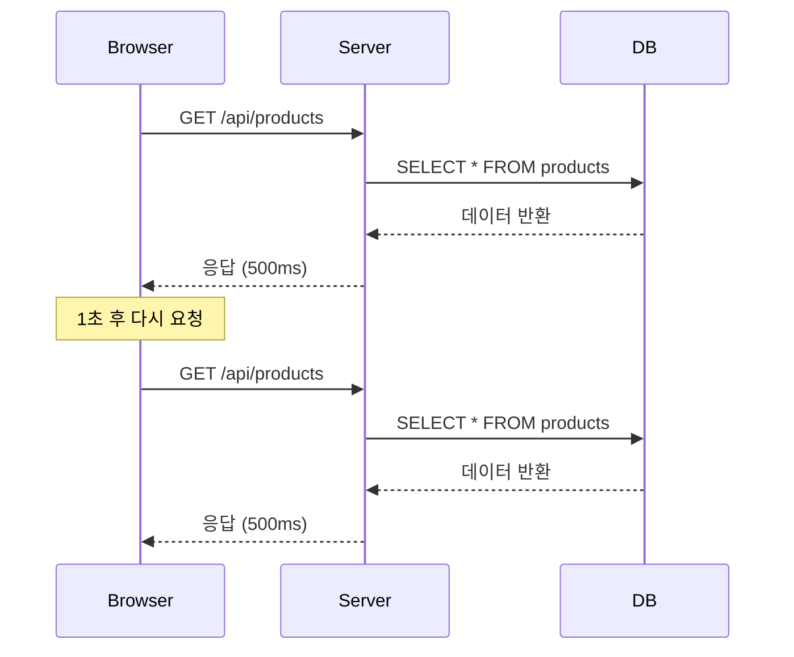
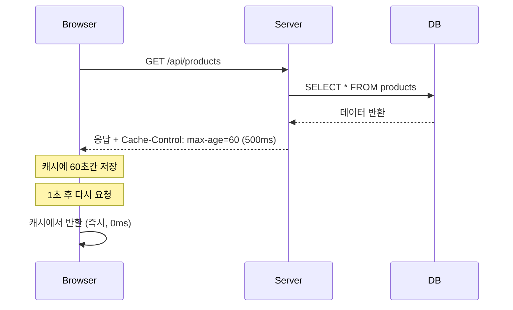
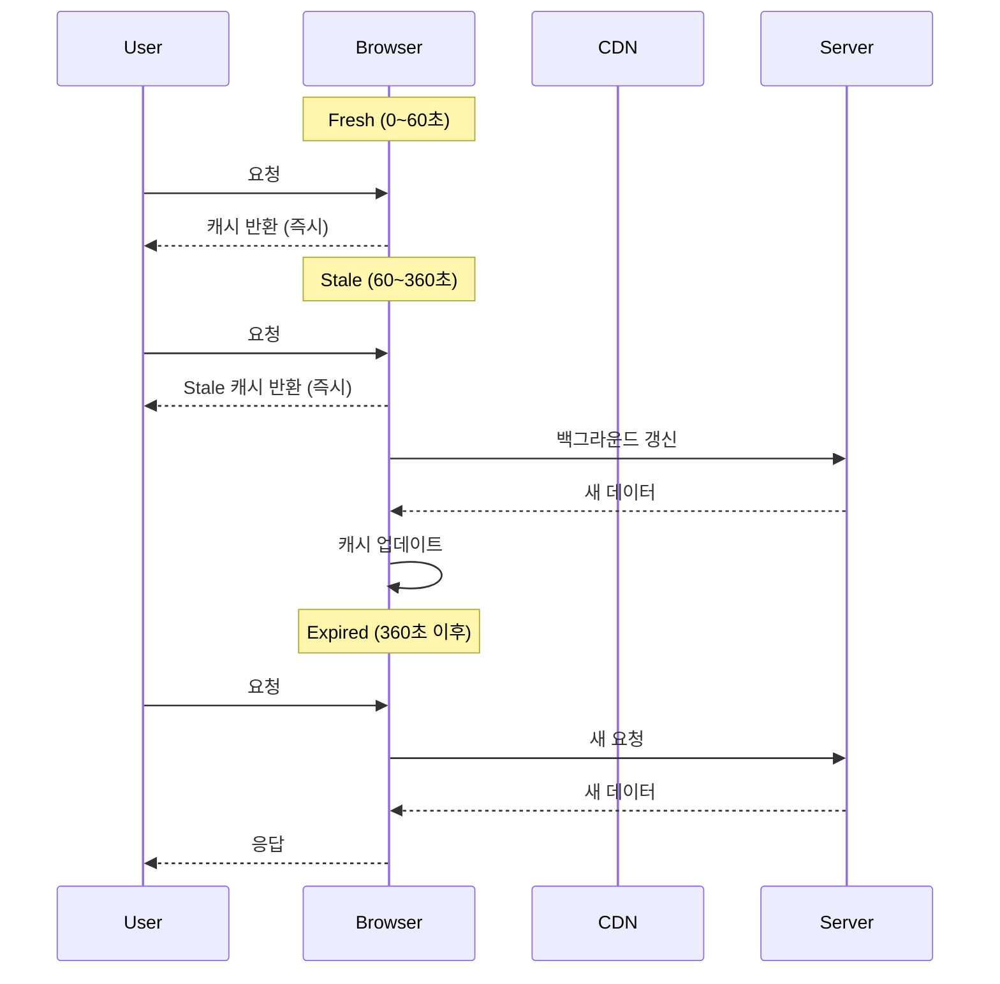

Cache-Control은 **HTTP 응답 헤더**로, 브라우저와 CDN이 응답을 얼마나 오래 캐싱할지 제어합니다. Sonamu에서는 API와 SSR 응답에 Cache-Control 헤더를 쉽게 설정할 수 있습니다.

## HTTP 캐싱이란?

HTTP 캐싱은 **같은 요청에 대한 응답을 재사용**하여 성능을 향상시키는 메커니즘입니다.

### 캐싱 없이



**문제**: 같은 데이터를 매번 DB에서 조회 (느림, 서버 부하)

### 캐싱 사용



**장점**: 서버 요청 없이 즉시 응답 (빠름, 서버 부하 감소)

## Cache-Control 헤더

### 기본 구조

```http
Cache-Control: public, max-age=3600
```

**의미**:

- `public`: 모든 캐시(브라우저, CDN)에서 저장 가능
- `max-age=3600`: 3600초(1시간) 동안 유효

### 주요 디렉티브

<Tabs>
  <Tab title="저장 위치" icon="location-dot">
    **public vs private** ```http Cache-Control: public, max-age=3600 ``` - **public**: 모든
    캐시에서 저장 가능 (브라우저, CDN, 프록시) - 용도: 모든 사용자에게 동일한 응답 (상품 목록,
    공지사항) ```http Cache-Control: private, max-age=3600 ``` - **private**: 브라우저에서만 저장
    가능 (CDN/프록시는 불가) - 용도: 사용자별로 다른 응답 (마이페이지, 장바구니)
  </Tab>

<Tab title="캐시 금지" icon="ban">
  **no-store vs no-cache** ```http Cache-Control: no-store ``` - **no-store**: 캐시 저장 자체를 금지
  - 용도: 민감한 데이터, 개인정보 - 효과: 항상 서버에 요청 ```http Cache-Control: no-cache ``` -
  **no-cache**: 캐시는 저장하되 **매번 재검증** 필요 - 용도: 최신 상태 확인이 중요한 데이터 - 효과:
  서버에 "변경되었나요?" 확인 → 변경 없으면 304 Not Modified
</Tab>

<Tab title="만료 시간" icon="clock">
  **max-age** ```http Cache-Control: public, max-age=60 ``` - 브라우저 캐시 유효 시간 (초 단위) -
  60초 = 1분, 3600초 = 1시간 **s-maxage** ```http Cache-Control: public, max-age=60, s-maxage=300
  ``` - CDN/프록시 캐시 유효 시간 - 브라우저: 60초, CDN: 300초 (5분) - 용도: CDN에서 더 오래
  캐싱하고 싶을 때
</Tab>

  <Tab title="재검증" icon="rotate">
    **must-revalidate** ```http Cache-Control: public, max-age=3600, must-revalidate ``` - 만료 후
    **반드시 재검증** 필요 - Stale 응답 사용 불가 **immutable** ```http Cache-Control: public,
    max-age=31536000, immutable ``` - 캐시된 응답이 **절대 변경되지 않음** - 용도: 해시가 포함된
    정적 파일 (`bundle-abc123.js`) - 효과: 재검증 없이 캐시만 사용
  </Tab>
</Tabs>

## Stale-While-Revalidate

만료된 캐시(Stale)를 즉시 반환하면서 백그라운드에서 갱신하는 전략입니다.

```http
Cache-Control: public, max-age=60, stale-while-revalidate=300
```

### 작동 방식



**장점**:

- 사용자는 항상 빠른 응답 (Stale이라도 즉시 반환)
- 백그라운드 갱신으로 다음 사용자는 신선한 데이터

**CloudFront 지원**: AWS CloudFront는 `stale-while-revalidate`를 지원합니다.

## Stale-If-Error

오류 발생 시 Stale 캐시를 사용합니다.

```http
Cache-Control: public, max-age=60, stale-if-error=86400
```

**작동 방식**:

1. 정상 상황: 60초마다 갱신
2. 서버 오류 발생: 최대 86400초(1일) 동안 Stale 캐시 사용
3. 서버 복구: 다시 정상 갱신

**용도**: 서버 장애 시에도 서비스 유지

## Vary 헤더

같은 URL이라도 **요청 헤더에 따라** 다른 캐시를 사용하도록 합니다.

```http
Cache-Control: public, max-age=3600
Vary: Accept-Language
```

**의미**: `Accept-Language` 헤더 값에 따라 캐시 분리

**예시**:

```
GET /api/products (Accept-Language: ko) → 한국어 응답 캐싱
GET /api/products (Accept-Language: en) → 영어 응답 캐싱
```

**자주 사용하는 Vary**:

- `Accept-Language`: 다국어 지원
- `Accept-Encoding`: 압축 방식 (gzip, br)
- `Authorization`: 인증 여부

## Sonamu vs BentoCache

Sonamu에는 두 가지 캐싱 메커니즘이 있습니다:

<Tabs>
  <Tab title="Cache-Control (HTTP)" icon="network-wired">
    **브라우저/CDN 캐싱**
    
    ```typescript
    @api({
      httpMethod: 'GET',
      cacheControl: { maxAge: 3600 }
    })
    async getProducts() {
      return this.findMany({});
    }
    ```
    
    **위치**: 브라우저, CDN, 프록시
    **제어**: HTTP 헤더로 제어
    **대상**: 클라이언트가 받는 **최종 응답**
    **특징**:
    - 네트워크 트래픽 감소
    - 클라이언트 제어 (브라우저가 캐시 관리)
    - 무효화 어려움
  </Tab>
  
  <Tab title="BentoCache (서버)" icon="server">
    **서버 사이드 캐싱**
    
    ```typescript
    @cache({ ttl: "10m" })
    @api()
    async getProducts() {
      return this.findMany({});
    }
    ```
    
    **위치**: 서버 메모리, Redis
    **제어**: 데코레이터로 제어
    **대상**: DB 조회 등 **서버 내부 연산**
    **특징**:
    - DB 부하 감소
    - 서버 제어 (즉시 무효화 가능)
    - Tag 기반 무효화
  </Tab>
</Tabs>

### 조합 사용

두 가지를 함께 사용하면 **최대 성능**을 얻을 수 있습니다:

```typescript
@cache({ ttl: "10m", tags: ["product"] })  // 서버 캐시
@api({
  httpMethod: 'GET',
  cacheControl: { maxAge: 60 }  // HTTP 캐시
})
async getProducts() {
  return this.findMany({});
}
```

**효과**:

1. **첫 요청**: DB 조회 (느림) → 서버 캐시 + HTTP 캐시
2. **60초 이내**: 브라우저 캐시에서 반환 (매우 빠름, 서버 요청 없음)
3. **60초~10분**: 서버 요청하지만 서버 캐시 사용 (빠름, DB 조회 없음)
4. **10분 이후**: DB 조회 (느림) → 다시 캐싱

## 캐싱 레이어

```mermaid
graph TD
    Client[클라이언트] --> Browser[브라우저 캐시<br/>Cache-Control: max-age]
    Browser --> CDN[CDN 캐시<br/>Cache-Control: s-maxage]
    CDN --> Server[서버]
    Server --> BentoCache[BentoCache<br/>@cache 데코레이터]
    BentoCache --> DB[(데이터베이스)]

    style Browser fill:#e3f2fd
    style CDN fill:#fff3e0
    style BentoCache fill:#e8f5e9
```

**각 레이어의 역할**:

1. **브라우저 캐시**: 사용자별 캐시, 가장 빠름
2. **CDN 캐시**: 지역별 캐시, 네트워크 지연 감소
3. **서버 캐시**: DB 부하 감소, 즉시 무효화 가능
4. **데이터베이스**: 원본 데이터

## 실전 예제

### 1. 공개 API (모든 사용자 동일)

```typescript
@api({
  httpMethod: 'GET',
  cacheControl: {
    visibility: 'public',
    maxAge: 300,  // 5분
  }
})
async getProducts() {
  return this.findMany({});
}
```

### 2. 개인화 API (사용자별 다름)

```typescript
@api({
  httpMethod: 'GET',
  cacheControl: {
    visibility: 'private',
    maxAge: 60,  // 1분
  }
})
async getMyOrders(ctx: Context) {
  return this.findMany({
    where: [['user_id', ctx.user.id]]
  });
}
```

### 3. SSR 페이지

```typescript
registerSSR({
  path: "/products",
  cacheControl: {
    visibility: "public",
    maxAge: 10,
    staleWhileRevalidate: 30, // 만료 후 30초간 Stale 사용
  },
});
```

### 4. 정적 파일 (해시 포함)

```typescript
// 파일명: bundle-abc123.js
{
  cacheControl: {
    visibility: 'public',
    maxAge: 31536000,  // 1년
    immutable: true,  // 절대 변경 안됨
  }
}
```

### 5. 민감한 데이터

```typescript
@api({
  httpMethod: 'POST',  // Mutation
  cacheControl: {
    noStore: true,  // 캐시 저장 금지
  }
})
async createPayment(data: PaymentSave) {
  return this.saveOne(data);
}
```

## 주의사항

<Warning>
**Cache-Control 사용 시 주의사항**:

1. **Mutation 요청은 캐싱 금지**: POST, PUT, DELETE 요청은 `no-store` 사용

   ```typescript
   // ❌ 잘못된 예
   @api({
     httpMethod: 'POST',
     cacheControl: { maxAge: 60 }  // Mutation인데 캐싱
   })

   // ✅ 올바른 예
   @api({
     httpMethod: 'POST',
     cacheControl: { noStore: true }
   })
   ```

2. **개인 정보는 private 또는 no-store**: 다른 사용자에게 노출되면 안 되는 데이터

   ```typescript
   // ❌ 위험: public이면 CDN에 캐싱될 수 있음
   @api({
     cacheControl: { visibility: 'public', maxAge: 60 }
   })
   async getMyProfile() { ... }

   // ✅ 안전: private 또는 no-store
   @api({
     cacheControl: { visibility: 'private', maxAge: 60 }
   })
   async getMyProfile() { ... }
   ```

3. **자주 변경되는 데이터는 짧은 TTL**: 오래된 데이터 방지

   ```typescript
   // ❌ 재고가 자주 변하는데 1시간 캐싱
   @api({
     cacheControl: { maxAge: 3600 }
   })
   async getStock() { ... }

   // ✅ 짧은 TTL 사용
   @api({
     cacheControl: { maxAge: 10 }
   })
   async getStock() { ... }
   ```

4. **CDN 사용 시 s-maxage 고려**: CDN에서 더 오래 캐싱 가능
   ```typescript
   @api({
     cacheControl: {
       maxAge: 60,      // 브라우저: 1분
       sMaxAge: 300,    // CDN: 5분
     }
   })
   async getData() { ... }
   ```
   </Warning>

## 다음 단계

<CardGroup cols={2}>
  <Card title="Cache Presets" icon="list" href="/ko/advanced-features/cache-control/cache-presets">
    사전 정의된 캐시 설정 사용하기
  </Card>
  <Card
    title="API에서 사용하기"
    icon="code"
    href="/ko/advanced-features/cache-control/using-in-apis"
  >
    @api 데코레이터에 Cache-Control 적용
  </Card>
  <Card
    title="SSR에서 사용하기"
    icon="window"
    href="/ko/advanced-features/cache-control/using-in-ssr"
  >
    SSR 페이지에 Cache-Control 적용
  </Card>
</CardGroup>
