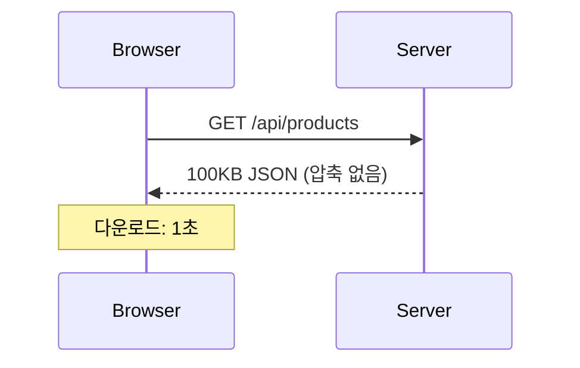
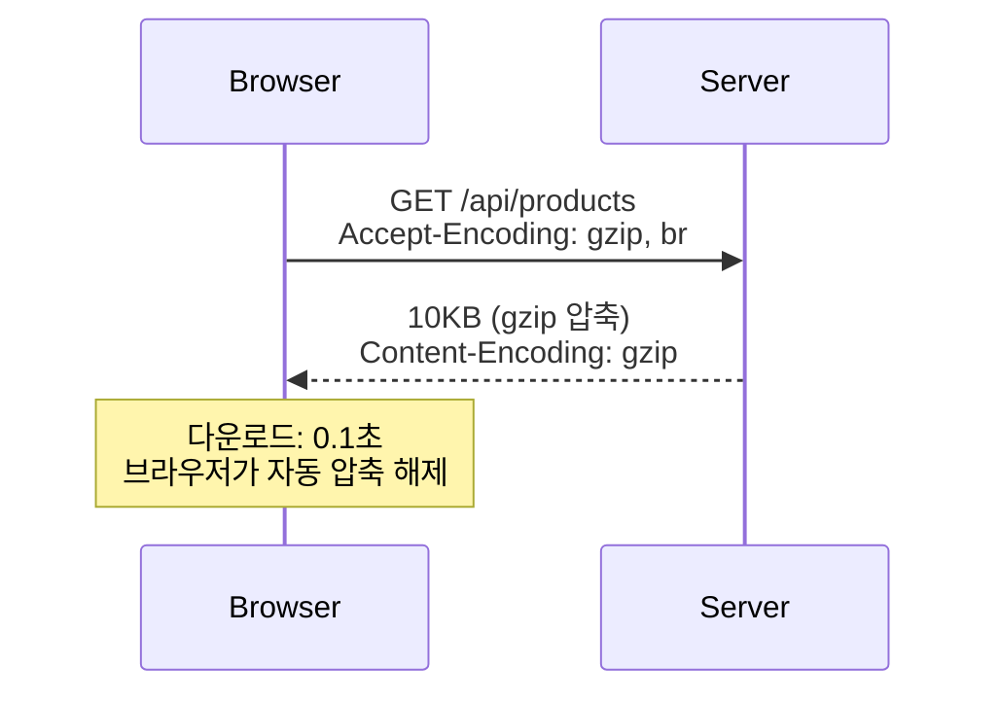

Sonamu는 `@fastify/compress` 플러그인을 사용하여 **HTTP 응답을 자동으로 압축**합니다. gzip, brotli(br), deflate 등 다양한 압축 알고리즘을 지원합니다.

## 왜 압축이 필요한가?

압축은 네트워크를 통해 전송되는 데이터 크기를 줄여줍니다.

### 압축 없이



### 압축 사용



**효과**:

- 전송 크기: 100KB → 10KB (90% 감소)
- 다운로드 시간: 1초 → 0.1초 (10배 빠름)
- 대역폭 절약

## 기본 설정

### sonamu.config.ts

```typescript
import { type SonamuConfig } from "sonamu";

export const config: SonamuConfig = {
  server: {
    plugins: {
      compress: true, // 압축 활성화 (기본 설정)
    },
  },
};
```

**기본 동작**:

- threshold: 1024 (1KB 이상만 압축)
- encodings: `["br", "gzip", "deflate"]` (우선순위 순)
- 모든 API에 자동 적용

## 설정 옵션

<Tabs>
  <Tab title="boolean" icon="toggle-on">
    **간단한 활성화/비활성화**
    
    ```typescript
    plugins: {
      compress: true,   // 활성화 (기본 설정)
      compress: false,  // 비활성화
    }
    ```
  </Tab>
  
  <Tab title="CompressOptions" icon="gear">
    **세부 설정**
    
    ```typescript
    import type { FastifyCompressOptions } from "@fastify/compress";

    plugins: {
      compress: {
        threshold: 1024,  // 최소 압축 크기 (바이트)
        encodings: ["br", "gzip", "deflate"],  // 압축 알고리즘 우선순위
        customTypes: /^text\/|application\/json/,  // 압축할 Content-Type
      } as FastifyCompressOptions
    }
    ```

  </Tab>
</Tabs>

## 압축 알고리즘

### Brotli (br)

**가장 압축률이 높은 알고리즘**

```typescript
plugins: {
  compress: {
    threshold: 1024,
    encodings: ["br"],  // Brotli만 사용
  }
}
```

**특징**:

- 압축률: 최고 (gzip 대비 15~20% 더 압축)
- 속도: 느림 (CPU 사용량 높음)
- 지원: 모던 브라우저 (IE 미지원)

**적합한 경우**:

- 정적 콘텐츠 (사전 압축 가능)
- 대역폭이 중요한 경우
- 서버 CPU에 여유가 있는 경우

### Gzip

**가장 보편적인 알고리즘**

```typescript
plugins: {
  compress: {
    threshold: 1024,
    encodings: ["gzip"],  // Gzip만 사용
  }
}
```

**특징**:

- 압축률: 중간
- 속도: 빠름
- 지원: 모든 브라우저

**적합한 경우**:

- 동적 API 응답
- 실시간 압축
- 호환성이 중요한 경우

### Deflate

**레거시 알고리즘**

```typescript
plugins: {
  compress: {
    threshold: 1024,
    encodings: ["deflate"],
  }
}
```

**특징**:

- 압축률: gzip과 유사
- 속도: 빠름
- 지원: 대부분 브라우저

**사용 권장 사항**: gzip을 사용하세요 (더 안정적)

## 압축 우선순위

브라우저가 여러 인코딩을 지원할 때 우선순위를 설정합니다.

```typescript
plugins: {
  compress: {
    encodings: ["br", "gzip", "deflate"],  // 우선순위: br > gzip > deflate
  }
}
```

**작동 방식**:

```
브라우저 요청: Accept-Encoding: br, gzip, deflate

1. br 지원? → br로 압축
2. br 미지원, gzip 지원? → gzip으로 압축
3. gzip 미지원, deflate 지원? → deflate로 압축
4. 모두 미지원? → 압축 없음
```

## Threshold (최소 크기)

작은 응답은 압축하지 않습니다.

```typescript
plugins: {
  compress: {
    threshold: 1024,  // 1KB 이상만 압축
  }
}
```

**이유**:

- 작은 데이터는 압축 효율이 낮음
- 압축/압축 해제 오버헤드가 더 클 수 있음
- HTTP 헤더 크기 증가

**권장값**:

- 기본값: `1024` (1KB)
- 적극적: `256` (256B)
- 보수적: `4096` (4KB)

### 예시

```typescript
// 100 바이트 응답
threshold: 1024; // 압축 안 함 (너무 작음)

// 2KB 응답
threshold: 1024; // 압축 함 (>= 1KB)
```

## Custom Types

특정 Content-Type만 압축합니다.

```typescript
plugins: {
  compress: {
    customTypes: /^text\/|application\/json/,  // 정규식
  }
}
```

**기본 동작**: 대부분의 텍스트 기반 응답 압축

- `text/*` (text/html, text/css, text/plain)
- `application/json`
- `application/javascript`
- `application/xml`

**이미지/비디오는 이미 압축됨**:

- `image/png`, `image/jpeg` (이미 압축된 형식)
- `video/mp4` (이미 압축된 형식)
- 추가 압축해도 효과 없음

### 함수로 제어

```typescript
plugins: {
  compress: {
    customTypes: (contentType: string) => {
      // JSON만 압축
      return contentType === "application/json";
    };
  }
}
```

## 실전 설정 예제

### 1. 기본 설정 (권장)

```typescript
export const config: SonamuConfig = {
  server: {
    plugins: {
      compress: true, // 간단하게 활성화
    },
  },
};
```

**사용하는 설정**:

- threshold: 1024 (1KB)
- encodings: `["br", "gzip", "deflate"]`

### 2. 고성능 API 서버

```typescript
export const config: SonamuConfig = {
  server: {
    plugins: {
      compress: {
        threshold: 256, // 작은 응답도 압축
        encodings: ["br", "gzip", "deflate"], // 모든 알고리즘
      },
    },
  },
};
```

**특징**:

- 최대 압축률 (brotli 우선)
- 256 바이트 이상 모두 압축
- 대역폭 최적화

### 3. 레거시 브라우저 지원

```typescript
export const config: SonamuConfig = {
  server: {
    plugins: {
      compress: {
        threshold: 1024,
        encodings: ["gzip", "deflate"], // brotli 제외
      },
    },
  },
};
```

**특징**:

- IE 등 오래된 브라우저 지원
- gzip만 사용 (안정적)

### 4. 선택적 압축

API별로 압축을 제어하고 싶을 때:

```typescript
export const config: SonamuConfig = {
  server: {
    plugins: {
      compress: {
        global: false,  // 기본적으로 압축 안 함
        threshold: 1024,
        encodings: ["br", "gzip", "deflate"],
      }
    },
  },
};

// API별 설정
@api({
  httpMethod: 'GET',
  compress: true,  // 이 API만 압축
})
async getData() {
  return this.findMany({});
}
```

**용도**:

- 대부분 API는 압축 불필요
- 특정 API만 선택적으로 압축

### 5. CPU 절약 (보수적)

```typescript
export const config: SonamuConfig = {
  server: {
    plugins: {
      compress: {
        threshold: 4096, // 4KB 이상만 압축
        encodings: ["gzip"], // gzip만 (빠름)
      },
    },
  },
};
```

**특징**:

- CPU 사용량 최소화
- 큰 응답만 압축
- 빠른 처리

## 환경별 설정

```typescript
export const config: SonamuConfig = {
  server: {
    plugins: {
      compress:
        process.env.NODE_ENV === "production"
          ? {
              threshold: 256,
              encodings: ["br", "gzip", "deflate"],
            }
          : false, // 개발 환경에서는 비활성화
    },
  },
};
```

**개발 환경**: 압축 비활성화

- 디버깅 용이
- 빠른 응답 (압축 오버헤드 없음)

**프로덕션**: 적극적 압축

- 대역폭 절약
- 사용자 경험 개선

## 압축 확인

### 브라우저 개발자 도구

```
Network 탭 → 요청 선택 → Headers 탭

Response Headers:
  Content-Encoding: gzip
  Content-Length: 1234 (압축된 크기)

Size:
  10.5 KB (압축된 크기)
  52.3 KB (원본 크기)
```

### curl 명령

```bash
# gzip 압축 요청
curl -H "Accept-Encoding: gzip" http://localhost:3000/api/products -v

# 응답 헤더 확인
< Content-Encoding: gzip
< Content-Length: 1234
```

## 주의사항

<Warning>
**압축 사용 시 주의사항**:

1. **이미 압축된 파일은 제외**: 이미지, 비디오는 압축 효과 없음

   ```typescript
   compress: {
     customTypes: /^text\/|application\/json/,  // 텍스트만
   }
   ```

2. **작은 응답은 압축하지 말 것**: threshold 설정

   ```typescript
   compress: {
     threshold: 1024,  // 1KB 미만은 압축 안 함
   }
   ```

3. **CPU 부하 고려**: brotli는 CPU 사용량이 높음

   ```typescript
   // ❌ 낮은 사양 서버에서 brotli 사용
   encodings: ["br"];

   // ✅ gzip 사용 (빠름)
   encodings: ["gzip"];
   ```

4. **HTTPS에서만 brotli 지원**: HTTP에서는 gzip 사용
5. **압축 해제 오류 주의**: 클라이언트가 제대로 압축 해제하는지 확인
   </Warning>

## 성능 영향

### 장점

- **대역폭 절약**: 70~90% 크기 감소
- **다운로드 속도**: 특히 느린 네트워크에서 효과적
- **비용 절감**: CDN 전송량 감소

### 단점

- **CPU 사용량 증가**: 압축/압축 해제 오버헤드
- **응답 지연**: 압축 시간 추가 (보통 수 ms)
- **메모리 사용**: 압축 버퍼

### 권장 사항

```typescript
// ✅ 권장: 큰 JSON 응답
@api({ compress: true })
async getLargeData() {
  return this.findMany({ num: 1000 });  // 100KB+
}

// ❌ 비권장: 작은 응답
@api({ compress: true })
async getStatus() {
  return { status: "ok" };  // 10 바이트
}
```

## 다음 단계

<CardGroup cols={2}>
  <Card title="압축 프리셋" icon="list" href="/ko/advanced-features/compress/compress-presets">
    사전 정의된 압축 설정
  </Card>
  <Card title="API별 제어" icon="code" href="/ko/advanced-features/compress/per-api-control">
    @api 데코레이터에 압축 설정
  </Card>
  <Card
    title="성능 최적화"
    icon="gauge-high"
    href="/ko/advanced-features/compress/performance-optimization"
  >
    압축 최적화 전략
  </Card>
</CardGroup>
