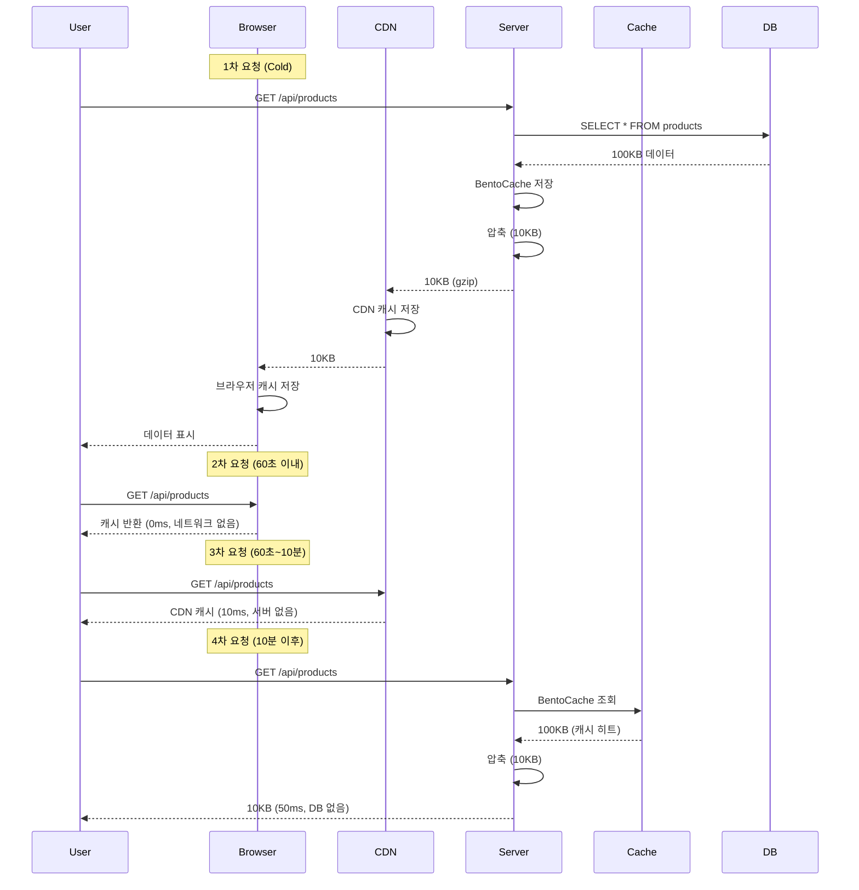

압축은 네트워크 성능을 크게 개선하지만, **잘못 사용하면 오히려 성능이 저하**될 수 있습니다. 이 문서는 압축을 효과적으로 사용하는 최적화 전략을 설명합니다.

## 압축의 트레이드오프

압축은 **CPU 시간**과 **네트워크 시간**을 교환합니다.


### 손익분기점

```typescript
// 압축 없이
총 시간 = 네트워크 시간
       = 100KB ÷ 1MB/s = 100ms

// 압축 사용
총 시간 = 압축 시간 + 네트워크 시간 + 압축 해제 시간
       = 5ms + (10KB ÷ 1MB/s) + 2ms
       = 5ms + 10ms + 2ms = 17ms

이득 = 100ms - 17ms = 83ms (83% 개선)
```

**결론**: 네트워크가 느릴수록, 데이터가 클수록 압축 효과 큼

## 최적의 Threshold 찾기

Threshold는 압축할 최소 크기입니다.

### Threshold별 효과

| 크기 | Threshold: 256      | Threshold: 1024 | Threshold: 4096 |
| ---- | ------------------- | --------------- | --------------- |
| 100B | 압축 ❌ (오버헤드)  | 압축 ❌         | 압축 ❌         |
| 500B | 압축 ⚠️ (효과 작음) | 압축 ❌         | 압축 ❌         |
| 2KB  | 압축 ✅             | 압축 ✅         | 압축 ❌         |
| 10KB | 압축 ✅             | 압축 ✅         | 압축 ✅         |

### 권장 Threshold

<Tabs>
  <Tab title="적극적 (256B)" icon="fire">
    ```typescript
    compress: {
      threshold: 256,
      encodings: ["br", "gzip", "deflate"],
    }
    ```
    
    **적합한 경우**:
    - 모바일 네트워크 (느린 속도)
    - 대역폭 비용이 비쌈
    - 대부분 응답이 작음 (< 10KB)
    
    **단점**: CPU 사용량 증가
  </Tab>
  
  <Tab title="기본 (1KB)" icon="check">
    ```typescript
    compress: {
      threshold: 1024,
      encodings: ["br", "gzip", "deflate"],
    }
    ```
    
    **적합한 경우**:
    - 일반적인 경우 (권장)
    - 균형잡힌 성능
    
    **장점**: 압축 효과와 오버헤드 균형
  </Tab>
  
  <Tab title="보수적 (4KB)" icon="shield">
    ```typescript
    compress: {
      threshold: 4096,
      encodings: ["gzip", "deflate"],
    }
    ```
    
    **적합한 경우**:
    - CPU 리소스 제한적
    - 빠른 네트워크 (LAN, 5G)
    - 대부분 응답이 큼 (> 100KB)
    
    **장점**: CPU 사용량 최소화
  </Tab>
</Tabs>

### 실험으로 최적값 찾기

```typescript
// 테스트 설정
const thresholds = [256, 512, 1024, 2048, 4096];

for (const threshold of thresholds) {
  console.time(`threshold-${threshold}`);

  // 100번 요청
  for (let i = 0; i < 100; i++) {
    await fetch("/api/products", {
      headers: { "Accept-Encoding": "gzip" },
    });
  }

  console.timeEnd(`threshold-${threshold}`);
}

// 결과 분석: 가장 빠른 threshold 선택
```

## 알고리즘 선택 전략

### Brotli vs Gzip

| 기준           | Brotli (br)           | Gzip          |
| -------------- | --------------------- | ------------- |
| 압축률         | 최고 (15~20% 더 압축) | 중간          |
| 압축 속도      | 느림 (CPU 사용 ↑)     | 빠름          |
| 압축 해제 속도 | 빠름                  | 빠름          |
| 브라우저 지원  | 모던 브라우저         | 모든 브라우저 |

### 사용 전략

<Tabs>
  <Tab title="정적 콘텐츠" icon="file">
    **사전 압축 → Brotli 사용**
    
    ```bash
    # 빌드 시 brotli로 사전 압축
    brotli -q 11 bundle.js  # 최고 품질
    # → bundle.js.br 생성
    
    # 서버에서 사전 압축된 파일 제공
    ```
    
    **장점**:
    - 압축 시간 걱정 없음 (미리 압축)
    - 최고 압축률 (quality 11)
    - 런타임 CPU 부하 없음
  </Tab>
  
  <Tab title="동적 API" icon="bolt">
    **실시간 압축 → Gzip 사용**
    
    ```typescript
    compress: {
      threshold: 1024,
      encodings: ["gzip"],  // 빠른 gzip
    }
    ```
    
    **이유**:
    - API 응답은 매번 다름 (사전 압축 불가)
    - Gzip이 Brotli보다 빠름
    - 충분한 압축률 (70~80%)
  </Tab>
  
  <Tab title="하이브리드" icon="layer-group">
    **정적 + 동적 혼합**
    
    ```typescript
    // 정적 파일: brotli (사전 압축)
    server.get('/assets/:filename', (req, reply) => {
      const filename = req.params.filename;
      const brFile = `${filename}.br`;
      
      if (fs.existsSync(brFile)) {
        reply.header('Content-Encoding', 'br');
        return reply.sendFile(brFile);
      }
      
      return reply.sendFile(filename);
    });
    
    // API: gzip (실시간 압축)
    plugins: {
      compress: {
        encodings: ["gzip"],
      }
    }
    ```
  </Tab>
</Tabs>

### 환경별 전략

```typescript
const isProduction = process.env.NODE_ENV === "production";
const isFastNetwork = process.env.NETWORK_SPEED === "fast";

export const config: SonamuConfig = {
  server: {
    plugins: {
      compress: isProduction
        ? isFastNetwork
          ? {
              // 빠른 네트워크: 보수적
              threshold: 4096,
              encodings: ["gzip"],
            }
          : {
              // 느린 네트워크: 적극적
              threshold: 256,
              encodings: ["br", "gzip", "deflate"],
            }
        : false, // 개발: 압축 없음
    },
  },
};
```

## 캐싱과 압축 조합

압축과 캐싱을 함께 사용하면 최고의 성능을 얻습니다.

```typescript
@cache({ ttl: "10m" })  // 서버 캐시
@api({
  httpMethod: 'GET',
  cacheControl: { maxAge: 60 },  // HTTP 캐시
  compress: CompressPresets.aggressive,  // 압축
})
async getProducts() {
  return this.findMany({});
}
```

### 효과



**레이어별 최적화**:

1. **브라우저 캐시**: 0ms (가장 빠름)
2. **CDN 캐시**: 10ms (네트워크만)
3. **서버 캐시**: 50ms (압축만, DB 없음)
4. **DB 조회**: 500ms (압축 + DB)

## CDN과 압축

### CloudFront 최적화

```typescript
@api({
  httpMethod: 'GET',
  cacheControl: {
    visibility: 'public',
    maxAge: 60,        // 브라우저: 1분
    sMaxAge: 300,      // CDN: 5분
  },
  compress: {
    threshold: 1024,
    encodings: ["br", "gzip"],  // CloudFront는 brotli 지원
  }
})
async getData() {
  return this.findMany({});
}
```

**CloudFront 설정**:

- Origin에서 압축된 응답 수신
- CloudFront가 그대로 캐싱
- 엣지에서 빠르게 제공

### Vary 헤더 주의

압축 사용 시 `Accept-Encoding`에 따라 다른 응답이므로:

```typescript
@api({
  cacheControl: {
    vary: ['Accept-Encoding'],  // 인코딩별 캐시 분리
  },
  compress: true,
})
async getData() {
  return this.findMany({});
}
```

## 사전 압축 (Pre-compression)

빌드 시 정적 파일을 미리 압축하면 런타임 CPU 부하가 없습니다.

### 빌드 스크립트

```typescript
// scripts/compress-assets.ts
import { brotliCompressSync, gzipSync } from "zlib";
import { readdirSync, readFileSync, writeFileSync } from "fs";

const assetsDir = "./dist/assets";
const files = readdirSync(assetsDir);

for (const file of files) {
  if (/\.(js|css|html|json|svg)$/.test(file)) {
    const content = readFileSync(`${assetsDir}/${file}`);

    // Brotli (최고 압축률)
    const br = brotliCompressSync(content, {
      params: {
        [zlib.constants.BROTLI_PARAM_QUALITY]: 11, // 최고 품질
      },
    });
    writeFileSync(`${assetsDir}/${file}.br`, br);

    // Gzip (호환성)
    const gz = gzipSync(content, { level: 9 });
    writeFileSync(`${assetsDir}/${file}.gz`, gz);

    console.log(`${file}: ${content.length} → br: ${br.length}, gz: ${gz.length}`);
  }
}
```

### 서버 설정

```typescript
// 사전 압축된 파일 제공
server.get("/assets/:filename", async (req, reply) => {
  const { filename } = req.params;
  const acceptEncoding = req.headers["accept-encoding"] || "";

  // Brotli 지원
  if (acceptEncoding.includes("br")) {
    const brFile = `./dist/assets/${filename}.br`;
    if (fs.existsSync(brFile)) {
      reply.header("Content-Encoding", "br");
      return reply.sendFile(`${filename}.br`, { root: "./dist/assets" });
    }
  }

  // Gzip 지원
  if (acceptEncoding.includes("gzip")) {
    const gzFile = `./dist/assets/${filename}.gz`;
    if (fs.existsSync(gzFile)) {
      reply.header("Content-Encoding", "gzip");
      return reply.sendFile(`${filename}.gz`, { root: "./dist/assets" });
    }
  }

  // 압축 없음
  return reply.sendFile(filename, { root: "./dist/assets" });
});
```

**장점**:

- 런타임 CPU 부하 없음
- 최고 압축률 (quality 11)
- 즉시 응답

## 성능 측정

### 1. 브라우저 개발자 도구

```
Network 탭 → 요청 선택

Size:
  1.2 KB (transferred)  ← 압축된 크기
  10.5 KB (size)        ← 원본 크기

Time:
  Waiting (TTFB): 50ms  ← 서버 처리 (압축 포함)
  Content Download: 10ms ← 네트워크 전송
```

### 2. 서버 로깅

```typescript
import { performance } from "perf_hooks";

@api({
  httpMethod: 'GET',
  compress: CompressPresets.aggressive,
})
async getData() {
  const start = performance.now();
  const data = await this.findMany({});
  const dbTime = performance.now() - start;

  console.log(`DB: ${dbTime.toFixed(2)}ms`);
  // 압축 시간은 Fastify가 자동 처리

  return data;
}
```

### 3. 부하 테스트

```bash
# Apache Bench로 부하 테스트
ab -n 1000 -c 10 -H "Accept-Encoding: gzip" http://localhost:3000/api/products

# 압축 없이
ab -n 1000 -c 10 http://localhost:3000/api/products

# 결과 비교:
# - Time per request (평균 응답 시간)
# - Transfer rate (전송 속도)
```

## 실전 최적화 체크리스트

<Tabs>
  <Tab title="초기 설정" icon="1">
    **✅ 전역 압축 활성화**
    ```typescript
    plugins: {
      compress: CompressPresets.default
    }
    ```
    
    **✅ Threshold 설정**
    - 일반: 1024 (1KB)
    - 모바일: 256 (256B)
    - 고성능: 4096 (4KB)
    
    **✅ 알고리즘 선택**
    - 정적: brotli (사전 압축)
    - 동적: gzip (실시간)
  </Tab>
  
  <Tab title="API 최적화" icon="2">
    **✅ 큰 응답은 적극적 압축**
    ```typescript
    @api({ compress: CompressPresets.aggressive })
    async exportData() { ... }
    ```
    
    **✅ 작은 응답은 압축 비활성화**
    ```typescript
    @api({ compress: false })
    async getStatus() { ... }
    ```
    
    **✅ 이미 압축된 파일은 제외**
    ```typescript
    @api({ compress: false })
    async getImage() { ... }
    ```
  </Tab>
  
  <Tab title="캐싱 조합" icon="3">
    **✅ 서버 캐시 추가**
    ```typescript
    @cache({ ttl: "10m" })
    @api({ compress: true })
    async getData() { ... }
    ```
    
    **✅ HTTP 캐시 설정**
    ```typescript
    @api({
      cacheControl: { maxAge: 60 },
      compress: true,
    })
    async getData() { ... }
    ```
    
    **✅ Vary 헤더 설정**
    ```typescript
    cacheControl: {
      vary: ['Accept-Encoding']
    }
    ```
  </Tab>
  
  <Tab title="모니터링" icon="4">
    **✅ 압축률 확인**
    - 개발자 도구에서 크기 비교
    - 70% 이상 압축되는지 확인
    
    **✅ CPU 사용량 모니터링**
    - 압축으로 인한 CPU 증가 확인
    - 30% 이상 증가 시 threshold 조정
    
    **✅ 응답 시간 측정**
    - 압축 전후 비교
    - 느려지면 설정 재검토
  </Tab>
</Tabs>

## 일반적인 실수

<Warning>
**피해야 할 실수**:

1. **모든 응답을 압축**: 작은 응답은 비효율적

   ```typescript
   // ❌ 잘못된 예
   threshold: 0; // 모든 응답 압축

   // ✅ 올바른 예
   threshold: 1024; // 1KB 이상만
   ```

2. **이미 압축된 파일 재압축**: 효과 없음

   ```typescript
   // ❌ JPEG, PNG, MP4 압축
   @api({ compress: true })
   async getImage() { ... }

   // ✅ 압축 제외
   @api({ compress: false })
   async getImage() { ... }
   ```

3. **스트리밍 압축**: 지연 발생

   ```typescript
   // ❌ SSE 압축
   @stream({ type: 'sse' })
   @api({ compress: true })
   async *streamData() { ... }

   // ✅ 압축 비활성화
   @api({ compress: false })
   async *streamData() { ... }
   ```

4. **개발 환경에서 압축**: 디버깅 어려움

   ```typescript
   // ✅ 환경별 설정
   compress: process.env.NODE_ENV === "production" ? CompressPresets.default : false;
   ```

5. **Brotli를 실시간 압축**: CPU 부하 높음

   ```typescript
   // ⚠️ 주의: API 응답에 brotli
   compress: {
     encodings: ["br"]; // 느림
   }

   // ✅ gzip 사용
   compress: {
     encodings: ["gzip"]; // 빠름
   }
   ```

   </Warning>

## 성능 벤치마크

실제 100KB JSON 응답 기준:

| 설정           | 압축 시간 | 전송 크기 | 네트워크 시간 | 총 시간 |
| -------------- | --------- | --------- | ------------- | ------- |
| 압축 없음      | 0ms       | 100KB     | 1000ms        | 1000ms  |
| Gzip           | 2ms       | 14KB      | 140ms         | 142ms   |
| Brotli         | 5ms       | 12KB      | 120ms         | 125ms   |
| Pre-compressed | 0ms       | 12KB      | 120ms         | 120ms   |

**결론**:

- Gzip: 85% 시간 절약
- Brotli: 87% 시간 절약
- Pre-compressed: 88% 시간 절약 (최고)

## 다음 단계

<CardGroup cols={2}>
  <Card title="압축 설정" icon="gear" href="/ko/advanced-features/compress/compress-configuration">
    전역 압축 플러그인 설정
  </Card>
  <Card title="압축 프리셋" icon="list" href="/ko/advanced-features/compress/compress-presets">
    사전 정의된 압축 설정
  </Card>
  <Card title="API별 제어" icon="code" href="/ko/advanced-features/compress/per-api-control">
    @api 데코레이터에 압축 설정
  </Card>
</CardGroup>
