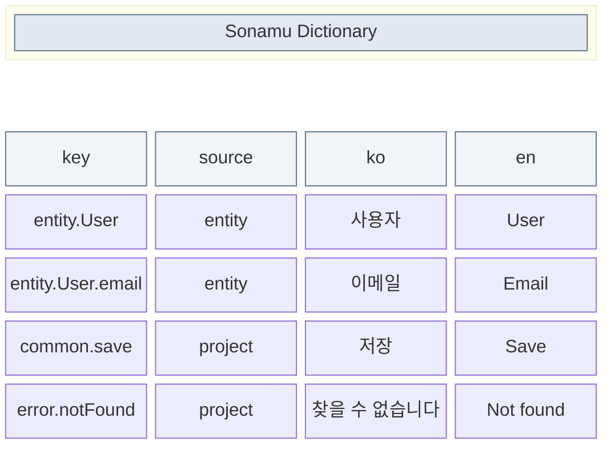
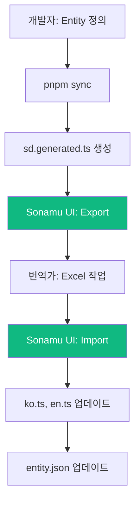

Sonamu UI는 i18n 딕셔너리를 Excel로 내보내고 가져오는 기능을 제공합니다. 번역가나 기획자가 스프레드시트에서 작업한 후 한 번에 반영할 수 있습니다.

## Excel Export

### Sonamu UI에서 내보내기

1. Sonamu UI 접속 (`http://localhost:34900/sonamu-ui`)
2. 좌측 메뉴에서 **i18n** 클릭
3. 우측 상단 **Export** 버튼 클릭
4. Excel 파일 다운로드

### Excel 파일 구조

| 컬럼 | 설명 |
|------|------|
| `key` | 딕셔너리 키 |
| `source` | `entity` (자동 추출) 또는 `project` (수동 작성) |
| `ko`, `en`, ... | 각 locale의 번역 값 |

## Excel Import

### 번역 작업 후 가져오기

1. Export한 Excel 파일에서 번역 작업
2. Sonamu UI의 i18n 페이지에서 **Import** 버튼 클릭
3. Excel 파일 선택
4. 변경 사항 확인 후 적용

### Import 동작 방식

| source | defaultLocale (ko) | 다른 locale (en) |
|--------|-------------------|------------------|
| `entity` | `entity.json` 업데이트 | `en.ts`에 저장 |
| `project` | `ko.ts`에 저장 | `en.ts`에 저장 |

<Note>
`entity` source의 defaultLocale 값은 Entity의 title, prop.desc, enumLabels를 직접 수정합니다.
</Note>

## 번역 워크플로우

### 권장 워크플로우

1. **개발 단계**: Entity 정의 시 defaultLocale(ko) 라벨만 작성
2. **번역 단계**: Excel export → 번역팀에 전달 → 번역 완료 후 import
3. **유지보수**: 새 키 추가 시 동일 과정 반복

## 함수형 값 처리

Excel에서 함수형 값도 그대로 유지됩니다:

| key | ko |
|-----|----|
| `common.results` | `(count: number) => \`${count}개 결과\`` |
| `validation.required` | `(field: string) => \`${field}은(는) 필수\`` |

Import 시 화살표 함수 패턴(`(...) => ...`)을 자동으로 감지하여 함수로 저장합니다.

## 주의사항

- **키 변경**: 기존 키를 변경하면 새 키로 추가되고 기존 키는 유지됩니다
- **키 삭제**: Excel에서 행을 삭제해도 기존 딕셔너리에서 삭제되지 않습니다
- **source 변경 불가**: `entity` → `project` 변경은 무시됩니다
- **빈 값**: 빈 셀은 해당 locale에서 키가 제거되지 않고 무시됩니다

<CardGroup cols={2}>
  <Card title="SD 함수 사용법" icon="code" href="/advanced-features/i18n/dictionary">
    딕셔너리 작성 및 사용
  </Card>
  <Card title="Entity 라벨" icon="tag" href="/advanced-features/i18n/entity-labels">
    자동 추출되는 라벨
  </Card>
</CardGroup>
