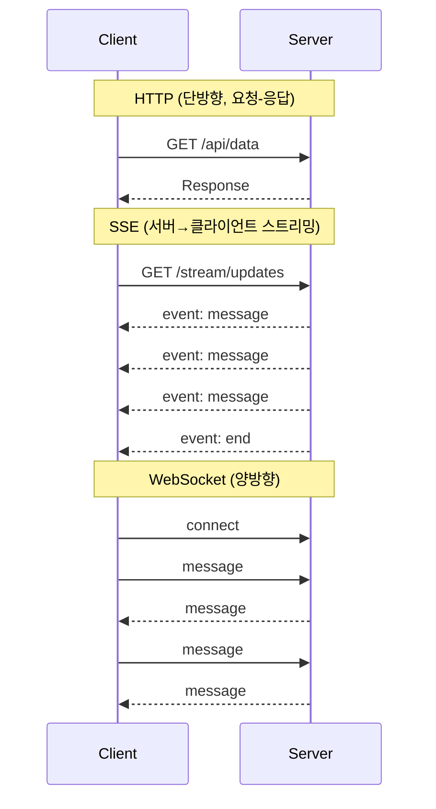
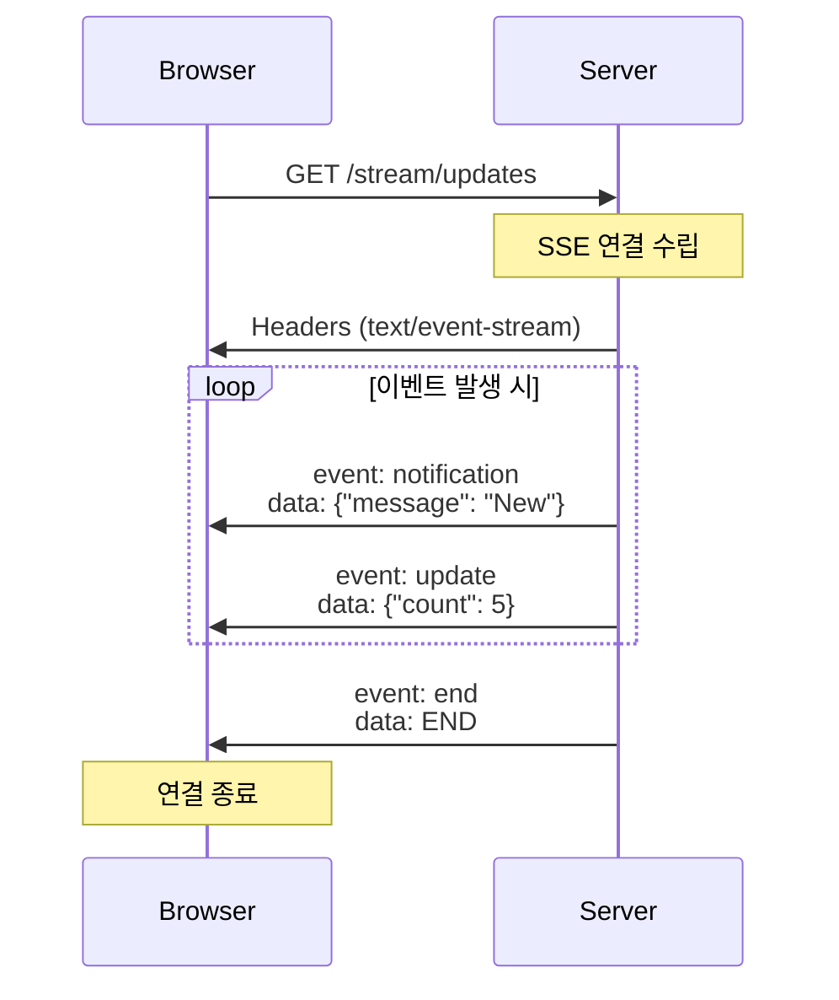

Sonamu는 **fastify-sse-v2** 플러그인을 기반으로 **Server-Sent Events (SSE)**를 지원합니다. SSE를 사용하면 서버에서 클라이언트로 실시간 데이터를 푸시할 수 있습니다.

## SSE란?

**Server-Sent Events**는 서버에서 클라이언트로 **단방향 실시간 통신**을 제공하는 기술입니다.

### HTTP vs SSE vs WebSocket



### 비교표

| 특징     | HTTP      | SSE             | WebSocket   |
| -------- | --------- | --------------- | ----------- |
| 방향     | 요청→응답 | 서버→클라이언트 | 양방향      |
| 프로토콜 | HTTP      | HTTP            | WebSocket   |
| 재연결   | X         | 자동            | 수동        |
| 복잡도   | 낮음      | 중간            | 높음        |
| 용도     | 일반 API  | 실시간 푸시     | 실시간 채팅 |

### SSE 사용 사례

<CardGroup cols={2}>
  <Card title="실시간 알림" icon="bell">
    새 메시지, 좋아요, 댓글 등
  </Card>
  <Card title="진행 상황" icon="spinner">
    파일 업로드, 작업 처리 진행률
  </Card>
  <Card title="라이브 피드" icon="rss">
    뉴스 피드, 소셜 미디어 업데이트
  </Card>
  <Card title="모니터링" icon="chart-line">
    서버 상태, 로그 스트리밍
  </Card>
</CardGroup>

## 기본 설정

### sonamu.config.ts

```typescript
import { type SonamuConfig } from "sonamu";

export const config: SonamuConfig = {
  server: {
    plugins: {
      sse: true, // SSE 플러그인 활성화
    },
  },
};
```

**기본 동작**:

- SSE 엔드포인트 자동 등록
- 자동 재연결 지원
- Keep-alive 자동 전송

## SSE 플러그인 옵션

<Tabs>
  <Tab title="boolean" icon="toggle-on">
    **간단한 활성화/비활성화**
    
    ```typescript
    plugins: {
      sse: true,   // 활성화
      sse: false,  // 비활성화
    }
    ```
  </Tab>
  
  <Tab title="SsePluginOptions" icon="gear">
    **세부 설정**
    
    ```typescript
    import type { SsePluginOptions } from "fastify-sse-v2/lib/types";

    plugins: {
      sse: {
        // 옵션 설정 (필요시)
      } as SsePluginOptions
    }
    ```

    **참고**: 대부분의 경우 기본 설정으로 충분합니다.

  </Tab>
</Tabs>

## SSE 작동 방식

### 연결 흐름



### HTTP 헤더

SSE는 특수한 HTTP 헤더를 사용합니다:

```http
Content-Type: text/event-stream
Cache-Control: no-cache
Connection: keep-alive
```

**특징**:

- `text/event-stream`: SSE 전용 Content-Type
- `no-cache`: 캐싱 방지
- `keep-alive`: 연결 유지

## 실전 설정 예제

### 1. 기본 설정 (권장)

```typescript
export const config: SonamuConfig = {
  server: {
    plugins: {
      sse: true, // 간단하게 활성화
    },
  },
};
```

### 2. 개발/프로덕션 분리

```typescript
const isDevelopment = process.env.NODE_ENV === "development";

export const config: SonamuConfig = {
  server: {
    plugins: {
      sse: !isDevelopment, // 프로덕션에서만 활성화
    },
  },
};
```

**이유**: 개발 환경에서는 HMR로 인해 연결이 자주 끊김

### 3. 조건부 활성화

```typescript
export const config: SonamuConfig = {
  server: {
    plugins: {
      sse: process.env.ENABLE_SSE === "true",
    },
  },
};
```

```.env
ENABLE_SSE=true
```

## 압축 비활성화

SSE는 스트리밍 응답이므로 **압축을 비활성화**해야 합니다.

```typescript
export const config: SonamuConfig = {
  server: {
    plugins: {
      sse: true,
      compress: {
        global: true, // 전역 압축 활성화
        threshold: 1024,
        encodings: ["gzip"],
      },
    },
  },
};
```

**@stream 데코레이터에서 자동 처리**:

```typescript
@stream({
  type: 'sse',
  events: z.object({
    message: z.string(),
  })
})
async streamUpdates(ctx: Context): Promise<void> {
  // @stream 데코레이터가 자동으로 압축을 비활성화합니다.
  // ...
}
```

## CORS 설정

SSE를 다른 도메인에서 사용하려면 CORS 설정이 필요합니다.

```typescript
export const config: SonamuConfig = {
  server: {
    plugins: {
      sse: true,
      cors: {
        origin: ["https://example.com", "https://app.example.com"],
        credentials: true,
      },
    },
  },
};
```

**주의**: SSE는 인증 쿠키 등을 전송할 수 있으므로 `credentials: true` 설정 필요

## 환경별 전략

### 개발 환경

```typescript
export const config: SonamuConfig = {
  server: {
    plugins: {
      sse: true,
      cors: {
        origin: "http://localhost:5173", // Vite 개발 서버
        credentials: true,
      },
    },
  },
};
```

### 프로덕션 환경

```typescript
export const config: SonamuConfig = {
  server: {
    plugins: {
      sse: true,
      cors: {
        origin: process.env.FRONTEND_URL,
        credentials: true,
      },
    },
  },
};
```

```.env
FRONTEND_URL=https://app.example.com
```

## 타임아웃 설정

SSE 연결은 장시간 유지되므로 타임아웃 설정이 중요합니다.

```typescript
export const config: SonamuConfig = {
  server: {
    fastify: {
      connectionTimeout: 0, // 타임아웃 비활성화
      keepAliveTimeout: 5000, // Keep-alive: 5초
    },
    plugins: {
      sse: true,
    },
  },
};
```

**설정 값**:

- `connectionTimeout: 0`: 연결 타임아웃 비활성화 (SSE는 장시간 유지)
- `keepAliveTimeout`: Keep-alive 간격 (기본값: 5초)

## 프록시 설정 (Nginx)

Nginx를 사용하는 경우 SSE를 위한 설정이 필요합니다.

```nginx
server {
    listen 80;
    server_name api.example.com;

    location /stream/ {
        proxy_pass http://localhost:3000;

        # SSE 필수 설정
        proxy_set_header Connection '';
        proxy_http_version 1.1;
        chunked_transfer_encoding off;

        # 버퍼링 비활성화
        proxy_buffering off;
        proxy_cache off;

        # 타임아웃
        proxy_read_timeout 24h;
        proxy_send_timeout 24h;
    }
}
```

**핵심 설정**:

- `proxy_buffering off`: 버퍼링 비활성화 (즉시 전송)
- `proxy_cache off`: 캐싱 비활성화
- `proxy_read_timeout 24h`: 읽기 타임아웃 (장시간)

## 디버깅

### 브라우저 개발자 도구

```
Network 탭 → 스트림 요청 선택 → Headers 탭

Request Headers:
  Accept: text/event-stream

Response Headers:
  Content-Type: text/event-stream
  Cache-Control: no-cache
  Connection: keep-alive

EventStream 탭:
  event: message
  data: {"text": "Hello"}

  event: update
  data: {"count": 5}
```

### curl 테스트

```bash
# SSE 연결 테스트
curl -N http://localhost:3000/stream/updates

# 결과:
# event: message
# data: {"text": "Hello"}
#
# event: update
# data: {"count": 5}
#
# event: end
# data: END
```

**옵션**:

- `-N`: 버퍼링 비활성화 (즉시 출력)

## 주의사항

<Warning>
**SSE 설정 시 주의사항**:

1. **압축 비활성화**: SSE는 스트리밍이므로 압축 금지 (@stream 데코레이터가 자동 처리)

   ```typescript
   @stream({ type: 'sse', events: z.object({ message: z.string() }) })
   async streamData(ctx: Context): Promise<void> { ... }
   ```

2. **타임아웃 설정**: 장시간 연결 유지

   ```typescript
   fastify: {
     connectionTimeout: 0,
   }
   ```

3. **CORS 설정**: 다른 도메인에서 사용 시 필요

   ```typescript
   cors: {
     origin: 'https://example.com',
     credentials: true,
   }
   ```

4. **재연결 처리**: 클라이언트는 자동 재연결 구현 필요

   ```typescript
   // EventSource가 자동으로 처리
   const source = new EventSource("/stream/updates");
   ```

5. **브라우저 제한**: 동시 SSE 연결 수 제한 (도메인당 6개)
   - 해결: HTTP/2 사용 또는 연결 재사용

6. **프록시 버퍼링**: Nginx 등 버퍼링 비활성화 필요
   ```nginx
   proxy_buffering off;
   ```
   </Warning>

## 브라우저 지원

SSE는 모든 모던 브라우저에서 지원됩니다:

| 브라우저 | 지원               |
| -------- | ------------------ |
| Chrome   | ✅                 |
| Firefox  | ✅                 |
| Safari   | ✅                 |
| Edge     | ✅                 |
| IE 11    | ❌ (polyfill 필요) |

**IE 11 지원**: [event-source-polyfill](https://www.npmjs.com/package/event-source-polyfill)

## 다음 단계

<CardGroup cols={2}>
  <Card
    title="SSE 엔드포인트 만들기"
    icon="code"
    href="/ko/advanced-features/sse/creating-sse-endpoints"
  >
    @stream 데코레이터로 SSE API 구축
  </Card>
  <Card title="클라이언트 통합" icon="browser" href="/ko/advanced-features/sse/client-integration">
    프론트엔드에서 SSE 사용하기
  </Card>
</CardGroup>
