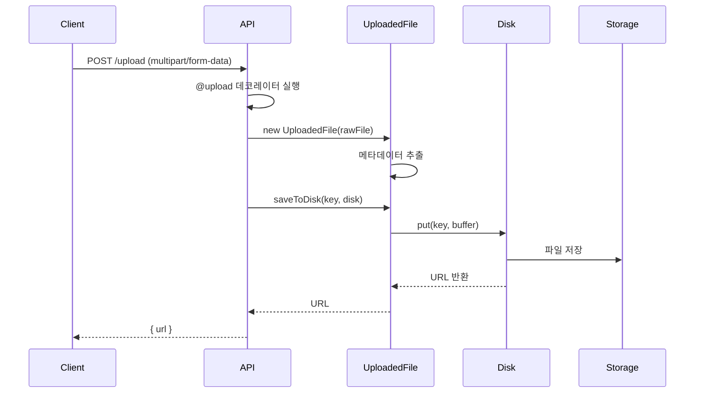

Sonamu는 **@upload** 데코레이터와 **UploadedFile** 클래스를 통해 파일 업로드를 쉽게 처리할 수 있습니다.

## 파일 업로드 흐름



## @upload 데코레이터

파일 업로드 API를 만들 때 사용합니다.

### 단일 파일 업로드

```typescript
import { BaseModel, api, upload, Sonamu } from "sonamu";

class UserModelClass extends BaseModel {
  @upload()
  async uploadAvatar(ctx: Context) {
    const { files } = Sonamu.getContext();
    const file = files?.[0]; // 첫 번째 파일 사용

    if (!file) {
      throw new Error('파일이 없습니다');
    }

    // 파일 저장
    const url = await file.saveToDisk(`avatars/${ctx.user.id}.png`);

    return { url };
  }
}
```

**클라이언트 요청**:
```typescript
const formData = new FormData();
formData.append('file', file);

await fetch('/api/user/uploadAvatar', {
  method: 'POST',
  body: formData,
});
```

### 다중 파일 업로드

```typescript
class PostModelClass extends BaseModel {
  @upload()
  async uploadImages(postId: number) {
    const { files } = Sonamu.getContext();

    if (files.length === 0) {
      throw new Error('파일이 없습니다');
    }
    
    // 모든 파일 저장
    const urls = await Promise.all(
      files.map(async (file, index) => {
        const key = `posts/${postId}/image-${index}.${file.extname}`;
        return await file.saveToDisk(key);
      })
    );
    
    return { urls };
  }
}
```

**클라이언트 요청**:
```typescript
const formData = new FormData();
formData.append('file', file1);
formData.append('file', file2);
formData.append('file', file3);

await fetch('/api/post/uploadImages?postId=1', {
  method: 'POST',
  body: formData,
});
```

## 파일 접근

**Sonamu.getContext()**의 `files` 속성으로 업로드된 파일에 접근합니다.

```typescript
// Context에서 업로드된 파일 접근
const { files } = Sonamu.getContext();

// files는 UploadedFile[] (optional 배열)
type Context = {
  // ...
  files?: UploadedFile[];
};
```

**단일 파일 접근**: 배열의 첫 번째 요소 사용
```typescript
const file = files?.[0];  // 첫 번째 파일
```

**다중 파일 접근**: 배열 순회
```typescript
for (const file of files) {
  // 각 파일 처리
}
```

### 사용 예제

```typescript
@upload()
async upload() {
  const { files } = Sonamu.getContext();
  const file = files?.[0]; // 첫 번째 파일 사용

  if (!file) {
    throw new Error('파일이 필요합니다');
  }

  // file은 UploadedFile 인스턴스
  console.log(file.filename);   // 원본 파일명
  console.log(file.mimetype);   // MIME 타입
  console.log(file.size);       // 파일 크기

  return await file.saveToDisk('uploads/file.pdf');
}
```

## UploadedFile 클래스

업로드된 파일을 래핑하는 클래스입니다.

### 속성

<Tabs>
  <Tab title="filename" icon="file">
    **원본 파일명**
    
    ```typescript
    const { files } = Sonamu.getContext();
    const file = files?.[0]; // 첫 번째 파일 사용
    console.log(file.filename);  // 'avatar.png'
    ```
  </Tab>
  
  <Tab title="mimetype" icon="file-code">
    **MIME 타입**
    
    ```typescript
    console.log(file.mimetype);
    // 'image/png'
    // 'application/pdf'
    // 'video/mp4'
    ```
  </Tab>
  
  <Tab title="size" icon="weight">
    **파일 크기** (바이트)
    
    ```typescript
    console.log(file.size);  // 1024000 (1MB)
    console.log(`${(file.size / 1024 / 1024).toFixed(2)}MB`);  // '0.98MB'
    ```
  </Tab>
  
  <Tab title="extname" icon="file-zipper">
    **확장자** (점 제외)
    
    ```typescript
    console.log(file.extname);
    // 'png'
    // 'pdf'
    // 'mp4'
    // false (확장자 없음)
    ```
  </Tab>
  
  <Tab title="url" icon="link">
    **저장 후 URL** (unsigned)
    
    ```typescript
    await file.saveToDisk('uploads/file.pdf');
    console.log(file.url);
    // '/uploads/file.pdf' (fs)
    // 'https://bucket.s3.amazonaws.com/uploads/file.pdf' (s3)
    ```
  </Tab>
  
  <Tab title="signedUrl" icon="lock">
    **저장 후 서명된 URL** (S3)
    
    ```typescript
    await file.saveToDisk('uploads/file.pdf');
    console.log(file.signedUrl);
    // 'https://bucket.s3.amazonaws.com/uploads/file.pdf?X-Amz-...'
    ```
    
    **용도**: 임시 접근 URL (만료 시간 있음)
  </Tab>
</Tabs>

### 메서드

#### toBuffer()

파일을 Buffer로 변환합니다.

```typescript
const { files } = Sonamu.getContext();
const file = files?.[0]; // 첫 번째 파일 사용
const buffer = await file.toBuffer();

console.log(buffer instanceof Buffer);  // true
console.log(buffer.length);  // 파일 크기 (바이트)
```

**캐싱**: 한 번 호출하면 캐싱됨 (재호출 시 빠름)

#### md5()

파일의 MD5 해시를 계산합니다.

```typescript
const { files } = Sonamu.getContext();
const file = files?.[0]; // 첫 번째 파일 사용
const hash = await file.md5();

console.log(hash);  // '5d41402abc4b2a76b9719d911017c592'
```

**용도**:
- 파일 중복 체크
- 파일 무결성 검증
- 고유한 파일명 생성

#### saveToDisk(key, diskName?)

파일을 디스크에 저장합니다.

```typescript
const { files } = Sonamu.getContext();
const file = files?.[0]; // 첫 번째 파일 사용

// 기본 디스크에 저장
const url = await file.saveToDisk('uploads/file.pdf');

// 특정 디스크에 저장
const url = await file.saveToDisk('uploads/file.pdf', 's3');
```

**반환값**: 저장된 파일의 URL (unsigned)

## 실전 예제

### 1. 프로필 사진 업로드

```typescript
class UserModelClass extends BaseModel {
  @upload()
  async uploadAvatar(ctx: Context) {
    const { files } = Sonamu.getContext();
    const file = files?.[0]; // 첫 번째 파일 사용

    if (!file) {
      throw new Error('파일이 없습니다');
    }

    // 이미지 파일만 허용
    if (!file.mimetype.startsWith('image/')) {
      throw new Error('이미지 파일만 업로드 가능합니다');
    }

    // 파일 크기 제한 (5MB)
    const maxSize = 5 * 1024 * 1024;  // 5MB
    if (file.size > maxSize) {
      throw new Error('파일 크기는 5MB 이하여야 합니다');
    }

    // 파일명: user-{id}-{timestamp}.{ext}
    const timestamp = Date.now();
    const ext = file.extname || 'png';
    const key = `avatars/user-${ctx.user.id}-${timestamp}.${ext}`;

    // 저장
    const url = await file.saveToDisk(key);

    // DB 업데이트
    await this.updateOne(['id', ctx.user.id], {
      avatar_url: url,
      updated_at: new Date(),
    });

    return { url };
  }
}
```

### 2. 다중 이미지 업로드

```typescript
class PostModelClass extends BaseModel {
  @upload()
  async uploadImages(postId: number, ctx: Context) {
    const { files } = Sonamu.getContext();

    // 파일 개수 제한
    if (files.length > 10) {
      throw new Error('최대 10개까지 업로드 가능합니다');
    }
    
    // 이미지만 필터링
    const imageFiles = files.filter(file => 
      file.mimetype.startsWith('image/')
    );
    
    if (imageFiles.length === 0) {
      throw new Error('이미지 파일이 없습니다');
    }
    
    // 모든 이미지 저장
    const urls = await Promise.all(
      imageFiles.map(async (file, index) => {
        const timestamp = Date.now();
        const ext = file.extname || 'png';
        const key = `posts/${postId}/image-${index}-${timestamp}.${ext}`;
        return await file.saveToDisk(key);
      })
    );
    
    return { urls, count: urls.length };
  }
}
```

### 3. 파일 타입별 검증

```typescript
class FileModelClass extends BaseModel {
  @upload()
  async uploadDocument(type: 'pdf' | 'excel' | 'word') {
    const { files } = Sonamu.getContext();
    const file = files?.[0]; // 첫 번째 파일 사용

    if (!file) {
      throw new Error('파일이 없습니다');
    }
    
    // MIME 타입 검증
    const allowedMimeTypes = {
      pdf: ['application/pdf'],
      excel: [
        'application/vnd.ms-excel',
        'application/vnd.openxmlformats-officedocument.spreadsheetml.sheet'
      ],
      word: [
        'application/msword',
        'application/vnd.openxmlformats-officedocument.wordprocessingml.document'
      ],
    };
    
    if (!allowedMimeTypes[type].includes(file.mimetype)) {
      throw new Error(`${type} 파일만 업로드 가능합니다`);
    }
    
    // 파일 저장
    const key = `documents/${type}/${Date.now()}-${file.filename}`;
    const url = await file.saveToDisk(key);
    
    return { url, type, filename: file.filename };
  }
}
```

### 4. MD5 해시로 중복 체크

```typescript
class MediaModelClass extends BaseModel {
  @upload()
  async uploadMedia() {
    const { files } = Sonamu.getContext();
    const file = files?.[0]; // 첫 번째 파일 사용

    if (!file) {
      throw new Error('파일이 없습니다');
    }
    
    // MD5 해시 계산
    const hash = await file.md5();
    
    // 이미 존재하는 파일인지 확인
    const existing = await this.findOne(['md5_hash', hash]);
    
    if (existing) {
      // 이미 존재하면 기존 URL 반환
      return {
        url: existing.url,
        duplicate: true,
      };
    }
    
    // 새 파일 저장
    const key = `media/${hash}.${file.extname}`;
    const url = await file.saveToDisk(key);
    
    // DB에 저장
    await this.saveOne({
      md5_hash: hash,
      url,
      filename: file.filename,
      size: file.size,
      mimetype: file.mimetype,
    });
    
    return { url, duplicate: false };
  }
}
```

### 5. 디스크 선택

```typescript
class FileModelClass extends BaseModel {
  @upload()
  async upload(visibility: 'public' | 'private', ctx: Context) {
    const { files } = Sonamu.getContext();
    const file = files?.[0]; // 첫 번째 파일 사용

    if (!file) {
      throw new Error('파일이 없습니다');
    }
    
    // visibility에 따라 다른 디스크 사용
    const disk = visibility === 'public' ? 'public' : 'private';
    const key = `${visibility}/${ctx.user.id}/${Date.now()}-${file.filename}`;
    
    // 저장
    const url = await file.saveToDisk(key, disk);
    
    // DB에 저장
    await this.saveOne({
      user_id: ctx.user.id,
      url,
      visibility,
      filename: file.filename,
    });
    
    return { url, visibility };
  }
}
```

## 파일 조회

Storage Manager를 사용하여 저장된 파일을 조회합니다.

### 파일 읽기

```typescript
import { Sonamu } from "sonamu";

@api({ httpMethod: 'GET' })
async getFile(key: string) {
  const disk = Sonamu.storage.use();
  
  // 파일 존재 확인
  const exists = await disk.exists(key);
  if (!exists) {
    throw new Error('파일이 없습니다');
  }
  
  // 파일 읽기
  const content = await disk.get(key);
  
  return content;  // Buffer
}
```

### 파일 다운로드 API

```typescript
@api({
  httpMethod: 'GET',
  contentType: 'application/octet-stream',
})
async downloadFile(key: string, ctx: Context) {
  const disk = Sonamu.storage.use();
  
  // 파일 존재 확인
  const exists = await disk.exists(key);
  if (!exists) {
    throw new Error('파일이 없습니다');
  }
  
  // 파일 읽기
  const buffer = await disk.get(key);
  
  // 파일명 추출
  const filename = key.split('/').pop() || 'download';
  
  // 다운로드 헤더 설정
  ctx.reply.header('Content-Disposition', `attachment; filename="${filename}"`);
  
  return buffer;
}
```

### URL 가져오기

```typescript
@api({ httpMethod: 'GET' })
async getFileUrl(key: string) {
  const disk = Sonamu.storage.use();
  
  // 파일 존재 확인
  const exists = await disk.exists(key);
  if (!exists) {
    throw new Error('파일이 없습니다');
  }
  
  // URL 가져오기
  const url = await disk.getUrl(key);
  
  return { url };
}
```

### Signed URL (S3)

```typescript
@api({ httpMethod: 'GET' })
async getSignedUrl(key: string) {
  const disk = Sonamu.storage.use('s3');
  
  // Signed URL 생성 (1시간 유효)
  const signedUrl = await disk.getSignedUrl(key, {
    expiresIn: '1h'
  });
  
  return { url: signedUrl };
}
```

## 파일 삭제

```typescript
@api({ httpMethod: 'DELETE' })
async deleteFile(key: string) {
  const disk = Sonamu.storage.use();
  
  // 파일 존재 확인
  const exists = await disk.exists(key);
  if (!exists) {
    throw new Error('파일이 없습니다');
  }
  
  // 파일 삭제
  await disk.delete(key);
  
  return { success: true };
}
```

## 주의사항

<Warning>
**파일 업로드 시 주의사항**:

1. **파일 검증 필수**: 타입, 크기, 확장자 검증
   ```typescript
   // ✅ 검증
   if (!file.mimetype.startsWith('image/')) {
     throw new Error('이미지만 가능');
   }
   if (file.size > 5 * 1024 * 1024) {
     throw new Error('5MB 이하');
   }
   ```

2. **고유한 파일명 사용**: 덮어쓰기 방지
   ```typescript
   // ❌ 원본 파일명 사용
   await file.saveToDisk(`uploads/${file.filename}`);
   
   // ✅ 타임스탬프 추가
   await file.saveToDisk(`uploads/${Date.now()}-${file.filename}`);
   
   // ✅ UUID 사용
   await file.saveToDisk(`uploads/${uuid()}.${file.extname}`);
   ```

3. **경로 검증**: 디렉토리 트래버설 방지
   ```typescript
   // ❌ 위험: 상위 디렉토리 접근 가능
   const key = userInput;  // '../../../etc/passwd'
   
   // ✅ 안전: 경로 검증
   const key = `uploads/${userInput.replace(/\.\./g, '')}`;
   ```

4. **파일 크기 제한**: 메모리 초과 방지
   ```typescript
   const maxSize = 10 * 1024 * 1024;  // 10MB
   if (file.size > maxSize) {
     throw new Error('파일이 너무 큽니다');
   }
   ```

5. **MIME 타입 검증**: 확장자만 믿지 말 것
   ```typescript
   // ❌ 확장자만 체크
   if (file.filename.endsWith('.png')) { ... }
   
   // ✅ MIME 타입 체크
   if (file.mimetype === 'image/png') { ... }
   ```
</Warning>

## 다음 단계

<CardGroup cols={2}>
  <Card title="Storage Manager" icon="database" href="/advanced-features/storage/storage-manager">
    여러 디스크 관리하기
  </Card>
  <Card title="스토리지 드라이버" icon="hard-drive" href="/advanced-features/storage/storage-drivers">
    fs, S3 드라이버 설정
  </Card>
  <Card title="URL 빌더" icon="link" href="/advanced-features/storage/url-builder">
    파일 URL 생성하기
  </Card>
</CardGroup>
