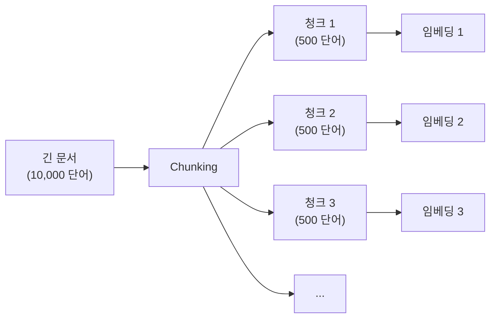

## Sonamu에서 긴 문서 처리하기

Sonamu 앱에 블로그 글이나 매뉴얼을 업로드하는 기능을 만들고 있습니다:

```typescript
class DocumentModelClass extends BaseModel {
  @upload()
  async uploadDocument() {
    const { file } = Sonamu.getUploadContext();
    const content = await file.toBuffer().then(b => b.toString());
    
    // 임베딩 생성 시도
    const embedding = await Embedding.embedOne(content, 'voyage', 'document');
    // ❌ 에러: 토큰 제한 초과 (32,000 토큰)
  }
}
```

**문제**:
- 긴 문서 (10,000단어 이상)
- 임베딩 API 토큰 제한 초과
- 전체를 한 번에 임베딩 불가능

**해결책**: **청킹(Chunking)** - 문서를 작은 조각으로 나누기

## 청킹이란?



**핵심**:
- 긴 문서 → 여러 청크
- 각 청크 → 개별 임베딩
- 검색 시 → 가장 관련 있는 청크 반환

### 왜 필요한가?

**1. 토큰 제한**
- Voyage AI: 32,000 토큰
- OpenAI: 8,191 토큰
- 긴 문서는 제한 초과

**2. 검색 정확도**
- 짧은 청크가 더 정확한 결과
- "환불 방법"검색 시 → 환불 섹션만 반환

**3. 컨텍스트 보존**
- 관련 정보를 함께 유지
- 문장이 끊기지 않게 분할

## Sonamu의 Chunking 클래스

```typescript
import { Chunking } from "sonamu/vector";

const chunking = new Chunking({
  chunkSize: 500,        // 청크 크기 (문자)
  chunkOverlap: 50,      // 중복 크기
  minChunkSize: 50,      // 최소 크기
  skipThreshold: 200,    // 짧으면 분할 스킵
  separators: ['\n\n', '\n', '. '],  // 구분자
});

const chunks = chunking.chunk("긴 텍스트...");
```

## Sonamu Model에서 사용하기

### 긴 문서 업로드 + 청킹

```typescript
class DocumentModelClass extends BaseModel {
  @upload()
  async uploadLongDocument() {
    const { file } = Sonamu.getUploadContext();
    const content = await file.toBuffer().then(b => b.toString());
    
    // 1. 청킹
    const chunking = new Chunking({
      chunkSize: 500,
      chunkOverlap: 50,
    });
    
    const chunks = chunking.chunk(content);
    
    // 2. 각 청크별 임베딩
    const embeddings = await Embedding.embed(
      chunks.map(c => c.text),
      'voyage',
      'document'
    );
    
    // 3. 부모 문서 생성
    const parent = await this.saveOne({
      title: file.filename,
      content,
      chunk_count: chunks.length,
    });
    
    // 4. 청크별 저장
    const savedChunks = await Promise.all(
      chunks.map((chunk, i) => 
        DocumentChunkModel.saveOne({
          parent_id: parent.id,
          chunk_index: chunk.index,
          content: chunk.text,
          start_offset: chunk.startOffset,
          end_offset: chunk.endOffset,
          embedding: embeddings[i].embedding,
        })
      )
    );
    
    return {
      parentId: parent.id,
      chunkCount: chunks.length,
    };
  }
}
```

### 테이블 구조

```sql
-- 부모 문서
CREATE TABLE documents (
  id SERIAL PRIMARY KEY,
  title TEXT NOT NULL,
  content TEXT NOT NULL,
  chunk_count INTEGER,
  created_at TIMESTAMP DEFAULT NOW()
);

-- 청크 (임베딩 저장)
CREATE TABLE document_chunks (
  id SERIAL PRIMARY KEY,
  parent_id INTEGER REFERENCES documents(id),
  chunk_index INTEGER,
  content TEXT NOT NULL,
  start_offset INTEGER,
  end_offset INTEGER,
  embedding vector(1024),
  created_at TIMESTAMP DEFAULT NOW()
);

CREATE INDEX ON document_chunks (parent_id);
CREATE INDEX ON document_chunks USING hnsw (embedding vector_cosine_ops);
```

## 설정 옵션 이해하기

### chunkSize: 청크 크기

```typescript
const chunking = new Chunking({
  chunkSize: 500,  // 500자
});
```

**권장 값**:
- 짧은 검색: 200-300자
- 일반적: 400-600자
- 긴 컨텍스트: 800-1000자

**고려 사항**:
- 한국어: ~1자 = ~1토큰
- 영어: ~1자 = ~0.7토큰

### chunkOverlap: 중복 크기

```typescript
const chunking = new Chunking({
  chunkSize: 500,
  chunkOverlap: 50,  // 10%
});
```

**역할**: 청크 경계에서 문맥 유지

```
청크 1: [..............................]
청크 2:                    [...........]
                           ↑ 중복 영역
```

**권장**: chunkSize의 10-20%

### skipThreshold: 분할 스킵

```typescript
const chunking = new Chunking({
  skipThreshold: 200,
});

// 200자 이하는 분할 안 함
const text = "짧은 글";  // 50자
const chunks = chunking.chunk(text);  // [전체 텍스트 1개]
```

**효율**: 짧은 문서는 청킹 불필요

### separators: 구분자 우선순위

```typescript
const chunking = new Chunking({
  separators: [
    '\n\n',  // 1순위: 단락
    '\n',    // 2순위: 줄
    '. ',    // 3순위: 문장
    ', ',    // 4순위: 쉼표
  ],
});
```

**동작**: 왼쪽부터 시도

## 실전 시나리오

### 시나리오: 기술 문서 지식 베이스

Sonamu로 개발 문서 검색 시스템을 만들고 있습니다.

**1단계: 조건부 청킹**

```typescript
@upload()
@api({ httpMethod: 'POST' })
async uploadTechDoc() {
  const { file } = Sonamu.getUploadContext();
  const content = await file.toBuffer().then(b => b.toString());
  
  const chunking = new Chunking({
    chunkSize: 500,
    skipThreshold: 300,
  });
  
  // 짧으면 그대로, 길면 청킹
  if (chunking.needsChunking(content)) {
    return await this.uploadWithChunking(file.filename, content);
  } else {
    return await this.uploadSimple(file.filename, content);
  }
}

private async uploadSimple(title: string, content: string) {
  const embedding = await Embedding.embedOne(
    `${title}\n\n${content}`,
    'voyage',
    'document'
  );
  
  return await this.saveOne({
    title,
    content,
    embedding: embedding.embedding,
  });
}

private async uploadWithChunking(title: string, content: string) {
  // 위의 예제와 동일
  const chunking = new Chunking({ chunkSize: 500 });
  const chunks = chunking.chunk(content);
  // ...
}
```

**2단계: 검색 (청크 기반)**

```typescript
@api({ httpMethod: 'POST' })
async searchDocs(query: string, limit: number = 5) {
  const embedding = await Embedding.embedOne(query, 'voyage', 'query');
  
  // 청크 검색
  const chunks = await this.getPuri().raw(`
    SELECT 
      c.id, c.parent_id, c.content, c.chunk_index,
      d.title,
      1 - (c.embedding <=> ?) AS similarity
    FROM document_chunks c
    JOIN documents d ON c.parent_id = d.id
    WHERE c.embedding IS NOT NULL
    ORDER BY c.embedding <=> ?
    LIMIT ?
  `, [
    JSON.stringify(embedding.embedding),
    JSON.stringify(embedding.embedding),
    limit * 2,
  ]);
  
  // 부모 문서별 그룹화
  const grouped = new Map();
  
  for (const chunk of chunks.rows) {
    const parentId = chunk.parent_id;
    
    if (!grouped.has(parentId)) {
      grouped.set(parentId, {
        parentId,
        title: chunk.title,
        bestSimilarity: chunk.similarity,
        relevantChunks: [],
      });
    }
    
    grouped.get(parentId).relevantChunks.push({
      content: chunk.content,
      chunkIndex: chunk.chunk_index,
      similarity: chunk.similarity,
    });
  }
  
  return Array.from(grouped.values())
    .sort((a, b) => b.bestSimilarity - a.bestSimilarity)
    .slice(0, limit);
}
```

**응답 예시**:
```json
[
  {
    "parentId": 123,
    "title": "TypeScript 시작하기",
    "bestSimilarity": 0.89,
    "relevantChunks": [
      {
        "content": "TypeScript는 타입이 있는 JavaScript입니다...",
        "chunkIndex": 2,
        "similarity": 0.89
      }
    ]
  }
]
```

## 마크다운 문서에 최적화

```typescript
const markdownChunking = new Chunking({
  chunkSize: 600,
  separators: [
    '\n## ',   // 헤딩 2
    '\n### ',  // 헤딩 3
    '\n\n',    // 단락
    '\n',      // 줄
    '. ',      // 문장
  ],
});

const markdown = `
# Sonamu

## 개요
Sonamu는 TypeScript 프레임워크입니다.

## 설치
\`\`\`bash
pnpm add sonamu
\`\`\`
`;

const chunks = markdownChunking.chunk(markdown);
```

**효과**: 헤딩 단위로 분할 → 문맥 보존

## 청킹 vs 전체 문서

### 언제 청킹이 필요한가?

| 문서 타입 | 평균 길이 | 청킹 필요 | 이유 |
|-----------|----------|----------|------|
| FAQ 항목 | < 200자 | ❌ | 짧음 |
| 블로그 글 | 1,000자 | 선택 | 중간 |
| 기술 문서 | 5,000자 | ✅ | 김 |
| 매뉴얼 | 20,000자 | ✅ 필수 | 매우 김 |
| 채팅 메시지 | < 100자 | ❌ | 짧음 |

### Sonamu에서의 판단

```typescript
const chunking = new Chunking({
  skipThreshold: 300,  // 300자 이하는 스킵
});

if (chunking.needsChunking(content)) {
  // 청킹 처리
} else {
  // 그대로 처리
}
```

## 주의사항

<Warning>
**Sonamu에서 청킹 사용 시 주의사항**:

1. **chunkSize 너무 작지 않게**
   ```typescript
   // ❌ 너무 작음
   chunkSize: 50
   
   // ✅ 적절
   chunkSize: 400-600
   ```

2. **chunkOverlap 적절히**
   ```typescript
   // 권장: 10-20%
   chunkSize: 500,
   chunkOverlap: 50,
   ```

3. **separators 순서 중요**
   ```typescript
   // ✅ 큰 단위부터
   separators: ['\n\n', '\n', '. ']
   
   // ❌ 작은 단위부터
   separators: [' ', '.', '\n']
   ```

4. **부모-자식 관계 유지**
   ```sql
   -- parent_id로 연결
   CREATE TABLE document_chunks (
     parent_id INTEGER REFERENCES documents(id)
   );
   ```

5. **검색 시 중복 제거**
   ```typescript
   // 같은 문서의 여러 청크 → 하나로 그룹화
   const grouped = new Map();
   ```

6. **offset 저장** (선택)
   ```typescript
   // 원본 위치 추적
   start_offset: chunk.startOffset,
   end_offset: chunk.endOffset,
   ```
</Warning>

## 다음 단계

<CardGroup cols={2}>
  <Card title="벡터 검색" icon="magnifying-glass" href="/advanced-features/vector-search/vector-search">
    청크 기반 검색 API 구현
  </Card>
  <Card title="임베딩" icon="brain" href="/advanced-features/vector-search/embeddings">
    배치 임베딩 생성하기
  </Card>
</CardGroup>
