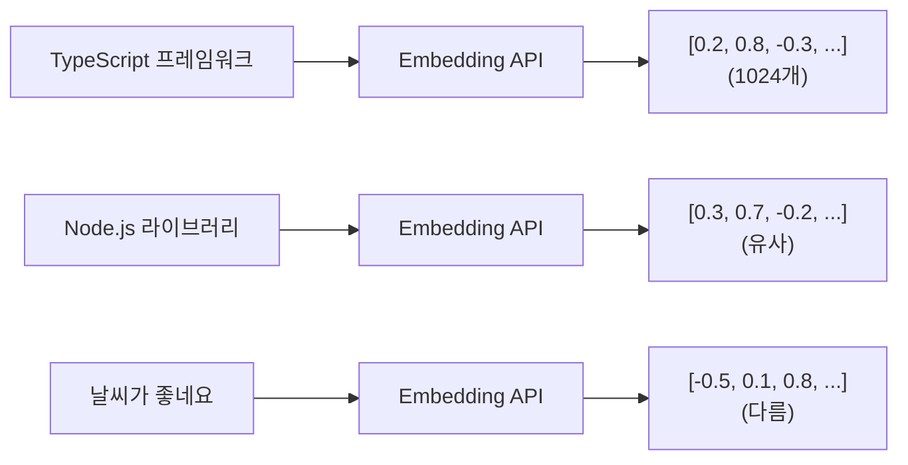

## Sonamu 검색 API의 문제

Sonamu로 지식 베이스 앱을 만들고 있습니다:

```typescript
class DocumentModelClass extends BaseModel {
  @api({ httpMethod: 'POST' })
  async search(query: string) {
    // 키워드 검색
    const results = await this.findMany({
      wq: [
        ['title', 'LIKE', `%${query}%`],
        ['content', 'LIKE', `%${query}%`],
      ],
    });
    return results;
  }
}
```

사용자가 "TypeScript 프레임워크"로 검색하면?
- ✅ "Sonamu는 **TypeScript 프레임워크**입니다" → 찾음
- ❌ "Sonamu는 Node.js API **라이브러리**입니다" → 못 찾음 (키워드 다름)
- ❌ "Sonamu is a **TS framework**" → 못 찾음 (영어)
- ❌ "타입스크립트 **프래임워크**" → 못 찾음 (오타)

**키워드 검색의 한계**:
- 동의어 처리 안 됨
- 표현 방식이 달라지면 못 찾음
- 오타에 취약
- 의미는 같은데 단어가 다르면 실패

## 의미 기반 검색이 필요합니다

"TypeScript 프레임워크"와 "Node.js API 라이브러리"는 **의미가 유사**합니다. 키워드는 달라도 말이죠.

이런 의미를 컴퓨터가 이해하려면? → **임베딩(Embedding)**

## 임베딩이란?

**임베딩**은 텍스트를 고차원 숫자 배열(벡터)로 변환하는 과정입니다. 의미가 유사한 텍스트는 벡터 공간에서 가까운 위치에 배치됩니다.



**핵심**:
- 숫자로 변환하면 **거리 계산** 가능
- 가까운 벡터 = 의미가 유사한 텍스트
- 먼 벡터 = 의미가 다른 텍스트

### Sonamu에서의 흐름

```typescript
// 1. 문서 저장 시: 텍스트 → 임베딩 → DB
await DocumentModel.saveOne({
  title: "Sonamu 시작하기",
  content: "...",
  embedding: [0.2, 0.8, -0.3, ...],  // 1024개
});

// 2. 검색 시: 쿼리 → 임베딩 → 유사도 계산
const queryEmbedding = [0.3, 0.7, -0.2, ...];
const results = await searchSimilar(queryEmbedding);
```

## Embedding 클래스

Sonamu는 임베딩을 쉽게 만들 수 있는 `Embedding` 클래스를 제공합니다:

```typescript
import { Embedding } from "sonamu/vector";

// 단일 텍스트 임베딩
const result = await Embedding.embedOne(
  "Sonamu는 TypeScript 프레임워크입니다",
  'voyage'  // 'voyage' | 'openai'
);

console.log(result.embedding);  // [0.123, -0.456, ...] (1024개)
console.log(result.model);      // "voyage-3"
console.log(result.tokenCount); // 8
```

## 어떤 프로바이더를 선택할까?

### Voyage AI vs OpenAI

Sonamu는 두 가지 임베딩 프로바이더를 지원합니다:

| 항목 | Voyage AI | OpenAI |
|------|-----------|--------|
| **한국어 성능** | ⭐⭐⭐⭐⭐ 최고 | ⭐⭐⭐⭐ 좋음 |
| **영어 성능** | ⭐⭐⭐⭐⭐ | ⭐⭐⭐⭐⭐ |
| **차원** | 1024 | 1536 |
| **최대 토큰** | 32,000 | 8,191 |
| **배치 크기** | 128 | 100 |
| **비대칭 임베딩** | ✅ (document/query 구분) | ❌ |
| **Sonamu 추천** | ⭐⭐⭐⭐⭐ | ⭐⭐⭐⭐ |

### Sonamu 프로젝트 기준 선택

**Voyage AI 추천**:
- ✅ 한국어 서비스 (한국어 성능 우수)
- ✅ 긴 문서 처리 (32,000 토큰)
- ✅ 검색 정확도 중요 (비대칭 임베딩)

**OpenAI 추천**:
- ✅ 글로벌 서비스 (다국어 균형)
- ✅ 이미 OpenAI API 사용 중

## 환경 설정

### 1. 패키지 설치

```bash
pnpm add voyageai
# 또는
pnpm add @ai-sdk/openai
```

### 2. API 키 설정

```.env
# Voyage AI (권장)
VOYAGE_API_KEY=pa-...

# OpenAI (대안)
OPENAI_API_KEY=sk-...
```

API 키는 각 프로바이더 웹사이트에서 발급받습니다:
- Voyage AI: https://www.voyageai.com/
- OpenAI: https://platform.openai.com/

## Sonamu Model에서 사용하기

### 문서 저장 시 임베딩 생성

```typescript
import { BaseModel, api } from "sonamu";
import { Embedding } from "sonamu/vector";

class DocumentModelClass extends BaseModel {
  @api({ httpMethod: 'POST' })
  async createDocument(title: string, content: string) {
    // 1. 임베딩 생성
    const result = await Embedding.embedOne(
      `${title}\n\n${content}`,
      'voyage',
      'document'  // 문서용 임베딩
    );
    
    // 2. DB에 저장 (Sonamu의 saveOne)
    const doc = await this.saveOne({
      title,
      content,
      embedding: result.embedding,  // 1024개 숫자 배열
      token_count: result.tokenCount,
    });
    
    return doc;
  }
}
```

**흐름**:
1. 사용자가 POST /documents에 문서 업로드
2. Sonamu API에서 Voyage AI로 임베딩 생성
3. PostgreSQL에 텍스트 + 임베딩 함께 저장

### 검색 API (나중에 구현)

```typescript
@api({ httpMethod: 'POST' })
async search(query: string) {
  // 1. 쿼리 임베딩 생성
  const result = await Embedding.embedOne(
    query,
    'voyage',
    'query'  // 검색용 임베딩
  );
  
  // 2. 벡터 검색 (vector-search.mdx 참고)
  const results = await this.getPuri().raw(`
    SELECT title, content,
      1 - (embedding <=> ?) AS similarity
    FROM documents
    WHERE embedding IS NOT NULL
    ORDER BY similarity DESC
    LIMIT 10
  `, [JSON.stringify(result.embedding)]);
  
  return results.rows;
}
```

## 비대칭 임베딩 (Voyage AI)

Voyage AI는 **문서**와 **쿼리**를 구분하여 임베딩합니다.

### 왜 구분할까?

**문서 (document)**:
- 긴 텍스트
- 상세 정보
- 저장 목적

**쿼리 (query)**:
- 짧은 텍스트
- 검색어
- 검색 목적

문서와 쿼리는 **성격이 다릅니다**. Voyage AI는 이를 고려하여 더 정확한 검색 결과를 제공합니다 (10-15% 향상).

### Sonamu에서 사용

```typescript
// 문서 저장 시: document
const docEmbedding = await Embedding.embedOne(
  "Sonamu는 TypeScript 풀스택 프레임워크입니다. API, DB, 인증 등을 제공합니다.",
  'voyage',
  'document'  // 문서용
);

// 검색 시: query
const queryEmbedding = await Embedding.embedOne(
  "TypeScript 프레임워크",
  'voyage',
  'query'  // 검색용
);
```

**OpenAI는 비대칭 임베딩을 지원하지 않습니다**:
```typescript
// OpenAI는 inputType이 무시됨
await Embedding.embedOne(text, 'openai', 'document');  // 'document' 무시
```

## 배치 처리

여러 문서를 한 번에 처리할 때:

```typescript
@api({ httpMethod: 'POST' })
async batchCreateDocuments(documents: Array<{
  title: string;
  content: string;
}>) {
  // 1. 텍스트 배열 준비
  const texts = documents.map(doc => 
    `${doc.title}\n\n${doc.content}`
  );
  
  // 2. 배치 임베딩 (자동으로 128개씩 분할)
  const embeddings = await Embedding.embed(
    texts,
    'voyage',
    'document'
  );
  
  // 3. DB에 저장
  const savedDocs = await Promise.all(
    documents.map((doc, i) => 
      this.saveOne({
        title: doc.title,
        content: doc.content,
        embedding: embeddings[i].embedding,
        token_count: embeddings[i].tokenCount,
      })
    )
  );
  
  return savedDocs;
}
```

**자동 분할**:
- Voyage AI: 128개씩
- OpenAI: 100개씩

1000개 문서도 자동으로 나눠서 처리합니다.

## 진행률 표시

많은 문서를 처리할 때 진행률을 보여줄 수 있습니다:

```typescript
@api({ httpMethod: 'POST' })
async importDocuments(files: string[]) {
  const texts = files.map(f => readFile(f));
  
  const embeddings = await Embedding.embed(
    texts,
    'voyage',
    'document',
    (processed, total) => {
      const percent = Math.round((processed / total) * 100);
      console.log(`Progress: ${processed}/${total} (${percent}%)`);
    }
  );
  
  // Progress: 128/1000 (13%)
  // Progress: 256/1000 (26%)
  // ...
  // Progress: 1000/1000 (100%)
}
```

## 실전 시나리오

### 시나리오: 고객 지원 지식 베이스

Sonamu로 고객 지원 시스템을 만들고 있습니다.

**1단계: 문서 업로드 API**
```typescript
class KnowledgeBaseModelClass extends BaseModel {
  @upload()
  async uploadDocument() {
    const { files } = Sonamu.getContext();
    const file = files?.[0]; // 첫 번째 파일 사용

    // 파일 읽기
    const content = await file.toBuffer().then(b => b.toString());
    
    // 임베딩 생성
    const embedding = await Embedding.embedOne(
      content,
      'voyage',
      'document'
    );
    
    // 저장
    return await this.saveOne({
      title: file.filename,
      content,
      embedding: embedding.embedding,
    });
  }
}
```

**2단계: 검색 API**
```typescript
@api({ httpMethod: 'POST' })
async searchSimilar(query: string) {
  // 쿼리 임베딩
  const embedding = await Embedding.embedOne(query, 'voyage', 'query');
  
  // 유사 문서 검색
  const results = await this.getPuri().raw(`
    SELECT id, title, content,
      1 - (embedding <=> ?) AS similarity
    FROM knowledge_base
    WHERE embedding IS NOT NULL
    ORDER BY similarity DESC
    LIMIT 5
  `, [JSON.stringify(embedding.embedding)]);
  
  return results.rows;
}
```

**3단계: 사용자 요청 처리**
```
POST /api/knowledge-base/search
{ "query": "환불 정책이 궁금해요" }

→ 유사 문서 5개 반환:
1. "환불 및 교환 안내" (similarity: 0.89)
2. "구매 취소 방법" (similarity: 0.82)
3. "결제 수단별 환불 기간" (similarity: 0.78)
...
```

## 에러 처리

```typescript
@api({ httpMethod: 'POST' })
async createDocument(title: string, content: string) {
  try {
    const embedding = await Embedding.embedOne(
      `${title}\n\n${content}`,
      'voyage',
      'document'
    );
    
    return await this.saveOne({
      title,
      content,
      embedding: embedding.embedding,
    });
  } catch (error) {
    if (error.message.includes('API_KEY')) {
      throw new Error('Voyage API 키를 설정하세요: VOYAGE_API_KEY');
    } else if (error.message.includes('token')) {
      throw new Error('텍스트가 너무 깁니다 (최대 32,000 토큰)');
    } else {
      throw new Error(`임베딩 생성 실패: ${error.message}`);
    }
  }
}
```

## 비용 고려

### 토큰 계산

```typescript
const result = await Embedding.embedOne(
  "Sonamu는 TypeScript 풀스택 프레임워크입니다",
  'voyage'
);

console.log(`Tokens: ${result.tokenCount}`);  // 12
```

### 비용 예측

**Voyage AI** ($0.13 per 1M tokens):
```typescript
// 1000개 문서, 평균 500토큰
// = 500,000 토큰
// = $0.065
```

**OpenAI** ($0.02 per 1M tokens):
```typescript
// 1000개 문서, 평균 500토큰
// = 500,000 토큰
// = $0.01
```

### 비용 절감 팁

**1. 캐싱**
```typescript
const cache = new Map<string, number[]>();

async function getCachedEmbedding(text: string) {
  if (cache.has(text)) {
    return cache.get(text)!;
  }
  
  const result = await Embedding.embedOne(text, 'voyage');
  cache.set(text, result.embedding);
  return result.embedding;
}
```

**2. 중복 제거**
```typescript
// 같은 텍스트는 한 번만 임베딩
const uniqueTexts = [...new Set(texts)];
const embeddings = await Embedding.embed(uniqueTexts, 'voyage');
```

## 주의사항

<Warning>
**Sonamu에서 임베딩 사용 시 주의사항**:

1. **API 키 필수**: 환경변수 설정
   ```bash
   VOYAGE_API_KEY=pa-...
   ```

2. **차원 수 일치**: DB 스키마와 맞춰야 함
   ```sql
   -- Voyage AI
   CREATE TABLE docs (embedding vector(1024));
   
   -- OpenAI
   CREATE TABLE docs (embedding vector(1536));
   ```

3. **document vs query**: Voyage는 구분, OpenAI는 무시
   ```typescript
   // 저장 시
   await Embedding.embedOne(text, 'voyage', 'document');
   
   // 검색 시
   await Embedding.embedOne(text, 'voyage', 'query');
   ```

4. **토큰 제한**: 너무 긴 텍스트는 청킹 필요
   - Voyage AI: 32,000 토큰
   - OpenAI: 8,191 토큰

5. **NULL 처리**: 임베딩 실패 시 NULL 저장 가능
   ```typescript
   embedding: result?.embedding || null
   ```

6. **비용 모니터링**: 토큰 사용량 추적
   ```typescript
   console.log(`Total tokens: ${result.tokenCount}`);
   ```
</Warning>

## 다음 단계

임베딩 생성이 완료되었습니다. 이제 Sonamu Model에서 검색 API를 구현할 차례입니다.

<CardGroup cols={3}>
  <Card title="pgvector 설정" icon="database" href="/advanced-features/vector-search/pgvector-setup">
    PostgreSQL 벡터 테이블 만들기
  </Card>
  <Card title="벡터 검색" icon="magnifying-glass" href="/advanced-features/vector-search/vector-search">
    Sonamu Model에서 검색 API 구현
  </Card>
  <Card title="청킹" icon="scissors" href="/advanced-features/vector-search/chunking">
    긴 문서 분할하기
  </Card>
</CardGroup>
