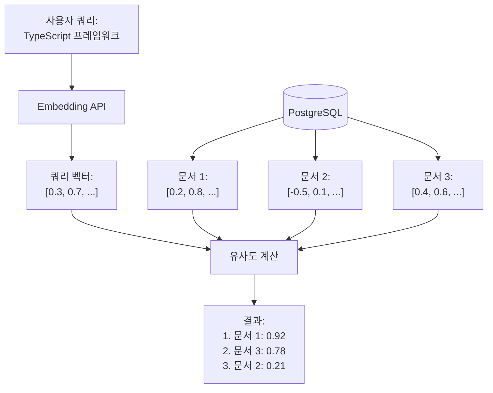

## Sonamu에서 검색 API 만들기

임베딩을 생성하고 DB에 저장했습니다. 이제 검색 API를 만들 차례입니다.

```typescript
// 문서를 저장했습니다
await DocumentModel.saveOne({
  title: "Sonamu 시작하기",
  content: "...",
  embedding: [0.2, 0.8, ...],  // 1024개
});

// 이제 검색하고 싶습니다
// "TypeScript 프레임워크" 검색 시
// → "Sonamu 시작하기" 찾아야 함
```

**목표**: Sonamu BaseModel에서 벡터 검색 API를 구현합니다.

## 벡터 검색 원리



**핵심**:

1. 쿼리를 임베딩으로 변환
2. DB의 모든 문서 벡터와 거리/유사도 계산
3. 가까운 순서대로 정렬

## Sonamu Model에서 구현

### 기본 검색 API

```typescript
import { BaseModelClass, api } from "sonamu";
import { Embedding } from "sonamu/vector";

class DocumentModelClass extends BaseModelClass {
  @api({ httpMethod: "POST" })
  async search(query: string, limit: number = 10) {
    // 1. 쿼리를 임베딩으로 변환
    const embedding = await Embedding.embedOne(
      query,
      "voyage",
      "query", // 검색용
    );

    // 2. Puri로 벡터 검색 SQL 작성
    const results = await this.getPuri().raw(
      `
      SELECT 
        id,
        title,
        content,
        1 - (embedding <=> ?) AS similarity
      FROM documents
      WHERE embedding IS NOT NULL
      ORDER BY embedding <=> ?
      LIMIT ?
    `,
      [JSON.stringify(embedding.embedding), JSON.stringify(embedding.embedding), limit],
    );

    return results.rows;
  }
}
```

**흐름**:

1. `POST /api/documents/search` → Sonamu API
2. 쿼리 임베딩 생성 (Voyage AI)
3. PostgreSQL에서 유사도 계산 (pgvector)
4. 상위 N개 반환

### 왜 Puri의 raw()를 쓰나요?

pgvector의 특수 연산자(`<=>`)는 Knex가 직접 지원하지 않습니다:

```typescript
// ❌ Knex로는 어려움
await this.findMany({
  wq: [
    /* pgvector 연산자 어떻게? */
  ],
});

// ✅ Puri.raw()로 SQL 직접 작성
await this.getPuri().raw(`
  SELECT * FROM docs
  WHERE embedding <=> ? < 0.5
`);
```

Sonamu의 `Puri`는 Knex를 감싸므로 `raw()` 메서드를 제공합니다.

## 유사도 함수 이해하기

pgvector는 세 가지 방식으로 벡터 간 거리/유사도를 계산합니다.

### 1. 코사인 유사도 (권장)

**벡터 간 각도로 측정**

```sql
SELECT
  id, title,
  1 - (embedding <=> ?) AS similarity
FROM documents
ORDER BY embedding <=> ?;
```

**연산자**: `<=>` (코사인 거리)
**범위**: 0.0 (동일) ~ 2.0 (정반대)
**유사도 변환**: `1 - distance`

**장점**:

- 벡터 크기 영향 없음 (방향만 비교)
- 대부분의 임베딩 모델에 최적
- **Sonamu 권장**

### 2. 유클리드 거리 (L2)

**벡터 간 직선 거리**

```sql
SELECT
  id, title,
  embedding <-> ? AS distance
FROM documents
ORDER BY embedding <-> ?;
```

**연산자**: `<->` (L2 거리)
**범위**: 0.0 (동일) ~ ∞

**용도**: 벡터 크기도 중요한 경우

### 3. 내적 (Dot Product)

**벡터 내적 (음수)**

```sql
SELECT
  id, title,
  (embedding <#> ?) * -1 AS score
FROM documents
ORDER BY embedding <#> ?;
```

**연산자**: `<#>` (음의 내적)
**범위**: -∞ ~ ∞

**용도**: 특수한 임베딩 모델

### Sonamu에서는 코사인 유사도 사용

```typescript
// ✅ 권장: 코사인 유사도
const results = await this.getPuri().raw(
  `
  SELECT 
    id, title, content,
    1 - (embedding <=> ?) AS similarity
  FROM documents
  WHERE embedding IS NOT NULL
  ORDER BY embedding <=> ?
  LIMIT ?
`,
  [JSON.stringify(embedding.embedding), JSON.stringify(embedding.embedding), limit],
);
```

## 임계값 필터링

유사도가 낮은 결과는 제외합니다:

```typescript
@api({ httpMethod: 'POST' })
async searchWithThreshold(
  query: string,
  threshold: number = 0.5,  // 0.5 이상만
  limit: number = 10
) {
  const embedding = await Embedding.embedOne(query, 'voyage', 'query');

  const results = await this.getPuri().raw(`
    SELECT
      id, title, content,
      1 - (embedding <=> ?) AS similarity
    FROM documents
    WHERE
      embedding IS NOT NULL
      AND 1 - (embedding <=> ?) > ?
    ORDER BY embedding <=> ?
    LIMIT ?
  `, [
    JSON.stringify(embedding.embedding),
    JSON.stringify(embedding.embedding),
    threshold,
    JSON.stringify(embedding.embedding),
    limit,
  ]);

  return results.rows;
}
```

**임계값 기준**:

- `0.8~1.0`: 매우 유사 (거의 동일)
- `0.6~0.8`: 유사
- `0.4~0.6`: 관련 있음
- `< 0.4`: 관련 없음

## 실전 예제

### 1. 지식 베이스 검색

```typescript
class KnowledgeBaseModelClass extends BaseModelClass {
  @api({ httpMethod: "POST" })
  async searchKnowledge(query: string, category?: string, limit: number = 5) {
    const embedding = await Embedding.embedOne(query, "voyage", "query");

    // 카테고리 필터 (선택)
    const categoryFilter = category ? `AND category = '${category}'` : "";

    const results = await this.getPuri().raw(
      `
      SELECT 
        id, title, content, category,
        1 - (embedding <=> ?) AS similarity,
        created_at
      FROM knowledge_base
      WHERE 
        embedding IS NOT NULL
        ${categoryFilter}
      ORDER BY embedding <=> ?
      LIMIT ?
    `,
      [JSON.stringify(embedding.embedding), JSON.stringify(embedding.embedding), limit],
    );

    return results.rows.map((row) => ({
      id: row.id,
      title: row.title,
      content: row.content,
      category: row.category,
      similarity: parseFloat(row.similarity.toFixed(3)),
      createdAt: row.created_at,
    }));
  }
}
```

**사용**:

```typescript
// 전체 검색
await KnowledgeBaseModel.searchKnowledge("환불 방법");

// 카테고리 필터
await KnowledgeBaseModel.searchKnowledge("환불 방법", "FAQ");
```

### 2. 상품 추천

"이 상품과 유사한 제품"을 구현합니다:

```typescript
class ProductModelClass extends BaseModelClass {
  @api({ httpMethod: "POST" })
  async recommendSimilarProducts(productId: number, limit: number = 10) {
    // 기준 상품 조회
    const baseProduct = await this.findById(productId);

    if (!baseProduct.embedding) {
      throw new Error("상품 임베딩이 없습니다");
    }

    // 유사 상품 검색 (자기 자신 제외)
    const results = await this.getPuri().raw(
      `
      SELECT 
        id, name, description, price,
        1 - (embedding <=> ?) AS similarity
      FROM products
      WHERE 
        embedding IS NOT NULL
        AND id != ?
      ORDER BY embedding <=> ?
      LIMIT ?
    `,
      [
        JSON.stringify(baseProduct.embedding),
        productId,
        JSON.stringify(baseProduct.embedding),
        limit,
      ],
    );

    return results.rows;
  }
}
```

**API 응답**:

```json
[
  {
    "id": 123,
    "name": "비슷한 상품 1",
    "price": 29000,
    "similarity": 0.89
  },
  ...
]
```

### 3. 다중 필터 검색

여러 조건을 조합합니다:

```typescript
@api({ httpMethod: 'POST' })
async advancedSearch(
  query: string,
  filters: {
    category?: string;
    minSimilarity?: number;
    dateFrom?: Date;
    dateTo?: Date;
  } = {},
  limit: number = 10
) {
  const embedding = await Embedding.embedOne(query, 'voyage', 'query');

  // WHERE 조건 동적 생성
  const conditions = ['embedding IS NOT NULL'];
  const params: any[] = [
    JSON.stringify(embedding.embedding),
    JSON.stringify(embedding.embedding),
  ];

  if (filters.category) {
    conditions.push(`category = ?`);
    params.push(filters.category);
  }

  if (filters.minSimilarity) {
    conditions.push(`1 - (embedding <=> ?) > ?`);
    params.push(
      JSON.stringify(embedding.embedding),
      filters.minSimilarity
    );
  }

  if (filters.dateFrom) {
    conditions.push(`created_at >= ?`);
    params.push(filters.dateFrom);
  }

  if (filters.dateTo) {
    conditions.push(`created_at <= ?`);
    params.push(filters.dateTo);
  }

  params.push(limit);

  const results = await this.getPuri().raw(`
    SELECT
      id, title, content, category,
      1 - (embedding <=> ?) AS similarity,
      created_at
    FROM documents
    WHERE ${conditions.join(' AND ')}
    ORDER BY embedding <=> ?
    LIMIT ?
  `, params);

  return results.rows;
}
```

### 4. 청크 검색 + 통합

문서를 청크로 나눠서 저장한 경우:

```typescript
@api({ httpMethod: 'POST' })
async searchDocumentChunks(
  query: string,
  limit: number = 5
) {
  const embedding = await Embedding.embedOne(query, 'voyage', 'query');

  // 청크별 검색 (더 많이 가져옴)
  const chunks = await this.getPuri().raw(`
    SELECT
      id, parent_id, title, content, chunk_index,
      1 - (embedding <=> ?) AS similarity
    FROM document_chunks
    WHERE embedding IS NOT NULL
    ORDER BY embedding <=> ?
    LIMIT ?
  `, [
    JSON.stringify(embedding.embedding),
    JSON.stringify(embedding.embedding),
    limit * 3,
  ]);

  // 부모 문서별로 그룹화
  const grouped = new Map();

  for (const chunk of chunks.rows) {
    const parentId = chunk.parent_id;

    if (!grouped.has(parentId)) {
      grouped.set(parentId, {
        parentId,
        title: chunk.title,
        bestSimilarity: chunk.similarity,
        chunks: [],
      });
    }

    grouped.get(parentId).chunks.push({
      chunkIndex: chunk.chunk_index,
      content: chunk.content,
      similarity: chunk.similarity,
    });
  }

  // 상위 N개 문서 반환
  return Array.from(grouped.values())
    .sort((a, b) => b.bestSimilarity - a.bestSimilarity)
    .slice(0, limit);
}
```

## 성능 최적화

### 인덱스가 있나요?

벡터 검색은 인덱스가 없으면 매우 느립니다:

```sql
-- 인덱스 확인
SELECT indexname, indexdef
FROM pg_indexes
WHERE tablename = 'documents'
  AND indexdef LIKE '%hnsw%';
```

없다면 생성합니다 (데이터 100개 이상 후):

```sql
CREATE INDEX idx_docs_embedding
ON documents
USING hnsw (embedding vector_cosine_ops);
```

### EXPLAIN ANALYZE로 확인

```typescript
const explain = await this.getPuri().raw(
  `
  EXPLAIN ANALYZE
  SELECT id, title, 1 - (embedding <=> ?) AS similarity
  FROM documents
  WHERE embedding IS NOT NULL
  ORDER BY embedding <=> ?
  LIMIT 10
`,
  [JSON.stringify(embedding.embedding), JSON.stringify(embedding.embedding)],
);

console.log(explain.rows);
```

**확인 사항**:

- `Index Scan using hnsw_...` → 좋음
- `Seq Scan` → 나쁨 (인덱스 없음)

### 인덱스 파라미터 조정

검색 정확도 vs 속도:

```sql
-- 세션별 설정
SET LOCAL hnsw.ef_search = 100;  -- 기본: 40

-- 높을수록: 정확, 느림
-- 낮을수록: 빠름, 부정확
```

Sonamu에서:

```typescript
await this.getPuri().raw("SET LOCAL hnsw.ef_search = 100");
const results = await this.getPuri().raw(`SELECT ...`);
```

## 벤치마크

### 인덱스 효과

| 문서 수 | 순차 스캔 | HNSW 인덱스 | 속도 향상 |
| ------- | --------- | ----------- | --------- |
| 1K      | 50ms      | 2ms         | 25배      |
| 10K     | 500ms     | 5ms         | 100배     |
| 100K    | 5s        | 8ms         | 625배     |
| 1M      | 50s       | 12ms        | 4166배    |

**결론**: 인덱스 필수!

## 주의사항

<Warning>
**Sonamu에서 벡터 검색 시 주의사항**:

1. **NULL 체크 필수**: 임베딩 없는 문서 제외

   ```sql
   WHERE embedding IS NOT NULL
   ```

2. **차원 일치**: 쿼리와 DB 벡터 차원 같아야 함

   ```typescript
   // ❌ 차원 불일치
   // DB: vector(1024) - Voyage
   // 쿼리: OpenAI (1536) - 에러!

   // ✅ 차원 일치
   // DB: vector(1024)
   // 쿼리: Voyage (1024)
   ```

3. **JSON.stringify 필수**: 배열을 JSON 문자열로

   ```typescript
   JSON.stringify(embedding.embedding);
   ```

4. **연산자 두 번 사용**: WHERE와 ORDER BY

   ```sql
   WHERE 1 - (embedding <=> ?) > 0.5
   ORDER BY embedding <=> ?
   ```

5. **Puri.raw() 사용**: Knex의 wq로는 안 됨

   ```typescript
   await this.getPuri().raw(`SELECT ...`);
   ```

6. **인덱스 생성 시점**: 데이터 후

   ```sql
   -- 1. 데이터 먼저
   INSERT INTO docs ...

   -- 2. 인덱스 나중에
   CREATE INDEX ...
   ```

7. **LIMIT 적절히**: 너무 많이 가져오지 않기
   ```sql
   LIMIT 10  -- OK
   -- LIMIT 1000  -- 느림
   ```
   </Warning>

## 다음 단계

Sonamu Model에서 벡터 검색을 구현했습니다. 더 정확한 검색을 위해 하이브리드 검색(벡터 + 키워드)을 추가할 수 있습니다.

<CardGroup cols={2}>
  <Card
    title="하이브리드 검색"
    icon="layer-group"
    href="/ko/advanced-features/vector-search/hybrid-search"
  >
    벡터 + FTS 결합하여 정확도 향상
  </Card>
  <Card title="청킹" icon="scissors" href="/ko/advanced-features/vector-search/chunking">
    긴 문서 분할하기
  </Card>
</CardGroup>
