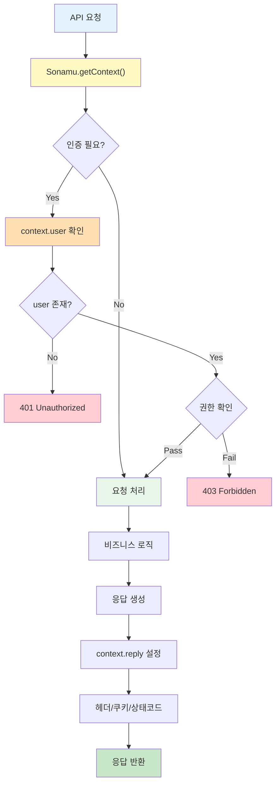

SonamuContext는 API 요청 처리 중에 필요한 정보들을 담고 있는 객체입니다.

## Context 개요

<CardGroup cols={2}>
  <Card title="Request 정보" icon="arrow-right-to-bracket">
    HTTP 요청 데이터
    
    헤더, 바디, 쿼리
  </Card>
  <Card title="Reply 객체" icon="arrow-left-from-line">
    HTTP 응답 제어
    
    상태 코드, 헤더
  </Card>
  <Card title="User 정보" icon="user">
    인증된 사용자
    
    ID, 권한, 역할
  </Card>
  <Card title="확장 가능" icon="puzzle-piece">
    커스텀 필드 추가
    
    프로젝트별 데이터
  </Card>
</CardGroup>

## SonamuContext 구조

### 기본 구조

```typescript
interface SonamuContext {
  // HTTP Request 객체
  request: FastifyRequest;
  
  // HTTP Reply 객체
  reply: FastifyReply;
  
  // 인증된 사용자 정보 (옵션)
  user?: {
    id: number;
    email: string;
    username: string;
    role: string;
    // 프로젝트별 추가 필드
  };
  
  // 커스텀 필드 (프로젝트별로 확장)
  [key: string]: any;
}
```

<Info>
Sonamu는 내부적으로 Fastify를 사용하므로, request와 reply는 Fastify의 객체입니다.
</Info>

## Context 구성 요소

### 1. Request

HTTP 요청과 관련된 모든 정보를 담고 있습니다.

```typescript
class UserModel extends BaseModelClass {
  @api({ httpMethod: "GET" })
  async list(): Promise<User[]> {
    const context = Sonamu.getContext();
    
    // Request 정보 접근
    const headers = context.request.headers;
    const query = context.request.query;
    const body = context.request.body;
    const params = context.request.params;
    const ip = context.request.ip;
    const hostname = context.request.hostname;
    const url = context.request.url;
    const method = context.request.method;
    
    console.log("Request from IP:", ip);
    console.log("User-Agent:", headers["user-agent"]);
    
    // ...
  }
}
```

**주요 속성**:
- `headers`: HTTP 헤더 (객체)
- `query`: URL 쿼리 파라미터 (객체)
- `body`: 요청 바디 (POST/PUT 등)
- `params`: URL 경로 파라미터
- `ip`: 클라이언트 IP 주소
- `hostname`: 호스트명
- `url`: 요청 URL
- `method`: HTTP 메서드

### 2. Reply

HTTP 응답을 제어할 수 있습니다.

```typescript
class UserModel extends BaseModelClass {
  @api({ httpMethod: "POST" })
  async create(params: CreateUserParams): Promise<{ userId: number }> {
    const context = Sonamu.getContext();
    
    // 응답 헤더 설정
    context.reply.header("X-Custom-Header", "value");
    
    // 응답 상태 코드 설정
    context.reply.status(201); // Created
    
    // 쿠키 설정
    context.reply.cookie("session_id", "abc123", {
      httpOnly: true,
      secure: true,
      maxAge: 3600000, // 1시간
    });
    
    // User 생성
    const wdb = this.getPuri("w");
    const [userId] = await wdb
      .table("users")
      .insert(params)
      .returning({ id: "id" });
    
    return { userId: userId.id };
  }
}
```

**주요 메서드**:
- `status(code)`: 상태 코드 설정
- `header(name, value)`: 응답 헤더 설정
- `cookie(name, value, options)`: 쿠키 설정
- `redirect(url)`: 리다이렉트
- `send(data)`: 응답 전송 (일반적으로 자동)

### 3. User

인증된 사용자 정보를 담고 있습니다.

```typescript
interface ContextUser {
  id: number;
  email: string;
  username: string;
  role: "admin" | "manager" | "normal";
  // 프로젝트별 추가 필드
}

class PostModel extends BaseModelClass {
  @api({ httpMethod: "POST" })
  async create(params: PostSaveParams): Promise<{ postId: number }> {
    const context = Sonamu.getContext();
    
    // 인증 확인
    if (!context.user) {
      throw new Error("Authentication required");
    }
    
    // 권한 확인
    if (context.user.role !== "admin" && context.user.role !== "manager") {
      throw new Error("Insufficient permissions");
    }
    
    const wdb = this.getPuri("w");
    
    // 현재 사용자를 작성자로 설정
    const [post] = await wdb
      .table("posts")
      .insert({
        ...params,
        user_id: context.user.id,
        author: context.user.username,
      })
      .returning({ id: "id" });
    
    return { postId: post.id };
  }
}
```

<Warning>
`context.user`는 인증 미들웨어에 의해 설정됩니다.
인증이 필요한 API에서는 항상 `context.user`의 존재 여부를 확인해야 합니다.
</Warning>

## 실전 사용 예제

### 인증 확인

```typescript
class UserModel extends BaseModelClass {
  @api({ httpMethod: "PUT" })
  async updateProfile(params: ProfileParams): Promise<void> {
    const context = Sonamu.getContext();
    
    if (!context.user) {
      context.reply.status(401);
      throw new Error("Unauthorized");
    }
    
    const wdb = this.getPuri("w");
    
    await wdb
      .table("users")
      .where("id", context.user.id)
      .update({
        bio: params.bio,
        avatar_url: params.avatarUrl,
      });
  }
}
```

### 권한 확인

```typescript
class UserModel extends BaseModelClass {
  @api({ httpMethod: "DELETE" })
  async remove(userId: number): Promise<void> {
    const context = Sonamu.getContext();
    
    // 인증 확인
    if (!context.user) {
      context.reply.status(401);
      throw new Error("Unauthorized");
    }
    
    // 권한 확인
    if (context.user.role !== "admin") {
      context.reply.status(403);
      throw new Error("Forbidden: Admin only");
    }
    
    // 자기 자신은 삭제 불가
    if (context.user.id === userId) {
      context.reply.status(400);
      throw new Error("Cannot delete yourself");
    }
    
    const wdb = this.getPuri("w");
    await wdb.table("users").where("id", userId).delete();
  }
}
```

### 로깅

```typescript
class OrderModel extends BaseModelClass {
  @api({ httpMethod: "POST" })
  async create(params: OrderParams): Promise<{ orderId: number }> {
    const context = Sonamu.getContext();
    
    // 요청 로깅
    console.log({
      timestamp: new Date(),
      userId: context.user?.id,
      ip: context.request.ip,
      userAgent: context.request.headers["user-agent"],
      endpoint: context.request.url,
      method: context.request.method,
    });
    
    // 주문 생성
    const wdb = this.getPuri("w");
    const [order] = await wdb
      .table("orders")
      .insert({
        ...params,
        user_id: context.user!.id,
        ip_address: context.request.ip,
      })
      .returning({ id: "id" });
    
    return { orderId: order.id };
  }
}
```

### 커스텀 헤더

```typescript
class FileModel extends BaseModelClass {
  @api({ httpMethod: "GET" })
  async download(fileId: number): Promise<Buffer> {
    const context = Sonamu.getContext();
    const rdb = this.getPuri("r");
    
    const file = await rdb
      .table("files")
      .where("id", fileId)
      .first();
    
    if (!file) {
      throw new Error("File not found");
    }
    
    // 파일 다운로드 헤더 설정
    context.reply.header("Content-Type", file.mime_type);
    context.reply.header(
      "Content-Disposition",
      `attachment; filename="${file.filename}"`
    );
    context.reply.header("Content-Length", file.size.toString());
    
    // 파일 내용 반환
    return Buffer.from(file.content);
  }
}
```

### 쿠키 처리

```typescript
class AuthModel extends BaseModelClass {
  @api({ httpMethod: "POST" })
  async login(params: LoginParams): Promise<{ token: string }> {
    const context = Sonamu.getContext();
    const rdb = this.getPuri("r");
    
    // 사용자 인증
    const user = await rdb
      .table("users")
      .where("email", params.email)
      .first();
    
    if (!user || user.password !== params.password) {
      context.reply.status(401);
      throw new Error("Invalid credentials");
    }
    
    // JWT 토큰 생성
    const jwt = require("jsonwebtoken");
    const token = jwt.sign(
      { userId: user.id, role: user.role },
      process.env.JWT_SECRET,
      { expiresIn: "24h" }
    );
    
    // 쿠키에 토큰 저장
    context.reply.cookie("auth_token", token, {
      httpOnly: true,
      secure: process.env.NODE_ENV === "production",
      maxAge: 86400000, // 24시간
      sameSite: "strict",
    });
    
    return { token };
  }
  
  @api({ httpMethod: "POST" })
  async logout(): Promise<{ message: string }> {
    const context = Sonamu.getContext();
    
    // 쿠키 삭제
    context.reply.clearCookie("auth_token");
    
    return { message: "Logged out successfully" };
  }
}
```

### IP 기반 제한

```typescript
class ApiModel extends BaseModelClass {
  private readonly ALLOWED_IPS = [
    "127.0.0.1",
    "192.168.1.0/24",
    // ...
  ];
  
  @api({ httpMethod: "POST" })
  async adminAction(params: AdminParams): Promise<void> {
    const context = Sonamu.getContext();
    
    // IP 확인
    const clientIp = context.request.ip;
    
    if (!this.isAllowedIp(clientIp)) {
      context.reply.status(403);
      throw new Error("Access denied from this IP");
    }
    
    // 관리자 작업 수행
    // ...
  }
  
  private isAllowedIp(ip: string): boolean {
    // IP 체크 로직
    return this.ALLOWED_IPS.includes(ip);
  }
}
```

### Rate Limiting 정보

```typescript
class ApiModel extends BaseModelClass {
  @api({ httpMethod: "GET" })
  async list(): Promise<any[]> {
    const context = Sonamu.getContext();
    
    // Rate limit 정보를 응답 헤더에 추가
    context.reply.header("X-RateLimit-Limit", "100");
    context.reply.header("X-RateLimit-Remaining", "95");
    context.reply.header("X-RateLimit-Reset", Date.now() + 3600000);
    
    const rdb = this.getPuri("r");
    return rdb.table("items").select("*");
  }
}
```

## Context 사용 패턴



## 주의사항

<Warning>
**Context 사용 시 주의사항**:
1. API 메서드 내에서만 접근 가능
2. `context.user`는 인증 후에만 존재
3. 비동기 작업 중에도 동일한 Context 유지
4. Context 수정은 신중하게
5. 응답 헤더는 데이터 전송 전에 설정
</Warning>

### 흔한 실수

```typescript
// ❌ 잘못됨: Context 없이 user 접근 시도
class UserModel extends BaseModelClass {
  private currentUserId?: number;
  
  @api({ httpMethod: "POST" })
  async create(params: UserParams): Promise<void> {
    // Context를 가져오지 않음
    if (this.currentUserId) { // ← 작동 안 함
      // ...
    }
  }
}

// ❌ 잘못됨: user 존재 확인 없이 사용
class PostModel extends BaseModelClass {
  @api({ httpMethod: "POST" })
  async create(params: PostParams): Promise<void> {
    const context = Sonamu.getContext();
    
    // context.user가 undefined일 수 있음
    const userId = context.user.id; // ← 에러 발생 가능
  }
}

// ✅ 올바름: Context 가져오고 user 확인
class PostModel extends BaseModelClass {
  @api({ httpMethod: "POST" })
  async create(params: PostParams): Promise<void> {
    const context = Sonamu.getContext();
    
    if (!context.user) {
      throw new Error("Authentication required");
    }
    
    const userId = context.user.id; // ← 안전
    // ...
  }
}
```

## 다음 단계

<CardGroup cols={2}>
  <Card title="Context 가져오기" icon="hand" href="/ko/api-development/context/getting-context">
    Sonamu.getContext() 사용법
  </Card>
  <Card title="커스텀 Context" icon="puzzle-piece" href="/ko/api-development/context/custom-context">
    Context 확장하기
  </Card>
  <Card title="@api 데코레이터" icon="at" href="/ko/api-development/creating-apis/api-decorator">
    API 기본 사용법
  </Card>
  <Card title="에러 처리" icon="triangle-exclamation" href="/ko/api-development/error-handling">
    API 에러 핸들링
  </Card>
</CardGroup>
