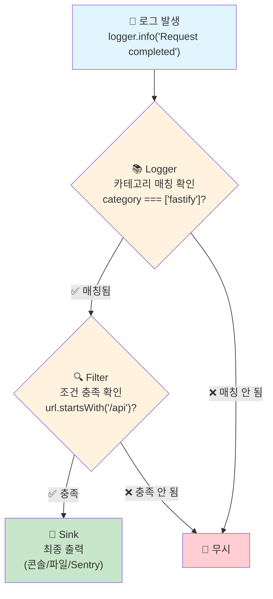
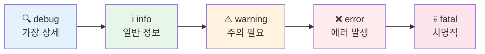

Sonamu는 [LogTape](https://github.com/dahlia/logtape)를 사용하여 구조화된 로깅을 제공합니다. `sonamu.config.ts`의 `logging` 옵션으로 로깅 동작을 설정할 수 있습니다.

## LogTape란?

LogTape는 TypeScript를 위한 구조화된 로깅 라이브러리입니다. 단순한 문자열 로그 대신, 구조화된 데이터로 로그를 기록합니다.

### 일반 로깅 vs 구조화된 로깅

**일반 로깅 (문자열):**
```typescript
console.log("User login failed: email=user@example.com, reason=invalid_password");
// → 분석하려면 문자열 파싱 필요
```

**구조화된 로깅 (LogTape):**
```typescript
logger.error("User login failed", {
  email: "user@example.com",
  reason: "invalid_password",
});
// → 이미 구조화된 데이터, 바로 분석 가능
```

### 구조화된 로깅의 장점

1. **검색/필터링 용이** - 특정 조건의 로그만 쉽게 찾을 수 있음
2. **분석 가능** - 로그 데이터를 집계하고 통계를 낼 수 있음
3. **타입 안전** - TypeScript로 로그 데이터 구조를 검증
4. **유연한 출력** - 같은 로그를 여러 형식(콘솔, 파일, 외부 서비스)으로 출력

## 핵심 개념

### 1. Sink (출력 대상)

로그가 최종적으로 기록되는 곳입니다.

```typescript
{
  console: getConsoleSink(),        // 터미널 출력
  file: getFileSink("app.log"),     // 파일 저장
  sentry: sentrySink,                // 외부 서비스
}
```

**한 로그를 여러 Sink에 동시에 기록할 수 있습니다:**
- 콘솔: 실시간 모니터링
- 파일: 영구 보관
- Sentry: 에러 알림

### 2. Filter (필터링 조건)

어떤 로그를 기록할지 결정합니다.

```typescript
{
  "api-only": (record) => record.url.startsWith("/api"),
  "errors": (record) => record.level >= "error",
}
```

**Filter 없이는 모든 로그가 출력되어 성능과 가독성이 저하됩니다.**

### 3. Logger (로거 설정)

카테고리, Sink, Filter를 연결합니다.

```typescript
{
  category: ["fastify"],           // 어떤 카테고리의 로그인가?
  sinks: ["console", "file"],      // 어디에 기록할까?
  filters: ["api-only"],           // 어떤 조건으로 필터링할까?
  lowestLevel: "info",             // 최소 어떤 레벨부터?
}
```

### Sink-Filter-Logger의 관계



**예시:**
```typescript
// 1. Fastify가 로그 발생
logger.info("Request completed", { url: "/api/user" });

// 2. Logger 확인: category가 ["fastify"]인가? ✓
// 3. Filter 확인: url이 /api로 시작하는가? ✓
// 4. Sink 출력: 콘솔과 파일에 기록
```

## 로그 레벨 선택 가이드

로그 레벨은 로그의 중요도를 나타냅니다.

### 각 레벨의 의미와 사용 시기

**1. debug**
- **의미**: 상세한 디버깅 정보
- **사용 시기**: 개발 중 문제 추적
- **예시**: 함수 호출 순서, 변수 값
```typescript
logger.debug("Processing order", { orderId, items });
```

**2. info (기본값)**
- **의미**: 일반적인 운영 정보
- **사용 시기**: 정상 동작 확인
- **예시**: HTTP 요청/응답, 작업 완료
```typescript
logger.info("User logged in", { userId });
```

**3. warning**
- **의미**: 문제 가능성 경고
- **사용 시기**: 에러는 아니지만 주의 필요
- **예시**: 느린 응답, 재시도 발생
```typescript
logger.warn("Slow query detected", { duration: 5000 });
```

**4. error**
- **의미**: 처리 가능한 에러
- **사용 시기**: 예외 처리, 복구 가능한 실패
- **예시**: 유효성 검증 실패, API 호출 실패
```typescript
logger.error("Payment failed", { error: "card_declined" });
```

**5. fatal**
- **의미**: 치명적 오류 (서버 중단 수준)
- **사용 시기**: 복구 불가능한 심각한 문제
- **예시**: DB 연결 실패, 메모리 부족
```typescript
logger.fatal("Database connection lost", { error });
```

### 환경별 레벨 권장사항

| 환경 | 최소 레벨 | 이유 |
|------|----------|------|
| 개발 | `debug` | 모든 정보 필요 |
| 스테이징 | `info` | 운영 정보 확인 |
| 프로덕션 | `warning` | 성능 고려 |

**레벨 계층 구조:**



<Info>
낮은 레벨을 설정하면 그보다 높은 모든 레벨의 로그가 출력됩니다. 예: `lowestLevel: "warning"`으로 설정하면 warning, error, fatal이 모두 출력됩니다.
</Info>

## 왜 이렇게 설계되었나?

### 1. 기본값이 안전함

Sonamu의 기본 설정:
```typescript
{
  category: ["fastify"],
  sinks: ["fastify-console"],
  lowestLevel: "info",
  filters: ["fastify-console"],  // /api만, healthcheck 제외
}
```

**이유:**
- ✅ `/api` 경로만 로깅 → 불필요한 정적 파일 요청 제외
- ✅ `info` 레벨 → 너무 많지도 적지도 않게
- ✅ healthcheck 제외 → 모니터링 시스템이 생성하는 반복 요청 제외

### 2. 확장 가능함

기본 설정 위에 커스텀 설정을 추가할 수 있습니다:

```typescript
logging: {
  // 기본 설정 유지하면서
  sinks: {
    errorFile: getFileSink("errors.log"),  // 추가 Sink
  },
  loggers: [
    // 추가 Logger (기본 Fastify 로거는 유지됨)
    {
      category: ["app"],
      sinks: ["console"],
      lowestLevel: "debug",
    },
  ],
}
```

### 3. 성능 영향 최소화

Filter를 통해 불필요한 로그를 조기에 차단:

```typescript
// ❌ Filter 없음: 모든 로그 처리 → 느림
logger → sink (모든 로그 출력)

// ✅ Filter 있음: 필요한 로그만 처리 → 빠름
logger → filter (불필요한 로그 차단) → sink (필요한 로그만 출력)
```

## 기본 설정

`logging` 옵션을 생략하면 기본 설정이 자동 적용됩니다.

```typescript
import { defineConfig } from "sonamu";

export default defineConfig({
  // logging 생략 시 기본값 사용
  server: {
    // ...
  },
});
```

**기본 동작:**
- Fastify 요청/응답을 콘솔에 로깅
- `/api/*` 경로만 로깅 (healthcheck 제외)
- 예쁜 형식으로 출력 (타임스탬프, 카테고리, 레벨)

## logging 옵션

```typescript
type SonamuLoggingOptions<TSinkId extends string, TFilterId extends string> = {
  fastifyCategory?: readonly string[];
  sinks?: Record<TSinkId, Sink>;
  filters?: Record<TFilterId, FilterLike>;
  loggers?: LoggerConfig<TSinkId, TFilterId>[];
};
```

### 로깅 비활성화

```typescript
export default defineConfig({
  logging: false,  // 모든 로깅 비활성화
  
  server: {
    // ...
  },
});
```

## fastifyCategory

Fastify HTTP 로깅에 사용할 카테고리를 지정합니다.

**타입**: `readonly string[]`

**기본값**: `["fastify"]`

```typescript
export default defineConfig({
  logging: {
    fastifyCategory: ["myapp", "http"],  // 커스텀 카테고리
  },
  
  server: {
    // ...
  },
});
```

**카테고리 형식**: `["a", "b", "c"]` 배열로 계층 구조 표현

**로그 출력 예시:**
```
[2025-01-09 12:34:56] [myapp.http] INFO: [GET:200] /api/user/list - Request completed
```

## sinks

로그를 출력할 대상(sink)을 추가합니다.

**타입**: `Record<string, Sink>`

```typescript
import { defineConfig } from "sonamu";
import { getConsoleSink, getFileSink } from "@logtape/logtape";

export default defineConfig({
  logging: {
    sinks: {
      console: getConsoleSink(),
      file: getFileSink("logs/app.log"),
    },
  },
  
  server: {
    // ...
  },
});
```

<Warning>
`"fastify-console"` 이름은 Sonamu가 자동으로 생성하는 기본 sink입니다. 이 이름으로 추가하면 기본 sink를 덮어씁니다.
</Warning>

## filters

로그를 선택적으로 필터링하는 조건을 추가합니다.

**타입**: `Record<string, FilterLike>`

```typescript
import { defineConfig } from "sonamu";
import type { LogRecord } from "@logtape/logtape";

export default defineConfig({
  logging: {
    filters: {
      "errors-only": (record: LogRecord) => record.level >= "error",
    },
  },
  
  server: {
    // ...
  },
});
```

<Warning>
`"fastify-console"` 이름은 Sonamu가 자동으로 생성하는 기본 filter입니다. 이 이름으로 추가하면 기본 filter를 덮어씁니다.
</Warning>

## loggers

카테고리별로 어떤 sink와 filter를 사용할지 설정합니다.

**타입**: `LoggerConfig[]`

```typescript
import { defineConfig } from "sonamu";
import { getConsoleSink } from "@logtape/logtape";

export default defineConfig({
  logging: {
    sinks: {
      console: getConsoleSink(),
    },
    
    loggers: [
      {
        category: ["fastify"],
        sinks: ["console"],
        lowestLevel: "info",
      },
    ],
  },
  
  server: {
    // ...
  },
});
```

<Note>
`fastifyCategory`에 설정된 카테고리의 logger 설정이 있으면, Sonamu는 기본 logger를 추가하지 않습니다.
</Note>

## 기본 예시

### 최소 설정 (기본값 사용)

```typescript
import { defineConfig } from "sonamu";

export default defineConfig({
  server: {
    listen: { port: 34900 },
  },
});
```

### 로깅 비활성화

```typescript
import { defineConfig } from "sonamu";

export default defineConfig({
  logging: false,
  
  server: {
    listen: { port: 34900 },
  },
});
```

### 커스텀 카테고리

```typescript
import { defineConfig } from "sonamu";

export default defineConfig({
  logging: {
    fastifyCategory: ["app", "server", "http"],
  },
  
  server: {
    listen: { port: 34900 },
  },
});
```

## 기본 동작 상세

Sonamu는 다음과 같이 자동으로 로깅을 설정합니다:

### 1. Fastify Sink 자동 생성

```typescript
// 자동 생성되는 "fastify-console" sink
{
  type: "console",
  formatter: prettyFormatter({
    timestamp: "time",
    categoryWidth: 20,
    categoryTruncate: "middle",
  }),
}
```

**특징:**
- HTTP 메서드와 응답 코드 표시: `[GET:200]`
- 요청 URL 표시: `/api/user/list`
- 색상으로 레벨 구분

### 2. Fastify Filter 자동 생성

```typescript
// 자동 생성되는 "fastify-console" filter
(record) => {
  // /api로 시작하는 경로만, healthcheck 제외
  return request.url.startsWith("/api") && 
         request.url !== "/api/healthcheck";
}
```

### 3. Logger 자동 생성

```typescript
// 자동 생성되는 logger
{
  category: ["fastify"],  // 또는 사용자 지정 fastifyCategory
  sinks: ["fastify-console"],
  lowestLevel: "info",
  filters: ["fastify-console"],
}
```

### 4. Meta Logger 비활성화

```typescript
// 자동 추가되는 logger
{
  category: ["logtape", "meta"],
  lowestLevel: "fatal",  // LogTape 내부 로그 숨김
}
```

## 로그 레벨

LogTape의 로그 레벨 (낮은 순서):

1. **debug** - 상세한 디버깅 정보
2. **info** - 일반 정보 (기본값)
3. **warning** - 경고
4. **error** - 에러
5. **fatal** - 치명적 오류

## 실전 예시

<Tabs>
  <Tab title="개발" icon="code">
    ```typescript
    import { defineConfig } from "sonamu";

    export default defineConfig({
      logging: {
        fastifyCategory: ["fastify"],
        loggers: [
          {
            category: ["fastify"],
            sinks: ["fastify-console"],
            lowestLevel: "debug",  // 모든 로그 확인
            filters: ["fastify-console"],
          },
        ],
      },
      
      server: {
        listen: { port: 34900 },
      },
    });
    ```

    **특징:**
    - `debug` 레벨로 모든 상세 정보 확인
    - 콘솔 출력으로 실시간 확인
    - 빠른 피드백 루프
  </Tab>

  <Tab title="스테이징" icon="flask">
    ```typescript
    import { defineConfig } from "sonamu";
    import { getConsoleSink, getFileSink } from "@logtape/logtape";

    export default defineConfig({
      logging: {
        sinks: {
          console: getConsoleSink(),
          file: getFileSink("logs/app.log"),
        },
        
        loggers: [
          {
            category: ["fastify"],
            sinks: ["console", "file"],
            lowestLevel: "info",  // 운영 정보
          },
        ],
      },
      
      server: {
        listen: { port: 34900 },
      },
    });
    ```

    **특징:**
    - `info` 레벨로 운영 정보 수집
    - 콘솔 + 파일로 이중 기록
    - 프로덕션 환경 테스트
  </Tab>

  <Tab title="프로덕션" icon="server">
    ```typescript
    import { defineConfig } from "sonamu";
    import { getConsoleSink, getFileSink } from "@logtape/logtape";

    export default defineConfig({
      logging: {
        sinks: {
          console: getConsoleSink(),
          errorLog: getFileSink("logs/errors.log"),
        },
        
        filters: {
          "errors": (record) => record.level >= "error",
        },
        
        loggers: [
          // 콘솔: warning 이상만
          {
            category: ["fastify"],
            sinks: ["console"],
            lowestLevel: "warning",
          },
          // 파일: 에러만
          {
            category: ["fastify"],
            sinks: ["errorLog"],
            filters: ["errors"],
            lowestLevel: "error",
          },
        ],
      },
      
      server: {
        listen: { port: 34900 },
      },
    });
    ```

    **특징:**
    - `warning` 레벨로 문제만 확인
    - 에러는 별도 파일 저장
    - 성능 영향 최소화
  </Tab>
</Tabs>

### 파일 로깅 추가

```typescript
import { defineConfig } from "sonamu";
import { getConsoleSink, getFileSink } from "@logtape/logtape";

export default defineConfig({
  logging: {
    sinks: {
      console: getConsoleSink(),
      file: getFileSink("logs/app.log"),
      errorFile: getFileSink("logs/errors.log"),
    },
    
    filters: {
      "errors-only": (record) => record.level >= "error",
    },
    
    loggers: [
      // 콘솔: 모든 로그
      {
        category: ["fastify"],
        sinks: ["console"],
        lowestLevel: "info",
      },
      // 파일: 모든 로그
      {
        category: ["fastify"],
        sinks: ["file"],
        lowestLevel: "info",
      },
      // 에러 파일: 에러만
      {
        category: ["fastify"],
        sinks: ["errorFile"],
        filters: ["errors-only"],
        lowestLevel: "error",
      },
    ],
  },
  
  server: {
    listen: { port: 34900 },
  },
});
```

### 프로덕션 설정

```typescript
import { defineConfig } from "sonamu";
import { getConsoleSink, getFileSink } from "@logtape/logtape";

export default defineConfig({
  logging: {
    sinks: {
      console: getConsoleSink(),
      errorLog: getFileSink("logs/errors.log"),
    },
    
    filters: {
      "errors": (record) => record.level >= "error",
    },
    
    loggers: [
      // 콘솔: warning 이상만
      {
        category: ["fastify"],
        sinks: ["console"],
        lowestLevel: "warning",
      },
      // 파일: 에러만
      {
        category: ["fastify"],
        sinks: ["errorLog"],
        filters: ["errors"],
        lowestLevel: "error",
      },
    ],
  },
  
  server: {
    listen: { port: 34900 },
  },
});
```

## Fastify 로깅 자동 통합

Sonamu는 `@logtape/fastify` 패키지로 Fastify 로깅을 자동 통합합니다.

```typescript
// Sonamu 내부에서 자동으로 수행
import { getLogTapeFastifyLogger } from "@logtape/fastify";

const server = fastify({
  logger: getLogTapeFastifyLogger({
    category: config.logging?.fastifyCategory ?? ["fastify"],
  }),
});
```

**자동으로 로깅되는 정보:**
- HTTP 요청 (method, URL)
- 응답 코드
- 응답 시간
- 에러 스택트레이스

## 주의사항

### 1. 기본 sink/filter 덮어쓰기

```typescript
// ❌ 나쁜 예: 기본 설정 손실
logging: {
  sinks: {
    "fastify-console": getConsoleSink(),  // 기본 formatter 손실
  },
}

// ✅ 좋은 예: 다른 이름 사용
logging: {
  sinks: {
    "my-console": getConsoleSink(),
  },
}
```

### 2. 로깅 비활성화 시 logger 옵션

```typescript
// ❌ 나쁜 예: 충돌
logging: false,
server: {
  fastify: {
    logger: true,  // logging: false와 충돌
  },
}

// ✅ 좋은 예: 일관성 유지
logging: false,
server: {
  fastify: {
    // logger 설정 안 함 (기본값 사용)
  },
}
```

### 3. 카테고리 일관성

```typescript
// ✅ 좋은 예: 일관된 카테고리
fastifyCategory: ["app", "http"]

// ❌ 나쁜 예: 의미 없는 카테고리
fastifyCategory: ["a", "b", "c"]
```

## 다음 단계

<CardGroup cols={2}>
  <Card 
    title="Sinks & Filters" 
    icon="filter" 
    href="/configuration/logging/sinks-and-filters"
  >
    커스텀 Sink와 Filter로 로그 출력을 세밀하게 제어하세요
  </Card>
  
  <Card 
    title="카테고리 로깅" 
    icon="folder-tree" 
    href="/configuration/logging/category-logging"
  >
    카테고리 시스템으로 로그를 체계적으로 관리하세요
  </Card>
  
  <Card 
    title="Fastify 로깅" 
    icon="bolt" 
    href="/configuration/logging/fastify-logging"
  >
    HTTP 요청/응답 로깅을 커스터마이징하세요
  </Card>
  
  <Card 
    title="LogTape 문서" 
    icon="book-open" 
    href="https://github.com/dahlia/logtape"
  >
    LogTape 공식 문서에서 고급 기능을 알아보세요
  </Card>
</CardGroup>
