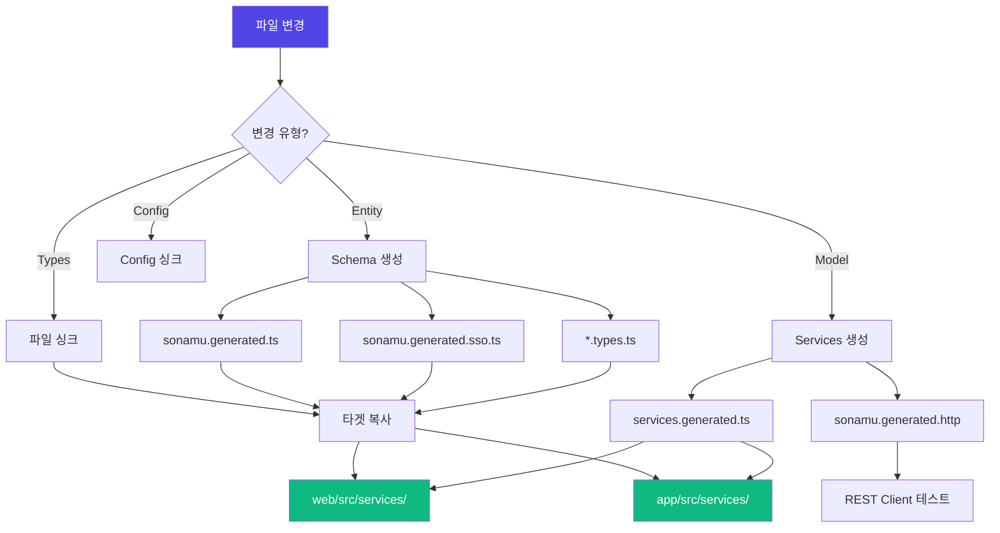

Syncer는 Sonamu의 자동 생성 시스템입니다. 파일 변경을 감지하고, 필요한 코드를 자동으로 생성하며, 타겟 프로젝트(web, app 등)에 동기화합니다.

## Syncer란?

<CardGroup cols={2}>
  <Card title="파일 변경 감지" icon="magnifying-glass">
    Entity, Model, Types 파일 변경 추적 Checksum 기반 효율적 감지
  </Card>
  <Card title="자동 코드 생성" icon="wand-magic-sparkles">
    타입, 스키마, API 클라이언트 생성 Template 기반 생성
  </Card>
  <Card title="HMR 지원" icon="bolt">
    개발 중 실시간 반영 파일 무효화 및 재로드
  </Card>
  <Card title="멀티 타겟 동기화" icon="arrows-turn-to-dots">
    web, app 등 여러 프로젝트 동기화 자동 파일 복사
  </Card>
</CardGroup>

## Syncer의 동작 흐름



## 감시 대상 파일

Syncer가 변경을 추적하는 파일 패턴입니다:

| 파일 타입         | 패턴                                  | 용도               |
| ----------------- | ------------------------------------- | ------------------ |
| **Entity**        | `src/application/**/*.entity.json`    | 데이터 구조 정의   |
| **Types**         | `src/application/**/*.types.ts`       | 타입 정의          |
| **Model**         | `src/application/**/*.model.ts`       | 비즈니스 로직      |
| **Frame**         | `src/application/**/*.frame.ts`       | 프레임 로직        |
| **Functions**     | `src/application/**/*.functions.ts`   | 유틸 함수          |
| **Generated**     | `src/application/sonamu.generated.ts` | 생성된 베이스 파일 |
| **Config**        | `src/sonamu.config.ts`                | Sonamu 설정        |
| **Workflow**      | `src/application/**/*.workflow.ts`    | 워크플로우 정의    |
| **i18n**          | `src/i18n/**/!(sd.generated).ts`      | 다국어 소스 파일   |
| **i18nGenerated** | `src/i18n/**/sd.generated.ts`         | 다국어 산출물 파일 |

<Info>**파일 패턴**: `file-patterns.ts`에서 관리되며, checksum으로 변경 감지</Info>

## 수동 동기화

개발 서버 없이 수동으로 동기화할 수 있습니다.

```bash
# 전체 동기화
pnpm sonamu sync

# 변경된 파일만 동기화
pnpm sonamu sync --check
```

**실행 결과**:

```
🔄 Syncing files...
✅ Generated: sonamu.generated.ts
✅ Generated: sonamu.generated.sso.ts
✅ Copied: web/src/services/user/user.types.ts
✅ Copied: web/src/services/sonamu.generated.ts
✅ Generated: services.generated.ts
✅ Generated: sonamu.generated.http
━━━━━━━━━━━━━━━━━━━━━━━━━━━━━━━━
  All files are synced!
━━━━━━━━━━━━━━━━━━━━━━━━━━━━━━━━
```

## 자동 동기화 (HMR)

개발 서버 실행 중에는 파일 변경이 자동으로 감지되고 동기화됩니다.

```bash
# 개발 서버 시작
pnpm dev

# 파일 변경하면 자동 동기화
# - user.entity.json 변경 → 타입 재생성
# - user.model.ts 변경 → API 클라이언트 재생성
```

**HMR 로그 예시**:

```
🔄 Invalidated:
- src/application/user/user.model.ts (with 5 APIs)
- src/application/user/user.types.ts

✅ Generated: sonamu.generated.sso.ts
✅ Copied: web/src/services/user/user.types.ts
✅ Generated: services.generated.ts

✨ HMR completed in 234ms
```

## Syncer 이벤트

Syncer는 EventEmitter로 이벤트를 발생시킵니다.

```typescript
import { Sonamu } from "sonamu";

// HMR 완료 이벤트 구독
Sonamu.syncer.eventEmitter.on("onHMRCompleted", () => {
  console.log("✅ HMR completed!");
  // 추가 작업 수행...
});
```

**이벤트 종류**:

| 이벤트           | 발생 시점   | 사용 예시        |
| ---------------- | ----------- | ---------------- |
| `onHMRCompleted` | HMR 완료 시 | 후속 작업 트리거 |

## Syncer 액션

파일 변경 유형에 따라 다른 액션이 실행됩니다.

### 1. Entity 변경 (`handleTruthSourceChanges`)

Entity 파일이 변경되면 스키마를 재생성합니다.

**트리거**: `*.entity.json` 파일 변경

**액션**:

1. EntityManager 재로드
2. 새 Entity면 `*.types.ts` 생성
3. 스키마 파일 생성:
   - `sonamu.generated.ts`
   - `sonamu.generated.sso.ts`
4. 타겟에 파일 복사

```typescript
// Syncer 내부 로직
async handleTruthSourceChanges(diffGroups, diffTypes) {
  await EntityManager.reload();

  // 새 Entity 타입 파일 생성
  if (entity.parentId === undefined && !(await exists(typeFilePath))) {
    await generateTemplate("init_types", { entityId });
  }

  // 스키마 생성
  await SyncerActions.actionGenerateSchemas();
}
```

### 2. Types/Functions/Generated 변경

타입 파일이 변경되면 타겟에 복사합니다.

**트리거**: `*.types.ts`, `*.functions.ts`, `*.generated.ts` 변경

**액션**:

1. 변경된 파일 목록 수집
2. 각 타겟(`web`, `app`)에 복사
3. `sonamu` import를 `./sonamu.shared`로 변경

```typescript
// 복사 시 import 변경
// Before (api)
import { BaseModelClass } from "sonamu";

// After (web/app)
import { BaseModelClass } from "./sonamu.shared";
```

<Info>
  **sonamu.shared.ts**: web/app에는 sonamu 패키지가 없으므로, 공통 유틸리티를 shared 파일로
  제공합니다.
</Info>

### 3. Model/Frame 변경

Model 파일이 변경되면 API 클라이언트를 재생성합니다.

**트리거**: `*.model.ts`, `*.frame.ts` 변경

**액션**:

1. Model, Types, APIs 재로드
2. API 클라이언트 생성 (`services.generated.ts`)
3. HTTP 테스트 파일 생성 (`sonamu.generated.http`)
4. SSR 파일 재생성 (`queries.generated.ts`, `entry-server.generated.tsx`)

```typescript
async handleImplementationChanges(diffGroups) {
  // 모듈 재로드
  await this.autoloadModels();
  await this.autoloadTypes();
  await this.autoloadApis();

  // 서비스 생성
  await SyncerActions.actionGenerateServices(params);
  await SyncerActions.actionGenerateHttps();

  // SSR 파일 재생성
  await SyncerActions.actionGenerateSsr();
}
```

### 4. Config 변경

설정 파일이 변경되면 환경 변수를 동기화합니다.

**트리거**: `sonamu.config.ts` 변경

**액션**:

1. `.sonamu.env` 파일 생성/업데이트
2. 각 타겟에 복사

```env title="web/.sonamu.env"
API_HOST=localhost
API_PORT=3000
```

### 5. Workflow 변경

워크플로우 파일이 변경되면 재로드합니다.

**트리거**: `*.workflow.ts` 변경

**액션**: 워크플로우 재로드 및 동기화

### 6. i18n 변경

다국어 파일이 변경되면 SD 파일을 재생성합니다.

**트리거**: `src/i18n/**/!(sd.generated).ts` 변경

**액션**:

1. Locale 파일을 타겟에 복사
2. `sd.generated.ts` 생성 (api, web, app)

### 7. SSR 설정 변경

SSR 라우트 설정 파일이 변경되면 즉시 재로드합니다.

**트리거**: `src/ssr/**/*.ts` 변경

**액션**:

1. 변경된 파일 무효화 (HMR)
2. SSR 라우트 전체 재로드 (`autoloadSSRRoutes`)
3. HMR 완료 이벤트 발생

<Info>
  SSR 설정 변경은 체크섬 기반 동기화 대상이 아닙니다. Watcher가 직접 감지하여 별도의 경로로
  처리합니다.
</Info>

## Checksum 기반 변경 감지

Syncer는 파일의 checksum을 저장하여 효율적으로 변경을 감지합니다.

```json title="sonamu.lock"
[
  { "path": "src/application/user/user.entity.json", "checksum": "a7f4b3e2c1d5..." },
  { "path": "src/application/user/user.types.ts", "checksum": "c3d1e4f5a6b7..." },
  { "path": "src/application/user/user.model.ts", "checksum": "e5f6a7b8c9d0..." }
]
```

**작동 방식**:

1. 파일 내용의 SHA-1 해시 계산
2. 저장된 checksum과 비교
3. 다르면 변경으로 판단
4. 동기화 후 checksum 갱신

**장점**:

- 빠른 변경 감지 (파일 내용 비교 불필요)
- 정확한 변경 추적 (timestamp 영향 없음)
- 여러 파일 동시 변경 처리

## Syncer API

Syncer는 프로그래밍 방식으로 사용할 수 있습니다.

### 수동 동기화

```typescript
import { Sonamu } from "sonamu";

// 전체 동기화
await Sonamu.syncer.sync();

// 특정 파일 동기화
await Sonamu.syncer.syncFromWatcher("change", "/path/to/user.entity.json");
```

### 템플릿 생성

```typescript
// Entity 생성
await Sonamu.syncer.createEntity({
  entityId: "User",
  table: "users",
  props: [
    { name: "id", type: "integer" },
    { name: "email", type: "string" },
  ],
  subsets: {
    A: ["id", "email"],
  },
  enums: {},
  indexes: [],
});

// 템플릿 생성
await Sonamu.syncer.generateTemplate("model", { entityId: "User" }, { overwrite: false });

// 커스텀 템플릿 렌더링
const files = await Sonamu.syncer.renderTemplate("view_list", { entityId: "User" });
```

### 모듈 로드

```typescript
// 타입 로드
await Sonamu.syncer.autoloadTypes();
console.log(Sonamu.syncer.types);

// Model 로드
await Sonamu.syncer.autoloadModels();
console.log(Sonamu.syncer.models);

// API 로드
await Sonamu.syncer.autoloadApis();
console.log(Sonamu.syncer.apis);

// Workflow 로드
await Sonamu.syncer.autoloadWorkflows();
console.log(Sonamu.syncer.workflows);
```

## Syncer 설정

`sonamu.config.ts`에서 Syncer 동작을 설정할 수 있습니다.

```typescript title="api/src/sonamu.config.ts"
export default {
  sync: {
    // 동기화 타겟 프로젝트
    targets: ["web", "app"],
  },

  // API 서버 설정 (환경 변수 생성에 사용)
  server: {
    baseUrl: "http://localhost:3000",
    listen: {
      host: "localhost",
      port: 3000,
    },
  },
};
```

## 개발 워크플로우

Syncer를 활용한 일반적인 개발 흐름입니다:

<Steps>
<Step title="개발 서버 시작">
```bash
pnpm dev
```

Syncer가 파일 변경을 감시합니다.

</Step>

<Step title="Entity 정의">
Sonamu UI에서 Entity를 정의하거나 `.entity.json` 파일을 수정합니다.

**자동 실행**:

- `*.types.ts` 생성
- `sonamu.generated.ts` 갱신
- `sonamu.generated.sso.ts` 갱신
- 타겟에 파일 복사
  </Step>

<Step title="Model 작성">
비즈니스 로직을 Model에 작성하고 `@api` 데코레이터를 추가합니다.

**자동 실행**:

- `services.generated.ts` 갱신
- `sonamu.generated.http` 갱신
- SSR 파일 갱신
  </Step>

<Step title="프론트엔드 개발">
생성된 API 클라이언트와 Types를 사용하여 UI를 개발합니다.

```typescript
import { useUsers } from "@/services/services.generated";
import type { User } from "@/services/user/user.types";

function UserList() {
  const { data } = useUsers();
  // ...
}
```

</Step>

<Step title="실시간 반영">
Model이나 Entity를 수정하면 HMR로 즉시 반영됩니다.

브라우저 새로고침 없이 변경사항 확인 가능!

</Step>
</Steps>

## 문제 해결

### Syncer가 동작하지 않을 때

<AccordionGroup>
  <Accordion title="파일이 생성되지 않음">
    **확인 사항**: 1. 개발 서버가 실행 중인지 확인 2. 파일이 감시 대상 패턴에 포함되는지 확인 3.
    Checksum 파일 삭제 후 재시도 ```bash rm sonamu.lock pnpm sonamu sync ```
  </Accordion>

<Accordion title="타겟에 파일이 복사되지 않음">
  **확인 사항**: 1. `sonamu.config.ts`의 `sync.targets` 확인 2. 타겟 디렉토리 존재 확인 3. 타겟
  디렉토리에 `src/services/` 디렉토리 생성 ```bash mkdir -p web/src/services mkdir -p
  app/src/services ```
</Accordion>

<Accordion title="HMR이 느림">
  **최적화 방법**: 1. Node.js 최신 버전 사용 (v22+) 2. SSD 사용 (HDD는 느림) 3. 불필요한 파일 제외
  4. TypeScript 프로젝트 분리 (monorepo)
</Accordion>

  <Accordion title="import 에러 발생">
    **원인**: `sonamu` import가 `./sonamu.shared`로 변환되지 않음 **해결**: ```bash # 강제 재동기화
    pnpm sonamu sync --force ```
  </Accordion>
</AccordionGroup>

## 다음 단계

<CardGroup cols={2}>
  <Card
    title="When Files Regenerate"
    icon="clock"
    href="/ko/core-concepts/auto-generation/when-files-regenerate"
  >
    파일 재생성 시점 상세 가이드
  </Card>
  <Card
    title="Customizing Generated Code"
    icon="pen-to-square"
    href="/ko/core-concepts/auto-generation/customizing-generated-code"
  >
    생성된 코드 커스터마이징 방법
  </Card>
  <Card title="Templates" icon="file-code" href="/ko/advanced/templates/creating-templates">
    커스텀 템플릿 만들기
  </Card>
  <Card title="HMR System" icon="bolt" href="/ko/advanced/hmr/understanding-hmr">
    HMR 시스템 깊이 이해하기
  </Card>
</CardGroup>
