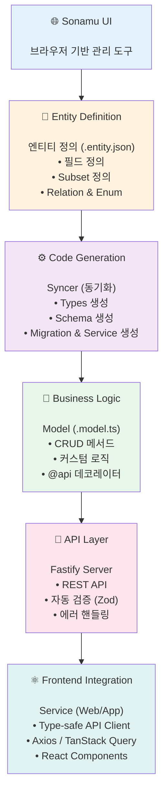
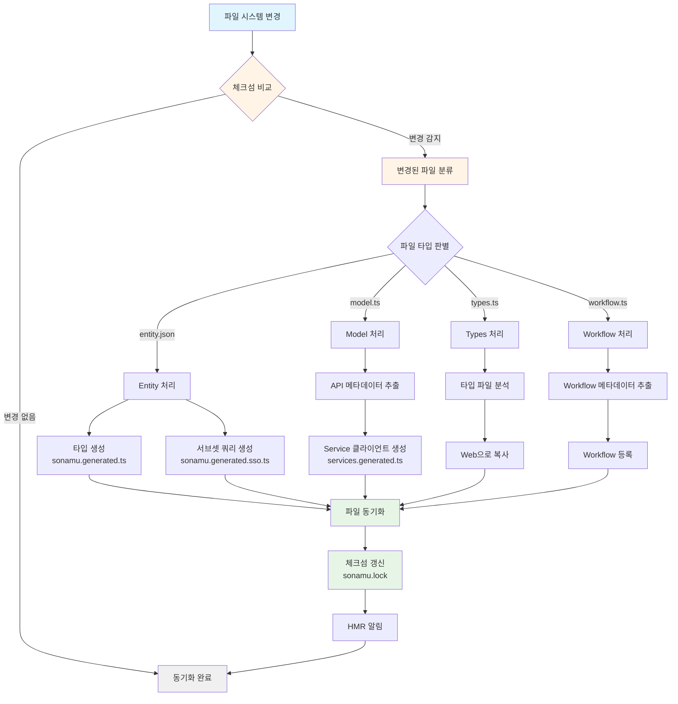

Sonamu는 **엔티티 중심의 풀스택 개발**을 가능하게 하는 TypeScript 프레임워크입니다. 이 가이드에서는 Sonamu의 전체 아키텍처와 핵심 작동 원리를 알아봅니다.

## Sonamu의 철학

Sonamu는 다음 원칙을 기반으로 설계되었습니다:

<Steps>
<Step title="1. Entity First (엔티티 우선)">
모든 개발은 **엔티티 정의**에서 시작합니다. 데이터 구조를 먼저 정의하면, 나머지는 자동으로 생성됩니다.
</Step>

<Step title="2. Type Safety (타입 안전성)">
백엔드부터 프론트엔드까지 **완전한 타입 안전성**을 보장합니다. 컴파일 타임에 오류를 발견할 수 있습니다.
</Step>

<Step title="3. Code Generation (코드 자동 생성)">
반복적인 보일러플레이트 코드를 **자동으로 생성**합니다. 개발자는 비즈니스 로직에만 집중할 수 있습니다.
</Step>

<Step title="4. Developer Experience (개발자 경험)">
**HMR**, **타입 추론**, **Sonamu UI** 등으로 뛰어난 개발 경험을 제공합니다.
</Step>
</Steps>

## 전체 아키텍처

Sonamu는 6개의 레이어가 자동으로 연결되어 동작합니다:



## 핵심 구성 요소

### 1. Entity (엔티티)

**엔티티**는 Sonamu의 모든 것의 시작점입니다.

```json title="user.entity.json"
{
  "entityId": "User",
  "tableName": "users",
  "title": "사용자",
  "properties": [
    {
      "name": "id",
      "type": "int",
      "isPrimary": true
    },
    {
      "name": "email",
      "type": "varchar"
    },
    {
      "name": "name",
      "type": "varchar"
    }
  ],
  "subsets": {
    "A": ["id", "email", "name", "created_at"],
    "C": ["id", "email", "name"]
  }
}
```

<Check>
**엔티티 정의의 역할**
- 데이터베이스 스키마의 소스
- TypeScript 타입 생성의 기반
- API 인터페이스의 정의
- 프론트엔드 타입의 기준
</Check>

### 2. Type System (타입 시스템)

엔티티 정의로부터 **3가지 타입 파일**이 자동 생성됩니다:

<CodeGroup>
```typescript title="user.types.ts (엔티티별 타입)"
// 자동 생성 + 확장 가능
import { z } from "zod";
import { UserBaseSchema } from "../sonamu.generated";

// Base 타입 (자동 생성)
export type User = z.infer<typeof UserBaseSchema>;

// 커스텀 타입 (직접 작성 가능)
export const UserSaveParams = UserBaseSchema.partial({
  id: true,
  created_at: true,
});
export type UserSaveParams = z.infer<typeof UserSaveParams>;
```

```typescript title="sonamu.generated.ts (전체 Base 스키마)"
// 자동 생성 - 수정 금지!
export const UserBaseSchema = z.object({
  id: z.number(),
  email: z.string(),
  name: z.string(),
  created_at: z.date(),
});

export const UserSubsetKey = z.enum(["A", "C"]);
export type UserSubsetKey = z.infer<typeof UserSubsetKey>;

export type UserSubsetMapping = {
  A: User;
  C: Pick<User, "id" | "email" | "name">;
};
```

```typescript title="sonamu.generated.sso.ts (쿼리 정의)"
// 자동 생성 - 수정 금지!
export const userSubsetQueries = {
  A: `SELECT * FROM users`,
  C: `SELECT id, email, name FROM users`,
};
```
</CodeGroup>

<Note>
**타입 파일 3종 세트**
1. `{entity}.types.ts` - 엔티티별 타입 (확장 가능)
2. `sonamu.generated.ts` - 전체 Base 스키마 (자동 생성)
3. `sonamu.generated.sso.ts` - Subset 쿼리 (자동 생성)
</Note>

### 3. Model (비즈니스 로직)

**Model**은 엔티티의 비즈니스 로직을 담당합니다.

```typescript title="user.model.ts"
import { api, BaseModelClass } from "sonamu";
import type { UserSubsetKey, UserSubsetMapping } from "../sonamu.generated";
import { userSubsetQueries } from "../sonamu.generated.sso";

class UserModelClass extends BaseModelClass<
  UserSubsetKey,
  UserSubsetMapping,
  typeof userSubsetQueries
> {
  constructor() {
    super("User", userSubsetQueries);
  }

  // CRUD API
  @api({ httpMethod: "GET", clients: ["axios", "tanstack-query"] })
  async findById<T extends UserSubsetKey>(
    subset: T,
    id: number,
  ): Promise<UserSubsetMapping[T]> {
    const user = await this.db().where("id", id).first();
    return user;
  }

  // 커스텀 비즈니스 로직
  @api({ httpMethod: "POST", clients: ["axios"] })
  async changePassword(userId: number, newPassword: string): Promise<void> {
    await this.db()
      .where("id", userId)
      .update({ password: await this.hashPassword(newPassword) });
  }

  private async hashPassword(password: string): Promise<string> {
    // 비밀번호 해싱 로직
    return password;
  }
}

export const UserModel = new UserModelClass();
```

<Check>
**Model의 특징**
- `@api` 데코레이터로 **자동 REST API 생성**
- `BaseModelClass` 상속으로 **기본 CRUD 메서드** 제공
- **Puri 쿼리 빌더**로 타입 안전한 DB 쿼리
- **비즈니스 로직**에만 집중 가능
</Check>

### 4. Syncer (동기화 시스템)

**Syncer**는 Sonamu의 핵심 엔진입니다. 파일 변경을 감지하고 자동으로 코드를 생성합니다.



```typescript
// Syncer의 주요 역할

1. 파일 변경 감지 (Checksum 기반)
   - entity.json 변경 → Types 재생성
   - model.ts 변경 → Service 재생성
   - types.ts 변경 → Web으로 복사

2. 코드 자동 생성
   - sonamu.generated.ts
   - sonamu.generated.sso.ts
   - {Entity}Service.ts (프론트엔드)

3. 파일 동기화
   - api/src/application → web/src/services
   - 타입 파일 복사
   - sonamu.shared.ts 배포

4. HMR 트리거
   - 변경된 모듈 무효화
   - API 서버 자동 재시작
```

<Info>
**Syncer 동작 시점**
- **자동**: `pnpm dev` 실행 중 파일 변경 시 (HMR)
- **수동**: `pnpm sync` 명령어 실행 시
</Info>

### 5. API Layer (REST API)

Model의 `@api` 데코레이터가 **자동으로 REST API**를 생성합니다.

```typescript
// Model 메서드
@api({ httpMethod: "GET", clients: ["axios"] })
async findById(subset: UserSubsetKey, id: number): Promise<User> {
  // ...
}

// ↓ 자동 변환

// REST API 엔드포인트
GET /api/users/:id?subset=A

// Request
curl http://localhost:34900/api/users/1?subset=A

// Response
{
  "id": 1,
  "email": "user@example.com",
  "name": "홍길동",
  "created_at": "2025-01-06T12:00:00Z"
}
```

<Check>
**자동 생성되는 것들**
- ✅ REST API 라우트
- ✅ 요청 파라미터 검증 (Zod)
- ✅ 응답 타입
- ✅ 에러 핸들링
- ✅ API 문서 (sonamu.generated.http)
</Check>

### 6. Frontend Service (프론트엔드 통합)

Model의 API는 **자동으로 프론트엔드 Service**로 생성됩니다.

```typescript title="web/src/services/UserService.ts (자동 생성)"
export class UserService {
  static async findById(subset: UserSubsetKey, id: number): Promise<User> {
    const res = await axios.get(`/api/users/${id}`, {
      params: { subset },
    });
    return res.data;
  }

  static async changePassword(
    userId: number,
    newPassword: string,
  ): Promise<void> {
    await axios.post("/api/users/changePassword", {
      userId,
      newPassword,
    });
  }
}
```

<Check>
**타입 안전성**
백엔드의 타입이 프론트엔드에 그대로 동기화되어, 타입 불일치 오류를 **컴파일 타임**에 발견할 수 있습니다!
</Check>

## 개발 플로우

실제 개발 시 Sonamu가 어떻게 작동하는지 살펴봅시다:

<Steps>
<Step title="1. 엔티티 정의 (Sonamu UI)">
```json
{
  "entityId": "Post",
  "properties": [
    { "name": "id", "type": "int", "isPrimary": true },
    { "name": "title", "type": "varchar" }
  ]
}
```
**저장 시 자동 생성:**
- `post.types.ts`
- `sonamu.generated.ts` 업데이트
</Step>

<Step title="2. 마이그레이션 (Migration 탭)">
```sql
CREATE TABLE posts (
  id SERIAL PRIMARY KEY,
  title VARCHAR(255) NOT NULL
);
```
**실행 시:**
- 데이터베이스에 테이블 생성
</Step>

<Step title="3. Model 작성 (직접 또는 스캐폴딩)">
```typescript
@api({ httpMethod: "GET" })
async findById(id: number): Promise<Post> {
  return await this.db().where("id", id).first();
}
```
**저장 시 자동 생성:**
- REST API: `GET /api/posts/:id`
- `PostService.ts` (프론트엔드)
- `sonamu.generated.http` 업데이트
</Step>

<Step title="4. 프론트엔드 사용">
```tsx
// 타입 안전하게 API 호출
const post = await PostService.findById(1);
console.log(post.title); // ✅ 타입 체크
console.log(post.invalid); // ❌ 컴파일 에러!
```
**타입 안전성:**
- 백엔드 타입 변경 시 프론트엔드에서 즉시 오류 감지
</Step>
</Steps>

<Frame caption="Development Flow"><video muted loop playsInline controls className="w-full rounded-xl" preload="metadata" src="https://cf.cartanova.ai/sonamu-docs/introduction1.mp4"></video></Frame>

## HMR (Hot Module Replacement)

Sonamu는 **강력한 HMR 시스템**을 제공합니다.

### HMR 작동 방식

```typescript
// 1. 파일 변경 감지
user.model.ts 수정 → Watcher 감지

// 2. 모듈 무효화
hmr-hook이 의존성 그래프 분석
user.model.ts와 의존 모듈들 invalidate

// 3. 재생성 (Syncer)
- services.generated.ts 재생성 (프론트엔드)
- sonamu.generated.ts 업데이트 (타입)
- API 라우트 재등록

// 4. 서버 재시작
graceful shutdown → reload
```

<Check>
**HMR의 이점**
- ✅ **빠른 피드백** - 코드 변경 후 1-2초 내 반영
- ✅ **상태 유지** - 데이터베이스 연결 등 유지
- ✅ **자동 동기화** - 프론트엔드 Service 자동 업데이트
</Check>

<Frame caption="HMR in Action">
<video muted loop playsInline controls className="w-full rounded-xl" preload="metadata" src="/images/introduction3.mp4"></video>
</Frame>

## 자동 생성 메커니즘

Sonamu가 자동으로 생성하는 것들을 정리해봅시다:

### 엔티티 정의 변경 시

```
user.entity.json 수정
↓
자동 생성:
✅ user.types.ts (타입 정의)
✅ sonamu.generated.ts (Base 스키마)
✅ sonamu.generated.sso.ts (Subset 쿼리)
✅ migration SQL (테이블 변경)
```

### Model 파일 변경 시

```
user.model.ts 수정
↓
자동 생성:
✅ UserService.ts (프론트엔드)
✅ services.generated.ts (Service 통합)
✅ sonamu.generated.http (API 문서)
✅ REST API 라우트 재등록
```

### Types 파일 변경 시

```
user.types.ts 수정
↓
자동 동기화:
✅ web/src/services/user.types.ts (복사)
✅ 프론트엔드에서 즉시 사용 가능
```

<Warning>
**절대 수정하면 안 되는 파일**
- `sonamu.generated.ts` - 다음 sync 시 덮어씌워짐
- `{Entity}Service.ts` - 다음 sync 시 덮어씌워짐
- `sonamu.generated.sso.ts` - 다음 sync 시 덮어씌워짐

이 파일들은 항상 자동으로 생성되므로 직접 수정하지 마세요!
</Warning>

## 타입 안전성의 흐름

Sonamu의 **End-to-End 타입 안전성**을 시각화하면:

```typescript
// 1. Entity 정의
{
  "name": "email",
  "type": "varchar"
}

↓

// 2. 타입 생성 (자동)
type User = {
  email: string;
}

↓

// 3. Model 메서드 (타입 안전)
async findByEmail(email: string): Promise<User> {
  return await this.db().where("email", email).first();
}

↓

// 4. REST API (자동 생성, 타입 안전)
GET /api/users/email/:email
Response: User

↓

// 5. Frontend Service (자동 생성, 타입 안전)
static async findByEmail(email: string): Promise<User> {
  const res = await axios.get(`/api/users/email/${email}`);
  return res.data; // 타입: User
}

↓

// 6. React Component (타입 안전)
const user = await UserService.findByEmail("test@example.com");
console.log(user.email); // ✅ 타입 체크
console.log(user.invalid); // ❌ 컴파일 에러!
```

<Check>
**타입 안전성 보장**
1. 엔티티 정의 → 타입 생성
2. Model → API 타입 추론
3. API → Service 타입 동기화
4. Service → UI 타입 체크

어느 단계에서든 타입이 변경되면, 전체 체인에 반영되어 컴파일 타임에 오류를 발견합니다!
</Check>

## Sonamu의 주요 장점

### 1. 개발 속도 향상

```
전통적인 방법:
1. 데이터베이스 테이블 설계
2. Migration 작성
3. 백엔드 타입 정의
4. API 컨트롤러 작성
5. API 라우트 등록
6. 프론트엔드 타입 정의
7. API 클라이언트 작성
⏱️ 총 소요 시간: 2-3시간

Sonamu 방법:
1. 엔티티 정의 (Sonamu UI)
2. 스캐폴딩 (Model 자동 생성)
⏱️ 총 소요 시간: 10-15분

✅ 약 90% 시간 단축!
```

### 2. 타입 안전성

```typescript
// ❌ 전통적인 방법: 런타임 에러
const user = await fetch("/api/users/1").then(r => r.json());
console.log(user.eamil); // 오타! 런타임에만 발견 ⚠️

// ✅ Sonamu: 컴파일 에러
const user = await UserService.findById("A", 1);
console.log(user.eamil); // 컴파일 에러! 즉시 발견 ✅
```

### 3. 유지보수성

```typescript
// 엔티티 변경: email → username
// ❌ 전통적인 방법:
// 1. DB Migration 작성
// 2. 백엔드 타입 수정
// 3. API 수정
// 4. 프론트엔드 타입 수정
// 5. API 호출부 전부 수정
// ⚠️ 누락된 곳은 런타임 에러!

// ✅ Sonamu:
// 1. entity.json에서 필드명 변경
// 2. Migration 자동 생성
// 3. 모든 타입 자동 업데이트
// 4. 컴파일 에러로 수정 필요한 곳 즉시 표시
// ✅ 빠뜨린 곳 없이 안전하게 변경!
```

### 4. 일관성

```typescript
// ✅ Sonamu는 코드 스타일이 자동으로 일관됩니다

// 모든 Service가 동일한 패턴
UserService.findById(...)
PostService.findById(...)
CommentService.findById(...)

// 모든 타입이 동일한 구조
type User = z.infer<typeof UserBaseSchema>;
type Post = z.infer<typeof PostBaseSchema>;
type Comment = z.infer<typeof CommentBaseSchema>;
```

## 제약사항과 트레이드오프

Sonamu의 강력한 기능은 일부 제약사항을 동반합니다:

<Warning>
**알아두어야 할 제약사항**

1. **학습 곡선**: Sonamu의 개념과 규칙을 이해해야 합니다
2. **자동 생성 파일 수정 불가**: 수동 수정 시 덮어씌워집니다
3. **엔티티 중심 설계 필수**: Sonamu 방식을 따라야 합니다
4. **복잡한 쿼리**: 매우 복잡한 경우 Raw SQL 사용 필요
</Warning>

<Check>
**하지만 장점이 훨씬 큽니다**

✅ 개발 속도 향상 (90% 시간 단축)
✅ 타입 안전성 보장
✅ 유지보수성 향상
✅ 코드 일관성
✅ 팀 생산성 향상
</Check>

## 다음 단계

Sonamu의 작동 원리를 이해했다면, 이제 각 구성 요소를 자세히 알아보세요:

<CardGroup cols={2}>
  <Card title="엔티티 정의하기" icon="database" href="/ko/core-concepts/entity/defining-entities">
    엔티티의 구조와 설정 옵션을 자세히 알아보세요.
  </Card>
  <Card title="Model 이해하기" icon="code" href="/ko/core-concepts/model/what-is-model">
    Model의 역할과 비즈니스 로직 작성 방법을 배워보세요.
  </Card>
  <Card title="자동 생성 메커니즘" icon="wand-magic-sparkles" href="/ko/core-concepts/auto-generation/what-gets-generated">
    어떤 파일들이 자동으로 생성되는지 알아보세요.
  </Card>
  <Card title="타입 시스템" icon="shield" href="/ko/core-concepts/type-system/entity-types">
    Sonamu의 타입 안전성이 어떻게 작동하는지 이해하세요.
  </Card>
</CardGroup>
