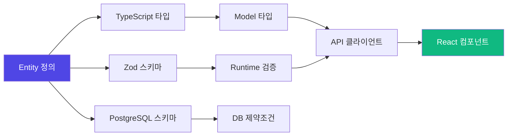

Sonamu는 Entity 정의 하나로 클라이언트부터 서버, 데이터베이스까지 완벽한 타입 안전성을 제공합니다. 이 문서는 타입이 어떻게 전체 스택을 관통하는지 설명합니다.

## 타입 흐름 개요



<CardGroup cols={2}>
  <Card title="컴파일 타임" icon="code">
    TypeScript로 타입 체크 개발 중 에러 방지
  </Card>
  <Card title="런타임" icon="play">
    Zod로 실제 데이터 검증 잘못된 데이터 차단
  </Card>
  <Card title="데이터베이스" icon="database">
    PostgreSQL 제약조건 데이터 무결성 보장
  </Card>
  <Card title="API 경계" icon="arrows-left-right">
    Request/Response 검증 안전한 데이터 교환
  </Card>
</CardGroup>

## 레이어별 타입 안전성

### 1. Entity → TypeScript

Entity 정의가 TypeScript 타입으로 변환됩니다.

<CodeGroup>
```json title="user.entity.json"
{
  "id": "User",
  "props": [
    { "name": "email", "type": "string", "length": 100 },
    { "name": "age", "type": "integer", "nullable": false },
    { "name": "role", "type": "enum", "id": "UserRole" }
  ],
  "enums": {
    "UserRole": {
      "admin": "관리자",
      "normal": "일반 사용자"
    }
  }
}
```

```typescript title="user.types.ts (자동 생성)"
export type User = {
  email: string;
  age: number;
  role: UserRole;
};

export type UserRole = "admin" | "normal";
```

</CodeGroup>

**타입 안전성 보장**:

```typescript
// ✅ 컴파일 성공
const user: User = {
  email: "john@test.com",
  age: 30,
  role: "admin",
};

// ❌ 컴파일 에러
const user: User = {
  email: "john@test.com",
  age: "30", // Error: Type 'string' is not assignable to type 'number'
  role: "guest", // Error: Type '"guest"' is not assignable to type 'UserRole'
};
```

### 2. Entity → Zod 스키마

Entity 정의가 Zod 스키마로 변환되어 런타임 검증을 제공합니다.

<CodeGroup>
```typescript title="user.types.ts (자동 생성)"
export const User = z.object({
  email: z.string().max(100),
  age: z.number().int(),
  role: UserRole,
});
```

```typescript title="런타임 검증"
// ✅ 검증 성공
const result = User.safeParse({
  email: "john@test.com",
  age: 30,
  role: "admin",
});
console.log(result.success); // true

// ❌ 검증 실패
const result = User.safeParse({
  email: "john@test.com",
  age: "30", // 문자열은 불가
  role: "guest", // 잘못된 역할
});
console.log(result.success); // false
console.log(result.error); // ZodError with details
```

</CodeGroup>

### 3. Entity → PostgreSQL

Entity 정의가 PostgreSQL 테이블 스키마로 변환됩니다.

<CodeGroup>
```json title="user.entity.json"
{
  "props": [
    { "name": "email", "type": "string", "length": 100 },
    { "name": "age", "type": "integer", "nullable": false }
  ],
  "indexes": [
    { "type": "unique", "columns": [{ "name": "email" }] }
  ]
}
```

```sql title="생성된 마이그레이션"
CREATE TABLE users (
  email VARCHAR(100) NOT NULL,
  age INTEGER NOT NULL,
  CONSTRAINT users_email_unique UNIQUE (email)
);
```

</CodeGroup>

**데이터베이스 제약조건**:

```sql
-- ✅ 삽입 성공
INSERT INTO users (email, age) VALUES ('john@test.com', 30);

-- ❌ 실패: NULL 불가
INSERT INTO users (email, age) VALUES ('jane@test.com', NULL);

-- ❌ 실패: UNIQUE 위반
INSERT INTO users (email, age) VALUES ('john@test.com', 25);
```

## API 레이어 타입 안전성

### Model → API Client

Model의 메서드가 타입 안전한 API 클라이언트로 변환됩니다.

<CodeGroup>
```typescript title="user.model.ts"
@api({ httpMethod: "POST" })
async save(params: UserSaveParams[]): Promise<number[]> {
  // 구현...
}
```

```typescript title="services.generated.ts (자동 생성)"
export async function saveUser(params: UserSaveParams[]): Promise<number[]> {
  const { data } = await axios.post("/user/save", { params });
  return data;
}
```

```tsx title="컴포넌트에서 사용"
import { saveUser } from "@/services/services.generated";
import type { UserSaveParams } from "@/services/user/user.types";

// ✅ 타입 안전
const params: UserSaveParams[] = [
  { email: "john@test.com", age: 30, role: "admin" },
];
await saveUser(params);

// ❌ 컴파일 에러
await saveUser([
  { email: "john@test.com", age: "30" }, // Type error
]);
```

</CodeGroup>

### Request 검증

API 요청은 Zod 스키마로 자동 검증됩니다.

```typescript title="Fastify 라우터에서"
// Sonamu가 자동으로 생성
fastify.post("/user/save", async (request, reply) => {
  // 자동 검증
  const params = UserSaveParams.array().parse(request.body.params);

  // 검증된 타입으로 안전하게 사용
  const result = await UserModel.save(params);
  return result;
});
```

**검증 실패 시**:

```json
// Request
POST /user/save
{
  "params": [
    { "email": "invalid-email", "age": "30" }
  ]
}

// Response (400 Bad Request)
{
  "error": "Validation failed",
  "issues": [
    {
      "path": ["params", 0, "email"],
      "message": "Invalid email"
    },
    {
      "path": ["params", 0, "age"],
      "message": "Expected number, received string"
    }
  ]
}
```

### Response 타입

API 응답도 타입 안전합니다.

<CodeGroup>
```typescript title="user.model.ts"
@api({ httpMethod: "GET" })
async findById(id: number): Promise<User> {
  return this.findById("A", id);
}
```

```typescript title="services.generated.ts"
export async function findUserById(id: number): Promise<User> {
  const { data } = await axios.get("/user/findById", { params: { id } });
  return data;
}
```

```tsx title="컴포넌트"
const user = await findUserById(1);
// user: User (타입 자동 추론)

console.log(user.email); // ✅ string
console.log(user.name); // ❌ Property 'name' does not exist
```

</CodeGroup>

## TanStack Query 타입 안전성

TanStack Query hooks도 완벽한 타입 안전성을 제공합니다.

<CodeGroup>
```typescript title="services.generated.ts"
export function useUserById(id: number) {
  return useQuery({
    queryKey: ["User", "findById", id],
    queryFn: () => findUserById(id),
  });
}

export function useSaveUser() {
  return useMutation({
    mutationFn: (params: UserSaveParams[]) => saveUser(params),
  });
}
```

```tsx title="컴포넌트"
function UserProfile({ userId }: { userId: number }) {
  // 타입 자동 추론
  const { data, isLoading, error } = useUserById(userId);
  // data: User | undefined
  // isLoading: boolean
  // error: Error | null

  if (isLoading) return <div>Loading...</div>;
  if (error) return <div>Error: {error.message}</div>;

  return (
    <div>
      <h1>{data.email}</h1> {/* ✅ data는 User 타입 */}
      <p>Age: {data.age}</p>
    </div>
  );
}

function UserForm() {
  const { mutate, isPending } = useSaveUser();

  const handleSubmit = (e: React.FormEvent<HTMLFormElement>) => {
    e.preventDefault();
    const formData = new FormData(e.currentTarget);

    // ✅ 타입 안전한 호출
    mutate(
      [
        {
          email: formData.get("email") as string,
          age: Number(formData.get("age")),
          role: "normal",
        },
      ],
      {
        onSuccess: (ids) => {
          // ids: number[]
          console.log("Created user IDs:", ids);
        },
      }
    );
  };

  return <form onSubmit={handleSubmit}>...</form>;
}
```

</CodeGroup>

## Subset 타입 안전성

Subset 쿼리도 완벽한 타입 추론을 제공합니다.

<CodeGroup>
```typescript title="user.model.ts"
async findMany<T extends UserSubsetKey>(
  subset: T,
  params?: UserListParams
): Promise<ListResult<UserListParams, UserSubsetMapping[T]>> {
  const { qb } = this.getSubsetQueries(subset);
  
  // subset에 따라 타입이 자동으로 결정됨
  return this.executeSubsetQuery({ subset, qb, params });
}
```

```typescript title="사용"
// 타입이 subset에 따라 자동으로 결정됨
const users = await UserModel.findMany("A", params);
// users: { rows: UserA[]; total: number }

const profiles = await UserModel.findMany("P", params);
// profiles: { rows: UserP[]; total: number }

const summaries = await UserModel.findMany("SS", params);
// summaries: { rows: UserSS[]; total: number }
```

</CodeGroup>

## 전체 스택 타입 흐름 예시

실제 CRUD 작업에서 타입이 어떻게 흐르는지 보여줍니다.

<Steps>
<Step title="1. Entity 정의">
```json title="user.entity.json"
{
  "id": "User",
  "props": [
    { "name": "email", "type": "string", "length": 100 },
    { "name": "age", "type": "integer" },
    { "name": "role", "type": "enum", "id": "UserRole" }
  ],
  "subsets": {
    "A": ["id", "email", "age", "role"]
  }
}
```

**생성**: TypeScript 타입, Zod 스키마, PostgreSQL 스키마

</Step>

<Step title="2. Model 작성">
```typescript title="user.model.ts"
class UserModelClass extends BaseModelClass<...> {
  @api({ httpMethod: "POST" })
  async save(params: UserSaveParams[]): Promise<number[]> {
    // 타입 안전한 구현
    params.forEach(p => wdb.ubRegister("users", p));
    return wdb.ubUpsert("users");
  }
}
```

**생성**: API 클라이언트, TanStack Query hooks

</Step>

<Step title="3. 프론트엔드 사용">
```tsx title="UserForm.tsx"
import { useSaveUser } from "@/services/services.generated";
import { UserSaveParams } from "@/services/user/user.types";

function UserForm() {
const { mutate } = useSaveUser();

const handleSubmit = (values: UserSaveParams) => {
mutate([values]); // ✅ 타입 체크됨
};

return <form>...</form>;
}

````

**검증**: 컴파일 타임 (TypeScript) + 런타임 (Zod)
</Step>

<Step title="4. API 요청">
```typescript
// Request (자동 직렬화)
POST /user/save
{
  "params": [
    { "email": "john@test.com", "age": 30, "role": "admin" }
  ]
}

// Zod 자동 검증
const params = UserSaveParams.array().parse(request.body.params);
````

**검증**: Zod 스키마로 런타임 검증

</Step>

<Step title="5. 데이터베이스 저장">
```sql
-- 자동 생성된 쿼리
INSERT INTO users (email, age, role)
VALUES ('john@test.com', 30, 'admin')
RETURNING id;

-- PostgreSQL 제약조건 체크
-- - email: VARCHAR(100) NOT NULL
-- - age: INTEGER NOT NULL
-- - role: CHECK (role IN ('admin', 'normal'))

````

**검증**: PostgreSQL 제약조건
</Step>

<Step title="6. 응답 반환">
```typescript
// Response
{ "data": [1] }  // number[]

// 프론트엔드에서 타입 추론
const ids = await saveUser([...]);
// ids: number[]
````

**타입 추론**: API 클라이언트가 반환 타입 보장

</Step>
</Steps>

## 타입 불일치 방지

Sonamu의 E2E 타입 안전성은 흔한 타입 불일치 문제를 방지합니다.

<AccordionGroup>
  <Accordion title="API 응답 타입 불일치">
    **문제**: API가 예상과 다른 타입 반환
    
    **Sonamu 해결**:
    ```typescript
    // Model에서 반환 타입 명시
    @api()
    async findById(id: number): Promise<User> {
      return this.findById("A", id);
    }
    
    // API 클라이언트도 같은 타입
    export async function findUserById(id: number): Promise<User> {
      // ...
    }
    
    // 타입 불일치 시 컴파일 에러
    ```
  </Accordion>
  
  <Accordion title="Request 파라미터 불일치">
    **문제**: 클라이언트가 잘못된 파라미터 전송
    
    **Sonamu 해결**:
    ```typescript
    // 동일한 타입 정의 공유
    export const UserSaveParams = z.object({...});
    
    // Model에서 사용
    async save(params: UserSaveParams[]): Promise<number[]>
    
    // API 클라이언트에서 사용
    export async function saveUser(params: UserSaveParams[]): Promise<number[]>
    
    // 서버에서 자동 검증
    const validated = UserSaveParams.array().parse(request.body.params);
    ```
  </Accordion>
  
  <Accordion title="Enum 값 불일치">
    **문제**: 하드코딩된 문자열이 Enum과 불일치
    
    **Sonamu 해결**:
    ```typescript
    // ❌ 잘못된 방법
    const role = "guest";  // 컴파일은 되지만 런타임 에러
    
    // ✅ 올바른 방법
    import { UserRole } from "./sonamu.generated";
    const role: UserRole = "admin";  // 타입 체크됨
    ```
  </Accordion>
  
  <Accordion title="Nullable 처리 누락">
    **문제**: nullable 필드를 null 체크 없이 사용
    
    **Sonamu 해결**:
    ```typescript
    type User = {
      bio: string | null;  // nullable 명시
    };
    
    // ❌ 컴파일 에러
    const length = user.bio.length;
    
    // ✅ null 체크 강제
    const length = user.bio?.length ?? 0;
    ```
  </Accordion>
</AccordionGroup>

## 타입 안전성 검증

타입 안전성이 제대로 작동하는지 확인하는 방법입니다.

### 컴파일 타임 검증

```typescript
// 타입 테스트 파일 생성
import { expectType } from "tsd";
import type { User, UserSaveParams } from "./user.types";

// 타입 체크
expectType<User>({
  id: 1,
  email: "test@test.com",
  age: 30,
  role: "admin",
});

// ❌ 이 코드는 컴파일 에러를 발생시켜야 함
expectType<User>({
  id: 1,
  email: "test@test.com",
  age: "30", // Type error
});
```

### 런타임 검증

```typescript
import { describe, it, expect } from "vitest";
import { User, UserSaveParams } from "./user.types";

describe("User type validation", () => {
  it("should validate correct user", () => {
    const result = User.safeParse({
      email: "test@test.com",
      age: 30,
      role: "admin",
    });

    expect(result.success).toBe(true);
  });

  it("should reject invalid user", () => {
    const result = User.safeParse({
      email: "invalid-email",
      age: "30",
      role: "guest",
    });

    expect(result.success).toBe(false);
  });
});
```

## 다음 단계

<CardGroup cols={2}>
  <Card
    title="Zod Validation"
    icon="shield-check"
    href="/ko/core-concepts/type-system/zod-validation"
  >
    Zod 검증 상세 가이드
  </Card>
  <Card
    title="Entity Types"
    icon="database"
    href="/ko/core-concepts/type-system/entity-types"
  >
    Entity 타입 변환 이해하기
  </Card>
  <Card
    title="Generated Types"
    icon="file-lines"
    href="/ko/core-concepts/type-system/generated-types"
  >
    생성 타입 활용하기
  </Card>
  <Card title="Testing" icon="flask" href="/ko/testing/model-testing/unit-tests">
    타입 안전한 테스트 작성하기
  </Card>
</CardGroup>
