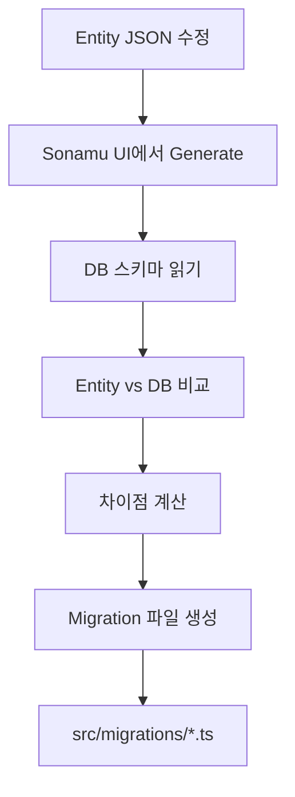
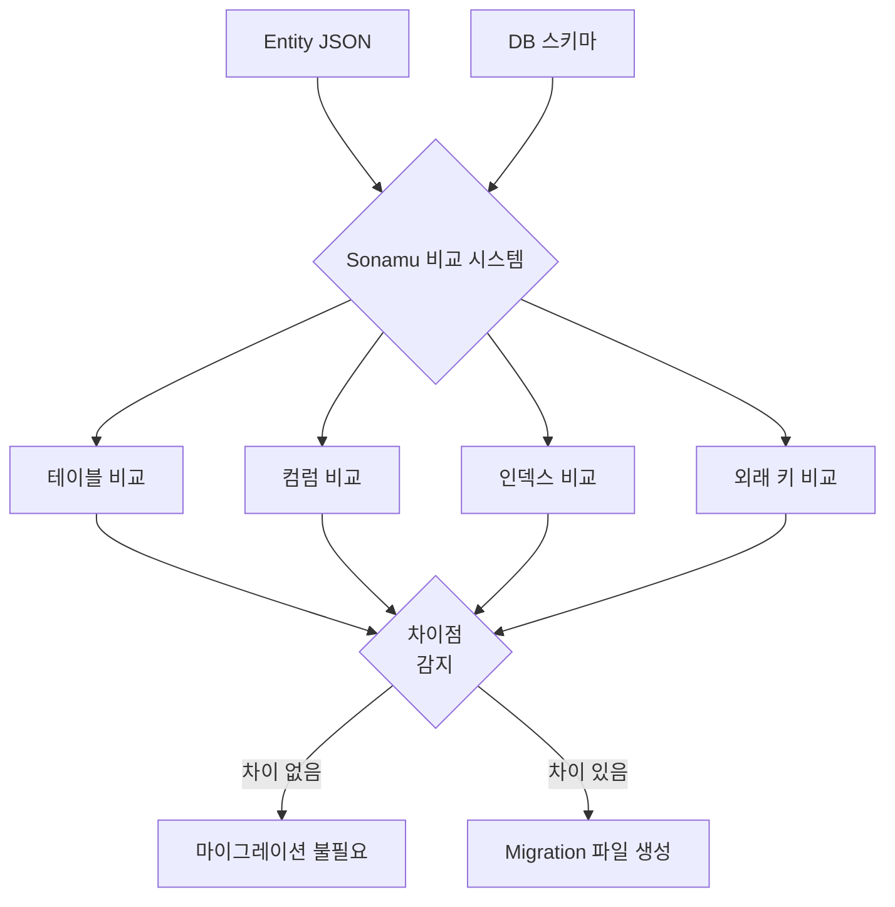

Sonamu는 Entity 정의를 기반으로 데이터베이스 마이그레이션을 **자동으로 생성**합니다.

## 마이그레이션 개요

<CardGroup cols={2}>
  <Card title="자동 생성" icon="wand-magic-sparkles">
    Entity → Migration
    
    수동 작성 불필요
  </Card>
  <Card title="버전 관리" icon="code-branch">
    타임스탬프 기반
    
    순차 실행 보장
  </Card>
  <Card title="Up/Down" icon="arrows-up-down">
    적용과 롤백
    
    양방향 지원
  </Card>
  <Card title="Knex 기반" icon="database">
    표준 Knex API
    
    호환성 보장
  </Card>
</CardGroup>

## 마이그레이션 생성 흐름



## Entity에서 Migration으로

### 1. Entity 정의

```json
// user.entity.json
{
  "id": "User",
  "table": "users",
  "props": [
    { "name": "id", "type": "integer" },
    { "name": "email", "type": "string", "length": 255 },
    { "name": "username", "type": "string", "length": 255 },
    { "name": "role", "type": "enum", "id": "UserRole" }
  ]
}
```

### 2. 자동 생성된 Migration

```typescript
// 20251209160747_create__users.ts
import type { Knex } from "knex";

export async function up(knex: Knex): Promise<void> {
  await knex.schema.createTable("users", (table) => {
    table.increments().primary();
    table.string("email", 255).notNullable();
    table.string("username", 255).notNullable();
    table.text("role").notNullable();
    
    table.unique(["email"], "users_email_unique");
  });
}

export async function down(knex: Knex): Promise<void> {
  return knex.schema.dropTable("users");
}
```

<Info>
Migration 파일명: `{타임스탬프}_{작업}_{테이블명}.ts`
- 타임스탬프: `YYYYMMDDHHmmss` 형식
- 작업: `create`, `alter`, `foreign`, `drop` 등
- 테이블명: 언더스코어 구분
</Info>

## Migration 파일 구조

### up 함수 - 변경 적용

```typescript
export async function up(knex: Knex): Promise<void> {
  // 데이터베이스에 변경 사항 적용
  await knex.schema.createTable("users", (table) => {
    // 테이블 정의
  });
}
```

### down 함수 - 변경 롤백

```typescript
export async function down(knex: Knex): Promise<void> {
  // 변경 사항 되돌리기
  return knex.schema.dropTable("users");
}
```

<Warning>
**down 함수는 필수입니다!**

롤백을 위해 반드시 up의 역작업을 정의해야 합니다.
</Warning>

## 생성되는 Migration 유형

### CREATE TABLE

```typescript
// 20251209160747_create__users.ts
export async function up(knex: Knex): Promise<void> {
  await knex.schema.createTable("users", (table) => {
    table.increments().primary();
    table.string("email", 255).notNullable();
    table.string("username", 255).notNullable();
    table.text("role").notNullable();
  });
}

export async function down(knex: Knex): Promise<void> {
  return knex.schema.dropTable("users");
}
```

### ALTER TABLE - 컬럼 추가

```typescript
// 20251211150026_alter_departments_add1.ts
export async function up(knex: Knex): Promise<void> {
  await knex.schema.alterTable("departments", (table) => {
    table.string("code", 10).notNullable();
  });
}

export async function down(knex: Knex): Promise<void> {
  await knex.schema.alterTable("departments", (table) => {
    table.dropColumns("code");
  });
}
```

### ALTER TABLE - 컬럼 삭제

```typescript
// 20251216132209_alter_projects_drop1.ts
export async function up(knex: Knex): Promise<void> {
  await knex.schema.alterTable("projects", (table) => {
    table.dropColumns("old_field");
  });
}

export async function down(knex: Knex): Promise<void> {
  await knex.schema.alterTable("projects", (table) => {
    // 롤백: 컬럼 재추가
    table.string("old_field", 100).nullable();
  });
}
```

### FOREIGN KEY 추가

```typescript
// 20251209160751_foreign__employees__user_id_department_id.ts
export async function up(knex: Knex): Promise<void> {
  return knex.schema.alterTable("employees", (table) => {
    table
      .foreign("user_id")
      .references("users.id")
      .onUpdate("CASCADE")
      .onDelete("CASCADE");
    
    table
      .foreign("department_id")
      .references("departments.id")
      .onUpdate("CASCADE")
      .onDelete("SET NULL");
  });
}

export async function down(knex: Knex): Promise<void> {
  return knex.schema.alterTable("employees", (table) => {
    table.dropForeign(["user_id"]);
    table.dropForeign(["department_id"]);
  });
}
```

## 데이터베이스 비교

Sonamu는 현재 DB 스키마와 Entity를 비교하여 차이점을 감지합니다:

### 비교 대상

1. **테이블**: 존재 여부, 이름
2. **컬럼**: 타입, 길이, nullable, default
3. **인덱스**: unique, index, 복합 인덱스
4. **외래 키**: 참조 테이블, onUpdate, onDelete
5. **제약 조건**: CHECK, DEFAULT 등

### 차이점 감지

```typescript
// Entity: email 길이 100 → 255 변경
{
  "name": "email",
  "type": "string",
  "length": 255  // 변경됨
}

// 생성되는 Migration
export async function up(knex: Knex): Promise<void> {
  await knex.raw(
    `ALTER TABLE users ALTER COLUMN email TYPE varchar(255)`
  );
}
```



## Migration 실행 순서

### 1. 타임스탬프 기반 정렬

```
20251209160740_create__companies.ts       (1st)
20251209160741_create__departments.ts     (2nd)
20251209160742_create__employees.ts       (3rd)
20251209160750_foreign__departments.ts    (4th)
20251209160751_foreign__employees.ts      (5th)
```

### 2. 의존성 고려

```typescript
// 올바른 순서
1. CREATE TABLE companies
2. CREATE TABLE departments (company_id 있지만 FK는 아직)
3. CREATE TABLE employees
4. ADD FOREIGN KEY departments.company_id → companies.id
5. ADD FOREIGN KEY employees.department_id → departments.id
```

<Warning>
**외래 키는 별도 Migration으로 생성됩니다!**

CREATE TABLE에서는 컬럼만 생성하고, 
외래 키 제약은 나중에 별도 Migration으로 추가됩니다.
</Warning>

## 실행 추적

### knex_migrations 테이블

Knex는 실행된 Migration을 추적합니다:

```sql
SELECT * FROM knex_migrations;
```

| id | name | batch | migration_time |
|----|------|-------|----------------|
| 1 | 20251209160740_create__companies.ts | 1 | 2025-12-09 16:10:00 |
| 2 | 20251209160741_create__departments.ts | 1 | 2025-12-09 16:10:00 |
| 3 | 20251209160742_create__employees.ts | 1 | 2025-12-09 16:10:00 |

- **batch**: 함께 실행된 그룹 (롤백 단위)
- **migration_time**: 실행 시간

## Entity 타입별 Migration

### 기본 타입

| Entity Type | DB Type | Migration |
|-------------|---------|-----------|
| `string` | `varchar(n)` | `table.string(name, length)` |
| `integer` | `integer` | `table.integer(name)` |
| `boolean` | `boolean` | `table.boolean(name)` |
| `date` | `timestamptz` | `table.timestamp(name, { useTz: true })` |
| `json` | `jsonb` | `table.jsonb(name)` |
| `uuid` | `uuid` | `table.uuid(name)` |

### 관계 타입

```json
// Entity
{
  "type": "relation",
  "name": "user",
  "with": "User",
  "relationType": "BelongsTo"
}

// Migration
table.integer("user_id").nullable();

// 외래 키 (별도 Migration)
table.foreign("user_id")
  .references("users.id")
  .onUpdate("CASCADE")
  .onDelete("SET NULL");
```

### 인덱스

```json
// Entity
{
  "indexes": [
    { "type": "unique", "column": "email" },
    { "type": "index", "columns": ["username", "created_at"] }
  ]
}

// Migration
table.unique(["email"], "users_email_unique");
table.index(["username", "created_at"], "users_username_created_at_index");
```

## 고급 기능

### Generated 컬럼

```typescript
// 20251211150026_alter_departments_add1.ts
export async function up(knex: Knex): Promise<void> {
  await knex.raw(
    `ALTER TABLE "departments" 
     ADD COLUMN "code" varchar(10) 
     GENERATED ALWAYS AS ('DEP-' || LPAD(id::text, 3, '0')) 
     STORED NOT NULL`
  );
}
```

### 전문 검색 인덱스

```typescript
export async function up(knex: Knex): Promise<void> {
  // tsvector 컬럼
  await knex.raw(
    `ALTER TABLE "posts" 
     ADD COLUMN "search_vector" tsvector 
     GENERATED ALWAYS AS (to_tsvector('english', title || ' ' || content)) 
     STORED`
  );
  
  // GIN 인덱스
  await knex.raw(
    `CREATE INDEX posts_search_vector_idx 
     ON posts USING GIN(search_vector)`
  );
}
```

### 벡터 검색 인덱스

```typescript
export async function up(knex: Knex): Promise<void> {
  // vector 컬럼
  await knex.raw(`ALTER TABLE "documents" ADD COLUMN "embedding" vector(1536)`);
  
  // HNSW 인덱스
  await knex.raw(
    `CREATE INDEX documents_embedding_hnsw_idx 
     ON documents USING hnsw (embedding vector_cosine_ops)`
  );
}
```

## 다음 단계

<CardGroup cols={2}>
  <Card title="마이그레이션 생성" icon="plus" href="/ko/database/migrations/creating-migrations">
    Sonamu UI에서 생성하기
  </Card>
  <Card title="마이그레이션 실행" icon="play" href="/ko/database/migrations/running-migrations">
    migrate run 명령어
  </Card>
  <Card title="롤백하기" icon="rotate-left" href="/ko/database/migrations/rolling-back">
    변경 사항 되돌리기
  </Card>
  <Card title="Entity 정의" icon="cube" href="/ko/core-concepts/entity/defining-entities">
    Entity 구조 이해하기
  </Card>
</CardGroup>
