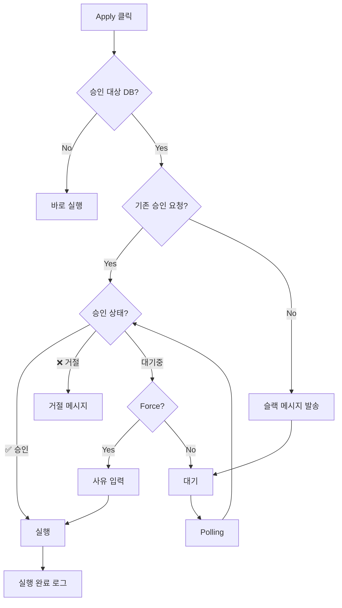

Production DB에 마이그레이션을 적용할 때 매니저(CTO/팀리드) 승인을 거치도록 하는 기능입니다. 슬랙 메시지를 보내고, ✅ 이모지가 달리면 승인된 것으로 처리합니다.

## 목표

<CardGroup cols={2}>
  <Card title="의식적인 배포" icon="shield-check">
    Production 마이그레이션을 "일상적이지 않은 별개의 태스크"로 인식
  </Card>
  <Card title="Force 옵션" icon="bolt">
    승인 없이도 force 진행 가능 (단, 사유 기록)
  </Card>
  <Card title="중복 방지" icon="check-double">
    동일 마이그레이션 조합에 대해 이미 승인이 있으면 재요청 없이 통과
  </Card>
  <Card title="장애 대응" icon="wrench">
    슬랙 장애 시 설정 주석 처리로 기존 동작 복원
  </Card>
</CardGroup>

## 설정

### sonamu.config.ts

```typescript
export default defineConfig({
  // ... 기존 설정

  slackConfirm: {
    targets: ["production"], // 승인 필요한 DB 키 목록
    botToken: process.env.SLACK_BOT_TOKEN ?? "",
    channelId: process.env.SLACK_CHANNEL_ID ?? "", // 예: "C01234567"
  },
});
```

### 환경변수

```bash
SLACK_BOT_TOKEN=xoxb-...
SLACK_CHANNEL_ID=C01234567
```

<Info>`slackConfirm` 블록을 주석 처리하면 기존 동작(승인 없이 바로 실행)으로 동작합니다.</Info>

## Slack App 생성

### 1. App 생성

1. [Slack API](https://api.slack.com/apps) → Create New App
2. "From scratch" 선택
3. App Name: "Sonamu Migration" (또는 원하는 이름)
4. Workspace 선택

### 2. Bot Token Scopes 추가

OAuth & Permissions → Scopes → Bot Token Scopes에서 다음 권한 추가:

| Scope             | 용도                              |
| ----------------- | --------------------------------- |
| `chat:write`      | 메시지 발송, 스레드에 사유 남기기 |
| `reactions:read`  | 이모지 조회                       |
| `reactions:write` | force 시 본인이 ✅ 찍기           |

### 3. 설치 및 설정

1. Install to Workspace 클릭
2. Bot User OAuth Token 복사 (`xoxb-...`)
3. 원하는 채널에서 `/invite @봇이름`
4. 채널 ID 확인 (채널 이름 우클릭 → "링크 복사" → URL에서 `C...` 부분)

## 승인 플로우



### 승인 요청 메시지

```
🗄️ *Production 마이그레이션 승인 요청*

*요청자:* user@example.com
*대상 DB:* production
*시간:* 2025. 1. 15. 오후 3:30:00

*적용 예정 마이그레이션:*
• 20251220143022_create__users.ts
• 20251220143100_create__posts.ts

✅ 승인  ❌ 거절
```

## 사용 방법

### 일반 승인

1. Sonamu UI에서 Production 대상 마이그레이션 Apply 클릭
2. 슬랙 채널에 승인 요청 메시지 발송됨
3. 매니저가 ✅ 이모지 클릭
4. 자동으로 마이그레이션 실행

### Force 진행

승인을 기다리지 않고 진행해야 할 경우:

1. 대기 중 "Force 진행" 버튼 클릭
2. 사유 입력
3. 마이그레이션 실행 (슬랙에 force 사유 기록)

<Warning>
  Force 진행 시 슬랙 스레드에 사유가 기록됩니다. 나중에 감사 목적으로 추적 가능합니다.
</Warning>

### 거절 처리

매니저가 ❌ 이모지를 클릭하면 마이그레이션이 거절됩니다.

## 로컬 파일 저장

승인 요청 정보는 로컬 파일로 저장되어 동일 마이그레이션 조합에 대해 재요청을 방지합니다.

### 저장 위치

```
src/migrations/.slack-confirm-{hash}
```

### 파일명 규칙

- `{hash}` = 마이그레이션 이름 목록을 정렬 후 MD5 해시 (12자)
- 예: `.slack-confirm-a1b2c3d4e5f6`

### 파일 내용

```
{channel_id}:{message_ts}
```

예: `C01234567:1705412345.000100`

## Slack API 참고

### 사용하는 API

| API                            | 용도                             |
| ------------------------------ | -------------------------------- |
| `chat.postMessage`             | 승인 요청 메시지 발송            |
| `reactions.get`                | 이모지 조회 (Tier 3, 분당 50+회) |
| `reactions.add`                | force 시 ✅ 추가                 |
| `chat.postMessage` (thread_ts) | 스레드에 로그 남기기             |

### Rate Limit

- `reactions.get`은 Tier 3 API로 분당 50회 이상 호출 가능
- 제한 초과 시 호출이 막히지 않고 응답이 지연됨
- Polling 간격 2초로 설정되어 있어 안전

## 테스트 시나리오

| 시나리오       | 동작                                         |
| -------------- | -------------------------------------------- |
| 정상 플로우    | Apply → 슬랙 메시지 → 대기 → ✅ → 실행       |
| 기존 승인 있음 | Apply → 기존 ts로 조회 → ✅ 있음 → 바로 실행 |
| 거절           | Apply → 대기 → ❌ → 거절 메시지              |
| Force          | Apply → 대기 → Force → 사유 입력 → 실행      |
| 설정 없음      | 기존 동작과 동일 (바로 실행)                 |
| 대상 아닌 DB   | targets에 없는 DB는 승인 없이 바로 실행      |

## 다음 단계

<CardGroup cols={2}>
  <Card title="마이그레이션 실행" icon="play" href="/ko/database/migrations/running-migrations">
    기본 실행 방법
  </Card>
  <Card title="롤백하기" icon="rotate-left" href="/ko/database/migrations/rolling-back">
    Sonamu UI·Migrator로 되돌리기
  </Card>
  <Card title="전략" icon="chess" href="/ko/database/migrations/migration-strategies">
    안전한 마이그레이션 전략
  </Card>
  <Card title="동작 원리" icon="gear" href="/ko/database/migrations/how-migrations-work">
    자동 생성 이해하기
  </Card>
</CardGroup>
