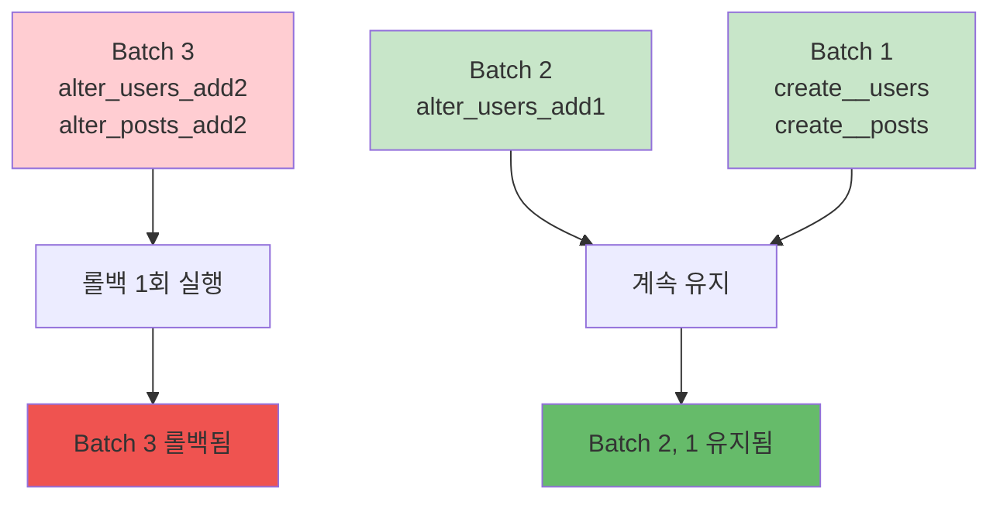

Migration을 롤백하여 데이터베이스를 이전 상태로 되돌릴 수 있습니다.

## 롤백 수단

<CardGroup cols={2}>
  <Card title="Sonamu UI" icon="rotate-left">
    Migrations 탭의 롤백 버튼 최근 batch 롤백
  </Card>
  <Card title="runAction()" icon="code">
    Migrator API 직접 호출 스크립트/자동화용
  </Card>
  <Card title="migrate status" icon="list-check">
    롤백 전 상태 확인 batch 확인
  </Card>
  <Card title="down 함수" icon="arrow-down">
    Migration 파일의 역작업 롤백 결과를 결정
  </Card>
</CardGroup>

<Warning>
  **롤백 전용 CLI 명령은 없습니다.** `sonamu migrate`가 제공하는 서브커맨드는 `run`, `apply`,
  `generate`, `status` 네 가지뿐입니다. 롤백은 Sonamu UI 또는 `Migrator.runAction("rollback", ...)`
  으로만 수행합니다.
</Warning>

## 기본 롤백

### Sonamu UI에서 롤백

1. API 개발 서버를 실행합니다(`pnpm dev`).
2. `http://localhost:34900/sonamu-ui`의 **Migrations** 탭을 엽니다.
3. 롤백할 DB 커넥션을 선택합니다.
4. **롤백** 버튼을 클릭하고 확인 모달에서 실행합니다.

<Info>롤백은 선택한 DB의 **가장 최근 batch에 속한 모든 Migration**을 되돌립니다.</Info>

### 스크립트에서 롤백

CI나 운영 스크립트에서는 `Migrator`를 직접 호출합니다.

```typescript title="src/scripts/rollback-migration.ts"
import { Migrator, Sonamu } from "sonamu";

Sonamu.runScript(async () => {
  const migrator = new Migrator();
  await migrator.runAction("rollback", ["development"]);
});
```

```bash
pnpm tsx src/scripts/rollback-migration.ts
```

### 현재 상태 확인

```bash
pnpm sonamu migrate status
```

**출력**:

```
Executed migrations (Batch 1):
  ✅ 20251220143022_create__users.ts
  ✅ 20251220143100_create__posts.ts

Executed migrations (Batch 2):
  ✅ 20251220143200_alter_users_add1.ts  ← 이 batch가 롤백됨

Pending migrations:
  ⏳ 20251220143300_alter_posts_add1.ts
```

## 롤백 방식

### Batch 단위 롤백

롤백의 단위는 **batch**입니다. 한 번의 롤백은 가장 최근 batch에 속한 Migration을 모두 되돌립니다.

```
# 롤백 전
Batch 3 (가장 최근): 20251220150000_alter_users_add2.ts
                     20251220150100_alter_posts_add2.ts
Batch 2:             20251220143200_alter_users_add1.ts

# 롤백 1회 실행 → Batch 3의 2개 Migration이 함께 롤백됨
Batch 2:             20251220143200_alter_users_add1.ts  ← 유지
```

### 여러 batch 되돌리기

Migration 하나만 골라서 되돌리거나, 여러 batch를 한 번에 되돌리는 기능은 제공되지 않습니다.
더 과거로 되돌리려면 **롤백을 batch 수만큼 반복 실행**하고, 각 회차 사이에
`pnpm sonamu migrate status`로 상태를 확인하세요.

<Warning>
  롤백을 반복하면 결국 초기 스키마(모든 테이블 삭제)까지 되돌아갑니다. 프로덕션에서는 각 회차마다
  영향 범위를 확인하세요.
</Warning>

## down 함수

### 기본 구조

```typescript
export async function down(knex: Knex): Promise<void> {
  // up의 역작업 수행
}
```

### CREATE TABLE 롤백

```typescript
// up: 테이블 생성
export async function up(knex: Knex): Promise<void> {
  await knex.schema.createTable("users", (table) => {
    table.increments().primary();
    table.string("email", 255).notNullable();
  });
}

// down: 테이블 삭제
export async function down(knex: Knex): Promise<void> {
  return knex.schema.dropTable("users");
}
```

### ALTER TABLE 롤백

```typescript
// up: 컬럼 추가
export async function up(knex: Knex): Promise<void> {
  await knex.schema.alterTable("users", (table) => {
    table.string("phone", 20).nullable();
  });
}

// down: 컬럼 삭제
export async function down(knex: Knex): Promise<void> {
  await knex.schema.alterTable("users", (table) => {
    table.dropColumns("phone");
  });
}
```

### FOREIGN KEY 롤백

```typescript
// up: 외래 키 추가
export async function up(knex: Knex): Promise<void> {
  return knex.schema.alterTable("employees", (table) => {
    table.foreign("user_id").references("users.id").onUpdate("CASCADE").onDelete("CASCADE");
  });
}

// down: 외래 키 삭제
export async function down(knex: Knex): Promise<void> {
  return knex.schema.alterTable("employees", (table) => {
    table.dropForeign(["user_id"]);
  });
}
```

## 롤백 시나리오

### 시나리오 1: 잘못된 Migration 수정

```bash
# 1. Migration 실행
pnpm sonamu migrate run
✅ 20251220143200_alter_users_add1.ts

# 2. 문제 발견 (잘못된 컬럼 타입)

# 3. Sonamu UI의 Migrations 탭에서 롤백

# 4. Migration 파일 수정
vim src/migrations/20251220143200_alter_users_add1.ts

# 5. 다시 실행
pnpm sonamu migrate run
```

### 시나리오 2: 프로덕션 긴급 롤백

프로덕션 DB는 Sonamu UI가 실행되는 환경에서 접근할 수 없는 경우가 많으므로,
롤백 스크립트를 프로덕션 환경 변수로 실행합니다.

```bash
# 1. 프로덕션 배포 후 문제 발견

# 2. 즉시 롤백 (runAction("rollback", ["production"]) 스크립트)
NODE_ENV=production pnpm tsx src/scripts/rollback-migration.ts

# 3. 이전 버전 애플리케이션 배포

# 4. 문제 수정 후 재배포
```

<Info>
  `NODE_ENV`가 `local`이 아니면 해당 환경과 이름이 같은 DB 커넥션만 작업 대상으로 허용됩니다. 다른
  대상을 넘기면 에러로 차단됩니다.
</Info>

### 시나리오 3: 부분 롤백

```
# 현재 상태
Batch 3: alter_users_add2.ts, alter_posts_add2.ts
Batch 2: alter_users_add1.ts
Batch 1: create__users.ts, create__posts.ts

# 롤백 1회 → Batch 3만 롤백 (Batch 2, 1은 유지)

# 결과
Batch 2: alter_users_add1.ts  ← 유지
Batch 1: create__users.ts, create__posts.ts  ← 유지
```



## 데이터 보존

### 롤백 시 데이터 손실

```typescript
// up: 컬럼 추가
export async function up(knex: Knex): Promise<void> {
  await knex.schema.alterTable("users", (table) => {
    table.string("phone", 20).nullable();
  });
}

// down: 컬럼 삭제 (데이터 손실!)
export async function down(knex: Knex): Promise<void> {
  await knex.schema.alterTable("users", (table) => {
    table.dropColumns("phone"); // ← phone 데이터 모두 삭제됨
  });
}
```

<Warning>
**데이터 손실 주의!**

컬럼/테이블 삭제 시 데이터는 복구되지 않습니다.
프로덕션에서는 백업 필수!

</Warning>

### 안전한 롤백 패턴

```typescript
// Step 1: 컬럼 추가 (nullable)
export async function up(knex: Knex): Promise<void> {
  await knex.schema.alterTable("users", (table) => {
    table.string("new_phone", 20).nullable();
  });
}

// Step 2: 데이터 마이그레이션
await knex("users").update({
  new_phone: knex.raw("old_phone"),
});

// Step 3: old_phone 컬럼 유지 (롤백 대비)
// → 나중에 별도 Migration으로 삭제
```

## 롤백 불가능한 경우

### 데이터 변환

```typescript
// up: 타입 변경
export async function up(knex: Knex): Promise<void> {
  await knex.raw(
    `ALTER TABLE users 
     ALTER COLUMN age TYPE integer 
     USING age::integer`,
  );
}

// down: 원본 데이터 복구 불가능
export async function down(knex: Knex): Promise<void> {
  await knex.raw(
    `ALTER TABLE users 
     ALTER COLUMN age TYPE varchar(255)`,
  );
  // "25" → 25 → "25" (원본이 "025"였다면 손실)
}
```

### 데이터 삭제

```typescript
// up: 특정 데이터 삭제
export async function up(knex: Knex): Promise<void> {
  await knex("users").where("is_deleted", true).delete();
}

// down: 삭제된 데이터 복구 불가능
export async function down(knex: Knex): Promise<void> {
  // 복구 불가능!
}
```

## 롤백 전략

### 1. 백업 우선

```bash
# PostgreSQL 백업
pg_dump -U postgres -d mydb > backup_before_rollback.sql

# 롤백 (Sonamu UI 또는 롤백 스크립트)

# 문제 발생 시 복원
psql -U postgres -d mydb < backup_before_rollback.sql
```

### 2. 스테이징 테스트

```bash
# 스테이징에서 롤백 테스트
NODE_ENV=staging pnpm tsx src/scripts/rollback-migration.ts

# 문제 없으면 프로덕션
NODE_ENV=production pnpm tsx src/scripts/rollback-migration.ts
```

### 3. 점진적 롤백

```bash
# 롤백 1회 실행 (최근 batch)

# 상태 확인
pnpm sonamu migrate status

# 애플리케이션 테스트

# 이상 없으면 다음 batch 롤백
```

## 에러 처리

### 롤백 실패

롤백 중 down 함수가 실패하면 다음과 같은 에러가 발생합니다.

**에러**:

```
❌ Error rolling back 20251220143200_alter_users_add1.ts
   Error: column "phone" does not exist
```

**원인**:

- Migration이 부분적으로만 적용됨
- down 함수가 up과 일치하지 않음
- 수동으로 DB 변경함

**해결**:

1. DB 상태 수동 확인
2. knex_migrations 테이블 수정
3. down 함수 수정 후 재시도

### 강제 롤백

```sql
-- knex_migrations에서 제거
DELETE FROM knex_migrations
WHERE name = '20251220143200_alter_users_add1.ts';

-- 수동으로 변경 사항 되돌리기
ALTER TABLE users DROP COLUMN phone;
```

## 롤백 로그

### 실행 결과 확인

`runAction("rollback", ...)`은 대상 커넥션별로 batch 번호와 롤백된 파일 목록을 반환합니다.

```typescript
const results = await migrator.runAction("rollback", ["development"]);
console.log(results);
// [{ connKey: "development", batchNo: 2, applied: ["20251220143200_alter_users_add1.ts"] }]
```

Sonamu UI에서는 롤백 진행률과 완료 상태가 각 target DB 카드에 표시됩니다. 파일이나 target에 귀속되는 오류도 해당 카드 안에서 확인할 수 있습니다.

### 롤백 기록 조회

```sql
-- 최근 롤백된 Migration 확인
SELECT * FROM knex_migrations
WHERE batch = (SELECT MAX(batch) + 1 FROM knex_migrations);
```

## 실전 팁

### 1. down 함수 검증

```typescript
// 테스트: up → down → up
test("migration reversibility", async () => {
  await migration.up(knex);
  await migration.down(knex);
  await migration.up(knex); // 다시 실행 가능해야 함
});
```

### 2. 롤백 계획 문서화

```markdown
# Rollback Plan

## Migration: 20251220143200_alter_users_add1.ts

### Changes

- Add column: users.phone

### Rollback Impact

- Data loss: users.phone 데이터 삭제
- Estimated time: 5 seconds
- Downtime: None (nullable 컬럼)

### Rollback Steps

1. Sonamu UI Migrations 탭에서 롤백 (또는 롤백 스크립트 실행)
2. Deploy previous app version
3. Verify phone field not used
```

### 3. 자동 롤백 스크립트

```bash
#!/bin/bash
# auto-rollback.sh

echo "Creating backup..."
pg_dump -U postgres -d mydb > backup.sql

echo "Rolling back..."
pnpm tsx src/scripts/rollback-migration.ts

if [ $? -eq 0 ]; then
  echo "✅ Rollback successful"
else
  echo "❌ Rollback failed, restoring backup..."
  psql -U postgres -d mydb < backup.sql
fi
```

## 다음 단계

<CardGroup cols={2}>
  <Card title="전략" icon="chess" href="/ko/database/migrations/migration-strategies">
    안전한 마이그레이션 전략
  </Card>
  <Card title="마이그레이션 실행" icon="play" href="/ko/database/migrations/running-migrations">
    migrate run으로 적용
  </Card>
  <Card title="마이그레이션 생성" icon="plus" href="/ko/database/migrations/creating-migrations">
    Sonamu UI에서 생성
  </Card>
  <Card title="동작 원리" icon="gear" href="/ko/database/migrations/how-migrations-work">
    자동 생성 이해하기
  </Card>
</CardGroup>
