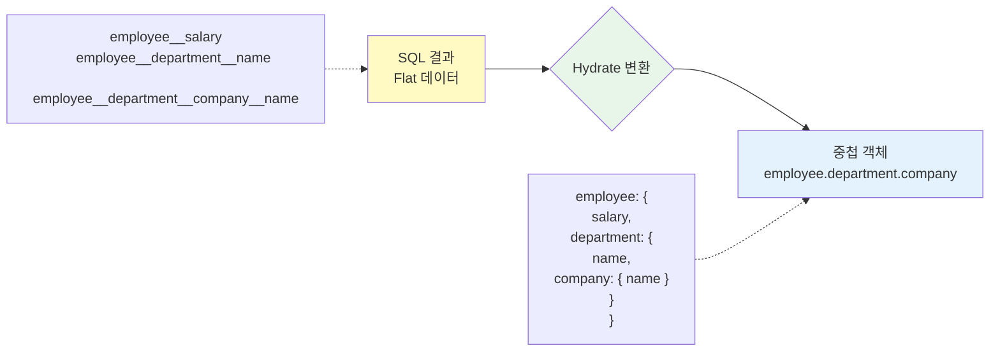

Subset은 Entity JSON 파일의 `subsets` 객체에서 정의합니다.

## 기본 Subset 정의

### Entity 구조

```json
{
  "id": "User",
  "table": "users",
  "props": [
    { "name": "id", "type": "integer" },
    { "name": "username", "type": "string" },
    { "name": "email", "type": "string" },
    { "name": "role", "type": "enum", "id": "UserRole" }
  ],
  "subsets": {
    "A": ["id", "username", "email", "role"],
    "SS": ["id", "username"]
  }
}
```

<Frame>
  
</Frame>

### Subset 정의 규칙

<CodeGroup>
```json title="기본 필드"
{
  "subsets": {
    "A": [
      "id",
      "created_at",
      "username",
      "email",
      "role"
    ]
  }
}
```

```json title="관계 필드 (점 표기법)"
{
  "subsets": {
    "P": ["id", "username", "employee.id", "employee.salary", "employee.department.name"]
  }
}
```

```json title="복합 Subset"
{
  "subsets": {
    "L": ["id", "username", "role"],
    "P": ["id", "username", "employee.salary"],
    "SS": ["id", "username"]
  }
}
```

</CodeGroup>

## 관계 필드 선택

### OneToOne 관계

```json
{
  "props": [
    { "name": "id", "type": "integer" },
    { "name": "username", "type": "string" },
    {
      "type": "relation",
      "name": "employee",
      "with": "Employee",
      "relationType": "OneToOne"
    }
  ],
  "subsets": {
    "P": ["id", "username", "employee.id", "employee.employee_number", "employee.salary"]
  }
}
```

<Info>
  OneToOne 관계는 **자동으로 LEFT JOIN**됩니다. `employee.id`를 선택하면 `employees` 테이블이
  조인됩니다.
</Info>

### 중첩 관계 (2단계 이상)

```json
{
  "subsets": {
    "P": [
      "id",
      "username",
      "employee.salary",
      "employee.department.name",
      "employee.department.company.name"
    ]
  }
}
```

**SQL 결과**:

```sql
SELECT
  users.id,
  users.username,
  employees.salary AS employee__salary,
  departments.name AS employee__department__name,
  companies.name AS employee__department__company__name
FROM users
LEFT JOIN employees ON users.id = employees.user_id
LEFT JOIN departments ON employees.department_id = departments.id
LEFT JOIN companies ON departments.company_id = companies.id
```

**Hydrate 결과**:

```typescript
{
  id: 1,
  username: "john",
  employee: {
    salary: "70000",
    department: {
      name: "Engineering",
      company: {
        name: "Tech Corp"
      }
    }
  }
}
```



## Subset 네이밍 전략

### 일반적인 규칙

```json
{
  "subsets": {
    "A": [...],   // All - 모든 필드 (관리자 상세)
    "L": [...],   // List - 목록용 (테이블 행)
    "P": [...],   // Profile - 프로필 (관계 포함)
    "SS": [...],  // Summary - 요약 (드롭다운, 태그)
    "C": [...]    // Card - 카드 UI
  }
}
```

<Frame>
  
</Frame>

### 도메인별 Subset

```json
{
  "subsets": {
    "AdminList": ["id", "username", "email", "role", "created_at"],
    "UserCard": ["id", "username", "role"],
    "ProfileView": ["id", "username", "bio", "employee.department.name"]
  }
}
```

<Tip>
  **명명 팁**: - 짧고 명확한 이름 사용 (A, L, P 등) - 팀 내에서 일관된 규칙 유지 - 도메인별로 의미
  있는 이름 사용 가능
</Tip>

## Subset 설계 원칙

### 1. 최소 필드 원칙

```json
// ❌ 나쁨: 불필요한 필드 포함
{
  "L": [
    "id", "created_at", "updated_at", "deleted_at",
    "username", "email", "password", "bio",
    "last_login_at", "is_verified"
  ]
}

// ✅ 좋음: 목록에 필요한 필드만
{
  "L": [
    "id",
    "username",
    "role",
    "created_at"
  ]
}
```

### 2. 용도별 분리

```json
{
  "subsets": {
    // 목록 조회용
    "L": ["id", "username", "role", "created_at"],

    // 상세 조회용 (관계 포함)
    "P": ["id", "username", "email", "bio", "employee.salary", "employee.department.name"],

    // 드롭다운용
    "SS": ["id", "username"]
  }
}
```

### 3. 성능 고려

```json
// ✅ 좋음: 필요한 관계만 JOIN
{
  "P": [
    "id",
    "username",
    "employee.department.name"
  ]
}

// ❌ 나쁨: 불필요한 JOIN
{
  "P": [
    "id",
    "username",
    "employee.id",
    "employee.company.id",
    "employee.projects.id"
  ]
}
```

<Info>
  **성능 팁**: - JOIN은 최소한으로 (필요한 관계만) - 목록 조회는 L Subset 사용 (관계 제외) - 상세
  조회만 P Subset 사용 (관계 포함)
</Info>

<Frame>
  
</Frame>

## 실전 예제

### User Entity

```json
{
  "id": "User",
  "table": "users",
  "props": [
    { "name": "id", "type": "integer" },
    { "name": "created_at", "type": "date" },
    { "name": "username", "type": "string" },
    { "name": "email", "type": "string" },
    { "name": "role", "type": "enum", "id": "UserRole" },
    { "name": "bio", "type": "string", "nullable": true },
    {
      "type": "relation",
      "name": "employee",
      "with": "Employee",
      "relationType": "OneToOne",
      "nullable": true
    }
  ],
  "subsets": {
    "A": ["id", "created_at", "username", "email", "role", "bio"],
    "L": ["id", "username", "role", "created_at"],
    "P": ["id", "username", "email", "bio", "employee.salary", "employee.department.name"],
    "SS": ["id", "username"]
  }
}
```

## Code Generation

Subset을 정의하면 자동으로 타입이 생성됩니다:

```bash
# Subset 변경 후 코드 재생성
pnpm sonamu sync
```

<Warning>
  Subset을 변경하면 **반드시 Code Generation**을 실행해야 합니다. 그래야 TypeScript 타입이
  업데이트됩니다.
</Warning>

**생성되는 타입**:

```typescript
// sonamu.generated.ts

export type UserSubsetKey = "A" | "L" | "P" | "SS";

export type UserSubsetMapping = {
  A: {
    id: number;
    created_at: Date;
    username: string;
    email: string;
    role: UserRole;
    bio: string | null;
  };
  L: {
    id: number;
    username: string;
    role: UserRole;
    created_at: Date;
  };
  P: {
    id: number;
    username: string;
    email: string;
    bio: string | null;
    employee: {
      salary: string;
      department: {
        name: string;
      };
    } | null;
  };
  SS: {
    id: number;
    username: string;
  };
};
```

<Frame>
  
</Frame>

## 다음 단계

<CardGroup cols={2}>
  <Card title="Subset 사용하기" icon="code" href="/ko/database/subsets/using-subsets">
    Model에서 Subset 활용
  </Card>
  <Card title="중첩 관계" icon="diagram-project" href="/ko/database/subsets/nested-relations">
    LoaderQuery로 1:N 로딩
  </Card>
  <Card title="Entity 정의" icon="cube" href="/ko/core-concepts/entity/defining-entities">
    Entity 구조 이해하기
  </Card>
  <Card
    title="Code Generation"
    icon="wand-magic-sparkles"
    href="/ko/auto-generation/code-generation"
  >
    코드 자동 생성
  </Card>
</CardGroup>
