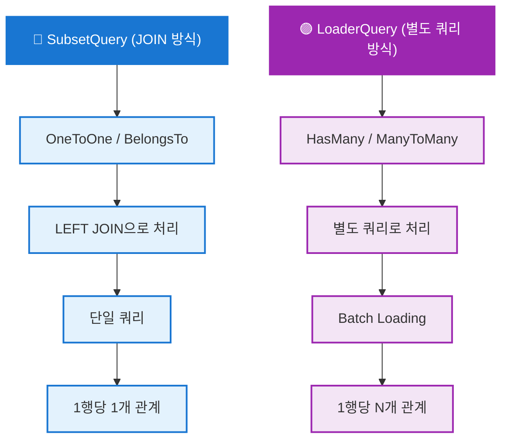

LoaderQuery는 1:N, N:M 관계의 데이터를 효율적으로 로딩하는 시스템입니다.

## LoaderQuery 개요

<CardGroup cols={2}>
  <Card title="1:N 관계" icon="arrow-right-to-bracket">
    부모 → 자식 여러 개 HasMany
  </Card>
  <Card title="N:M 관계" icon="diagram-project">
    양방향 다대다 관계 ManyToMany
  </Card>
  <Card title="N+1 해결" icon="gauge-high">
    효율적인 데이터 로딩 Batch Loading
  </Card>
  <Card title="중첩 Loader" icon="layer-group">
    재귀적 관계 로딩 Nested Relations
  </Card>
</CardGroup>

## LoaderQuery vs SubsetQuery



### SubsetQuery (JOIN)

OneToOne 또는 BelongsTo 관계에 적합:

```typescript
// SubsetQuery: LEFT JOIN으로 처리
{
  "subsets": {
    "P": [
      "id",
      "username",
      "employee.salary",           // ← OneToOne
      "employee.department.name"   // ← BelongsTo
    ]
  }
}

// SQL: LEFT JOIN employees, LEFT JOIN departments
// 결과: 1행당 1개의 employee
```

### LoaderQuery (Separate Query)

HasMany 또는 ManyToMany 관계에 적합:

```typescript
// LoaderQuery: 별도 쿼리로 처리
{
  loaders: [
    {
      as: "posts",
      refId: "user_id",
      qb: (qb, fromIds) => qb.table("posts").whereIn("user_id", fromIds),
    },
  ];
}

// SQL: SELECT * FROM posts WHERE user_id IN (1, 2, 3)
// 결과: 1명당 N개의 posts 배열
```

## LoaderQuery 정의

LoaderQuery는 `subset-loaders.ts` 파일에서 정의합니다:

```typescript
// src/application/user/user.subset-loaders.ts

import type { SubsetLoaderMap } from "sonamu";

export const UserSubsetLoaders: SubsetLoaderMap<"User"> = {
  // Subset A에 posts 로더 추가
  A: [
    {
      as: "posts", // 결과 필드명
      refId: "user_id", // 참조 필드 (posts.user_id)
      qb: (qb, fromIds) =>
        qb
          .table("posts")
          .whereIn("user_id", fromIds)
          .select({
            id: "id",
            title: "title",
            created_at: "created_at",
          })
          .orderBy("created_at", "desc"),
    },
  ],
};
```

<Info>LoaderQuery는 자동으로 **Batch Loading**을 수행하여 N+1 문제를 해결합니다.</Info>

## 1:N 관계 (HasMany)

### 부서 → 직원들

```typescript
// Department Entity
export const DepartmentSubsetLoaders: SubsetLoaderMap<"Department"> = {
  P: [
    {
      as: "employees",
      refId: "department_id",
      qb: (qb, fromIds) =>
        qb
          .table("employees")
          .whereIn("department_id", fromIds)
          .join("users", "employees.user_id", "users.id")
          .select({
            id: "employees.id",
            employee_number: "employees.employee_number",
            username: "users.username",
            salary: "employees.salary",
          })
          .orderBy("employees.employee_number", "asc"),
    },
  ],
};
```

**사용 예시**:

```typescript
const dept = await DepartmentModel.findById(1, ["P"]);

// 타입:
// {
//   id: number;
//   name: string;
//   employees: Array<{
//     id: number;
//     employee_number: string;
//     username: string;
//     salary: string;
//   }>;
// }

console.log(`${dept.name} 부서 직원 수: ${dept.employees.length}`);
dept.employees.forEach((emp) => {
  console.log(`- ${emp.username} (${emp.employee_number})`);
});
```

## N:M 관계 (ManyToMany)

### 프로젝트 ↔ 직원

```typescript
// Project Entity
export const ProjectSubsetLoaders: SubsetLoaderMap<"Project"> = {
  P: [
    {
      as: "members",
      refId: "project_id",
      qb: (qb, fromIds) =>
        qb
          .table("projects__employees")
          .whereIn("project_id", fromIds)
          .join("employees", "projects__employees.employee_id", "employees.id")
          .join("users", "employees.user_id", "users.id")
          .select({
            id: "employees.id",
            username: "users.username",
            employee_number: "employees.employee_number",
            role: "projects__employees.role", // 중간 테이블 필드
          }),
    },
  ],
};
```

**사용 예시**:

```typescript
const project = await ProjectModel.findById(1, ["P"]);

// 타입:
// {
//   id: number;
//   name: string;
//   members: Array<{
//     id: number;
//     username: string;
//     employee_number: string;
//     role: string;  // 중간 테이블의 role
//   }>;
// }

console.log(`프로젝트: ${project.name}`);
console.log(`참여자 ${project.members.length}명:`);
project.members.forEach((member) => {
  console.log(`- ${member.username} (${member.role})`);
});
```

## 중첩 LoaderQuery

<Frame>
  
</Frame>

LoaderQuery는 **재귀적으로 중첩**할 수 있습니다:

```typescript
// Department Entity
export const DepartmentSubsetLoaders: SubsetLoaderMap<"Department"> = {
  P: [
    {
      as: "employees",
      refId: "department_id",
      qb: (qb, fromIds) =>
        qb
          .table("employees")
          .whereIn("department_id", fromIds)
          .join("users", "employees.user_id", "users.id")
          .select({
            id: "employees.id",
            username: "users.username",
            user_id: "users.id", // ← 다음 Loader를 위한 refId
          }),

      // 중첩 Loader: 직원 → 프로젝트들
      loaders: [
        {
          as: "projects",
          refId: "employee_id",
          qb: (qb, fromIds) =>
            qb
              .table("projects__employees")
              .whereIn("employee_id", fromIds)
              .join("projects", "projects__employees.project_id", "projects.id")
              .select({
                id: "projects.id",
                name: "projects.name",
                status: "projects.status",
              }),
        },
      ],
    },
  ],
};
```

**결과 구조**:

```typescript
{
  id: 1,
  name: "Engineering",
  employees: [
    {
      id: 1,
      username: "john",
      projects: [
        { id: 1, name: "Project A", status: "in_progress" },
        { id: 2, name: "Project B", status: "completed" }
      ]
    },
    {
      id: 2,
      username: "jane",
      projects: [
        { id: 3, name: "Project C", status: "in_progress" }
      ]
    }
  ]
}
```

## Batch Loading 동작 원리

<Frame>
  
</Frame>

### N+1 문제

```typescript
// ❌ N+1 문제 발생
const users = await UserModel.findMany({ subsetKey: "L" }); // 1 query

for (const user of users) {
  const posts = await PostModel.findMany({
    where: [["user_id", user.id]],
    subsetKey: "L",
  }); // N queries (users 수만큼)

  console.log(`${user.username}: ${posts.length} posts`);
}

// 총 쿼리: 1 + N개
```

### Batch Loading 해결

```typescript
// ✅ Batch Loading으로 해결
const users = await UserModel.findMany({
  subsetKey: "A", // A Subset에 posts Loader 포함
});

// 쿼리 1: SELECT * FROM users
// 쿼리 2: SELECT * FROM posts WHERE user_id IN (1, 2, 3, ...)

users.forEach((user) => {
  console.log(`${user.username}: ${user.posts.length} posts`);
});

// 총 쿼리: 2개 (users 수와 무관)
```

## 실전 예제

### 부서별 직원 목록

```typescript
async getDepartmentWithEmployees(deptId: number) {
  const dept = await DepartmentModel.findById(deptId, ["P"]);

  if (!dept) {
    throw new NotFoundException("Department not found");
  }

  return {
    id: dept.id,
    name: dept.name,
    employeeCount: dept.employees.length,
    employees: dept.employees.map(emp => ({
      id: emp.id,
      name: emp.username,
      number: emp.employee_number,
      salary: emp.salary,
    })),
  };
}
```

### 프로젝트 대시보드

```typescript
async getProjectDashboard(projectId: number) {
  const project = await ProjectModel.findById(projectId, ["Dashboard"]);

  if (!project) {
    throw new NotFoundException("Project not found");
  }

  return {
    id: project.id,
    name: project.name,
    status: project.status,

    // Members from LoaderQuery
    members: project.members.map(m => ({
      id: m.id,
      name: m.username,
      role: m.role,
    })),

    // Tasks from LoaderQuery
    tasks: project.tasks.map(t => ({
      id: t.id,
      title: t.title,
      status: t.status,
      assignee: t.assignee_name,
    })),

    stats: {
      memberCount: project.members.length,
      taskCount: project.tasks.length,
      completedTasks: project.tasks.filter(t => t.status === "completed").length,
    },
  };
}
```

### 사용자 활동 요약

```typescript
// User Subset with posts and comments
const user = await UserModel.findById(userId, ["Activity"]);

const summary = {
  user: {
    id: user.id,
    username: user.username,
    email: user.email,
  },

  activity: {
    totalPosts: user.posts.length,
    recentPosts: user.posts.slice(0, 5).map((p) => ({
      id: p.id,
      title: p.title,
      createdAt: p.created_at,
    })),

    totalComments: user.comments.length,
    recentComments: user.comments.slice(0, 5).map((c) => ({
      id: c.id,
      content: c.content,
      postTitle: c.post_title,
      createdAt: c.created_at,
    })),
  },
};
```

## LoaderQuery 설계 원칙

### 1. 필요한 필드만 SELECT

```typescript
// ❌ 나쁨: 모든 필드 로딩
{
  as: "employees",
  refId: "department_id",
  qb: (qb, fromIds) =>
    qb.table("employees")
      .whereIn("department_id", fromIds)
      .selectAll(),  // 모든 필드 (password 등 포함)
}

// ✅ 좋음: 필요한 필드만
{
  as: "employees",
  refId: "department_id",
  qb: (qb, fromIds) =>
    qb.table("employees")
      .whereIn("department_id", fromIds)
      .select({
        id: "id",
        username: "username",
        employee_number: "employee_number",
      }),
}
```

### 2. 정렬과 제한

```typescript
// 최근 5개 게시글만
{
  as: "recentPosts",
  refId: "user_id",
  qb: (qb, fromIds) =>
    qb.table("posts")
      .whereIn("user_id", fromIds)
      .orderBy("created_at", "desc")
      .limit(5),
}
```

### 3. 조건 필터링

```typescript
// 완료된 프로젝트만
{
  as: "completedProjects",
  refId: "employee_id",
  qb: (qb, fromIds) =>
    qb.table("projects__employees")
      .whereIn("employee_id", fromIds)
      .join("projects", "projects__employees.project_id", "projects.id")
      .where("projects.status", "completed")
      .select({
        id: "projects.id",
        name: "projects.name",
      }),
}
```

## 실전 복잡한 시나리오

실무에서 자주 마주치는 복잡한 Subset 패턴과 해결 방법입니다.

### 시나리오 1: 동적 Subset 선택

사용자 권한에 따라 다른 Subset을 사용하는 패턴

```typescript
class PostModelClass extends BaseModelClass {
  @api({ httpMethod: "GET", clients: ["axios", "tanstack-query"] })
  async findMany<T extends PostSubsetKey>(
    subset: T,
    params: PostListParams,
  ): Promise<ListResult<PostListParams, PostSubsetMapping[T]>> {
    const context = Sonamu.getContext();

    // 사용자 권한에 따라 Subset 동적 결정
    let effectiveSubset: PostSubsetKey;

    if (context.user?.role === "admin") {
      // 관리자: 모든 정보 포함 (작성자 상세, 통계 등)
      effectiveSubset = "AdminList" as T;
    } else if (context.user?.role === "normal") {
      // 일반 사용자: 기본 정보만
      effectiveSubset = "List" as T;
    } else {
      // 게스트: 공개 정보만
      effectiveSubset = "PublicList" as T;
    }

    const { qb, onSubset } = this.getSubsetQueries(effectiveSubset);

    // 권한별 추가 필터링
    if (context.user?.role !== "admin") {
      // 비공개 게시글 제외
      qb.where("posts.is_public", true);
    }

    return this.executeSubsetQuery({
      subset: effectiveSubset,
      qb,
      params,
    });
  }
}
```

**핵심 포인트**:

- 사용자 Context를 확인하여 적절한 Subset 선택
- 타입 단언(`as T`)으로 타입 안전성 유지
- 권한별 추가 필터링 적용

### 시나리오 2: 깊은 중첩 관계 (3단계 이상)

여러 단계로 중첩된 데이터를 효율적으로 로드

```typescript
// Entity 정의: Comment Subset
export const commentSubsetQueries = {
  // 대댓글 포함 (3단계: Post → Comment → Reply)
  WithReplies: {
    _one: {
      id: "comments.id",
      content: "comments.content",
      created_at: "comments.created_at",
      // 작성자 (2단계)
      author__id: "users.id",
      author__username: "users.username",
    },
    _many: {
      // 대댓글 (3단계)
      replies: {
        as: "replies",
        refId: "parent_id",
        qb: (qb, fromIds) =>
          qb
            .table("comments")
            .whereIn("parent_id", fromIds)
            .where("deleted_at", null)
            .leftJoin("users", "comments.user_id", "users.id")
            .select({
              id: "comments.id",
              content: "comments.content",
              created_at: "comments.created_at",
              // 대댓글 작성자
              author__id: "users.id",
              author__username: "users.username",
              author__profile__avatar: "profiles.avatar_url",
            })
            .leftJoin("profiles", "users.id", "profiles.user_id")
            .orderBy("comments.created_at", "asc"),
      },
    },
  },
} as const;

// Model 사용
class PostModelClass extends BaseModelClass {
  @api({ httpMethod: "GET" })
  async findByIdWithComments(id: number): Promise<Post> {
    // Post → Comment → Reply → Author까지 한 번에 로드
    const post = await this.findById("DetailWithComments", id);

    // 타입 안전하게 접근
    post.comments?.forEach((comment) => {
      console.log(comment.author?.username); // 댓글 작성자

      comment.replies?.forEach((reply) => {
        console.log(reply.author?.username); // 대댓글 작성자
        console.log(reply.author?.profile?.avatar); // 프로필 이미지
      });
    });

    return post;
  }
}
```

**성능 고려사항**:

- 3단계 이상 중첩 시 쿼리 수 증가 (N+1 문제 주의)
- 필요한 경우에만 깊은 중첩 사용
- 페이지네이션과 함께 사용하여 데이터 양 제한

### 시나리오 3: 조건부 중첩 로딩

특정 조건일 때만 중첩 데이터를 로드

```typescript
class UserModelClass extends BaseModelClass {
  @api({ httpMethod: "GET" })
  async findManyWithOptionalPosts<T extends UserSubsetKey>(
    subset: T,
    params: UserListParams,
    includePosts: boolean = false,
  ): Promise<ListResult<UserListParams, UserSubsetMapping[T]>> {
    const { qb, onSubset } = this.getSubsetQueries(subset);

    // 기본 쿼리 구성
    qb.where("users.deleted_at", null);

    // 조건부 중첩 데이터 로딩
    if (includePosts) {
      onSubset({
        List: () => {
          // List Subset에 게시글 동적 추가
          qb.onExecute(async (rows) => {
            const userIds = rows.map((row) => row.id);

            // 게시글 별도 조회
            const posts = await this.getPuri("r")
              .table("posts")
              .whereIn("user_id", userIds)
              .where("is_public", true)
              .select({
                id: "id",
                user_id: "user_id",
                title: "title",
                created_at: "created_at",
              })
              .orderBy("created_at", "desc");

            // 사용자별로 게시글 그룹화
            const postsByUser = posts.reduce(
              (acc, post) => {
                if (!acc[post.user_id]) {
                  acc[post.user_id] = [];
                }
                acc[post.user_id].push(post);
                return acc;
              },
              {} as Record<number, typeof posts>,
            );

            // 결과에 게시글 추가
            return rows.map((row) => ({
              ...row,
              posts: postsByUser[row.id] || [],
            }));
          });
        },
      });
    }

    return this.executeSubsetQuery({ subset, qb, params });
  }
}
```

**활용 사례**:

- 모바일 vs 웹에서 다른 데이터 로드
- 사용자 설정에 따른 선택적 데이터 로드
- 성능 최적화를 위한 필요시에만 로드

### 시나리오 4: N+1 문제 해결

여러 관계를 효율적으로 로드하여 N+1 문제 방지

```typescript
// ❌ 나쁜 예: N+1 문제 발생
class PostModelClass extends BaseModelClass {
  async getPostsWithAuthorsBad(): Promise<PostWithAuthor[]> {
    const posts = await this.getPuri("r")
      .table("posts")
      .select({ id: "id", title: "title", user_id: "user_id" });

    // 각 게시글마다 작성자 조회 → N+1 문제!
    const results = [];
    for (const post of posts) {
      const author = await UserModel.findById("Simple", post.user_id);
      results.push({ ...post, author });
    }

    return results;
  }
}

// ✅ 좋은 예: Subset으로 한 번에 로드
class PostModelClass extends BaseModelClass {
  @api({ httpMethod: "GET" })
  async getPostsWithAuthorsGood(): Promise<PostSubsetMapping["WithAuthor"][]> {
    // Subset 정의에 author 관계 포함
    const { rows } = await this.findMany("WithAuthor", { num: 100 });

    // 2개의 쿼리로 완료:
    // 1. SELECT * FROM posts ...
    // 2. SELECT * FROM users WHERE id IN (...)

    return rows;
  }
}

// Subset 정의
export const postSubsetQueries = {
  WithAuthor: {
    _one: {
      id: "posts.id",
      title: "posts.title",
      content: "posts.content",
      // 작성자 정보
      author__id: "users.id",
      author__username: "users.username",
      author__email: "users.email",
    },
  },
} as const;
```

**N+1 문제 비교**:

| 방식                      | 쿼리 수                           | 성능      | 문제점       |
| ------------------------- | --------------------------------- | --------- | ------------ |
| **나쁜 예** (반복문 조회) | N+1개 (게시글 100개 → 101개 쿼리) | 매우 느림 | DB 부하 증가 |
| **좋은 예** (Subset)      | 2개 (posts + users)               | 빠름      | 없음         |

### 시나리오 5: 순환 참조 처리 (자기 참조)

댓글 대댓글, 조직도 등 자기 참조 관계 처리

```typescript
// Entity: 조직도 (상사-부하 관계)
export const employeeSubsetQueries = {
  // 직속 부하 포함
  WithDirectReports: {
    _one: {
      id: "employees.id",
      username: "employees.username",
      position: "employees.position",
      manager_id: "employees.manager_id",
    },
    _many: {
      // 직속 부하들 (1단계만)
      directReports: {
        as: "directReports",
        refId: "manager_id",
        qb: (qb, fromIds) =>
          qb
            .table("employees")
            .whereIn("manager_id", fromIds)
            .where("deleted_at", null)
            .select({
              id: "id",
              username: "username",
              position: "position",
            })
            .orderBy("position", "asc"),
      },
    },
  },
} as const;

// Model: 전체 조직도 트리 구성
class EmployeeModelClass extends BaseModelClass {
  @api({ httpMethod: "GET" })
  async getOrganizationTree(rootId: number, maxDepth: number = 3): Promise<EmployeeTreeNode> {
    // 재귀적으로 조직도 구성
    return this.buildTreeRecursive(rootId, 0, maxDepth);
  }

  private async buildTreeRecursive(
    employeeId: number,
    currentDepth: number,
    maxDepth: number,
  ): Promise<EmployeeTreeNode> {
    // 최대 깊이 제한
    if (currentDepth >= maxDepth) {
      const employee = await this.findById("Simple", employeeId);
      return { ...employee, children: [] };
    }

    // 직속 부하 포함 조회
    const employee = await this.findById("WithDirectReports", employeeId);

    // 각 부하에 대해 재귀 호출
    const children = await Promise.all(
      (employee.directReports || []).map((report) =>
        this.buildTreeRecursive(report.id, currentDepth + 1, maxDepth),
      ),
    );

    return {
      ...employee,
      children,
      depth: currentDepth,
    };
  }

  @api({ httpMethod: "GET" })
  async getOrganizationTreeOptimized(rootId: number): Promise<EmployeeTreeNode> {
    // 최적화: 한 번에 모든 직원 조회 후 메모리에서 트리 구성
    const allEmployees = await this.findMany("WithDirectReports", {
      num: 10000,
    });

    // Map으로 빠른 조회
    const employeeMap = new Map(allEmployees.rows.map((emp) => [emp.id, emp]));

    // 트리 구성
    return this.buildTreeFromMap(rootId, employeeMap);
  }

  private buildTreeFromMap(
    employeeId: number,
    employeeMap: Map<number, Employee>,
  ): EmployeeTreeNode {
    const employee = employeeMap.get(employeeId);
    if (!employee) {
      throw new NotFoundError(`직원 ${employeeId}를 찾을 수 없습니다`);
    }

    // 직속 부하 찾기
    const children = Array.from(employeeMap.values())
      .filter((emp) => emp.manager_id === employeeId)
      .map((emp) => this.buildTreeFromMap(emp.id, employeeMap));

    return {
      ...employee,
      children,
    };
  }
}

interface EmployeeTreeNode extends Employee {
  children: EmployeeTreeNode[];
  depth?: number;
}
```

**자기 참조 패턴 비교**:

| 방식                        | 장점            | 단점                    | 사용 시점      |
| --------------------------- | --------------- | ----------------------- | -------------- |
| **재귀 조회**               | 간단한 구현     | 쿼리 수 많음 (깊이만큼) | 작은 트리      |
| **일괄 조회 + 메모리 구성** | 쿼리 1개로 완료 | 메모리 사용 많음        | 큰 트리        |
| **깊이 제한**               | 성능 예측 가능  | 전체 트리 못 봄         | 매우 깊은 트리 |

<Warning>
  **순환 참조 주의사항**: 1. **무한 루프 방지**: 최대 깊이 제한 필수 2. **순환 데이터**: A → B → A
  같은 잘못된 데이터 검증 3. **성능**: 깊이가 깊어질수록 재귀 호출 증가 4. **메모리**: 큰 트리는
  메모리 사용량 주의
</Warning>

### 시나리오 6: 동적 필터링 with Subset

사용자 입력에 따라 동적으로 필터를 적용하면서 Subset 활용

```typescript
interface ProductSearchParams {
  category?: string;
  minPrice?: number;
  maxPrice?: number;
  tags?: string[];
  inStock?: boolean;
  sortBy?: "price" | "popularity" | "recent";
}

class ProductModelClass extends BaseModelClass {
  @api({ httpMethod: "POST" })
  async search<T extends ProductSubsetKey>(
    subset: T,
    searchParams: ProductSearchParams,
    listParams: ProductListParams,
  ): Promise<ListResult<ProductListParams, ProductSubsetMapping[T]>> {
    const { qb, onSubset } = this.getSubsetQueries(subset);

    // 동적 필터 적용
    if (searchParams.category) {
      qb.where("products.category", searchParams.category);
    }

    if (searchParams.minPrice !== undefined) {
      qb.where("products.price", ">=", searchParams.minPrice);
    }

    if (searchParams.maxPrice !== undefined) {
      qb.where("products.price", "<=", searchParams.maxPrice);
    }

    if (searchParams.tags && searchParams.tags.length > 0) {
      // PostgreSQL array contains
      qb.whereRaw("products.tags @> ?", [JSON.stringify(searchParams.tags)]);
    }

    if (searchParams.inStock === true) {
      qb.where("products.stock", ">", 0);
    }

    // 동적 정렬
    switch (searchParams.sortBy) {
      case "price":
        qb.orderBy("products.price", "asc");
        break;
      case "popularity":
        qb.orderBy("products.view_count", "desc");
        break;
      case "recent":
        qb.orderBy("products.created_at", "desc");
        break;
      default:
        qb.orderBy("products.id", "desc");
    }

    // Subset별 추가 로직
    onSubset({
      ListWithReviews: () => {
        // 리뷰 포함 시 평균 평점 계산
        qb.select({
          avg_rating: qb.raw("(SELECT AVG(rating) FROM reviews WHERE product_id = products.id)"),
        });
      },
    });

    return this.executeSubsetQuery({ subset, qb, params: listParams });
  }
}
```

**동적 필터링 Best Practice**:

1. **선택적 필터**: undefined 체크로 조건부 적용
2. **타입 안전성**: TypeScript로 필터 파라미터 정의
3. **SQL Injection 방지**: 파라미터 바인딩 사용
4. **성능 최적화**: 인덱스가 있는 컬럼 우선 필터링

## 다음 단계

<CardGroup cols={2}>
  <Card title="Subset 정의" icon="pen" href="/ko/database/subsets/defining-subsets">
    Entity에서 Subset 생성
  </Card>
  <Card title="Subset 사용" icon="code" href="/ko/database/subsets/using-subsets">
    Model에서 Subset 활용
  </Card>
  <Card title="Model 메서드" icon="cube" href="/ko/core-concepts/model/model-methods">
    Model CRUD 메서드
  </Card>
  <Card title="Puri 조인" icon="link" href="/ko/database/puri/joins">
    Puri JOIN 쿼리
  </Card>
</CardGroup>
