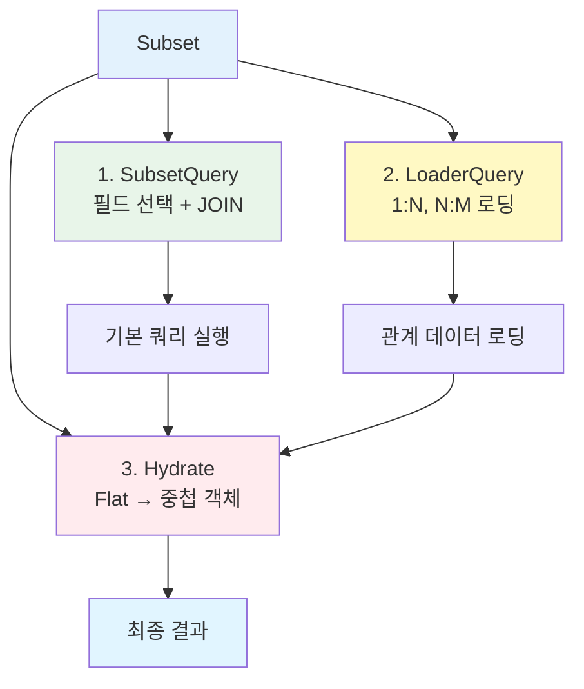
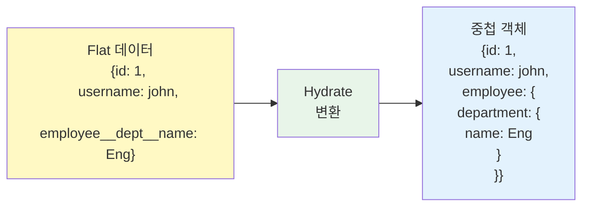

Subset은 Entity의 데이터를 다양한 형태로 조회하기 위한 **미리 정의된 쿼리 템플릿**입니다.

## Subset 개요

<CardGroup cols={2}>
  <Card title="유연한 조회" icon="table-cells">
    상황에 맞는 데이터 형식
    
    A, P, SS 등
  </Card>
  <Card title="타입 안전성" icon="shield">
    컴파일 타임 검증
    
    자동 타입 추론
  </Card>
  <Card title="관계 로딩" icon="link">
    JOIN과 Loader 통합
    
    1:N, N:M 지원
  </Card>
  <Card title="성능 최적화" icon="gauge-high">
    필요한 필드만 선택
    
    N+1 문제 해결
  </Card>
</CardGroup>

## Subset이 필요한 이유

### 문제: 단일 쿼리의 한계

API마다 필요한 데이터 형식이 다릅니다:

```typescript
// ❌ 문제 1: 목록 조회 - 너무 많은 데이터
const users = await db.table("users").selectAll();
// → 모든 컬럼을 가져옴 (password, bio, 불필요한 정보 포함)

// ❌ 문제 2: 상세 조회 - 관계 데이터 로딩 복잡
const user = await db.table("users").where("id", 1).first();
const employee = await db.table("employees").where("user_id", user.id).first();
const department = await db.table("departments").where("id", employee.department_id).first();
// → N+1 문제, 코드 중복

// ❌ 문제 3: 타입 안전성 부족
type UserList = {
  id: number;
  username: string;
  role: string;
}; // 수동으로 타입 정의 필요
```

### 해결: Subset으로 통합

```typescript
// ✅ Subset A: 전체 정보
const admin = await UserModel.findById(1, ["A"]);
// 타입: { id, created_at, email, username, role, bio, ... }

// ✅ Subset P: 프로필 + 관계
const profile = await UserModel.findById(1, ["P"]);
// 타입: { id, username, employee: { salary, department: { name } } }

// ✅ Subset SS: 요약 정보
const summary = await UserModel.findById(1, ["SS"]);
// 타입: { id, username, role, last_login_at }
```

## Subset의 구성 요소



### 1. SubsetQuery - 기본 쿼리

Entity에서 정의된 필드 선택:

```json
{
  "subsets": {
    "A": ["id", "username", "email", "role"],
    "P": ["id", "username", "employee.department.name"],
    "SS": ["id", "username"]
  }
}
```

### 2. LoaderQuery - 관계 로딩

1:N, N:M 관계 데이터 로딩:

```typescript
// Loader 정의 (자동 생성됨)
const loaders = {
  employees: {
    as: "employees",
    refId: "department_id",
    qb: (qb, fromIds) => 
      qb.table("employees")
        .whereIn("department_id", fromIds)
        .select({ id: "id", name: "username" }),
  },
};
```

### 3. Hydrate - 결과 변환

Flat 데이터 → 중첩 객체:

```typescript
// Flat 결과 (DB에서 조회)
{
  id: 1,
  username: "john",
  employee__department__name: "Engineering"
}

// ↓ Hydrate 변환

// 중첩 객체 (최종 결과)
{
  id: 1,
  username: "john",
  employee: {
    department: {
      name: "Engineering"
    }
  }
}
```



## Subset 명명 규칙

일반적인 Subset 이름 패턴:

| Subset | 의미 | 사용 예시 |
|--------|------|----------|
| **A** | All (전체) | 관리자 페이지 상세 |
| **P** | Profile (프로필) | 사용자 프로필 조회 |
| **L** | List (목록) | 목록 API, 테이블 행 |
| **SS** | Summary (요약) | 드롭다운, 간단한 정보 |
| **C** | Card (카드) | 카드 UI 컴포넌트 |

<Info>
Subset 이름은 자유롭게 정의할 수 있습니다. 팀 내에서 일관된 규칙을 사용하세요.
</Info>

## 실전 예제

### 사용자 목록 API

```typescript
// GET /users - 사용자 목록
async list(params: UserListParams) {
  const users = await UserModel.findMany({
    listParams: params,
    subsetKey: "L",  // List Subset 사용
  });
  
  // 타입: { id: number; username: string; role: string; created_at: Date }[]
  return users.map(user => ({
    id: user.id,
    username: user.username,
    role: user.role,
    createdAt: user.created_at,
  }));
}
```

### 사용자 프로필 API

```typescript
// GET /users/:id/profile
async getProfile(userId: number) {
  const user = await UserModel.findById(userId, ["P"]);
  
  if (!user) {
    throw new Error("User not found");
  }
  
  // 타입: {
  //   id: number;
  //   username: string;
  //   employee: {
  //     salary: string;
  //     department: { name: string }
  //   }
  // }
  
  return {
    id: user.id,
    username: user.username,
    department: user.employee?.department?.name,
    salary: user.employee?.salary,
  };
}
```

## Subset vs Raw Puri

### Subset 사용 (권장)

```typescript
// ✅ Subset 사용
const user = await UserModel.findById(1, ["P"]);
// - 타입 안전
// - 코드 재사용
// - 유지보수 쉬움
```

### Raw Puri 사용

```typescript
// ⚠️ Raw Puri (특수한 경우만)
const user = await UserModel.getPuri("r")
  .table("users")
  .join("employees", "users.id", "employees.user_id")
  .leftJoin("departments", "employees.department_id", "departments.id")
  .select({
    id: "users.id",
    username: "users.username",
    deptName: "departments.name",
  })
  .where("users.id", 1)
  .first();
// - 타입 추론 복잡
// - 코드 중복
// - Subset으로 표현 안 되는 특수 쿼리만 사용
```

<Tip>
**언제 Raw Puri를 사용하나요?**
- Subset으로 표현할 수 없는 복잡한 쿼리
- 성능 최적화가 필요한 특수 케이스
- 일회성 데이터 마이그레이션

일반적인 CRUD는 **항상 Subset 사용**을 권장합니다.
</Tip>

## 다음 단계

<CardGroup cols={2}>
  <Card title="Subset 정의하기" icon="pen" href="/ko/database/subsets/defining-subsets">
    Entity에서 Subset 생성
  </Card>
  <Card title="Subset 사용하기" icon="code" href="/ko/database/subsets/using-subsets">
    Model에서 Subset 활용
  </Card>
  <Card title="중첩 관계" icon="diagram-project" href="/ko/database/subsets/nested-relations">
    LoaderQuery로 1:N, N:M 로딩
  </Card>
  <Card title="Puri 기본" icon="database" href="/ko/database/puri/basic-queries">
    Puri 쿼리 빌더 배우기
  </Card>
</CardGroup>
