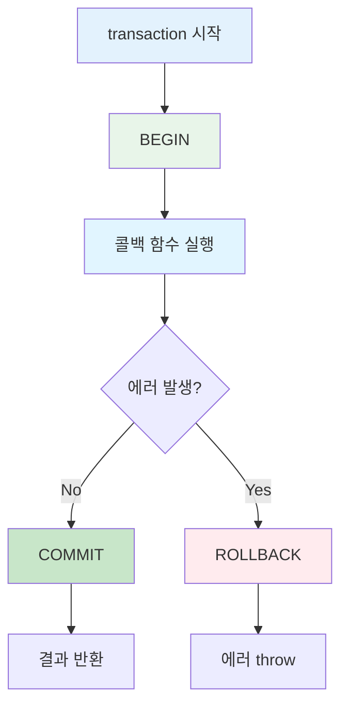
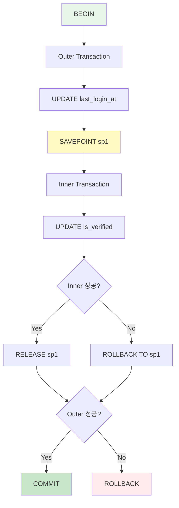

`transaction()` 메서드를 사용하면 트랜잭션을 세밀하게 제어할 수 있습니다.

## 수동 트랜잭션 개요

<CardGroup cols={2}>
  <Card title="세밀한 제어" icon="sliders">
    트랜잭션 경계 명확
    
    부분 트랜잭션 가능
  </Card>
  <Card title="조건부 롤백" icon="code-branch">
    상황에 따른 롤백
    
    커밋 전 검증
  </Card>
  <Card title="중첩 트랜잭션" icon="layer-group">
    Savepoint 사용
    
    부분 롤백 지원
  </Card>
  <Card title="명시적 관리" icon="hand">
    트랜잭션 흐름 명확
    
    디버깅 용이
  </Card>
</CardGroup>

## 기본 사용법

### 단순 트랜잭션

```typescript
class UserModel extends BaseModelClass {
  async createUser(data: UserSaveParams): Promise<number> {
    const wdb = this.getPuri("w");
    
    return wdb.transaction(async (trx) => {
      // 트랜잭션 내에서 trx 사용
      trx.ubRegister("users", data);
      const [userId] = await trx.ubUpsert("users");
      
      // 성공 시 자동 커밋
      return userId;
    });
  }
}
```

<Info>
`transaction()` 콜백 함수가 성공적으로 완료되면 자동으로 COMMIT됩니다.
에러가 발생하면 자동으로 ROLLBACK됩니다.
</Info>

### 트랜잭션 흐름



## 실전 예제

### 예제 1: 기본 트랜잭션

```typescript
class UserModel extends BaseModelClass {
  async registerUser(
    userData: UserSaveParams,
    profileData: { bio: string }
  ): Promise<number> {
    const wdb = this.getPuri("w");
    
    return wdb.transaction(async (trx) => {
      // 1. User 생성
      const [user] = await trx
        .table("users")
        .insert(userData)
        .returning({ id: "id" });
      
      // 2. Profile 업데이트
      await trx
        .table("users")
        .where("id", user.id)
        .update({ bio: profileData.bio });
      
      // 성공 시 자동 커밋
      return user.id;
    });
  }
}
```

### 예제 2: 조건부 롤백

```typescript
class OrderModel extends BaseModelClass {
  async createOrder(
    userId: number,
    items: OrderItem[]
  ): Promise<number> {
    const wdb = this.getPuri("w");
    
    return wdb.transaction(async (trx) => {
      // 1. 재고 확인
      for (const item of items) {
        const product = await trx
          .table("products")
          .where("id", item.productId)
          .first();
        
        if (!product || product.stock < item.quantity) {
          // 조건부 롤백
          throw new Error(`Insufficient stock for product ${item.productId}`);
        }
      }
      
      // 2. 주문 생성
      const [order] = await trx
        .table("orders")
        .insert({ user_id: userId, status: "pending" })
        .returning({ id: "id" });
      
      // 3. 재고 차감
      for (const item of items) {
        await trx
          .table("products")
          .where("id", item.productId)
          .decrement("stock", item.quantity);
      }
      
      return order.id;
    });
  }
}
```

### 예제 3: UpsertBuilder와 함께

```typescript
class CompanyModel extends BaseModelClass {
  async createOrganization(data: {
    companyName: string;
    departments: string[];
  }): Promise<{ companyId: number; departmentIds: number[] }> {
    const wdb = this.getPuri("w");
    
    return wdb.transaction(async (trx) => {
      // 1. Company 등록
      const companyRef = trx.ubRegister("companies", {
        name: data.companyName,
      });
      
      // 2. Departments 등록
      data.departments.forEach((name) => {
        trx.ubRegister("departments", {
          name,
          company_id: companyRef,
        });
      });
      
      // 3. 순서대로 저장
      const [companyId] = await trx.ubUpsert("companies");
      const departmentIds = await trx.ubUpsert("departments");
      
      return { companyId, departmentIds };
    });
  }
}
```

## 중첩 트랜잭션 (Savepoint)

### 기본 중첩

```typescript
class UserModel extends BaseModelClass {
  async complexOperation(userId: number): Promise<void> {
    const wdb = this.getPuri("w");
    
    return wdb.transaction(async (trx1) => {
      console.log("Outer transaction started");
      
      // 외부 트랜잭션 작업
      await trx1
        .table("users")
        .where("id", userId)
        .update({ last_login_at: new Date() });
      
      // 중첩 트랜잭션 (Savepoint)
      await trx1.transaction(async (trx2) => {
        console.log("Inner transaction started (savepoint)");
        
        // 내부 트랜잭션 작업
        await trx2
          .table("users")
          .where("id", userId)
          .update({ is_verified: true });
      });
      
      console.log("Outer transaction completed");
    });
  }
}
```



### 부분 롤백

```typescript
class UserModel extends BaseModelClass {
  async updateWithPartialRollback(userId: number): Promise<void> {
    const wdb = this.getPuri("w");
    
    return wdb.transaction(async (trx1) => {
      // 1. 외부 트랜잭션 작업 (유지됨)
      await trx1
        .table("users")
        .where("id", userId)
        .update({ last_login_at: new Date() });
      
      try {
        // 2. 중첩 트랜잭션 (실패 가능)
        await trx1.transaction(async (trx2) => {
          await trx2
            .table("users")
            .where("id", userId)
            .update({ is_verified: true });
          
          // 의도적인 에러
          throw new Error("Inner transaction failed");
        });
      } catch (error) {
        console.log("Inner transaction rolled back");
        // 내부 트랜잭션만 롤백, 외부는 계속 진행
      }
      
      // 3. 외부 트랜잭션 계속 (커밋됨)
      await trx1
        .table("users")
        .where("id", userId)
        .update({ bio: "Updated after inner rollback" });
    });
  }
}
```

<Info>
**중첩 트랜잭션의 장점**:
- 부분 작업의 독립적 롤백
- 복잡한 비즈니스 로직 구조화
- 에러 격리 가능
</Info>

## 명시적 롤백

### rollback() 호출

```typescript
class OrderModel extends BaseModelClass {
  async createOrderWithValidation(
    userId: number,
    items: OrderItem[]
  ): Promise<number | null> {
    const wdb = this.getPuri("w");
    
    return wdb.transaction(async (trx) => {
      // 1. 주문 생성
      const [order] = await trx
        .table("orders")
        .insert({ user_id: userId, status: "pending" })
        .returning({ id: "id" });
      
      // 2. 유효성 검사
      const totalAmount = await this.calculateTotal(items);
      
      if (totalAmount > 1000000) {
        // 명시적 롤백
        await trx.rollback();
        return null;
      }
      
      // 3. 주문 상세 저장
      for (const item of items) {
        await trx
          .table("order_items")
          .insert({
            order_id: order.id,
            product_id: item.productId,
            quantity: item.quantity,
          });
      }
      
      return order.id;
    });
  }
  
  private async calculateTotal(items: OrderItem[]): Promise<number> {
    // 총액 계산 로직
    return items.reduce((sum, item) => sum + item.price * item.quantity, 0);
  }
}
```

<Warning>
`rollback()` 호출 후에도 코드는 계속 실행됩니다.
명시적으로 `return`하거나 `throw`해야 합니다.
</Warning>

## 트랜잭션 격리 수준

### Isolation Level 설정

```typescript
class UserModel extends BaseModelClass {
  async updateWithIsolation(userId: number): Promise<void> {
    const wdb = this.getPuri("w");
    
    // PostgreSQL/MySQL 모두 지원
    return wdb.transaction(
      async (trx) => {
        const user = await trx
          .table("users")
          .where("id", userId)
          .first();
        
        if (!user) {
          throw new Error("User not found");
        }
        
        await trx
          .table("users")
          .where("id", userId)
          .update({ last_login_at: new Date() });
      },
      { isolation: "repeatable read" }
    );
  }
}
```

### 격리 수준별 특징

| Level | Dirty Read | Non-repeatable Read | Phantom Read | 성능 |
|-------|------------|---------------------|--------------|------|
| READ UNCOMMITTED | O | O | O | ⭐⭐⭐⭐⭐ |
| READ COMMITTED | X | O | O | ⭐⭐⭐⭐ |
| REPEATABLE READ | X | X | O | ⭐⭐⭐ |
| SERIALIZABLE | X | X | X | ⭐⭐ |

<Tip>
**격리 수준 선택 가이드**:
- 일반 조회/수정: READ COMMITTED
- 일관성 중요: REPEATABLE READ (기본값)
- 금융 거래: SERIALIZABLE
</Tip>

## 에러 처리

### Try-Catch 패턴

```typescript
class UserModel extends BaseModelClass {
  async createUserSafely(data: UserSaveParams): Promise<{
    success: boolean;
    userId?: number;
    error?: string;
  }> {
    const wdb = this.getPuri("w");
    
    try {
      const userId = await wdb.transaction(async (trx) => {
        // 중복 체크
        const existing = await trx
          .table("users")
          .where("email", data.email)
          .first();
        
        if (existing) {
          throw new Error("Email already exists");
        }
        
        // User 생성
        const [user] = await trx
          .table("users")
          .insert(data)
          .returning({ id: "id" });
        
        return user.id;
      });
      
      return { success: true, userId };
    } catch (error) {
      return {
        success: false,
        error: error instanceof Error ? error.message : "Unknown error",
      };
    }
  }
}
```

### 트랜잭션 내 에러 처리

```typescript
class OrderModel extends BaseModelClass {
  async processOrder(orderId: number): Promise<void> {
    const wdb = this.getPuri("w");
    
    return wdb.transaction(async (trx) => {
      // 1. 주문 조회
      const order = await trx
        .table("orders")
        .where("id", orderId)
        .first();
      
      if (!order) {
        throw new Error("Order not found");
      }
      
      // 2. 상태 검증
      if (order.status !== "pending") {
        throw new Error(`Cannot process order with status: ${order.status}`);
      }
      
      try {
        // 3. 결제 처리 (외부 API)
        await this.processPayment(order);
      } catch (error) {
        // 결제 실패 시 주문 상태 업데이트
        await trx
          .table("orders")
          .where("id", orderId)
          .update({ status: "failed" });
        
        // 에러 재전파 (트랜잭션 롤백)
        throw error;
      }
      
      // 4. 주문 완료
      await trx
        .table("orders")
        .where("id", orderId)
        .update({ status: "completed" });
    });
  }
  
  private async processPayment(order: any): Promise<void> {
    // 결제 로직
  }
}
```

## 트랜잭션 디버깅

### 로깅

```typescript
class UserModel extends BaseModelClass {
  async createUserWithLogging(data: UserSaveParams): Promise<number> {
    const wdb = this.getPuri("w");
    
    console.log("[TRX] Starting transaction");
    
    return wdb.transaction(async (trx) => {
      console.log("[TRX] Inside transaction");
      
      const [userId] = await trx
        .table("users")
        .insert(data)
        .returning({ id: "id" });
      
      console.log("[TRX] User created:", userId);
      
      // 트랜잭션 상태 확인 (디버그용)
      await trx.debugTransaction();
      
      console.log("[TRX] Committing transaction");
      return userId.id;
    }).then(
      (result) => {
        console.log("[TRX] Transaction committed successfully");
        return result;
      },
      (error) => {
        console.log("[TRX] Transaction rolled back:", error.message);
        throw error;
      }
    );
  }
}
```

## 성능 최적화

### 트랜잭션 최소화

```typescript
// ❌ 나쁨: 긴 트랜잭션
async badPattern(userId: number): Promise<void> {
  const wdb = this.getPuri("w");
  
  return wdb.transaction(async (trx) => {
    // 불필요한 조회 (트랜잭션 밖에서 가능)
    const user = await trx.table("users").where("id", userId).first();
    
    // 외부 API 호출 (트랜잭션 안에서 불필요)
    await this.sendEmail(user.email);
    
    // 실제 업데이트
    await trx.table("users").where("id", userId).update({ last_login_at: new Date() });
  });
}

// ✅ 좋음: 짧은 트랜잭션
async goodPattern(userId: number): Promise<void> {
  const rdb = this.getPuri("r");
  const wdb = this.getPuri("w");
  
  // 1. 조회 (READ DB, 트랜잭션 밖)
  const user = await rdb.table("users").where("id", userId).first();
  
  if (!user) {
    throw new Error("User not found");
  }
  
  // 2. 외부 작업 (트랜잭션 밖)
  await this.sendEmail(user.email);
  
  // 3. 업데이트 (짧은 트랜잭션)
  return wdb.transaction(async (trx) => {
    await trx.table("users").where("id", userId).update({ last_login_at: new Date() });
  });
}
```

<Warning>
**트랜잭션 최적화 원칙**:
- 트랜잭션은 최대한 짧게
- 외부 API 호출은 트랜잭션 밖에서
- 읽기 전용 조회는 트랜잭션 불필요
- 락 대기 시간 최소화
</Warning>

## @transactional vs 수동 트랜잭션

### 비교

| 특징 | @transactional | 수동 transaction() |
|------|----------------|-------------------|
| 코드 간결성 | ⭐⭐⭐⭐⭐ | ⭐⭐⭐ |
| 세밀한 제어 | ⭐⭐ | ⭐⭐⭐⭐⭐ |
| 부분 트랜잭션 | ❌ | ✅ |
| 조건부 롤백 | ⭐⭐ | ⭐⭐⭐⭐⭐ |
| 디버깅 | ⭐⭐⭐ | ⭐⭐⭐⭐ |
| 재사용성 | ⭐⭐⭐⭐⭐ | ⭐⭐⭐ |

### 선택 가이드

```typescript
class UserModel extends BaseModelClass {
  // ✅ @transactional 사용 - 단순한 경우
  @transactional()
  async simpleCreate(data: UserSaveParams): Promise<number> {
    const wdb = this.getPuri("w");
    wdb.ubRegister("users", data);
    const [id] = await wdb.ubUpsert("users");
    return id;
  }
  
  // ✅ 수동 transaction - 복잡한 제어
  async complexCreate(data: UserSaveParams): Promise<number | null> {
    const wdb = this.getPuri("w");
    
    return wdb.transaction(async (trx) => {
      // 조건부 작업
      if (await this.shouldCreateUser(data)) {
        const [id] = await trx.table("users").insert(data).returning({ id: "id" });
        return id.id;
      }
      
      // 조건 불충족 시 롤백
      await trx.rollback();
      return null;
    });
  }
}
```

## 다음 단계

<CardGroup cols={2}>
  <Card title="@transactional" icon="at" href="/ko/database/transactions/transactional-decorator">
    데코레이터로 간편하게
  </Card>
  <Card title="모범 사례" icon="star" href="/ko/database/transactions/best-practices">
    트랜잭션 사용 가이드
  </Card>
  <Card title="UpsertBuilder" icon="database" href="/ko/database/upsert-builder/basic-usage">
    트랜잭션 내 데이터 저장
  </Card>
  <Card title="Puri" icon="search" href="/ko/database/puri/basic-queries">
    쿼리 빌더 사용하기
  </Card>
</CardGroup>
