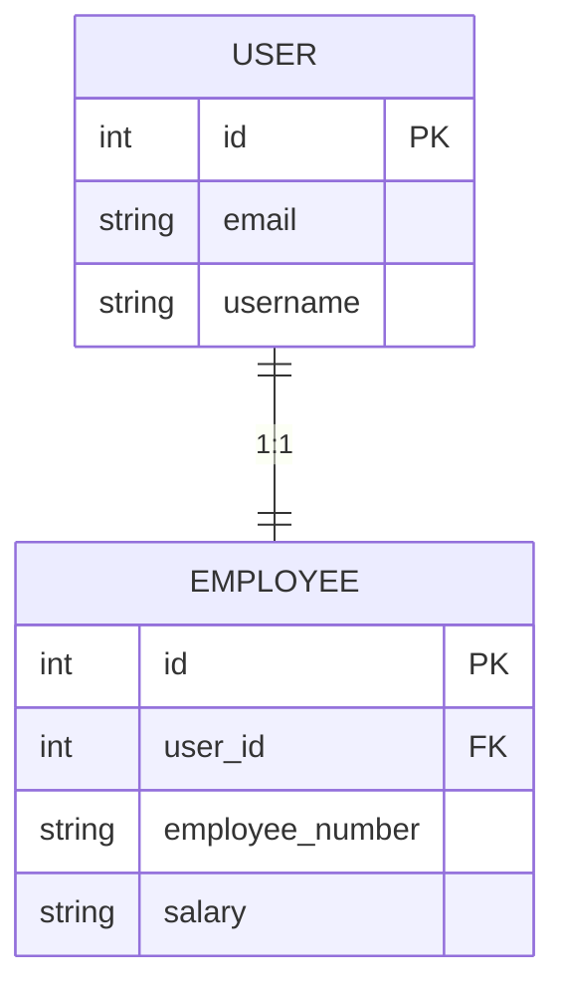
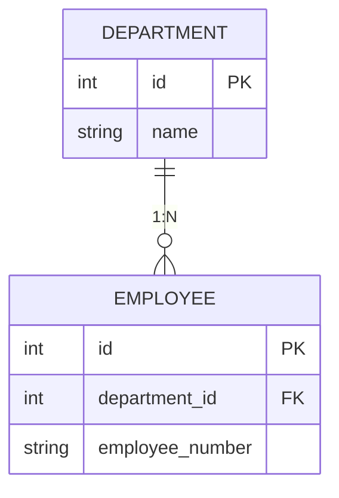
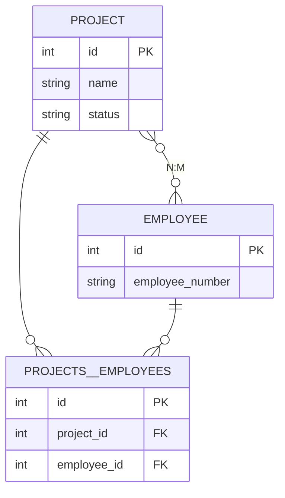
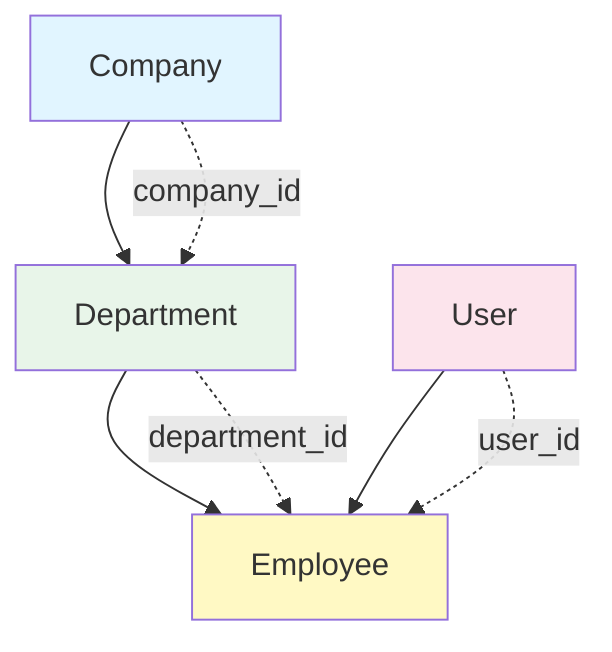

UBRef를 사용하면 외래 키 ID를 미리 알지 못해도 관계 데이터를 쉽게 저장할 수 있습니다.

## 관계 패턴 개요

<CardGroup cols={2}>
  <Card title="OneToOne" icon="arrow-right">
    1:1 관계
    
    User → Employee
  </Card>
  <Card title="OneToMany" icon="arrow-right-to-bracket">
    1:N 관계
    
    Department → Employees
  </Card>
  <Card title="ManyToMany" icon="diagram-project">
    N:M 관계
    
    Projects ↔ Employees
  </Card>
  <Card title="계층 구조" icon="sitemap">
    Self-referencing
    
    Department → Parent
  </Card>
</CardGroup>

## OneToOne 관계

User와 Employee가 1:1 관계인 경우:

```typescript
await db.transaction(async (trx) => {
  // 1. User 등록
  const userRef = trx.ubRegister("users", {
    email: "john@test.com",
    username: "john",
    password: "hashed_password",
    role: "normal",
  });
  
  // 2. Employee 등록 (User 참조)
  trx.ubRegister("employees", {
    user_id: userRef, // ← UBRef 사용
    employee_number: "E001",
    salary: "70000",
  });
  
  // 3. 저장
  const [userId] = await trx.ubUpsert("users");
  const [employeeId] = await trx.ubUpsert("employees");
  
  console.log({ userId, employeeId });
  // { userId: 1, employeeId: 1 }
});
```



## OneToMany 관계

Department가 여러 Employee를 가지는 경우:

```typescript
await db.transaction(async (trx) => {
  // 1. Department 등록
  const deptRef = trx.ubRegister("departments", {
    name: "Engineering",
  });
  
  // 2. 여러 Employee 등록 (같은 Department 참조)
  const employees = [
    { name: "John", number: "E001" },
    { name: "Jane", number: "E002" },
    { name: "Bob", number: "E003" },
  ];
  
  for (const emp of employees) {
    const userRef = trx.ubRegister("users", {
      email: `${emp.name.toLowerCase()}@test.com`,
      username: emp.name,
      password: "pass",
      role: "normal",
    });
    
    trx.ubRegister("employees", {
      user_id: userRef,
      department_id: deptRef, // ← 같은 deptRef 사용
      employee_number: emp.number,
    });
  }
  
  // 3. 저장
  const [deptId] = await trx.ubUpsert("departments");
  const userIds = await trx.ubUpsert("users");
  const empIds = await trx.ubUpsert("employees");
  
  console.log({
    deptId,
    userCount: userIds.length,
    empCount: empIds.length,
  });
  // { deptId: 1, userCount: 3, empCount: 3 }
});
```



## ManyToMany 관계

Project와 Employee가 N:M 관계인 경우 (중간 테이블 사용):

```typescript
await db.transaction(async (trx) => {
  // 1. Project 등록
  const projectRef = trx.ubRegister("projects", {
    name: "New Feature",
    status: "in_progress",
  });
  
  // 2. Employee 등록
  const emp1Ref = trx.ubRegister("users", {
    email: "dev1@test.com",
    username: "dev1",
    password: "pass",
    role: "normal",
  });
  
  const emp2Ref = trx.ubRegister("users", {
    email: "dev2@test.com",
    username: "dev2",
    password: "pass",
    role: "normal",
  });
  
  trx.ubRegister("employees", {
    user_id: emp1Ref,
    employee_number: "E100",
  });
  
  trx.ubRegister("employees", {
    user_id: emp2Ref,
    employee_number: "E101",
  });
  
  // 3. 조인 테이블 등록 (Project ↔ Employee)
  const employee1Ref = trx.ubRegister("employees", {
    user_id: emp1Ref,
    employee_number: "E100",
  });
  
  const employee2Ref = trx.ubRegister("employees", {
    user_id: emp2Ref,
    employee_number: "E101",
  });
  
  trx.ubRegister("projects__employees", {
    project_id: projectRef, // ← Project UBRef
    employee_id: employee1Ref, // ← Employee UBRef
  });
  
  trx.ubRegister("projects__employees", {
    project_id: projectRef,
    employee_id: employee2Ref,
  });
  
  // 4. 저장
  const [projectId] = await trx.ubUpsert("projects");
  const userIds = await trx.ubUpsert("users");
  const empIds = await trx.ubUpsert("employees");
  await trx.ubUpsert("projects__employees");
  
  console.log({
    projectId,
    userCount: userIds.length,
    empCount: empIds.length,
  });
});
```



<Info>
**ManyToMany 저장 순서**:
1. 양쪽 메인 테이블 먼저 저장 (projects, employees)
2. 조인 테이블 나중에 저장 (projects__employees)
</Info>

## 계층 구조 (Self-Referencing)

Department가 부모 Department를 참조하는 경우:

```typescript
await db.transaction(async (trx) => {
  // 1. 본부 (최상위)
  const headquartersRef = trx.ubRegister("departments", {
    name: "본부",
    parent_id: null, // 최상위
  });
  
  // 2. 개발팀 (본부 하위)
  const devTeamRef = trx.ubRegister("departments", {
    name: "개발팀",
    parent_id: headquartersRef, // ← 부모 참조
  });
  
  // 3. 백엔드팀 (개발팀 하위)
  trx.ubRegister("departments", {
    name: "백엔드팀",
    parent_id: devTeamRef, // ← 부모 참조
  });
  
  // 4. 프론트엔드팀 (개발팀 하위)
  trx.ubRegister("departments", {
    name: "프론트엔드팀",
    parent_id: devTeamRef, // ← 부모 참조
  });
  
  // 5. 저장 (한 번에 가능)
  const deptIds = await trx.ubUpsert("departments");
  
  console.log({ deptCount: deptIds.length });
  // { deptCount: 4 }
});
```

**결과 구조**:
```
본부 (id: 1, parent_id: null)
└── 개발팀 (id: 2, parent_id: 1)
    ├── 백엔드팀 (id: 3, parent_id: 2)
    └── 프론트엔드팀 (id: 4, parent_id: 2)
```

<Warning>
Self-referencing은 같은 테이블 내 참조이므로 **한 번의 ubUpsert**로 저장 가능합니다.
하지만 순환 참조는 불가능합니다.
</Warning>

## 복합 관계

Company → Department → Employee → User 전체 체인:

```typescript
await db.transaction(async (trx) => {
  // 1. Company
  const companyRef = trx.ubRegister("companies", {
    name: "Tech Corp",
  });
  
  // 2. Department (Company 참조)
  const deptRef = trx.ubRegister("departments", {
    name: "Engineering",
    company_id: companyRef,
  });
  
  // 3. User
  const userRef = trx.ubRegister("users", {
    email: "john@test.com",
    username: "john",
    password: "pass",
    role: "normal",
  });
  
  // 4. Employee (User, Department 참조)
  trx.ubRegister("employees", {
    user_id: userRef,
    department_id: deptRef,
    employee_number: "E001",
    salary: "70000",
  });
  
  // 5. 의존성 순서대로 저장
  await trx.ubUpsert("companies");
  await trx.ubUpsert("departments");
  await trx.ubUpsert("users");
  await trx.ubUpsert("employees");
});
```



## 실전 예제

### 프로젝트 생성 (팀 배정)

```typescript
async createProjectWithTeam(data: {
  projectName: string;
  description: string;
  memberEmails: string[];
}) {
  return await this.getPuri("w").transaction(async (trx) => {
    // 1. Project 등록
    const projectRef = trx.ubRegister("projects", {
      name: data.projectName,
      description: data.description,
      status: "planning",
    });
    
    // 2. 기존 Employee 조회
    const employees = await trx
      .table("employees")
      .join("users", "employees.user_id", "users.id")
      .select({
        emp_id: "employees.id",
        email: "users.email",
      })
      .whereIn("users.email", data.memberEmails);
    
    // 3. Project ↔ Employee 관계 등록
    for (const emp of employees) {
      trx.ubRegister("projects__employees", {
        project_id: projectRef,
        employee_id: emp.emp_id, // 기존 ID 사용
      });
    }
    
    // 4. 저장
    const [projectId] = await trx.ubUpsert("projects");
    await trx.ubUpsert("projects__employees");
    
    return { projectId, memberCount: employees.length };
  });
}
```

### 조직 구조 생성

```typescript
async createOrganization(data: {
  companyName: string;
  departments: Array<{
    name: string;
    parentName?: string;
  }>;
}) {
  return await this.getPuri("w").transaction(async (trx) => {
    // 1. Company
    const companyRef = trx.ubRegister("companies", {
      name: data.companyName,
    });
    
    // 2. Department 참조 맵
    const deptRefs = new Map<string, any>();
    
    // 3. Department 등록
    for (const dept of data.departments) {
      const parentRef = dept.parentName
        ? deptRefs.get(dept.parentName)
        : null;
      
      const deptRef = trx.ubRegister("departments", {
        name: dept.name,
        company_id: companyRef,
        parent_id: parentRef,
      });
      
      deptRefs.set(dept.name, deptRef);
    }
    
    // 4. 저장
    const [companyId] = await trx.ubUpsert("companies");
    const deptIds = await trx.ubUpsert("departments");
    
    return {
      companyId,
      departmentCount: deptIds.length,
    };
  });
}

// 사용
await createOrganization({
  companyName: "Tech Startup",
  departments: [
    { name: "본부" },
    { name: "개발팀", parentName: "본부" },
    { name: "백엔드팀", parentName: "개발팀" },
    { name: "프론트엔드팀", parentName: "개발팀" },
  ],
});
```

### 사용자 초대 (User + Profile + Settings)

```typescript
async inviteUser(data: {
  email: string;
  username: string;
  bio?: string;
  theme?: string;
}) {
  return await this.getPuri("w").transaction(async (trx) => {
    // 1. User
    const userRef = trx.ubRegister("users", {
      email: data.email,
      username: data.username,
      password: "temp_password", // 이메일로 변경 링크 전송
      role: "normal",
      is_verified: false,
    });
    
    // 2. Profile
    trx.ubRegister("profiles", {
      user_id: userRef,
      bio: data.bio || "",
    });
    
    // 3. Settings
    trx.ubRegister("user_settings", {
      user_id: userRef,
      theme: data.theme || "light",
      language: "ko",
    });
    
    // 4. 저장
    const [userId] = await trx.ubUpsert("users");
    await trx.ubUpsert("profiles");
    await trx.ubUpsert("user_settings");
    
    return userId;
  });
}
```

## UBRef vs 실제 ID

### UBRef 사용 (신규 레코드)

```typescript
// ✅ 새로 만드는 레코드는 UBRef 사용
const userRef = trx.ubRegister("users", { ... });

trx.ubRegister("employees", {
  user_id: userRef, // ← UBRef
});
```

### 실제 ID 사용 (기존 레코드)

```typescript
// ✅ 이미 존재하는 레코드는 실제 ID 사용
const existingDeptId = 5;

trx.ubRegister("employees", {
  user_id: userRef, // UBRef (신규)
  department_id: existingDeptId, // 실제 ID (기존)
});
```

### 혼합 사용

```typescript
await db.transaction(async (trx) => {
  // 신규 User
  const userRef = trx.ubRegister("users", { ... });
  
  // 기존 Department ID
  const existingDeptId = 10;
  
  // 혼합
  trx.ubRegister("employees", {
    user_id: userRef, // UBRef
    department_id: existingDeptId, // 실제 ID
  });
  
  await trx.ubUpsert("users");
  await trx.ubUpsert("employees");
});
```

## 다음 단계

<CardGroup cols={2}>
  <Card title="배치 작업" icon="layer-group" href="/ko/database/upsert-builder/batch-operations">
    대량 데이터 등록
  </Card>
  <Card title="고급 패턴" icon="wand-magic-sparkles" href="/ko/database/upsert-builder/advanced-patterns">
    복잡한 데이터 구조
  </Card>
  <Card title="기본 사용법" icon="play" href="/ko/database/upsert-builder/basic-usage">
    UpsertBuilder 기초
  </Card>
  <Card title="트랜잭션" icon="arrows-rotate" href="/ko/database/transactions">
    트랜잭션 가이드
  </Card>
</CardGroup>
