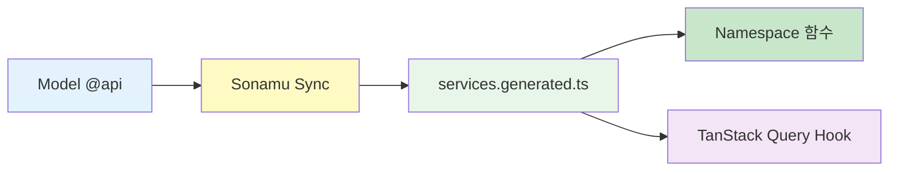

생성된 Namespace Service를 사용하여 타입 안전하게 API를 호출하는 방법을 알아봅니다.

## Service 사용 개요

<CardGroup cols={2}>
  <Card title="Namespace 호출" icon="cube">
    UserService.getUser() 간결한 문법
  </Card>
  <Card title="타입 안전" icon="shield-check">
    자동 완성 컴파일 검증
  </Card>
  <Card title="Subset 지원" icon="layer-group">
    필요한 필드만 성능 최적화
  </Card>
  <Card title="TanStack Query" icon="arrows-rotate">
    useUser Hook 자동 캐싱
  </Card>
</CardGroup>

## 기본 사용법

### Service Import

생성된 Service는 `services.generated.ts`에서 Namespace로 export됩니다.

```typescript
// ✅ 올바른 import 방식
import { UserService, PostService } from "@/services/services.generated";
```

**단일 파일 import의 장점**:

1. **일관성**: 모든 Service가 한 곳에서 관리됨
2. **간편한 import**: 파일 경로 찾을 필요 없음
3. **자동 업데이트**: `pnpm generate` 시 자동으로 동기화
4. **명확한 네이밍**: Namespace로 그룹화되어 충돌 없음

### 기본 API 호출

Service의 정적 함수를 직접 호출합니다.

```typescript
import { UserService } from "@/services/services.generated";

// 사용자 조회 (Subset "A"로 기본 정보만)
const user = await UserService.getUser("A", 123);
console.log(user.username); // 타입 안전!

// 사용자 수정
await UserService.updateProfile({
  username: "newname",
  bio: "Hello, World!",
});
```

**특징**:

- `await`으로 비동기 호출
- 응답은 자동으로 파싱됨 (fetch 함수 내부 처리)
- 타입이 완전히 보장됨
- **Subset 파라미터 필수** (getUser 등)

<Info>
  **Namespace 기반 구조**: - ❌ 클래스 인스턴스: `new UserService()` 불필요 - ✅ 정적 함수:
  `UserService.getUser()` 직접 호출 - 모든 함수가 독립적으로 동작
</Info>

### Subset 시스템 이해하기

Sonamu의 핵심 기능인 Subset 시스템입니다.

```typescript
// Subset "A": 기본 정보
const basicUser = await UserService.getUser("A", 123);
console.log(basicUser.id); // ✅ OK
console.log(basicUser.username); // ✅ OK
console.log(basicUser.bio); // ❌ 컴파일 에러 (Subset A에 없음)

// Subset "B": bio 포함
const userWithBio = await UserService.getUser("B", 123);
console.log(userWithBio.bio); // ✅ OK

// Subset "C": 전체 필드
const fullUser = await UserService.getUser("C", 123);
console.log(fullUser.createdAt); // ✅ OK
```

**Subset을 사용하는 이유**:

1. **성능**: 필요한 필드만 조회하여 네트워크 비용 절감
2. **타입 안전**: 각 Subset마다 정확한 타입 반환
3. **명시성**: 어떤 데이터가 필요한지 코드에서 명확히 표현

## React에서 사용하기

### TanStack Query Hook (권장)

가장 간편한 방법은 자동 생성된 TanStack Query Hook을 사용하는 것입니다.

```typescript
import { UserService } from "@/services/services.generated";

function UserProfile({ userId }: { userId: number }) {
  // 자동 생성된 Hook 사용
  const { data: user, error, isLoading } = UserService.useUser("A", userId);

  if (isLoading) return <div>Loading...</div>;
  if (error) return <div>Error: {error.message}</div>;
  if (!user) return <div>User not found</div>;

  return (
    <div>
      <h1>{user.username}</h1>
      <p>{user.email}</p>
    </div>
  );
}
```

**TanStack Query Hook의 장점**:

- 자동 캐싱 (같은 userId 재사용)
- 자동 재검증 (포커스 시, 재연결 시)
- 로딩/에러 상태 자동 관리
- 중복 요청 자동 제거

### 함수 컴포넌트 (useEffect)

Hook을 사용하지 않고 직접 호출할 수도 있습니다.

```typescript
import { useState, useEffect } from "react";
import { UserService } from "@/services/services.generated";
import type { User } from "@/services/services.generated";

function UserProfile({ userId }: { userId: number }) {
  const [user, setUser] = useState<User | null>(null);
  const [loading, setLoading] = useState(true);
  const [error, setError] = useState<string | null>(null);

  useEffect(() => {
    async function fetchUser() {
      try {
        setLoading(true);
        // Subset "C"로 전체 필드 조회
        const userData = await UserService.getUser("C", userId);
        setUser(userData);
      } catch (err) {
        setError(err instanceof Error ? err.message : "Failed to load user");
      } finally {
        setLoading(false);
      }
    }

    fetchUser();
  }, [userId]);

  if (loading) return <div>Loading...</div>;
  if (error) return <div>Error: {error}</div>;
  if (!user) return <div>User not found</div>;

  return (
    <div>
      <h1>{user.username}</h1>
      <p>{user.email}</p>
    </div>
  );
}
```

<Info>
  **권장**: 가능하면 TanStack Query Hook을 사용하세요. 자동 캐싱, 재검증, 상태 관리를 모두 제공하여
  코드가 훨씬 간결해집니다.
</Info>

### 이벤트 핸들러

사용자 액션에 따라 API를 호출합니다.

```typescript
import { useState } from "react";
import { UserService } from "@/services/services.generated";

function EditProfile({ userId }: { userId: number }) {
  const [username, setUsername] = useState("");
  const [bio, setBio] = useState("");
  const [saving, setSaving] = useState(false);

  async function handleSubmit(e: React.FormEvent) {
    e.preventDefault();

    try {
      setSaving(true);

      await UserService.updateProfile({
        username,
        bio,
      });

      alert("Profile updated!");
    } catch (error) {
      alert("Failed to update profile");
      console.error(error);
    } finally {
      setSaving(false);
    }
  }

  return (
    <form onSubmit={handleSubmit}>
      <input
        type="text"
        value={username}
        onChange={(e) => setUsername(e.target.value)}
        placeholder="Username"
      />

      <textarea
        value={bio}
        onChange={(e) => setBio(e.target.value)}
        placeholder="Bio"
      />

      <button type="submit" disabled={saving}>
        {saving ? "Saving..." : "Save"}
      </button>
    </form>
  );
}
```

### useTypeForm으로 폼 처리하기 (권장)

`@sonamu-kit/react-components`의 `useTypeForm`을 사용하면 타입 안전한 폼을 더 간편하게 작성할 수 있습니다.

```tsx
import { useTypeForm } from "@sonamu-kit/react-components/lib";
import { Input, Button } from "@sonamu-kit/react-components/components";
import { UserService } from "@/services/services.generated";
import { UserSaveParams } from "@/services/user/user.types";

function RegisterForm() {
  // Zod 스키마 기반 타입 안전 폼
  const { register, submit } = useTypeForm(UserSaveParams, {
    email: "",
    username: "",
    password: "",
  });

  const saveMutation = UserService.useSaveMutation();

  const handleSubmit = submit(async (form) => {
    saveMutation.mutate(
      { spa: [form] },
      {
        onSuccess: ([userId]) => {
          console.log("Registered:", userId); // ✅ 타입 안전
        },
        onError: (error) => {
          console.error("Registration failed:", error);
        },
      },
    );
  });

  return (
    <div>
      <Input placeholder="이메일" {...register("email")} />
      <Input placeholder="이름" {...register("username")} />
      <Input type="password" placeholder="비밀번호" {...register("password")} />
      <Button onClick={handleSubmit} disabled={saveMutation.isPending}>
        {saveMutation.isPending ? "등록 중..." : "등록"}
      </Button>
    </div>
  );
}
```

**useTypeForm의 장점**:

- ✅ **타입 안전**: Zod 스키마에서 타입 자동 추론
- ✅ **자동 유효성 검사**: 스키마 규칙 자동 적용
- ✅ **간결한 코드**: `useState` + 이벤트 핸들러 불필요
- ✅ **에러 처리**: 필드별 에러 메시지 자동 관리
- ✅ **통합 컴포넌트**: Input, Button 등 즉시 사용 가능

<Info>
  **권장**: 새로운 폼을 작성할 때는 `useTypeForm`을 사용하세요. 보일러플레이트 코드를 크게 줄이고
  타입 안전성을 보장합니다.
</Info>

**에러 표시 예제**:

```tsx
function RegisterFormWithErrors() {
  const { register, submit, errors } = useTypeForm(UserSaveParams, {
    email: "",
    username: "",
    password: "",
  });

  const saveMutation = UserService.useSaveMutation();

  const handleSubmit = submit(async (form) => {
    saveMutation.mutate({ spa: [form] });
  });

  return (
    <div>
      <div>
        <Input placeholder="이메일" {...register("email")} />
        {errors.email && <span className="error">{errors.email.message}</span>}
      </div>

      <div>
        <Input placeholder="이름" {...register("username")} />
        {errors.username && <span className="error">{errors.username.message}</span>}
      </div>

      <div>
        <Input type="password" placeholder="비밀번호" {...register("password")} />
        {errors.password && <span className="error">{errors.password.message}</span>}
      </div>

      <Button onClick={handleSubmit}>등록</Button>
    </div>
  );
}
```

**패턴 비교**:

| 패턴                 | 코드량      | 타입 안전 | 유효성 검사 | 권장도      |
| -------------------- | ----------- | --------- | ----------- | ----------- |
| **useTypeForm**      | ⭐️⭐️⭐️ 적음 | ✅ 완벽   | ✅ 자동     | ⭐️⭐️⭐️ 최고 |
| useEffect + useState | ⭐️ 많음     | ⚠️ 수동   | ❌ 수동     | ⭐️ 낮음     |
| 이벤트 핸들러        | ⭐️⭐️ 보통   | ⚠️ 수동   | ❌ 수동     | ⭐️⭐️ 보통   |

<Tip>
  `@sonamu-kit/react-components`는 Material-UI, Ant Design 등 다른 UI 라이브러리와도 함께 사용할 수
  있습니다.
</Tip>

## SSR에서 Service 사용하기

Sonamu는 Vite + React 기반의 SSR을 지원합니다. SSR에서는 `queries.generated.ts`에 자동 생성된 SSR 전용 Service를 사용합니다.

### SSR Service란?

프론트엔드 Service(`services.generated.ts`)와는 별개로, 백엔드에 **SSR 전용 Service**가 자동 생성됩니다.

```typescript
// api/src/application/queries.generated.ts (자동 생성)
import type { SSRQuery } from "sonamu/ssr";

export namespace UserService {
  // SSRQuery 객체를 반환 (HTTP 요청하지 않음)
  export const getUser = <T extends UserSubsetKey>(subset: T, id: number): SSRQuery =>
    createSSRQuery("UserModel", "findById", [subset, id], ["User", "getUser"]);

  export const me = (): SSRQuery => createSSRQuery("UserModel", "me", [], ["User", "me"]);
}
```

### registerSSR에서 사용

SSR 라우트를 등록할 때 이 Service를 사용합니다.

```typescript
// api/src/ssr/routes.ts
import { registerSSR } from "sonamu/ssr";
import { UserService, CompanyService } from "../application/queries.generated";

// 회사 상세 페이지 SSR
registerSSR({
  path: "/companies/:companyId",
  preload: (params) => [
    // Service 메서드 호출 → SSRQuery 객체 반환
    UserService.me(),
    CompanyService.getCompany("A", Number(params.companyId)),
  ],
});
```

### 프론트엔드 Service vs SSR Service

| 항목          | 프론트엔드 Service                       | SSR Service                                |
| ------------- | ---------------------------------------- | ------------------------------------------ |
| **파일 위치** | `web/src/services/services.generated.ts` | `api/src/application/queries.generated.ts` |
| **반환값**    | `Promise<Data>` (HTTP 요청)              | `SSRQuery` (객체)                          |
| **사용 위치** | 브라우저 (React 컴포넌트)                | 백엔드 (`registerSSR`)                     |
| **HTTP 요청** | ✅ 실제 API 호출                         | ❌ 백엔드 Model 직접 실행                  |

```typescript
// 프론트엔드 Service (브라우저)
const user = await UserService.getUser("A", 123); // HTTP GET /api/user/findById

// SSR Service (백엔드)
const query = UserService.getUser("A", 123); // SSRQuery 객체 반환
// → Sonamu가 UserModel.findById("A", 123) 직접 실행
```

<Info>
  **핵심 차이점**: SSR Service는 HTTP 요청 없이 백엔드 Model 메서드를 직접 실행하므로 네트워크
  오버헤드가 없습니다.
</Info>

### 더 알아보기

SSR에 대한 자세한 내용은 다음 문서를 참고하세요.

<CardGroup cols={2}>
  <Card title="데이터 프리로딩" icon="database" href="/ko/frontend-integration/ssr/preloading-data">
    registerSSR로 서버에서 데이터 미리 로드하기
  </Card>
  <Card title="SSR 설정" icon="server" href="/ko/frontend-integration/ssr/ssr-setup">
    SSR 시스템 이해하기
  </Card>
</CardGroup>

### Service 생성 메커니즘 이해하기

Service는 **Namespace 기반의 정적 함수 모음**입니다.

#### Service는 클래스가 아닌 Namespace

```typescript
// services.generated.ts (자동 생성)

// ❌ 클래스가 아님
// class UserService { ... }

// ✅ Namespace임
export namespace UserService {
  // 정적 함수들
  export async function getUser<T extends UserSubsetKey>(
    subset: T,
    id: number,
  ): Promise<UserSubsetMapping[T]> {
    return fetch({
      method: "GET",
      url: `/api/user/getUser?${qs.stringify({ subset, id })}`,
    });
  }

  export async function save(spa: UserSaveParams[]): Promise<number[]> {
    return fetch({
      method: "POST",
      url: `/api/user/save`,
      data: { spa },
    });
  }

  // TanStack Query Hook
  export const useUser = <T extends UserSubsetKey>(subset: T, id: number) =>
    useQuery({
      queryKey: ["User", "getUser", subset, id],
      queryFn: () => getUser(subset, id),
    });
}
```

**Namespace의 특징**:

- **무상태 (Stateless)**: 인스턴스를 생성하지 않음
- **정적 호출**: `UserService.getUser()` 직접 호출
- **타입 안전**: TypeScript Namespace로 완벽한 타입 추론
- **트리 셰이킹**: 사용하지 않는 함수는 번들에 포함 안됨

#### Service는 의존성 주입(DI)이 없음

Service는 **순수 함수**이므로 의존성이 주입되지 않습니다:

```typescript
// ❌ DI가 없음 (클래스가 아니므로)
// new UserService(dependencies)

// ✅ 직접 호출
const user = await UserService.getUser("A", 123);
```

**Context는 어떻게 전달되나요?**

Service는 **HTTP 요청으로 Context를 전달**합니다:

```typescript
// Service 내부 (간략화)
export async function getUser(subset: string, id: number) {
  return fetch({
    method: "GET",
    url: `/api/user/getUser?subset=${subset}&id=${id}`,
    // Context는 HTTP 헤더로 전달됨
    headers: {
      Authorization: `Bearer ${getToken()}`,
      Cookie: document.cookie, // 세션 정보
    },
  });
}
```

백엔드에서는 **HTTP 요청에서 Context를 자동 추출**:

```typescript
// Backend Model
class UserModelClass extends BaseModelClass {
  @api({ httpMethod: "GET" })
  async getUser(subset: string, id: number) {
    // Context는 HTTP 요청에서 자동 파싱됨
    const context = Sonamu.getContext();

    console.log(context.user); // 인증된 사용자
    console.log(context.session); // 세션 정보
    console.log(context.request.ip); // 클라이언트 IP

    // 권한 체크 등 가능
    if (!context.user) {
      throw new UnauthorizedException();
    }

    return this.findById(id, [subset]);
  }
}
```

#### Service 생성 과정



**생성 단계**:

1. **백엔드**: Model에 `@api` 데코레이터 작성
2. **Sonamu Sync**: `pnpm sonamu sync` 실행
3. **자동 생성**: `services.generated.ts` 파일 생성
4. **Namespace 함수**: 각 API 메서드가 Namespace 함수로 변환
5. **Hook 생성**: GET 메서드는 `useQuery` Hook 자동 생성

#### Model Instance는 어디에 있나요?

**Server Components에서 직접 생성**:

```typescript
// Server Component
export default async function UserPage() {
  // ✅ 서버에서 Model을 직접 인스턴스화
  const userModel = new UserModel();
  const user = await userModel.findById(1, ["A"]);

  return <div>{user.username}</div>;
}
```

**왜 `new UserModel()`을 해도 되나요?**

- Model은 **무상태**이므로 매번 새로 생성해도 안전
- Constructor에서 초기화하는 것은 Subset 쿼리뿐
- Context는 `Sonamu.getContext()`로 동적으로 가져옴

```typescript
// Model 내부
class UserModelClass extends BaseModelClass {
  constructor() {
    super("User", userSubsetQueries, userLoaderQueries);
    // 상태를 저장하지 않음
  }

  async findById(id: number, subsets: string[]) {
    // Context는 여기서 동적으로 가져옴
    const context = Sonamu.getContext();

    // DB 쿼리 실행
    return this.getPuri("r").table("users").where("id", id).first();
  }
}
```

#### Service vs Model 비교

| 항목          | Service (Frontend)      | Model (Backend)        |
| ------------- | ----------------------- | ---------------------- |
| **타입**      | Namespace               | Class Instance         |
| **호출 방식** | `UserService.getUser()` | `userModel.findById()` |
| **상태**      | 무상태 (Stateless)      | 무상태 (Stateless)     |
| **의존성**    | 없음                    | BaseModelClass         |
| **Context**   | HTTP 헤더로 전달        | `Sonamu.getContext()`  |
| **사용 위치** | Client Component        | Server Component / API |
| **생성 방법** | 자동 생성               | 개발자 작성            |

<Warning>
  **Model 인스턴스 생성 시 주의사항**: 1. **Server Components에서만**: Client Component에서는
  Model을 import할 수 없음 2. **매번 생성**: 싱글톤 패턴 사용 불필요 (무상태이므로) 3. **Context
  접근**: `Sonamu.getContext()`는 요청 컨텍스트에서 자동으로 가져옴
</Warning>

<Info>
  **권장 패턴**: - **Client Component**: Service 사용 - **Server Component**: Model 직접 사용 -
  **API 엔드포인트**: Model에 `@api` 데코레이터
</Info>

### Client Components

Client Components에서는 Service를 자유롭게 사용할 수 있습니다.

```typescript
// app/users/[id]/edit-button.tsx
"use client";

import { useState } from "react";
import { UserService } from "@/services/services.generated";

export function EditButton({ userId }: { userId: number }) {
  const [editing, setEditing] = useState(false);

  async function handleEdit() {
    setEditing(true);

    try {
      await UserService.updateProfile({
        username: "newname",
      });

      alert("Updated!");
    } catch (error) {
      alert("Failed!");
    } finally {
      setEditing(false);
    }
  }

  return (
    <button onClick={handleEdit} disabled={editing}>
      {editing ? "Saving..." : "Edit"}
    </button>
  );
}
```

## 에러 처리

### SonamuError 처리

Service 호출 시 발생하는 에러를 타입 안전하게 처리합니다.

```typescript
import { UserService } from "@/services/services.generated";
import { isSonamuError } from "@/lib/sonamu.shared";

async function updateUser() {
  try {
    await UserService.updateProfile({
      username: "newname",
    });
  } catch (error) {
    if (isSonamuError(error)) {
      // Sonamu 에러 (타입 안전)
      console.log("Status:", error.code);
      console.log("Message:", error.message);

      // Zod 유효성 검사 에러
      error.issues.forEach((issue) => {
        console.log(`${issue.path.join(".")}: ${issue.message}`);
      });

      // HTTP 상태 코드별 처리
      if (error.code === 401) {
        // 인증 에러
        console.log("Please login");
      } else if (error.code === 403) {
        // 권한 에러
        console.log("Permission denied");
      } else if (error.code === 422) {
        // Validation 에러
        console.log("Invalid data:", error.issues);
      }
    } else {
      // 일반 에러
      console.log("Network error:", error);
    }
  }
}
```

### React에서 에러 처리

```typescript
import { isSonamuError } from "@/lib/sonamu.shared";

function EditProfile({ userId }: { userId: number }) {
  const [error, setError] = useState<string | null>(null);
  const [validationErrors, setValidationErrors] = useState<Record<string, string>>({});

  async function handleSubmit(data: any) {
    setError(null);
    setValidationErrors({});

    try {
      await UserService.updateProfile(data);
    } catch (err) {
      if (isSonamuError(err)) {
        setError(err.message);

        // Zod 유효성 검사 에러를 필드별로 매핑
        const fieldErrors: Record<string, string> = {};
        err.issues.forEach((issue) => {
          const field = issue.path.join(".");
          fieldErrors[field] = issue.message;
        });
        setValidationErrors(fieldErrors);
      } else {
        setError("An unexpected error occurred");
      }
    }
  }

  return (
    <div>
      {error && <div className="error-message">{error}</div>}

      <form onSubmit={(e) => {
        e.preventDefault();
        handleSubmit({/* data */});
      }}>
        <div>
          <input name="username" />
          {validationErrors.username && (
            <span className="error">{validationErrors.username}</span>
          )}
        </div>
      </form>
    </div>
  );
}
```

## 고급 패턴

### 병렬 요청

여러 API를 동시에 호출하여 성능을 향상시킵니다.

```typescript
import { UserService, PostService } from "@/services/services.generated";

async function loadUserDashboard(userId: number) {
  // ❌ 순차 실행 (느림)
  const user = await UserService.getUser("A", userId);
  const posts = await PostService.getPostsByUser(userId);
  const comments = await PostService.getCommentsByUser(userId);

  return { user, posts, comments };
}

async function loadUserDashboardFast(userId: number) {
  // ✅ 병렬 실행 (빠름)
  const [user, posts, comments] = await Promise.all([
    UserService.getUser("A", userId),
    PostService.getPostsByUser(userId),
    PostService.getCommentsByUser(userId),
  ]);

  return { user, posts, comments };
}
```

**성능 비교**:

- 순차: 300ms + 200ms + 150ms = 650ms
- 병렬: max(300ms, 200ms, 150ms) = 300ms

### Subset 활용 최적화

상황에 따라 적절한 Subset을 선택합니다.

```typescript
// 목록 화면: 기본 정보만
const users = await UserService.getUsers("A");

users.map((user) => (
  <div key={user.id}>
    {user.username} - {user.email}
  </div>
));

// 상세 화면: 전체 정보
const fullUser = await UserService.getUser("C", userId);

<div>
  <h1>{fullUser.username}</h1>
  <p>{fullUser.bio}</p>
  <p>Created: {fullUser.createdAt}</p>
</div>
```

### TanStack Query 활용

#### 조건부 페칭

```typescript
function UserProfile({ userId }: { userId: number | null }) {
  const { data: user } = UserService.useUser(
    "A",
    userId!,
    { enabled: userId !== null } // userId가 null이면 호출 안함
  );

  if (!userId) return <div>Please select a user</div>;
  if (!user) return <div>Loading...</div>;

  return <div>{user.username}</div>;
}
```

#### 캐시 무효화

```typescript
import { useQueryClient } from "@tanstack/react-query";
import { UserService } from "@/services/services.generated";

function EditProfile({ userId }: { userId: number }) {
  const queryClient = useQueryClient();

  async function handleUpdate(data: any) {
    await UserService.updateProfile(data);

    // 특정 쿼리 무효화
    queryClient.invalidateQueries(UserService.getUserQueryOptions("A", userId));

    // 또는 모든 User 쿼리 무효화
    queryClient.invalidateQueries({
      queryKey: ["User"],
    });
  }
}
```

#### Prefetching

```typescript
function UserList({ userIds }: { userIds: number[] }) {
  const queryClient = useQueryClient();

  // 호버 시 미리 로드
  function handleMouseEnter(userId: number) {
    queryClient.prefetchQuery(
      UserService.getUserQueryOptions("A", userId)
    );
  }

  return (
    <ul>
      {userIds.map((id) => (
        <li
          key={id}
          onMouseEnter={() => handleMouseEnter(id)}
        >
          User {id}
        </li>
      ))}
    </ul>
  );
}
```

## 실전 예제

### 전체 CRUD 플로우

```typescript
import { useState } from "react";
import { UserService } from "@/services/services.generated";
import { isSonamuError } from "@/lib/sonamu.shared";

function UserManagement() {
  // 목록 조회 (Subset A)
  const { data: users, refetch } = UserService.useUsers("A");

  // 생성
  async function handleCreate(data: { username: string; email: string }) {
    try {
      await UserService.create(data);
      refetch(); // 목록 새로고침
      alert("Created!");
    } catch (error) {
      if (isSonamuError(error)) {
        alert(error.message);
      }
    }
  }

  // 수정
  async function handleUpdate(id: number, data: { username: string }) {
    try {
      await UserService.update(id, data);
      refetch();
      alert("Updated!");
    } catch (error) {
      if (isSonamuError(error)) {
        alert(error.message);
      }
    }
  }

  // 삭제
  async function handleDelete(id: number) {
    if (!confirm("Are you sure?")) return;

    try {
      await UserService.delete(id);
      refetch();
      alert("Deleted!");
    } catch (error) {
      if (isSonamuError(error)) {
        alert(error.message);
      }
    }
  }

  return (
    <div>
      <h1>Users</h1>
      {users?.map((user) => (
        <div key={user.id}>
          {user.username}
          <button onClick={() => handleUpdate(user.id, { username: "new" })}>
            Edit
          </button>
          <button onClick={() => handleDelete(user.id)}>
            Delete
          </button>
        </div>
      ))}
    </div>
  );
}
```

## 주의사항

<Warning>
  **Service 사용 시 주의사항**: 1. 생성된 Service 파일(`services.generated.ts`)은 **절대 수동 수정
  금지** 2. **Subset 파라미터 필수**: getUser 등에서 subset 지정 필요 3. Server Components에서는
  Service 대신 **백엔드 모델 직접 호출** 4. 에러 처리 시 `isSonamuError()` **타입 가드 사용** 5.
  TanStack Query Hook은 **컴포넌트 내부**에서만 호출 6. `await` 키워드 필수 (모든 Service 함수는
  async) 7. Namespace이므로 **new 불필요**: `UserService.getUser()` 직접 호출
</Warning>

## 다음 단계

<CardGroup cols={2}>
  <Card
    title="Service 동작 원리"
    icon="diagram-project"
    href="/ko/frontend-integration/generated-services/how-services-work"
  >
    자동 생성 이해하기
  </Card>
  <Card
    title="TanStack Query Hook"
    icon="arrows-rotate"
    href="/ko/frontend-integration/generated-services/tanstack-query"
  >
    React에서 더 쉽게
  </Card>
  <Card title="인증" icon="shield-halved" href="/ko/api-development/authentication/setup">
    인증 시스템
  </Card>
  <Card
    title="에러 처리"
    icon="triangle-exclamation"
    href="/ko/api-development/validation/error-handling"
  >
    에러 처리 패턴
  </Card>
</CardGroup>
