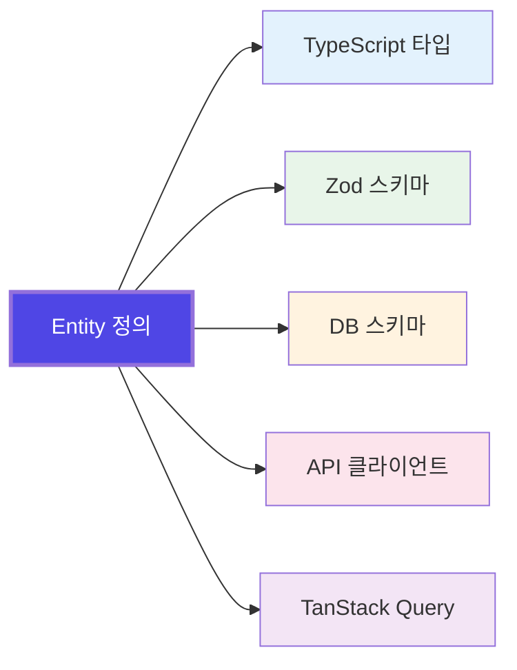

TypeScript는 강력한 타입 시스템을 가지고 있습니다. 하지만 많은 프레임워크들이 이 강점을 온전히 활용하지 못하고 있습니다.

Sonamu는 TypeScript의 타입 시스템을 중심에 두고 설계되었습니다.

## 핵심 철학: 단일 진실 공급원

**Entity 하나를 정의하면, 나머지는 TypeScript가 알아서 합니다.**

<Frame caption="🎬 Entity 생성 → Migration 실행 → 타입/스키마/API 자동 생성 → 프론트엔드 Service 생성까지 전체 플로우">
  <video
    muted
    loop
    playsInline
    controls
    className="w-full rounded-xl"
    preload="metadata"
    src="https://cf.cartanova.ai/sonamu-docs/introduction1.mp4"
  ></video>
</Frame>



Entity를 한 곳에 정의하면, 시스템 전체가 동기화됩니다. 수동으로 타입을 맞추거나, API 스펙을 문서화하거나, 프론트엔드 클라이언트를 작성할 필요가 없습니다.

## 백엔드와 프론트엔드의 타입 동기화

일반적으로 백엔드 API를 만들고 프론트엔드에서 사용할 때는 타입 동기화가 어렵습니다. Sonamu는 백엔드 변경이 즉시 프론트엔드에 반영되어 **컴파일 타임에 에러를 감지**합니다.

<Tabs>
  <Tab title="수동 작성 시">
    ```typescript
    // 백엔드 API
    router.get('/api/users/:id', async (req, res) => {
      const user = await db.users.findById(req.params.id);
      res.json(user);
    });
    
    // 프론트엔드 클라이언트 (수동으로 작성)
    async function getUser(id: number): Promise<any> {  // ← any!
      const res = await fetch(`/api/users/${id}`);
      return res.json();
    }
    
    const user = await getUser(123);
    console.log(user.username);  // 런타임 에러 가능성
    ```
  </Tab>
  
  <Tab title="Sonamu 방식">
    ```typescript
    // 백엔드 Model
    @api({ httpMethod: "GET", clients: ["axios", "tanstack-query"], resourceName: "User" })
    async findById<T extends UserSubsetKey>(subset: T, id: number): Promise<UserSubsetMapping[T]> {
      return this.getPuri("r").table("users").where("id", id).first();
    }

    @api({ httpMethod: "POST", clients: ["axios", "tanstack-mutation"] })
    async save(spa: UserSaveParams[]): Promise<number[]> {
      // ...
    }

    // 프론트엔드 Service (자동 생성)
    export namespace UserService {
      // GET 요청 함수
      export async function getUser<T extends UserSubsetKey>(
        subset: T,
        id: number,
      ): Promise<UserSubsetMapping[T]> {
        return fetch({
          method: "GET",
          url: `/api/user/findById?${qs.stringify({ subset, id })}`
        });
      }

      // GET을 위한 React Query Hook
      export const useUser = <T extends UserSubsetKey>(
        subset: T,
        id: number,
        options?: { enabled?: boolean },
      ) => useQuery({ queryKey: ["User", "getUser", subset, id], queryFn: () => getUser(subset, id), ...options });

      // POST 요청 함수
      export async function save(spa: UserSaveParams[]): Promise<number[]> {
        return fetch({
          method: "POST",
          url: `/api/user/save`,
          data: { spa }
        });
      }

      // POST를 위한 React Query Hook
      export const useSaveMutation = () =>
        useMutation({ mutationFn: (params: { spa: UserSaveParams[] }) => save(params.spa) });
    }

    // 컴포넌트에서 사용
    const user = await UserService.getUser("A", 123);      // 직접 호출
    const { data: user } = UserService.useUser("A", 123);  // Hook으로 호출
    console.log(user.username);    // ✅ 타입 체크됨
    console.log(user.nonExistent); // ❌ 컴파일 에러
    ```

  </Tab>
</Tabs>

<Frame caption="📸 Sonamu 방식에서 존재하지 않는 속성에 접근하면 컴파일 에러 표시">
  
</Frame>

---

## Fully Type-safe Query Builder: Puri

Sonamu는 Knex 기반의 타입 안전한 쿼리 빌더 Puri를 제공합니다. 테이블명, 칼럼명, 관계까지 모두 타입 체크됩니다.

<Frame caption="🎬 필요: Puri로 타입 안전한 쿼리 작성 - 테이블명, 칼럼명 자동완성">
</Frame>

```typescript
// 타입 안전한 쿼리
const users = await this.getPuri("r")
  .table("users")           // ✅ 테이블명 자동완성
  .select("id", "email")    // ✅ 칼럼명 타입 체크
  .where("role", "admin")   // ✅ 칼럼명 + 값 타입 체크
  .orderBy("created_at", "desc");

// Relation 조인
const posts = await this.getPuri("r")
  .table("posts")
  .join("users", "posts.author_id", "users.id")  // ✅ 관계 타입 체크
  .select("posts.*", "users.username as author_name");
```

**핵심 기능**:

- ✅ Entity 정의에서 타입 자동 추출
- ✅ 테이블명, 칼럼명, 관계 모두 자동완성
- ✅ 잘못된 칼럼명은 컴파일 에러
- ✅ Knex의 모든 기능 지원

<Card
  title="Puri 가이드"
  icon="database"
  href="/database/puri"
>
  타입 안전한 쿼리 작성하기
</Card>

---

## Frontend Integration

백엔드 API를 정의하면, 프론트엔드 Service와 TanStack Query Hook이 자동으로 생성됩니다.

<Frame caption="🎬 백엔드 @api 메서드 작성 → 프론트엔드 Service 자동 생성 → useQuery 사용">
  <video
    autoPlay
    muted
    loop
    playsInline
    controls
    className="w-full rounded-xl"
    src="/images/introduction3.mp4"
  ></video>
</Frame>

```tsx
// 백엔드: @api 데코레이터로 API 정의
@api({ httpMethod: "GET" })
async getProfile(userId: number): Promise<User> {
  return this.getPuri("r").table("users").where("id", userId).first();
}

// 프론트엔드: 자동 생성된 Hook 사용
function UserProfile({ userId }: { userId: number }) {
  const { data: user, isLoading } = UserService.useUser("A", userId);

  if (isLoading) return <div>Loading...</div>;
  return <div>{user.username}</div>; // ✅ 완벽한 타입 안전성
}
```

### Subset으로 최적화

필요한 필드만 조회하여 네트워크 비용을 줄이고 성능을 높입니다. 각 Subset마다 정확한 TypeScript 타입이 자동으로 생성됩니다.

```typescript
// 목록 화면: 최소 정보만
const users = await UserService.findMany("A", { page: 1 });
// { id, email, username }

// 상세 화면: 전체 정보
const user = await UserService.findById("C", userId);
// { id, email, username, bio, createdAt, updatedAt, ... }
```

### SSR

Next.js App Router와 함께 서버 사이드 렌더링을 지원합니다. SEO 최적화와 초기 로딩 속도를 개선할 수 있습니다.

```tsx
// app/users/[id]/page.tsx
export default async function UserPage({ params }: { params: { id: string } }) {
  // 서버에서 데이터 페칭
  const user = await UserService.findById("C", Number(params.id));

  return (
    <div>
      <h1>{user.username}</h1>  {/* ✅ 타입 안전 */}
      <p>{user.bio}</p>
    </div>
  );
}
```

**핵심 기능**:

- ✅ 백엔드 변경 시 컴파일 에러로 즉시 감지
- ✅ Namespace 기반으로 깔끔한 구조
- ✅ TanStack Query 자동 통합 (캐싱, 재검증, 낙관적 업데이트)
- ✅ Subset별 정확한 타입 추론
- ✅ SSR 지원으로 SEO 최적화

<CardGroup cols={3}>
  <Card
    title="Service 사용법"
    icon="code"
    href="/frontend-integration/generated-services/using-services"
  >
    자동 생성된 Service 활용하기
  </Card>
  <Card
    title="TanStack Query"
    icon="arrows-rotate"
    href="/frontend-integration/generated-services/tanstack-query"
  >
    React Hook으로 데이터 페칭
  </Card>
  <Card
    title="SSR"
    icon="server"
    href="/frontend-integration/ssr"
  >
    서버 사이드 렌더링
  </Card>
</CardGroup>

---

## Testing

Sonamu는 테스트를 위한 강력한 도구를 내장하고 있습니다.

### Fixture 시스템

Fixture DB에 미리 세팅된 테스트 데이터를 `createFixtureLoader`로 쉽게 로드할 수 있습니다.

```typescript
// fixture.ts
import { createFixtureLoader } from "sonamu/test";
import { UserModel } from "../application/user/user.model";

export const loadFixtures = createFixtureLoader({
  adminUser: async () => UserModel.findById("A", 1),
  normalUser: async () => UserModel.findById("A", 2),
});

// 테스트에서 사용
import { loadFixtures } from "./fixture";

test("관리자는 모든 사용자를 볼 수 있다", async () => {
  const f = await loadFixtures(["adminUser"]);

  expect(f.adminUser.role).toBe("admin");
});
```

### Naite: 테스트 데이터 추적 & 시각화

테스트 실행 중 모든 데이터 변화를 추적하고 시각화합니다. 디버깅이 훨씬 쉬워집니다.

<Frame caption="📸 Naite Viewer 화면 - 테스트 실행 중 데이터베이스 변화를 시각적으로 보여주는 UI">
  <video
    muted
    loop
    playsInline
    controls
    className="w-full rounded-xl"
    preload="metadata"
    src="https://cf.cartanova.ai/sonamu-docs/introduction4.mp4"
  ></video>
</Frame>

```typescript
test("사용자 생성 플로우", async () => {
  Naite.t("초기 상태", { userCount: 0 });

  const user = await UserModel.create({
    email: "test@test.com",
    username: "testuser",
  });

  Naite.t("사용자 생성 후", { userCount: 1, userId: user.id });

  await UserModel.delete(user.id);

  Naite.t("삭제 후", { userCount: 0 });
});
```

### Transaction 자동 롤백

각 테스트는 독립된 Transaction에서 실행되고 자동으로 롤백됩니다. 테스트 간 격리가 보장되며 데이터 정리가 필요 없습니다.

```typescript
test("사용자 생성", async () => {
  await UserModel.create({ email: "test@test.com", ... });
  // 테스트 종료 후 자동 롤백 → DB는 깨끗한 상태 유지
});

test("다음 테스트는 깨끗한 DB에서 시작", async () => {
  const users = await UserModel.findMany();
  expect(users).toHaveLength(0); // ✅ 이전 테스트 데이터 없음
});
```

**핵심 기능**:

- ✅ Fixture로 테스트 데이터 재사용
- ✅ Naite로 데이터 변화 시각화
- ✅ Transaction 자동 롤백으로 격리된 테스트

<CardGroup cols={2}>
  <Card
    title="Fixture 시스템"
    icon="box"
    href="/testing/writing-tests/test-helpers"
  >
    테스트 데이터 관리
  </Card>
  <Card title="Naite 가이드" icon="chart-line" href="/testing/naite">
    데이터 추적 & 시각화
  </Card>
</CardGroup>

---

## AI Ready

Sonamu는 AI 시대에 맞는 기능들을 네이티브로 지원합니다.

### Vector Search (pgvector)

AI 임베딩 검색을 Entity 필드로 정의하면 끝입니다. pgvector를 네이티브로 지원합니다.

<Frame caption="🎬 Entity에 vector 필드 정의 → 마이그레이션 자동 생성 → 벡터 검색 API 구현">
  <video
    autoPlay
    muted
    loop
    playsInline
    controls
    className="w-full rounded-xl"
    src="/images/introduction5.mp4"
  ></video>
</Frame>

```typescript
// Entity에 vector 필드 정의
{
  "name": "embedding",
  "type": "vector",
  "dimensions": 1536
}

// vectorSimilarity로 벡터 검색
const results = await this.getPuri("r")
  .table("documents")
  .select("id", "title", "content")
  .vectorSimilarity("embedding", queryEmbedding, "similarity")
  .orderBy("similarity", "desc")
  .limit(10);
```

### AI SDK 통합

Vercel AI SDK와 완벽하게 통합됩니다. 스트리밍 응답도 간단합니다.

```typescript
@api({ httpMethod: "POST" })
async chat(message: string): Promise<StreamingResponse> {
  const result = await streamText({
    model: openai("gpt-4"),
    messages: [{ role: "user", content: message }],
  });

  return result.toTextStreamResponse();
}
```

### SSE (Server-Sent Events)

`@stream` 데코레이터로 실시간 스트리밍을 간편하게 사용할 수 있습니다.

```typescript
import { stream } from "sonamu";
import { z } from "zod";

const ChatEventSchema = z.object({
  type: z.enum(["message", "done"]),
  content: z.string().optional(),
});

@stream({ eventSchema: ChatEventSchema })
async chat(message: string) {
  return async (emit) => {
    for (const chunk of await generateResponse(message)) {
      await emit({ type: "message", content: chunk });
    }
    await emit({ type: "done" });
  };
}
```

### AI Agent 통합

Sonamu UI의 AI 채팅으로 Entity를 자연어로 생성할 수 있습니다.

<Frame caption="🎬 Sonamu UI에서 AI에게 '이커머스 주문 시스템 만들어줘' 입력 → Entity 4개 자동 생성">
  <video
    muted
    loop
    playsInline
    controls
    className="w-full rounded-xl"
    src="https://cf.cartanova.ai/sonamu-docs/introduction6.mp4"
  ></video>
</Frame>

```
💬 "이커머스 주문 시스템을 만들어줘. 사용자, 상품, 주문, 주문 아이템 테이블이 필요해."

→ Entity 4개가 관계까지 포함해서 자동 생성됩니다.
```

**핵심 기능**:

- ✅ pgvector 네이티브 지원 (벡터 검색)
- ✅ AI SDK 완벽 통합 (스트리밍)
- ✅ SSE로 실시간 이벤트
- ✅ AI Agent로 Entity 자동 생성

<CardGroup cols={2}>
  <Card
    title="Vector Search"
    icon="magnifying-glass"
    href="/advanced-features/vector-search/pgvector-setup"
  >
    임베딩 검색 구현하기
  </Card>
  <Card title="SSE 스트리밍" icon="signal-stream" href="/advanced-features/sse">
    실시간 이벤트 전송
  </Card>
</CardGroup>

---

## Production Ready

Sonamu는 프로덕션 환경을 위한 강력한 기능들을 내장하고 있습니다.

### BentoCache: 다층 캐싱

메모리 + Redis 다층 캐싱을 간단하게 사용할 수 있습니다.

```typescript
import { Sonamu } from "sonamu";

// L1 (메모리) + L2 (Redis) 캐싱
const user = await Sonamu.cache.getOrSet(
  `user:${userId}`,
  async () => {
    return await UserModel.findById("C", userId);
  },
  { ttl: "5m" } // 5분 캐싱
);
```

### Cache-Control: 응답 캐싱

HTTP 응답 캐싱 전략을 데코레이터로 간단히 설정할 수 있습니다.

```typescript
@api({
  httpMethod: "GET",
  cacheControl: { maxAge: 3600, sMaxAge: 7200 }
})
async getPublicData(): Promise<PublicData[]> {
  return await this.getPuri("r")
    .table("public_data")
    .where("public", true);
}
```

### i18n: 타입 안전한 다국어 지원

Entity의 title, prop.desc, enumLabels가 자동으로 딕셔너리에 추출됩니다. 타입 안전한 `SD()` 함수로 번역을 관리하고, 존재하지 않는 키는 컴파일 타임에 에러로 잡아줍니다.

```typescript
import { SD } from "../i18n/sd.generated";

SD("common.save")         // "저장" (ko) / "Save" (en)
SD("error.typo")          // ❌ 컴파일 에러: 키 없음

SD("entity.User")         // "사용자" - Entity title 자동 추출
SD("entity.User.email")   // "이메일" - prop.desc 자동 추출
SD.enumLabels("UserRole")["admin"]  // "관리자"
```

### Workflow: 복잡한 비즈니스 로직 관리

여러 단계로 이루어진 복잡한 비즈니스 로직을 체계적으로 관리할 수 있습니다.

```typescript
import { workflow } from "sonamu";

export const processOrder = workflow(
  {
    name: "process-order",
    version: "1.0",
  },
  async ({ input, step }) => {
    // Step 1: 검증
    await step
      .define({ name: "validate" }, async () => validateOrder(input))
      .run();

    // Step 2: 결제
    const payment = await step
      .define({ name: "charge" }, async () => chargePayment(input))
      .run();

    // Step 3: 주문 생성
    const order = await step
      .define({ name: "create-order" }, async () =>
        createOrderRecord(input, payment)
      )
      .run();

    // Step 4: 이메일 전송
    await step
      .define({ name: "send-email" }, async () => sendConfirmationEmail(order))
      .run();

    return order;
  }
);

// 실행
await Sonamu.workflows.run(processOrder, orderData);
```

### 성능 최적화 내장

N+1 문제 자동 해결, 쿼리 최적화, HMR(Hot Module Replacement)이 기본으로 제공됩니다.

```typescript
// Relation 쿼리에서 N+1 자동 해결
const posts = await PostModel.findMany("A", {
  relations: ["author", "tags"], // DataLoader 패턴으로 최적화
});
```

**핵심 기능**:

- ✅ BentoCache로 다층 캐싱 (메모리 + Redis)
- ✅ Cache-Control로 HTTP 응답 캐싱
- ✅ i18n으로 타입 안전한 다국어 지원
- ✅ Workflow로 복잡한 비즈니스 로직 관리
- ✅ N+1 문제 자동 해결

<CardGroup cols={2}>
  <Card
    title="BentoCache"
    icon="layer-group"
    href="/advanced-features/caching/bentocache"
  >
    다층 캐싱 전략
  </Card>
  <Card
    title="i18n"
    icon="language"
    href="/advanced-features/i18n/overview"
  >
    다국어 지원 시스템
  </Card>
</CardGroup>

---

## 간단한 예시

Entity를 정의하고 사용하기까지의 전체 플로우입니다.

> **참고:** 자동 생성되는 파일들
>
> - `api/src/application/sonamu.generated.ts` - 모든 타입, 스키마, Enum
> - `web/src/services/sonamu.generated.ts` - 프론트엔드 타입 (동기화됨)
> - `web/src/services/services.generated.ts` - 모든 Service 메서드
> - `web/src/services/{entity}/{entity}.types.ts` - 커스텀 타입 (수동 작성)

### 1. Entity 정의

<Frame caption="🎬 Sonamu UI에서 User Entity를 정의하는 화면">
  <video
    autoPlay
    muted
    loop
    playsInline
    controls
    className="w-full rounded-xl"
    preload="metadata"
    src="https://cf.cartanova.ai/sonamu-docs/introduction7.mp4"
  ></video>
</Frame>

```json
{
  "id": "User",
  "table": "users",
  "props": [
    { "name": "email", "type": "string", "length": 255 },
    { "name": "username", "type": "string", "length": 100 },
    { "name": "role", "type": "enum", "id": "UserRole" }
  ]
}
```

### 2. Migration 실행 및 동기화

Entity 저장 → Migration 실행 → `pnpm sync`:

✅ TypeScript 타입 (`sonamu.generated.ts`)  
✅ Zod 스키마 (BaseSchema, BaseListParams)  
✅ DB 마이그레이션  
✅ 프론트엔드 Service (`services.generated.ts`)  
✅ TanStack Query Hook

### 3. Model에서 비즈니스 로직 작성

```typescript
@api({ httpMethod: "POST" })
@transactional()
async register(params: {
  email: string;
  username: string;
  password: string;
}): Promise<{ user: User }> {
  const wdb = this.getPuri("w");

  wdb.ubRegister("users", {
    email: params.email,
    username: params.username,
    password: await bcrypt.hash(params.password, 10),
    role: "user",
  });

  const [userId] = await wdb.ubUpsert("users");
  const user = await this.findById("C", userId);

  return { user };
}
```

### 4. React에서 즉시 사용

```tsx
import { useTypeForm } from "@sonamu-kit/react-components/lib";
import { Input, Button } from "@sonamu-kit/react-components/components";
import { UserService } from "@/services/services.generated";
import { UserSaveParams } from "@/services/user/user.types";

function RegisterForm() {
  const { register, submit } = useTypeForm(UserSaveParams, {
    email: "",
    username: "",
    password: "",
  });

  const saveMutation = UserService.useSaveMutation();

  const handleSubmit = submit(async (form) => {
    saveMutation.mutate(
      { spa: [form] },
      {
        onSuccess: ([userId]) => {
          console.log("Registered:", userId); // ✅ 타입 안전
        },
      },
    );
  });

  return (
    <div>
      <Input placeholder="이메일" {...register("email")} />
      <Input placeholder="이름" {...register("username")} />
      <Input type="password" placeholder="비밀번호" {...register("password")} />
      <Button onClick={handleSubmit}>등록</Button>
    </div>
  );
}
```

<Frame caption="🎬 Entity 정의 → Migration → Model 작성 → React에서 사용까지 전체 플로우">
  <video
    muted
    loop
    playsInline
    controls
    className="w-full rounded-xl"
    preload="metadata"
    src="https://cf.cartanova.ai/sonamu-docs/introduction1.mp4"
  ></video>
</Frame>

---

## 누구를 위한 프레임워크인가

<CardGroup cols={2}>
  <Card title="생산성을 중시하는 개발자" icon="rocket">
    반복 작업에 시간을 낭비하지 않고, 비즈니스 로직에 집중하고 싶은 분
  </Card>

{" "}

<Card title="타입 안전성을 신뢰하는 팀" icon="shield-check">
  런타임 에러보다 컴파일 에러를 선호하고, IDE의 도움을 최대한 활용하는 팀
</Card>

{" "}

<Card title="프론트엔드와 협업하는 백엔드" icon="handshake">
  API 스펙 문서화와 클라이언트 작성의 이중 작업에서 벗어나고 싶은 분
</Card>

  <Card title="빠른 프로토타이핑이 필요한 스타트업" icon="gauge-high">
    MVP를 빠르게 만들면서도 기술 부채를 최소화하고 싶은 팀
  </Card>
</CardGroup>

---

## 시작하기

3분이면 충분합니다.

```bash
# 프로젝트 생성
pnpm create sonamu my-project

# 개발 서버 시작
cd my-project/api
pnpm dev

# Sonamu UI 열기
open http://localhost:1028/sonamu-ui
```

<CardGroup cols={2}>
  <Card title="Quick Start" icon="rocket" href="/getting-started/quick-start">
    5분 만에 첫 API 만들기
  </Card>

{" "}

<Card title="Installation" icon="download" href="/getting-started/installation">
  자세한 설치 가이드
</Card>

{" "}

<Card title="Core Concepts" icon="book" href="/core-concepts/how-sonamu-works">
  Sonamu 작동 원리 이해하기
</Card>

  <Card
    title="Development Workflow"
    icon="diagram-project"
    href="/getting-started/development-workflow"
  >
    개발 워크플로우 알아보기
  </Card>
</CardGroup>

---

## 커뮤니티

<Card
  title="GitHub"
  icon="github"
  href="https://github.com/cartanova-ai/sonamu"
>
  이슈 리포트와 기여
</Card>

---

**Sonamu와 함께라면, TypeScript로 개발하는 것이 즐거워집니다.**
