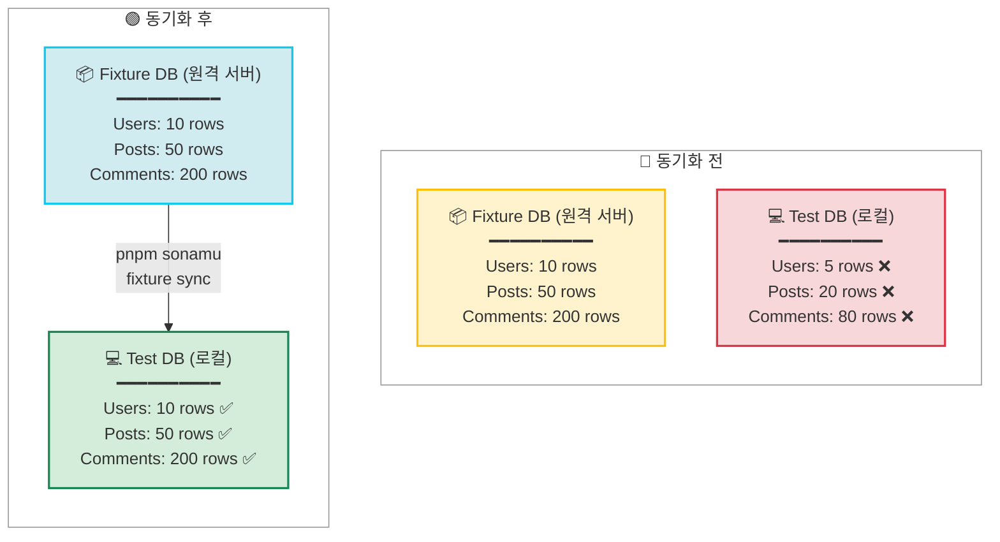

Fixture DB의 데이터를 Test DB로 동기화하여 테스트 환경을 준비하는 방법을 알아봅니다.

## Fixture 동기화 개요

<CardGroup cols={2}>
  <Card title="완전 복사" icon="copy">
    모든 데이터 스키마 + 레코드
  </Card>
  <Card title="깨끗한 시작" icon="broom">
    Test DB 초기화 일관된 환경
  </Card>
  <Card title="빠른 실행" icon="bolt">
    pg_dump + pg_restore 효율적인 복사
  </Card>
  <Card title="자동 실행" icon="gear">
    import 후 자동 수동 실행 가능
  </Card>
</CardGroup>

## pnpm sonamu fixture sync

Fixture DB의 모든 데이터를 Test DB로 복사합니다.

### 기본 사용법

```bash
pnpm sonamu fixture sync
```

이 명령어는:

1. Test DB를 완전히 초기화
2. Fixture DB를 덤프
3. Test DB에 복원

## 작동 원리

### 내부 구현

```typescript
// sonamu/src/testing/fixture-manager.ts
async function sync() {
  const fixtureConn = Sonamu.dbConfig.fixture.connection;
  const testConn = Sonamu.dbConfig.test.connection;

  // 1. Test DB 연결 종료
  execSync(`psql -h ${testConn.host} -p ${testConn.port} -U ${testConn.user} 
    -d postgres -c "
      SELECT pg_terminate_backend(pg_stat_activity.pid)
      FROM pg_stat_activity
      WHERE datname = '${testConn.database}'
        AND pid <> pg_backend_pid();
    "`);

  // 2. Test DB 재생성
  execSync(`psql -h ${testConn.host} -U ${testConn.user} -d postgres 
    -c "DROP DATABASE IF EXISTS \\"${testConn.database}\\""`);

  execSync(`psql -h ${testConn.host} -U ${testConn.user} -d postgres 
    -c "CREATE DATABASE \\"${testConn.database}\\""`);

  // 3. Fixture DB → Test DB 복사
  const dumpCmd = `pg_dump -h ${fixtureConn.host} -p ${fixtureConn.port} 
    -U ${fixtureConn.user} -d ${fixtureConn.database} -Fc`;

  const restoreCmd = `pg_restore -h ${testConn.host} -p ${testConn.port} 
    -U ${testConn.user} -d ${testConn.database} --no-owner --no-acl`;

  execSync(`${dumpCmd} | PGPASSWORD="${testConn.password}" ${restoreCmd}`);
}
```

### 실행 과정

```bash
$ pnpm sonamu fixture sync

# 1. 기존 연결 종료
Terminating existing connections to myapp_test...

# 2. Test DB 재생성
DROP DATABASE IF EXISTS "myapp_test"
CREATE DATABASE "myapp_test"

# 3. Fixture DB 덤프
pg_dump -h fixture-db.example.com -d myapp_fixture -Fc

# 4. Test DB 복원
pg_restore -h localhost -d myapp_test --no-owner --no-acl

✅ Sync complete!
```

## 사용 시나리오

### 1. Fixture 변경 후

```bash
# Fixture에 새 데이터 추가
pnpm sonamu fixture import User 10 11 12

# 자동으로 sync 실행됨
# 하지만 수동으로도 가능:
pnpm sonamu fixture sync
```

### 2. Test DB 초기화

```bash
# Test DB가 오염되었을 때
# (예: 수동으로 데이터를 추가한 경우)
pnpm sonamu fixture sync

# 깨끗한 Fixture 데이터로 재설정
```

### 3. 팀원 간 동기화

```bash
# 팀원 A가 Fixture에 데이터 추가
# (원격 Fixture DB에 저장됨)

# 팀원 B가 로컬 Test DB에 반영
pnpm sonamu fixture sync
```

## 데이터베이스 비교



## pg_dump 옵션

### -Fc (Format Custom)

바이너리 형식으로 덤프하여 빠르고 효율적입니다.

```bash
# -Fc: Custom format (압축된 바이너리)
pg_dump -d myapp_fixture -Fc
```

**장점**:

- 압축되어 크기가 작음
- `pg_restore`로 선택적 복원 가능
- 빠른 속도

### --no-owner --no-acl

소유자와 권한 정보를 제외합니다.

```bash
pg_restore -d myapp_test --no-owner --no-acl
```

**이유**:

- 로컬과 원격의 사용자가 다를 수 있음
- 권한 충돌 방지

## 자동 vs 수동

### 자동 동기화

`pnpm sonamu fixture import` 실행 시 자동으로 sync가 호출됩니다:

```typescript
async function fixture_import(entityId: string, recordIds: number[]) {
  await setupFixtureManager();

  // 1. Import
  await FixtureManager.importFixture(entityId, recordIds);

  // 2. Sync (자동)
  await FixtureManager.sync();
}
```

```bash
$ pnpm sonamu fixture import User 1 2 3

# Import 완료 후 자동으로:
✅ Import complete! Syncing to test DB...
# Sync 실행...
```

### 수동 동기화

필요할 때 직접 실행:

```bash
# Test DB를 Fixture DB 상태로 재설정
pnpm sonamu fixture sync
```

## 워크플로우

### 일반적인 개발 흐름

```bash
# 1. 프로덕션에서 필요한 데이터 가져오기
pnpm sonamu fixture import User 1 2 3
# → 자동으로 sync 실행됨

# 2. 테스트 실행
pnpm test

# 3. 필요시 추가 데이터 가져오기
pnpm sonamu fixture import Post 10 11 12
# → 자동으로 sync 실행됨

# 4. 테스트 재실행
pnpm test
```

### Fixture 공유 흐름

```bash
# 팀원 A
pnpm sonamu fixture import User 100 101 102
# → Fixture DB(원격)에 저장됨

# 팀원 B
pnpm sonamu fixture sync
# → Fixture DB에서 로컬 Test DB로 복사

# 팀원 B도 동일한 데이터로 테스트 가능
```

## 성능 최적화

### 1. 로컬 Fixture DB

Fixture DB를 로컬에서 운영하면 sync가 빠릅니다:

```json
// sonamu.config.json
{
  "db": {
    "fixture": {
      "client": "pg",
      "connection": {
        "host": "localhost", // 로컬
        "database": "myapp_fixture"
      }
    },
    "test": {
      "client": "pg",
      "connection": {
        "host": "localhost",
        "database": "myapp_test"
      }
    }
  }
}
```

### 2. 최소 데이터

Fixture에 필요한 최소 데이터만 유지:

```bash
# ✅ 올바른 방법: 필요한 것만
pnpm sonamu fixture import User 1 2 3

# ❌ 잘못된 방법: 너무 많은 데이터
pnpm sonamu fixture import User $(seq 1 1000)
```

## 베스트 프랙티스

### 1. 정기적인 동기화

```bash
# 매일 아침 최신 Fixture로 동기화
pnpm sonamu fixture sync

# 테스트 실행
pnpm test
```

### 2. CI/CD 통합

```yaml
# .github/workflows/test.yml
name: Test

on: [push, pull_request]

jobs:
  test:
    runs-on: ubuntu-latest
    steps:
      - uses: actions/checkout@v2

      - name: Setup PostgreSQL
        run: |
          docker run -d -p 5432:5432 \
            -e POSTGRES_PASSWORD=postgres \
            postgres:14

      - name: Initialize Fixture
        run: pnpm sonamu fixture init

      - name: Sync Fixture
        run: pnpm sonamu fixture sync

      - name: Run Tests
        run: pnpm test
```

### 3. 스크립트 추가

```json
// package.json
{
  "scripts": {
    "test:setup": "pnpm sonamu fixture sync",
    "test": "pnpm test:setup && vitest"
  }
}
```

```bash
# 테스트 전 자동으로 sync
pnpm test
```

## 문제 해결

### 연결 실패

```bash
Error: connection to server at "fixture-db.example.com" failed
```

**해결**:

- 네트워크 연결 확인
- Fixture DB 서버 상태 확인
- 방화벽 설정 확인

### 권한 오류

```bash
Error: must be owner of database myapp_test
```

**해결**:

```sql
-- Test DB 소유자 변경
ALTER DATABASE myapp_test OWNER TO current_user;
```

### DB가 사용 중

```bash
Error: database "myapp_test" is being accessed by other users
```

**해결**:

```sql
-- 모든 연결 종료
SELECT pg_terminate_backend(pg_stat_activity.pid)
FROM pg_stat_activity
WHERE datname = 'myapp_test'
  AND pid <> pg_backend_pid();
```

또는:

```bash
# 애플리케이션 중지 후 다시 시도
pnpm sonamu fixture sync
```

## 주의사항

<Warning>
  **Fixture 동기화 시 주의사항**: 1. **Test DB 초기화**: 기존 데이터가 모두 삭제됨 2. **권한 필요**:
  Test DB에 대한 DROP/CREATE 권한 3. **연결 종료**: 실행 중인 테스트가 있으면 실패 4. **네트워크**:
  Fixture DB가 원격이면 시간이 걸림 5. **데이터 크기**: Fixture가 크면 sync가 느림
</Warning>

## 다음 단계

<CardGroup cols={2}>
  <Card title="테스트 DB" icon="database" href="/ko/testing/fixtures/test-database">
    테스트 DB 설정
  </Card>
  <Card title="Fixture 생성" icon="plus" href="/ko/testing/fixtures/creating-fixtures">
    fixture.ts 작성하기
  </Card>
  <Card title="Fixture 로딩" icon="download" href="/ko/testing/fixtures/loading-fixtures">
    프로덕션 데이터 가져오기
  </Card>
  <Card title="테스트 작성" icon="vial" href="/ko/testing/writing-tests/test-structure">
    테스트 구조 이해하기
  </Card>
</CardGroup>
