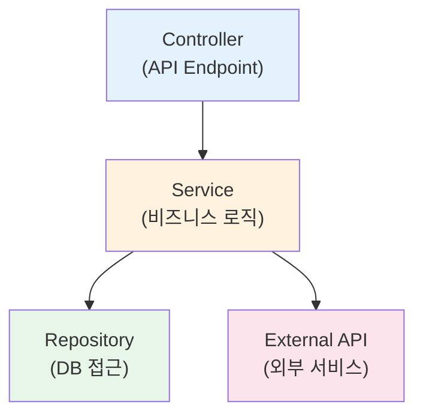

외부 API, 파일 시스템, 타이머 등의 의존성을 모킹하여 독립적인 테스트를 작성하는 방법을 알아봅니다.

## API Mocking이란?

테스트에서 외부 의존성(API, 파일 시스템, 시간 등)을 **실제로 실행하지 않고** 가짜 동작을 제공하는 것을 Mocking이라고 합니다. 이를 통해:

- 외부 서비스 장애와 무관하게 테스트 실행
- 네트워크 호출 없이 빠른 테스트
- 예측 가능한 결과로 안정적인 테스트
- 비용이 발생하는 작업(결제, SMS 등) 회피

## Mocking의 종류

Sonamu에서는 세 가지 방식의 Mocking을 지원합니다:

<CardGroup cols={3}>
  <Card title="Vitest Mock" icon="flask">
    Vitest의 기본 Mocking 기능
  </Card>
  <Card title="Naite Mock" icon="database">
    Naite를 활용한 동적 Mocking
  </Card>
  <Card title="Manual Mock" icon="code">
    수동으로 구현한 Mock 객체
  </Card>
</CardGroup>

## Vitest Mock 사용하기

### 모듈 Mocking

외부 모듈의 동작을 가짜로 대체합니다:

```typescript
import { test, vi } from "vitest";
import axios from "axios";

// axios 모듈 전체를 Mock으로 대체
vi.mock("axios");

test("외부 API 호출", async () => {
  // Mock 함수의 반환값 설정
  vi.mocked(axios.get).mockResolvedValue({
    data: { id: 1, name: "John" },
  });
  
  const result = await userService.fetchUser(1);
  
  expect(result.name).toBe("John");
  expect(axios.get).toHaveBeenCalledWith("/api/users/1");
});
```

### 함수 Spy

실제 함수의 호출을 추적합니다:

```typescript
import { test, vi } from "vitest";
import { emailService } from "../services/email.service";

test("이메일 발송 확인", async () => {
  // 함수 호출을 추적하는 Spy 생성
  const sendSpy = vi.spyOn(emailService, "send").mockResolvedValue(true);
  
  await userService.register({ email: "user@example.com" });
  
  // 이메일 발송 함수가 호출되었는지 확인
  expect(sendSpy).toHaveBeenCalledWith({
    to: "user@example.com",
    subject: "회원가입을 환영합니다",
  });
  
  // Spy 정리
  sendSpy.mockRestore();
});
```

### 타이머 Mocking

시간 관련 함수를 제어합니다:

```typescript
import { test, vi } from "vitest";

test("setTimeout 테스트", async () => {
  // 가짜 타이머 사용
  vi.useFakeTimers();
  
  let executed = false;
  setTimeout(() => {
    executed = true;
  }, 1000);
  
  // 1초 전
  expect(executed).toBe(false);
  
  // 시간 1초 진행
  vi.advanceTimersByTime(1000);
  
  // 1초 후
  expect(executed).toBe(true);
  
  // 실제 타이머로 복원
  vi.useRealTimers();
});
```

<Info>
**bootstrap()과 타이머**: Sonamu의 `bootstrap()` 함수는 `afterEach`에서 자동으로 `vi.useRealTimers()`를 호출하여 타이머를 복원합니다. 별도로 호출할 필요가 없습니다.
</Info>

### 날짜 Mocking

현재 시각을 고정합니다:

```typescript
import { test, vi } from "vitest";

test("오늘 날짜 확인", () => {
  // 2025년 1월 1일로 고정
  vi.setSystemTime(new Date("2025-01-01T00:00:00Z"));
  
  const today = new Date();
  expect(today.getFullYear()).toBe(2025);
  expect(today.getMonth()).toBe(0);  // 0 = January
  
  // 시스템 시간 복원
  vi.useRealTimers();
});
```

## Naite Mock 사용하기

Naite의 특별한 키 패턴을 사용하여 동적으로 Mock을 생성합니다.

### 파일 시스템 Mocking

#### 가상 파일 생성

`mock:fs/promises:virtualFileSystem` 키로 가상 파일을 등록합니다:

```typescript
import { test } from "sonamu/test";
import { Naite } from "sonamu";
import { access, constants } from "fs/promises";
import { expect } from "vitest";

test("가상 파일 시스템", async () => {
  const filePath = "/tmp/my-virtual-file.txt";
  
  // 1. 실제로는 존재하지 않는 파일
  await expect(
    access(filePath, constants.F_OK)
  ).rejects.toThrow();
  
  // 2. Naite로 가상 파일 등록
  Naite.t("mock:fs/promises:virtualFileSystem", filePath);
  
  // 3. 이제 파일이 "존재"하는 것처럼 동작
  await expect(
    access(filePath, constants.F_OK)
  ).resolves.toBeUndefined();
  
  // 4. Mock 삭제
  Naite.del("mock:fs/promises:virtualFileSystem");
  
  // 5. 다시 존재하지 않음
  await expect(
    access(filePath, constants.F_OK)
  ).rejects.toThrow();
});
```

#### 실전 예제: 파일 업로드 테스트

```typescript
import { test } from "sonamu/test";
import { Naite } from "sonamu";
import { fileService } from "../services/file.service";
import { expect } from "vitest";

test("파일 존재 여부 확인", async () => {
  const uploadPath = "/uploads/user/123/profile.jpg";
  
  // 가상 파일 등록
  Naite.t("mock:fs/promises:virtualFileSystem", uploadPath);
  
  // 파일 서비스 테스트
  const exists = await fileService.checkExists(uploadPath);
  expect(exists).toBe(true);
  
  // Mock 정리
  Naite.del("mock:fs/promises:virtualFileSystem");
});

test("여러 파일 존재 확인", async () => {
  const files = [
    "/uploads/file1.pdf",
    "/uploads/file2.pdf",
    "/uploads/file3.pdf",
  ];
  
  // 여러 파일 등록
  for (const file of files) {
    Naite.t("mock:fs/promises:virtualFileSystem", file);
  }
  
  // 배치 확인
  const results = await fileService.checkMultiple(files);
  expect(results.every(r => r.exists)).toBe(true);
  
  // 정리
  Naite.del("mock:fs/promises:virtualFileSystem");
});
```

### Naite Mock의 작동 원리

Naite는 특별한 키 패턴(`mock:*`)을 감지하여 해당 동작을 가로챕니다:

```typescript
// Sonamu 내부 (의사 코드)
async function access(path: string) {
  // Naite에서 mock:fs/promises:virtualFileSystem 확인
  const mocked = Naite.get("mock:fs/promises:virtualFileSystem")
    .result()
    .includes(path);
  
  if (mocked) {
    // 가상 파일이 등록되어 있으면 성공
    return Promise.resolve();
  }
  
  // 실제 파일 시스템 확인
  return realAccess(path);
}
```

## Manual Mock 구현하기

복잡한 외부 서비스는 직접 Mock 클래스를 구현합니다.

### Mock 클래스 생성

```typescript
// __mocks__/payment.service.ts
export class MockPaymentService {
  private payments: Map<string, any> = new Map();
  
  async charge(amount: number, userId: number) {
    const paymentId = `mock_${Date.now()}`;
    
    this.payments.set(paymentId, {
      id: paymentId,
      amount,
      userId,
      status: "success",
      createdAt: new Date(),
    });
    
    return {
      success: true,
      paymentId,
    };
  }
  
  async getPayment(paymentId: string) {
    return this.payments.get(paymentId) ?? null;
  }
  
  async refund(paymentId: string) {
    const payment = this.payments.get(paymentId);
    if (!payment) {
      throw new Error("결제 정보를 찾을 수 없습니다");
    }
    
    payment.status = "refunded";
    return { success: true };
  }
  
  // 테스트용 헬퍼
  clear() {
    this.payments.clear();
  }
}
```

### Mock 사용하기

```typescript
import { test, beforeEach } from "vitest";
import { MockPaymentService } from "./__mocks__/payment.service";
import { orderService } from "../services/order.service";

let mockPayment: MockPaymentService;

beforeEach(() => {
  mockPayment = new MockPaymentService();
  // 실제 서비스를 Mock으로 교체
  orderService.paymentService = mockPayment as any;
});

test("주문 결제", async () => {
  const order = await orderService.create({
    userId: 1,
    items: [{ productId: 1, quantity: 2 }],
    totalAmount: 50000,
  });
  
  // Mock 결제 실행
  const result = await orderService.processPayment(order.id);
  
  expect(result.success).toBe(true);
  expect(result.paymentId).toBeDefined();
  
  // Mock에 기록된 결제 확인
  const payment = await mockPayment.getPayment(result.paymentId);
  expect(payment?.amount).toBe(50000);
  expect(payment?.status).toBe("success");
});

test("결제 실패 시나리오", async () => {
  // Mock에서 에러 발생하도록 설정
  mockPayment.charge = async () => {
    throw new Error("카드 승인 실패");
  };
  
  const order = await orderService.create({
    userId: 1,
    items: [{ productId: 1, quantity: 1 }],
    totalAmount: 10000,
  });
  
  await expect(
    orderService.processPayment(order.id)
  ).rejects.toThrow("카드 승인 실패");
});
```

## 실전 활용 예제

### 외부 API 호출 Mocking

```typescript
import { test, vi } from "vitest";
import axios from "axios";
import { weatherService } from "../services/weather.service";

vi.mock("axios");

test("날씨 정보 조회", async () => {
  // API 응답 Mock
  vi.mocked(axios.get).mockResolvedValue({
    data: {
      temperature: 25,
      condition: "맑음",
      humidity: 60,
    },
  });
  
  const weather = await weatherService.getCurrentWeather("Seoul");
  
  expect(weather.temperature).toBe(25);
  expect(weather.condition).toBe("맑음");
  expect(axios.get).toHaveBeenCalledWith(
    expect.stringContaining("Seoul")
  );
});

test("API 에러 처리", async () => {
  // 네트워크 에러 시뮬레이션
  vi.mocked(axios.get).mockRejectedValue(
    new Error("Network Error")
  );
  
  await expect(
    weatherService.getCurrentWeather("Seoul")
  ).rejects.toThrow("날씨 정보를 가져올 수 없습니다");
});
```

### SMS 발송 Mocking

```typescript
import { test, vi } from "vitest";
import { smsService } from "../services/sms.service";
import { userService } from "../services/user.service";

test("회원가입 SMS 발송", async () => {
  // SMS 발송 함수 Mock
  const sendSpy = vi
    .spyOn(smsService, "send")
    .mockResolvedValue({ success: true, messageId: "mock_123" });
  
  await userService.register({
    phone: "010-1234-5678",
    name: "홍길동",
  });
  
  // SMS 발송 확인
  expect(sendSpy).toHaveBeenCalledWith({
    to: "010-1234-5678",
    message: expect.stringContaining("인증번호"),
  });
  
  sendSpy.mockRestore();
});
```

### 파일 업로드 Mocking

```typescript
import { test } from "sonamu/test";
import { Naite } from "sonamu";
import { imageService } from "../services/image.service";
import { expect } from "vitest";

test("이미지 업로드 및 처리", async () => {
  const originalPath = "/tmp/upload/original.jpg";
  const thumbnailPath = "/tmp/upload/thumbnail.jpg";
  
  // 가상 파일 등록
  Naite.t("mock:fs/promises:virtualFileSystem", originalPath);
  
  // 이미지 처리 (썸네일 생성)
  await imageService.createThumbnail(originalPath, thumbnailPath);
  
  // 썸네일도 가상으로 생성되었다고 가정
  Naite.t("mock:fs/promises:virtualFileSystem", thumbnailPath);
  
  // 두 파일 모두 존재 확인
  const exists = await imageService.checkBothExist(
    originalPath,
    thumbnailPath
  );
  expect(exists).toBe(true);
  
  // 정리
  Naite.del("mock:fs/promises:virtualFileSystem");
});
```

### 환경 변수 Mocking

```typescript
import { test, vi } from "vitest";
import { configService } from "../services/config.service";

test("API 키 설정", () => {
  // 환경 변수 Mock
  vi.stubEnv("API_KEY", "test_key_12345");
  vi.stubEnv("API_URL", "https://test.api.com");
  
  const config = configService.load();
  
  expect(config.apiKey).toBe("test_key_12345");
  expect(config.apiUrl).toBe("https://test.api.com");
  
  // 환경 변수 복원
  vi.unstubAllEnvs();
});
```

## Mocking 전략

### 계층별 Mocking



**테스트 레벨별 Mocking**:

1. **Unit 테스트**: 모든 의존성 Mock
   ```typescript
   test("Service 단위 테스트", async () => {
     // Repository와 External API 모두 Mock
     const mockRepo = { findById: vi.fn() };
     const mockApi = { fetch: vi.fn() };
     
     const service = new UserService(mockRepo, mockApi);
     await service.getUser(1);
   });
   ```

2. **Integration 테스트**: 외부 의존성만 Mock
   ```typescript
   test("Service + Repository 통합 테스트", async () => {
     // External API만 Mock, DB는 실제 사용
     vi.mock("axios");
     
     const user = await userService.getUser(1);
   });
   ```

3. **E2E 테스트**: Mocking 최소화
   ```typescript
   test("전체 흐름 테스트", async () => {
     // 비용이 발생하는 작업만 Mock (결제, SMS 등)
     vi.spyOn(paymentService, "charge").mockResolvedValue({
       success: true,
     });
     
     const response = await request(app).post("/api/orders");
   });
   ```

### Mock 데이터 관리

테스트용 Mock 데이터를 별도 파일로 관리합니다:

```typescript
// __fixtures__/users.ts
export const mockUsers = {
  admin: {
    id: 1,
    username: "admin",
    role: "admin",
    email: "admin@example.com",
  },
  user: {
    id: 2,
    username: "user",
    role: "user",
    email: "user@example.com",
  },
  guest: {
    id: 3,
    username: "guest",
    role: "guest",
    email: "guest@example.com",
  },
};

// __fixtures__/api-responses.ts
export const mockApiResponses = {
  weather: {
    success: {
      temperature: 25,
      condition: "맑음",
    },
    error: {
      error: "API_ERROR",
      message: "날씨 정보를 가져올 수 없습니다",
    },
  },
  payment: {
    success: {
      success: true,
      transactionId: "txn_12345",
    },
    failure: {
      success: false,
      error: "INSUFFICIENT_FUNDS",
    },
  },
};
```

사용:

```typescript
import { mockUsers } from "./__fixtures__/users";
import { mockApiResponses } from "./__fixtures__/api-responses";

test("관리자 권한 테스트", async () => {
  vi.mocked(userService.findById).mockResolvedValue(mockUsers.admin);
  
  const hasPermission = await authService.checkAdmin(1);
  expect(hasPermission).toBe(true);
});

test("날씨 API 성공", async () => {
  vi.mocked(axios.get).mockResolvedValue({
    data: mockApiResponses.weather.success,
  });
  
  const weather = await weatherService.get("Seoul");
  expect(weather.temperature).toBe(25);
});
```

## 주의사항

<Warning>
**Mocking 시 주의사항**:

1. **과도한 Mocking 지양**: Mock이 너무 많으면 실제 동작과 괴리가 생깁니다. 꼭 필요한 부분만 Mock하세요.

2. **Mock 정리**: `afterEach`에서 Mock을 정리하지 않으면 다른 테스트에 영향을 줄 수 있습니다.
   ```typescript
   afterEach(() => {
     vi.restoreAllMocks();
     Naite.del("mock:*");
   });
   ```

3. **Mock과 실제 동작 일치**: Mock의 동작이 실제 서비스와 다르면 테스트는 통과해도 운영 환경에서 실패할 수 있습니다.

4. **타입 안전성**: Mock에도 타입을 명시하여 런타임 에러를 방지하세요.
   ```typescript
   // ❌ 타입 없음
   vi.mocked(service.method).mockResolvedValue({});
   
   // ✅ 타입 명시
   vi.mocked(service.method).mockResolvedValue({
     id: 1,
     name: "test",
   } as User);
   ```

5. **Naite Mock 범위**: `mock:*` 키는 전역적으로 작동하므로 테스트 종료 시 반드시 삭제하세요.
</Warning>

## 다음 단계

<CardGroup cols={2}>
  <Card title="runWithMockContext" icon="circle" href="/testing/mocking/run-with-mock-context">
    Mock Context로 테스트하기
  </Card>
  <Card title="Database Mocking" icon="database" href="/testing/mocking/database-mocking">
    트랜잭션으로 DB 테스트 격리
  </Card>
  <Card title="Naite 로깅" icon="pen" href="/testing/naite/recording-logs">
    테스트 로그 기록 및 추적
  </Card>
  <Card title="Bootstrap" icon="gear" href="/testing/getting-started/bootstrap">
    테스트 환경 초기화
  </Card>
</CardGroup>
