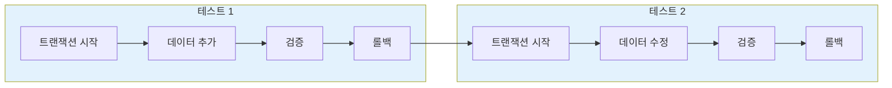

데이터베이스 트랜잭션을 사용하여 테스트를 격리하고, 테스트 간 데이터 오염을 방지하는 방법을 알아봅니다.

## 데이터베이스 테스트 격리란?

Sonamu는 각 테스트를 **트랜잭션**으로 감싸서 실행하고, 테스트 종료 시 **자동으로 롤백**합니다. 이를 통해:

- 테스트 간 데이터가 섞이지 않음
- 테스트 실행 순서와 무관하게 항상 동일한 결과
- DB를 초기 상태로 되돌리는 별도 cleanup 불필요



## 자동 트랜잭션 관리

### bootstrap() 함수

Sonamu의 `bootstrap()` 함수가 자동으로 트랜잭션을 관리합니다:

```typescript
import { bootstrap, test } from "sonamu/test";
import { vi } from "vitest";

// 테스트 파일 상단에서 한 번만 호출
bootstrap(vi);

test("사용자 생성", async () => {
  // beforeEach: 트랜잭션 시작
  const user = await userModel.create({ username: "john" });
  expect(user.id).toBeDefined();
  // afterEach: 트랜잭션 롤백 → DB에 실제로 저장되지 않음
});

test("사용자 조회", async () => {
  // 새로운 트랜잭션 시작
  // 이전 테스트의 데이터는 존재하지 않음
  const users = await userModel.findMany({});
  expect(users.length).toBe(0);
  // 트랜잭션 롤백
});
```

### bootstrap()의 역할

```typescript
export function bootstrap(vi: VitestUtils) {
  beforeAll(async () => {
    await Sonamu.initForTesting();
  });
  
  beforeEach(async () => {
    await DB.createTestTransaction();  // 트랜잭션 시작
  });
  
  afterEach(async ({ task }) => {
    vi.useRealTimers();
    await DB.clearTestTransaction();   // 트랜잭션 롤백
    
    // Naite 로그 전송
    await NaiteReporter.reportTestResult({...});
  });
  
  afterAll(() => {});
}
```

**핵심**:
1. `beforeEach`: 각 테스트 시작 전 트랜잭션 생성
2. `afterEach`: 각 테스트 종료 후 트랜잭션 롤백
3. 테스트 성공/실패 여부와 무관하게 항상 롤백

## 테스트 환경 DB 설정

### sonamu.config.ts

테스트용 DB는 `sonamu.config.ts`에서 설정합니다:

<CodeGroup>

```typescript sonamu.config.ts
import type { SonamuConfig } from "sonamu";

export const config: SonamuConfig = {
  database: {
    name: "myapp",
    defaultOptions: {
      client: "postgresql",
      connection: {
        host: "localhost",
        port: 5432,
        user: "postgres",
        password: "password",
      },
    },
    environments: {
      // 테스트 환경 설정
      test: {
        connection: {
          database: "myapp_test",  // 별도의 테스트 DB
        },
        pool: {
          min: 1,
          max: 1,  // 단일 연결 풀 (트랜잭션 격리)
        },
      },
      development: {
        connection: {
          database: "myapp_dev",
        },
      },
      production: {
        connection: {
          database: "myapp_prod",
        },
      },
    },
  },
};
```

```bash 테스트 DB 생성
# PostgreSQL
createdb myapp_test

# MySQL
mysql -u root -e "CREATE DATABASE myapp_test;"
```

</CodeGroup>

**중요**:
- 테스트 DB는 개발/운영 DB와 **완전히 분리**
- `pool.max: 1`로 설정하여 단일 연결 사용 (트랜잭션 격리 보장)

### DB 클래스의 테스트 모드

`DB` 클래스는 `NODE_ENV=test`일 때 자동으로 테스트 모드로 전환됩니다:

```typescript
// db.ts 내부
getDB(which: DBPreset): Knex {
  if (process.env.NODE_ENV === "test") {
    // 테스트 트랜잭션이 있으면 그것을 반환
    if (this.testTransaction) {
      return this.testTransaction;
    }
    
    // 없으면 wdb 반환 (단일 연결 풀)
    if (!this.wdb) {
      this.wdb = createKnexInstance({
        ...dbConfig.test,
        pool: { min: 1, max: 1 },
      });
    }
    return this.wdb;
  }
  
  // 개발/운영 환경 로직
  // ...
}
```

## 트랜잭션 격리 메커니즘

### createTestTransaction()

`beforeEach`에서 호출되어 새로운 트랜잭션을 시작합니다:

```typescript
// db.ts
public testTransaction: Knex.Transaction | null = null;

async createTestTransaction(): Promise<Knex.Transaction> {
  const db = this.getDB("w");
  this.testTransaction = await db.transaction();
  return this.testTransaction;
}
```

**작동 방식**:
1. Write DB 인스턴스 가져오기
2. 새 트랜잭션 시작
3. `testTransaction` 속성에 저장
4. 이후 모든 쿼리는 이 트랜잭션을 통해 실행됨

### clearTestTransaction()

`afterEach`에서 호출되어 트랜잭션을 롤백하고 정리합니다:

```typescript
// db.ts
async clearTestTransaction(): Promise<void> {
  await this.testTransaction?.rollback();
  this.testTransaction = null;
}
```

**작동 방식**:
1. 현재 트랜잭션 롤백 (모든 변경사항 취소)
2. `testTransaction`을 `null`로 초기화
3. 다음 테스트를 위한 준비 완료

## 실전 예제

### 기본 CRUD 테스트

```typescript
import { bootstrap, test } from "sonamu/test";
import { userModel } from "../application/user/user.model";
import { expect, vi } from "vitest";

bootstrap(vi);

test("사용자 생성 및 조회", async () => {
  // 생성
  const created = await userModel.create({
    username: "john",
    email: "john@example.com",
  });
  expect(created.id).toBeDefined();
  
  // 조회
  const found = await userModel.findById(created.id);
  expect(found?.username).toBe("john");
  
  // afterEach에서 자동 롤백 → DB에 실제로는 저장되지 않음
});

test("사용자 업데이트", async () => {
  // 새로운 트랜잭션 시작 → 이전 테스트 데이터 없음
  const user = await userModel.create({ username: "jane" });
  
  // 업데이트
  await userModel.update(user.id, { username: "jane_updated" });
  
  // 검증
  const updated = await userModel.findById(user.id);
  expect(updated?.username).toBe("jane_updated");
  
  // 롤백
});

test("사용자 삭제", async () => {
  const user = await userModel.create({ username: "bob" });
  
  await userModel.delete(user.id);
  
  const deleted = await userModel.findById(user.id);
  expect(deleted).toBeNull();
});
```

### 여러 테이블 작업

```typescript
test("게시글과 댓글 생성", async () => {
  // 사용자 생성
  const user = await userModel.create({ username: "john" });
  
  // 게시글 생성
  const post = await postModel.create({
    author_id: user.id,
    title: "Hello World",
  });
  
  // 댓글 생성
  const comment = await commentModel.create({
    post_id: post.id,
    author_id: user.id,
    content: "Nice post!",
  });
  
  // 검증
  const comments = await commentModel.findByPostId(post.id);
  expect(comments.length).toBe(1);
  expect(comments[0].content).toBe("Nice post!");
  
  // 롤백 → user, post, comment 모두 삭제됨
});
```

### 트랜잭션 내 에러 처리

```typescript
test("중복 사용자명 에러", async () => {
  await userModel.create({ username: "john" });
  
  // 중복 사용자명으로 생성 시도
  await expect(
    userModel.create({ username: "john" })
  ).rejects.toThrow("이미 존재하는 사용자명입니다");
  
  // 에러 발생해도 트랜잭션은 롤백됨
});

test("제약 조건 위반", async () => {
  // NOT NULL 제약 조건 위반
  await expect(
    userModel.create({ username: null as any })
  ).rejects.toThrow();
  
  // 롤백으로 DB 상태는 깨끗함
});
```

### 복잡한 비즈니스 로직 테스트

```typescript
test("주문 생성 전체 흐름", async () => {
  // 1. 사용자 생성
  const user = await userModel.create({ username: "customer" });
  
  // 2. 상품 생성
  const product = await productModel.create({
    name: "노트북",
    price: 1000000,
    stock: 10,
  });
  
  // 3. 주문 생성 (재고 감소 포함)
  const order = await orderModel.create({
    user_id: user.id,
    items: [{ product_id: product.id, quantity: 2 }],
  });
  
  // 4. 재고 확인
  const updatedProduct = await productModel.findById(product.id);
  expect(updatedProduct?.stock).toBe(8);  // 10 - 2
  
  // 5. 주문 확인
  expect(order.total_amount).toBe(2000000);
  
  // 전체 롤백 → 사용자, 상품, 주문 모두 삭제, 재고도 원상복구
});
```

## 테스트 격리 검증

### 격리 확인 테스트

```typescript
import { bootstrap, test } from "sonamu/test";
import { userModel } from "../application/user/user.model";
import { expect, vi } from "vitest";

bootstrap(vi);

test("테스트 1: 데이터 생성", async () => {
  const user = await userModel.create({ username: "test1" });
  expect(user.id).toBeDefined();
  
  const count = await userModel.count();
  expect(count).toBe(1);
});

test("테스트 2: 격리 확인", async () => {
  // 이전 테스트의 데이터가 롤백되었으므로
  // DB는 깨끗한 상태여야 함
  const count = await userModel.count();
  expect(count).toBe(0);  // ✅ 통과
  
  // 새로운 데이터 생성
  await userModel.create({ username: "test2" });
  const newCount = await userModel.count();
  expect(newCount).toBe(1);
});

test("테스트 3: 다시 격리 확인", async () => {
  const count = await userModel.count();
  expect(count).toBe(0);  // ✅ 통과
});
```

## 수동 트랜잭션 제어

필요한 경우 트랜잭션을 수동으로 제어할 수 있습니다:

```typescript
import { DB } from "sonamu";

test("수동 트랜잭션 제어", async () => {
  // 현재 테스트 트랜잭션 가져오기
  const trx = DB.testTransaction;
  
  if (!trx) {
    throw new Error("트랜잭션이 없습니다");
  }
  
  // 트랜잭션 내에서 직접 쿼리 실행
  await trx("users").insert({
    username: "manual",
    email: "manual@example.com",
  });
  
  const users = await trx("users").where({ username: "manual" });
  expect(users.length).toBe(1);
  
  // afterEach에서 자동 롤백됨
});
```

## 트랜잭션 외부 작업 (주의)

일부 작업은 트랜잭션 범위 밖에서 실행되므로 주의가 필요합니다:

<Warning>
**트랜잭션으로 롤백되지 않는 작업들**:

1. **파일 시스템 작업**
   ```typescript
   test("파일 업로드", async () => {
     await fs.writeFile("/tmp/test.txt", "data");
     // ❌ 롤백되지 않음 → 테스트 종료 후 수동 삭제 필요
   });
   ```

2. **외부 API 호출**
   ```typescript
   test("결제 API 호출", async () => {
     await paymentAPI.charge(1000);
     // ❌ 실제 결제가 발생함 → Mock 사용 필요
   });
   ```

3. **DDL 문 (PostgreSQL의 경우 예외)**
   ```typescript
   test("테이블 생성", async () => {
     await DB.getDB("w").schema.createTable("temp", (t) => {
       t.increments("id");
     });
     // PostgreSQL: ✅ 롤백됨
     // MySQL: ❌ 롤백 안됨 (DDL은 즉시 커밋)
   });
   ```

4. **시간 함수 (NOW(), CURRENT_TIMESTAMP 등)**
   ```typescript
   test("생성 시각 확인", async () => {
     const user = await userModel.create({ username: "john" });
     // user.created_at은 실제 현재 시각
     // vi.useFakeTimers()로 제어 가능
   });
   ```
</Warning>

### 파일 시스템 Mocking

파일 작업은 Naite Mock을 사용합니다:

```typescript
import { Naite } from "sonamu";
import { access, constants } from "fs/promises";

test("가상 파일 시스템", async () => {
  const filePath = "/tmp/virtual-file.txt";
  
  // 가상 파일 등록
  Naite.t("mock:fs/promises:virtualFileSystem", filePath);
  
  // 파일 존재 확인
  await expect(access(filePath, constants.F_OK)).resolves.toBeUndefined();
  
  // Mock 삭제
  Naite.del("mock:fs/promises:virtualFileSystem");
  
  // 이제 파일이 존재하지 않음
  await expect(access(filePath, constants.F_OK)).rejects.toThrow();
});
```

자세한 내용은 [API Mocking](/testing/mocking/api-mocking)을 참고하세요.

## 성능 최적화

### 단일 연결 풀

테스트 환경에서는 `pool.max: 1`로 설정하여 단일 연결만 사용합니다:

```typescript
// sonamu.config.ts
test: {
  pool: {
    min: 1,
    max: 1,  // 단일 연결
  },
}
```

**이유**:
- 트랜잭션 격리를 보장하려면 같은 연결을 사용해야 함
- 여러 연결을 사용하면 트랜잭션이 공유되지 않음

### 병렬 실행 제한

테스트는 순차적으로 실행하는 것이 안전합니다:

```json
// package.json
{
  "scripts": {
    "test": "vitest run --no-threads"
  }
}
```

또는 `vitest.config.ts`:

```typescript
export default defineConfig({
  test: {
    pool: "forks",
    poolOptions: {
      forks: {
        singleFork: true,  // 단일 프로세스
      },
    },
  },
});
```

## 주의사항

<Warning>
**데이터베이스 테스트 시 주의사항**:

1. **bootstrap() 필수**: `bootstrap(vi)`를 호출하지 않으면 트랜잭션이 생성되지 않아 실제 DB에 데이터가 저장됩니다.

2. **테스트 DB 분리**: 개발 DB와 테스트 DB를 반드시 분리하세요. 실수로 개발 데이터가 삭제될 수 있습니다.

3. **외부 리소스 정리**: 파일, 외부 API 호출 등은 수동으로 정리해야 합니다.

4. **DDL 주의**: MySQL에서는 DDL 문이 즉시 커밋되어 롤백되지 않습니다. 테스트에서 테이블 생성/삭제는 피하세요.

5. **병렬 실행 제한**: 트랜잭션 격리를 위해 테스트는 순차 실행이 권장됩니다.
</Warning>

## 다음 단계

<CardGroup cols={2}>
  <Card title="runWithMockContext" icon="circle" href="/testing/mocking/run-with-mock-context">
    Mock Context로 테스트하기
  </Card>
  <Card title="API Mocking" icon="code" href="/testing/mocking/api-mocking">
    외부 API 호출 모킹하기
  </Card>
  <Card title="Naite 로깅" icon="pen" href="/testing/naite/recording-logs">
    테스트 로그 기록 및 추적
  </Card>
  <Card title="Bootstrap" icon="gear" href="/testing/getting-started/bootstrap">
    테스트 환경 초기화
  </Card>
</CardGroup>
