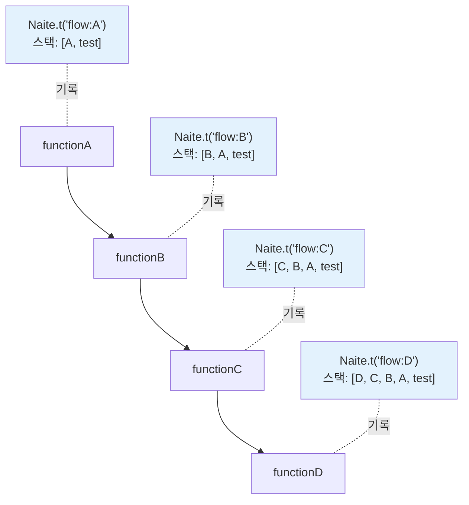

Naite의 콜스택 추적 기능을 활용하여 테스트를 효과적으로 디버깅하는 방법을 알아봅니다.

## 콜스택 추적 개요

<CardGroup cols={2}>
  <Card title="자동 수집" icon="gears">
    Naite.t() 호출 시 콜스택 자동 추적
  </Card>
  <Card title="호출 경로" icon="route">
    함수 호출 순서 파일 위치 정보
  </Card>
  <Card title="디버깅 지원" icon="bug">
    문제 위치 파악 원인 추적
  </Card>
  <Card title="Viewer 통합" icon="eye">
    VSCode에서 시각화 클릭으로 이동
  </Card>
</CardGroup>

## 콜스택이란?

콜스택(Call Stack)은 프로그램 실행 중 함수 호출 순서를 추적하는 데이터 구조입니다. Naite는 `Naite.t()` 호출 시점의 콜스택을 자동으로 수집하여, 로그가 어디서 기록되었는지 정확히 파악할 수 있게 합니다.

### 왜 콜스택이 중요한가?

복잡한 애플리케이션에서는 하나의 작업이 여러 함수를 거쳐 실행됩니다. 문제가 발생했을 때, 어떤 경로로 함수가 호출되었는지 알면 디버깅이 훨씬 쉬워집니다.

<Tabs>
  <Tab title="console.log의 한계">
    ```typescript
    function saveUser() {
      console.log("Saving user..."); // 어디서 호출되었는지 모름
    }
    
    // A 경로: test1 → createUser → saveUser
    // B 경로: test2 → updateUser → saveUser
    // C 경로: test3 → importUsers → saveUser
    
    // 같은 로그가 세 경로에서 나오는데
    // 어느 경로인지 파악하기 어려움
    ```
  </Tab>
  
  <Tab title="Naite의 해결책">
    ```typescript
    function saveUser() {
      Naite.t("user:save", { /* ... */ });
      // 자동으로 콜스택 수집:
      // [saveUser → createUser → test1 → runWithMockContext]
    }
    
    // 나중에 조회 시
    const logs = Naite.get("user:save")
      .fromFunction("createUser")  // A 경로만
      .result();
    
    // 또는
    const logs = Naite.get("user:save")
      .fromFunction("updateUser")  // B 경로만
      .result();
    ```
  </Tab>
</Tabs>

### 기본 구조

Naite가 수집하는 콜스택 정보는 다음과 같습니다:

```typescript
interface StackFrame {
  functionName: string | null; // "createUser"
  filePath: string; // "/Users/.../user.model.ts"
  lineNumber: number; // 123
}

interface NaiteTrace {
  key: string;
  data: any;
  stack: StackFrame[]; // 콜스택 배열
  at: Date;
}
```

<Accordion title="콜스택 예시">

```typescript
async function createUser() {
  Naite.t("user:create", { username: "john" });
}

test("사용자 생성", async () => {
  await createUser();
});
```

**수집되는 콜스택**:

```typescript
[
  {
    functionName: "createUser",
    filePath: "/Users/.../user.model.ts",
    lineNumber: 15,
  },
  {
    functionName: "test",
    filePath: "/Users/.../user.model.test.ts",
    lineNumber: 42,
  },
  {
    functionName: "runWithMockContext",
    filePath: "/Users/.../bootstrap.ts",
    lineNumber: 58,
  },
];
```

**의미**:

1. `createUser` (15번 줄): 실제로 `Naite.t()`를 호출한 위치
2. `test` (42번 줄): 테스트 코드에서 `createUser`를 호출
3. `runWithMockContext`: Sonamu의 Context 래퍼 (여기서 종료)

</Accordion>

## 콜스택 수집 원리

### extractCallStack() 동작

Naite는 JavaScript의 `Error` 객체를 이용하여 콜스택을 수집합니다.

```typescript
function extractCallStack(): StackFrame[] {
  // 현재 시점의 콜스택 생성
  const stack = new Error().stack;
  if (!stack) return [];

  const lines = stack.split("\n");

  // 콜스택 구조:
  // [0]: "Error"
  // [1]: "at extractCallStack"
  // [2]: "at Naite.t"
  // [3]: 실제 호출 위치부터 시작
  const frames = lines
    .slice(3) // 위 3개 제외
    .map(parseStackFrame)
    .filter((frame): frame is StackFrame => frame !== null);

  // runWithContext 발견 시 거기서 자르기
  const contextIndex = frames.findIndex(
    (f) =>
      f.functionName?.includes("runWithContext") || f.functionName?.includes("runWithMockContext"),
  );

  return contextIndex >= 0 ? frames.slice(0, contextIndex + 1) : frames;
}
```

<Steps>
  <Step title="Error 객체 생성">`new Error().stack`으로 현재 콜스택을 문자열로 얻습니다.</Step>

<Step title="불필요한 프레임 제거">
  `Error`, `extractCallStack`, `Naite.t` 프레임을 제외합니다 (`slice(3)`).
</Step>

<Step title="파싱">각 라인을 `StackFrame` 객체로 파싱합니다.</Step>

  <Step title="Context 경계에서 종료">
    `runWithContext`를 만나면 거기서 자릅니다. 그 이상은 Vitest 내부 코드로 의미가 없습니다.
  </Step>
</Steps>

### parseStackFrame() 로직

두 가지 콜스택 형식을 파싱합니다:

<Tabs>
  <Tab title="형식 1: 함수명 있음">
    ```
    at FunctionName (filePath:lineNumber:columnNumber)
    ```
    
    ```typescript
    const matchWithFunc = line.match(/at\s+(.+?)\s+\((.+?):(\d+):\d+\)/);
    if (matchWithFunc) {
      const functionName = matchWithFunc[1];
      const filePath = matchWithFunc[2];
      const lineNumber = Number.parseInt(matchWithFunc[3], 10);
    
      return { functionName, filePath, lineNumber };
    }
    ```
  </Tab>
  
  <Tab title="형식 2: 익명 함수">
    ```
    at filePath:lineNumber:columnNumber
    ```
    
    ```typescript
    const matchNoFunc = line.match(/at\s+(.+?):(\d+):\d+$/);
    if (matchNoFunc) {
      const filePath = matchNoFunc[1];
      const lineNumber = Number.parseInt(matchNoFunc[2], 10);
    
      return {
        functionName: null,  // 익명
        filePath,
        lineNumber,
      };
    }
    ```
  </Tab>
  
  <Tab title="특수 케이스: node:internal">
    ```typescript
    // filePath에 이미 :가 포함되어 있으면
    // (예: "node:internal/process/task_queues")
    if (filePath.includes(":")) {
      return { 
        functionName, 
        filePath, 
        lineNumber: 0  // 라인 번호 없음
      };
    }
    ```
  </Tab>
</Tabs>

<Info>
  **runWithContext 종료 이유**: Naite는 의미 있는 콜스택만 유지합니다. `runWithContext`는 Sonamu의
  Context 경계이며, 그 위는 Vitest의 내부 코드로 디버깅에 도움이 되지 않습니다.
</Info>

## 실전 디버깅 시나리오

### 1. 호출 경로 추적

복잡한 함수 호출 체인에서 특정 경로만 추적합니다.

```typescript
async function processOrder(orderId: number) {
  Naite.t("order:process:start", { orderId });

  await validateOrder(orderId);
  await chargePayment(orderId);
  await sendNotification(orderId);

  Naite.t("order:process:done", { orderId });
}

async function chargePayment(orderId: number) {
  Naite.t("payment:charge", { orderId });
  // 결제 처리
}

test("주문 처리", async () => {
  await processOrder(123);

  // payment:charge가 어디서 호출되었는지 확인
  const trace = Naite.get("payment:charge").getTraces()[0];

  // 콜스택 출력
  console.log("콜스택:");
  trace.stack.forEach((frame, i) => {
    console.log(`${i + 1}. ${frame.functionName} (${frame.filePath}:${frame.lineNumber})`);
  });

  // 출력:
  // 1. chargePayment (/Users/.../payment.ts:45)
  // 2. processOrder (/Users/.../order.ts:23)
  // 3. test (/Users/.../order.test.ts:15)
  // 4. runWithMockContext (/Users/.../bootstrap.ts:58)
});
```

<Tip>
  **VSCode에서 확인**: Naite Viewer에서 로그를 클릭하면 콜스택이 표시되고, 각 프레임을 클릭하면 해당
  코드 위치로 바로 이동합니다.
</Tip>

### 2. 에러 발생 지점 파악

에러가 발생했을 때 정확한 위치를 찾습니다.

```typescript
async function createUser(data: UserCreateInput) {
  Naite.t("user:create:start", data);

  try {
    // 유효성 검사
    await validateUser(data);

    // DB 저장
    const user = await db.insert("users").values(data);
    Naite.t("user:create:success", { userId: user.id });

    return user;
  } catch (error) {
    // 에러 발생 시 콜스택과 함께 기록
    Naite.t("user:create:error", {
      error: error.message,
      data,
    });
    throw error;
  }
}

test("에러 추적", async () => {
  try {
    await createUser({ username: "" }); // 유효하지 않은 입력
  } catch (error) {
    // 에러 로그의 콜스택 확인
    const errorTrace = Naite.get("user:create:error").getTraces()[0];

    // 에러가 발생한 파일과 라인 확인
    expect(errorTrace.stack[0].filePath).toContain("user.model.ts");
    expect(errorTrace.stack[0].lineNumber).toBeGreaterThan(0);

    // VSCode Viewer에서 클릭하면 해당 위치로 이동 가능
  }
});
```

<Accordion title="에러 추적의 가치">

일반적인 `console.log`나 `console.error`는 에러 메시지만 보여줍니다. 하지만 Naite의 콜스택을 사용하면:

1. **정확한 파일과 라인**: 에러가 발생한 정확한 코드 위치
2. **호출 경로**: 어떤 함수들을 거쳐 에러가 발생했는지
3. **VSCode 통합**: 클릭 한 번으로 코드 위치로 이동
4. **컨텍스트**: 에러 발생 시점의 데이터와 함께 저장

예를 들어, `validateUser`에서 에러가 발생했다면:

```
[
  { functionName: "validateUser", filePath: "...", lineNumber: 78 },
  { functionName: "createUser", filePath: "...", lineNumber: 45 },
  { functionName: "test", filePath: "...", lineNumber: 12 }
]
```

이를 통해 78번 줄의 `validateUser`에서 에러가 발생했고, 이것이 45번 줄의 `createUser`에서 호출되었고, 12번 줄의 테스트에서 시작되었음을 알 수 있습니다.

</Accordion>

### 3. 복잡한 호출 체인 분석

A → B → C → D 순서로 호출되는 복잡한 체인을 분석합니다.

```typescript
async function functionA() {
  Naite.t("flow:A", { step: "A" });
  await functionB();
}

async function functionB() {
  Naite.t("flow:B", { step: "B" });
  await functionC();
}

async function functionC() {
  Naite.t("flow:C", { step: "C" });
  await functionD();
}

async function functionD() {
  Naite.t("flow:D", { step: "D" });
}

test("호출 체인 분석", async () => {
  await functionA();

  // 각 로그의 콜스택 길이 확인
  const traceA = Naite.get("flow:A").getTraces()[0];
  const traceD = Naite.get("flow:D").getTraces()[0];

  console.log("A의 콜스택 길이:", traceA.stack.length); // 2 (A → test)
  console.log("D의 콜스택 길이:", traceD.stack.length); // 5 (D → C → B → A → test)

  // D의 콜스택에 모든 함수가 포함되어 있는지 확인
  const functions = traceD.stack.map((f) => f.functionName);
  expect(functions).toContain("functionD");
  expect(functions).toContain("functionC");
  expect(functions).toContain("functionB");
  expect(functions).toContain("functionA");

  // 순서도 확인 가능
  expect(functions[0]).toBe("functionD"); // 가장 안쪽
  expect(functions[3]).toBe("functionA"); // 가장 바깥쪽
});
```

**시각화**:



### 4. fromFunction() 활용

특정 함수에서 호출된 로그만 필터링합니다.

```typescript
test("특정 함수에서 호출된 로그만", async () => {
  await processOrder(123);

  // chargePayment 함수에서 직접 호출된 로그만
  const paymentLogs = Naite.get("*").fromFunction("chargePayment", { from: "direct" }).result();

  // chargePayment의 호출 체인에 있는 모든 로그
  const allPaymentLogs = Naite.get("*").fromFunction("chargePayment", { from: "both" }).result();

  console.log("직접 호출:", paymentLogs.length);
  console.log("체인 전체:", allPaymentLogs.length);
});
```

<Tabs>
  <Tab title="direct (직접 호출)">
    콜스택의 첫 번째 프레임(`stack[0]`)만 체크합니다.
    
    ```typescript
    fromFunction("chargePayment", { from: "direct" })
    
    // 매칭되는 경우:
    // [chargePayment, processOrder, test]
    //  ^^^^^^^^^^^^^ 첫 번째 프레임에 있음
    
    // 매칭 안 되는 경우:
    // [sendEmail, chargePayment, processOrder, test]
    //  ^^^^^^^^^ 첫 번째 프레임에 없음
    ```
  </Tab>
  
  <Tab title="indirect (간접 호출)">
    콜스택의 두 번째 이후 프레임(`stack[1+]`)만 체크합니다.
    
    ```typescript
    fromFunction("chargePayment", { from: "indirect" })
    
    // 매칭되는 경우:
    // [sendEmail, chargePayment, processOrder, test]
    //             ^^^^^^^^^^^^^ 두 번째 이후에 있음
    
    // 매칭 안 되는 경우:
    // [chargePayment, processOrder, test]
    //  ^^^^^^^^^^^^^ 첫 번째에 있음 (직접 호출)
    ```
  </Tab>
  
  <Tab title="both (모두, 기본값)">
    콜스택 전체에서 체크합니다.
    
    ```typescript
    fromFunction("chargePayment", { from: "both" })
    fromFunction("chargePayment")  // 동일
    
    // 매칭되는 경우:
    // [chargePayment, ...]         직접 호출
    // [sendEmail, chargePayment, ...] 간접 호출
    // 모두 매칭됨
    ```
  </Tab>
</Tabs>

## VSCode Viewer 통합

Naite Viewer는 콜스택 정보를 시각적으로 표시하고, 클릭 한 번으로 코드 위치로 이동할 수 있게 합니다.

### 콜스택 시각화

Naite Viewer에서 각 로그를 클릭하면 다음과 같이 표시됩니다:

<Accordion title="Viewer 화면 예시" defaultOpen>

```text
user:create:start
{ username: "john", email: "john@example.com" }

📍 직접 호출 위치:
  /Users/.../user.model.ts:15
  ↑ 클릭하면 이 위치로 이동

📚 전체 콜스택:
  1. createUser (user.model.ts:15)
     ↑ 클릭하면 해당 위치로 이동
  2. processUser (user.service.ts:45)
  3. test (user.model.test.ts:42)
  4. runWithMockContext (bootstrap.ts:58)
```

**인터랙션**:

- 각 프레임을 클릭하면 VSCode 에디터가 해당 파일의 정확한 라인으로 이동
- 코드 컨텍스트를 즉시 확인 가능
- 디버깅 시간 단축

</Accordion>

### 실전 활용 예시

<Steps>
  <Step title="Viewer에서 로그 확인">
    테스트 실행 후 Naite Viewer에서 의심스러운 로그를 찾습니다.
  </Step>

<Step title="콜스택 확인">
  로그를 클릭하여 콜스택을 확인합니다. 어떤 함수들을 거쳐 왔는지 파악합니다.
</Step>

<Step title="코드 위치로 이동">콜스택의 각 프레임을 클릭하여 실제 코드를 확인합니다.</Step>

  <Step title="문제 파악 및 수정">콜스택을 따라가며 문제의 원인을 찾고 수정합니다.</Step>
</Steps>

<Tip>
  **프로 팁**: Viewer에서 여러 로그의 콜스택을 비교하면, 정상 경로와 비정상 경로의 차이를 빠르게
  파악할 수 있습니다.
</Tip>

## 고급 패턴

### 1. 성능 병목 파악

콜스택과 시간 정보를 결합하여 성능 병목을 찾습니다.

```typescript
async function slowOperation() {
  Naite.t("perf:start", { at: Date.now() });

  await step1(); // 느린 단계
  Naite.t("perf:step1", { at: Date.now() });

  await step2();
  Naite.t("perf:step2", { at: Date.now() });

  await step3();
  Naite.t("perf:step3", { at: Date.now() });

  Naite.t("perf:end", { at: Date.now() });
}

test("성능 분석", async () => {
  await slowOperation();

  const traces = Naite.get("perf:*").getTraces();

  // 각 단계별 소요 시간과 호출 위치 출력
  for (let i = 1; i < traces.length; i++) {
    const prev = traces[i - 1];
    const curr = traces[i];

    const duration = curr.at.getTime() - prev.at.getTime();

    console.log(`${prev.key} → ${curr.key}: ${duration}ms`);
    console.log(`  호출 위치: ${curr.stack[0].filePath}:${curr.stack[0].lineNumber}`);

    if (duration > 1000) {
      console.log(`  ⚠️ 병목 구간! (1초 초과)`);
    }
  }
});
```

### 2. Syncer 디버깅

Syncer의 복잡한 템플릿 생성 과정을 추적합니다.

```typescript
test("Syncer 템플릿 생성 추적", async () => {
  await Sonamu.syncer.generateTemplate("model", {
    entityId: "User",
  });

  // renderTemplate이 어디서 어떻게 호출되었는지
  const renderLogs = Naite.get("syncer:*").fromFunction("renderTemplate").getTraces();

  for (const trace of renderLogs) {
    console.log(`\n${trace.key}:`);
    console.log(`  데이터:`, trace.data);
    console.log(`  콜스택:`);

    trace.stack.forEach((frame, i) => {
      console.log(
        `    ${i + 1}. ${frame.functionName} (${frame.filePath.split("/").pop()}:${frame.lineNumber})`,
      );
    });
  }

  // 출력 예시:
  // syncer:renderTemplate:
  //   데이터: { template: "model", entityId: "User" }
  //   콜스택:
  //     1. renderTemplate (syncer.ts:145)
  //     2. generateTemplate (syncer.ts:98)
  //     3. generateAll (syncer.ts:45)
  //     4. test (syncer.test.ts:23)
});
```

### 3. 무한 루프 감지

재귀 함수의 깊이를 모니터링합니다.

```typescript
async function recursiveFunction(depth: number) {
  Naite.t("recursive:call", { depth });

  if (depth > 100) {
    throw new Error("Too deep!");
  }

  if (depth < 10) {
    await recursiveFunction(depth + 1);
  }
}

test("재귀 깊이 확인", async () => {
  await recursiveFunction(0);

  const traces = Naite.get("recursive:call").getTraces();

  // 각 depth의 콜스택 길이 확인
  for (const trace of traces) {
    console.log(`Depth ${trace.data.depth}:`);
    console.log(`  콜스택 길이: ${trace.stack.length}`);

    // 콜스택에 recursiveFunction이 몇 개인지
    const recursiveCount = trace.stack.filter((f) => f.functionName === "recursiveFunction").length;

    console.log(`  재귀 깊이: ${recursiveCount}`);

    if (recursiveCount > 50) {
      console.warn(`  ⚠️ 재귀가 너무 깊습니다!`);
    }
  }
});
```

### 4. 조건부 로깅

특정 조건에서만 상세 로깅을 활성화합니다.

```typescript
async function processData(data: any[]) {
  const TRACE_SUSPICIOUS = process.env.TRACE_SUSPICIOUS === "true";

  for (let i = 0; i < data.length; i++) {
    const item = data[i];

    // 의심스러운 데이터만 추적
    if (TRACE_SUSPICIOUS && item.suspicious) {
      Naite.t("data:suspicious", {
        index: i,
        item,
      });

      // 콜스택으로 누가 이 데이터를 만들었는지 추적 가능
    }
  }
}

// 사용:
// TRACE_SUSPICIOUS=true pnpm test
```

## 콜스택 제한 사항

### runWithContext에서 종료

Naite는 `runWithContext` 또는 `runWithMockContext`를 만나면 콜스택 수집을 종료합니다.

```typescript
function extractCallStack(): StackFrame[] {
  // ...

  // runWithContext 계열 함수 발견 시 거기서 자르기
  const contextIndex = frames.findIndex(
    (f) =>
      f.functionName?.includes("runWithContext") || f.functionName?.includes("runWithMockContext"),
  );

  return contextIndex >= 0 ? frames.slice(0, contextIndex + 1) : frames;
}
```

**이유**:

- `runWithContext`는 Sonamu의 Context 경계
- 그 위는 Vitest 내부 코드 (의미 없음)
- 의미 있는 콜스택만 유지하여 가독성 향상

### node:internal 경로

Node.js 내부 경로는 lineNumber를 0으로 설정합니다:

```typescript
if (filePath.includes(":")) {
  return { functionName, filePath, lineNumber: 0 };
}
```

**예시**:

```typescript
{
  functionName: "processTicksAndRejections",
  filePath: "node:internal/process/task_queues",
  lineNumber: 0
}
```

이러한 프레임은 Node.js 내부 동작이므로 디버깅에 큰 도움이 되지 않습니다.

### 익명 함수

화살표 함수나 익명 함수는 `functionName`이 `null`입니다:

```typescript
// 익명 함수
const handler = async () => {
  Naite.t("handler:call", {});
};

// 콜스택:
// [
//   { functionName: null, filePath: "...", lineNumber: 15 }
// ]
```

<Tip>
디버깅을 쉽게 하려면 중요한 함수에는 명시적인 이름을 부여하세요:
```typescript
// ✅ 좋은 방법
async function handleUser() { /* ... */ }

// ❌ 나쁜 방법
const handler = async () => {/* ... */};

````
</Tip>

## 베스트 프랙티스

<Steps>
  <Step title="의미 있는 위치에 로깅">
    ```typescript
    // ✅ 좋은 예: 중요한 분기점에
    async function processUser(user: User) {
      Naite.t("user:process:start", { userId: user.id });

      if (user.isAdmin) {
        Naite.t("user:process:admin", { userId: user.id });
        await processAdmin(user);
      } else {
        Naite.t("user:process:regular", { userId: user.id });
        await processRegular(user);
      }

      Naite.t("user:process:done", { userId: user.id });
    }
    ```
  </Step>

  <Step title="에러 상황에 로깅">
    ```typescript
    // ✅ 좋은 예: 에러 발생 시 콜스택 기록
    async function riskyOperation() {
      try {
        await dangerousCall();
      } catch (error) {
        Naite.t("error", {
          message: error.message,
          // 콜스택이 자동으로 수집되므로
          // 어디서 에러가 발생했는지 추적 가능
        });
        throw error;
      }
    }
    ```
  </Step>

  <Step title="명시적 함수명 사용">
    ```typescript
    // ✅ 좋은 예: 명시적 함수명
    async function createUser() {
      Naite.t("user:create", {});
    }

    // ❌ 나쁜 예: 익명 함수
    const create = async () => {
      Naite.t("user:create", {});
    };
    ```
  </Step>

  <Step title="VSCode Viewer 활용">
    로컬 개발 시 Naite Viewer를 켜두고, 로그를 클릭하여 콜스택을 확인하세요. 코드 위치로 바로 이동할 수 있어 디버깅 속도가 크게 향상됩니다.
  </Step>
</Steps>

## 주의사항

<Warning>
**콜스택 추적 사용 시 주의사항**:

1. **성능**: 콜스택 수집은 비용이 있으므로 과도한 로깅을 피하세요.

2. **깊이**: 재귀가 깊으면 콜스택도 길어집니다. 무한 재귀를 주의하세요.

3. **익명 함수**: 익명 함수는 `functionName`이 `null`입니다. 중요한 함수는 명시적 이름을 부여하세요.

4. **압축 코드**: 프로덕션 빌드에서는 함수명이 난독화될 수 있습니다. 하지만 Naite는 테스트 전용이므로 문제없습니다.

5. **테스트 전용**: 프로덕션 코드에는 사용하지 않습니다 (`NODE_ENV === "test"`에서만 동작).
</Warning>

## 다음 단계

<CardGroup cols={2}>
  <Card title="Naite Viewer" icon="eye" href="/ko/testing/naite/naite-viewer">
    VSCode Extension으로 콜스택을 시각적으로 확인하세요.
  </Card>
  <Card title="로그 조회하기" icon="magnifying-glass" href="/ko/testing/naite/querying-logs">
    fromFunction()으로 특정 함수의 로그만 필터링하세요.
  </Card>
  <Card title="로그 기록하기" icon="pen" href="/ko/testing/naite/recording-logs">
    효과적인 로깅 전략을 배우세요.
  </Card>
  <Card title="Naite란?" icon="circle-info" href="/ko/testing/naite/what-is-naite">
    Naite 전체 개요로 돌아가세요.
  </Card>
</CardGroup>
````
