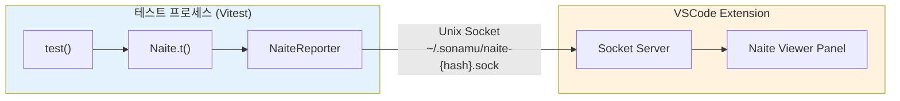
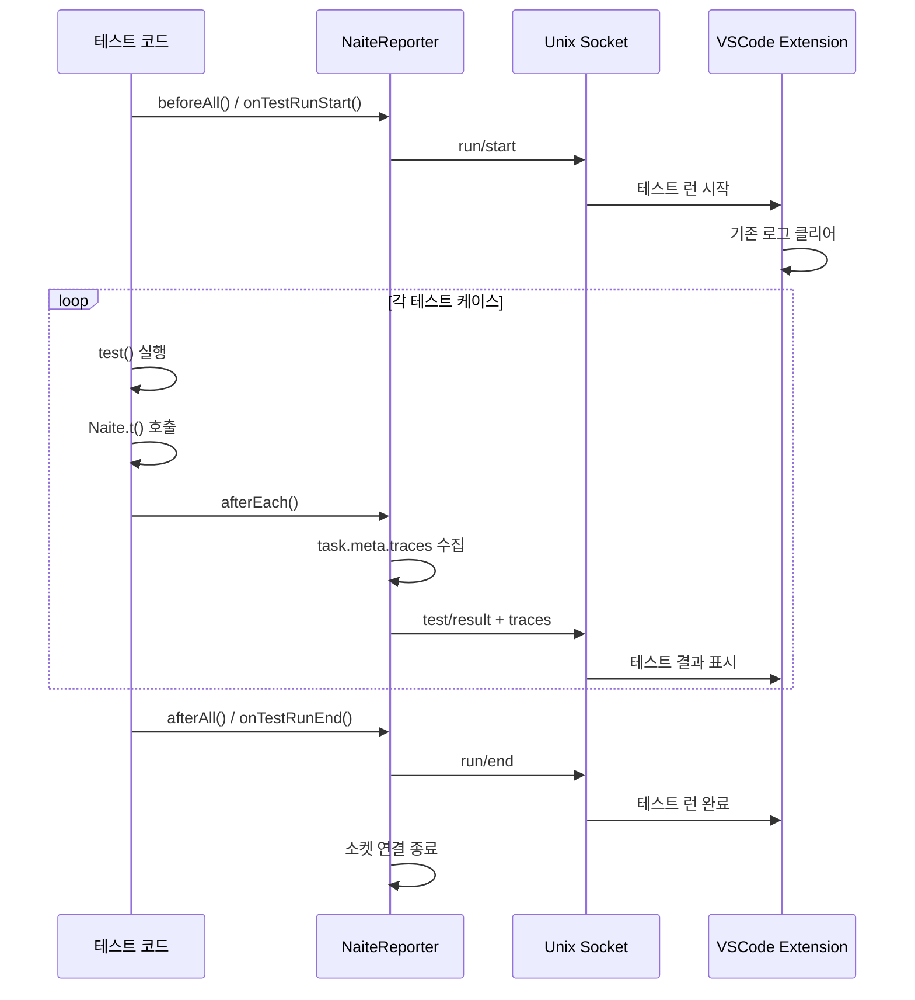

VSCode Extension인 Naite Viewer를 사용하여 테스트 실행 중 기록된 로그를 실시간으로 시각화하는 방법을 알아봅니다.

## Naite Viewer 개요

<CardGroup cols={2}>
  <Card title="실시간 시각화" icon="chart-line">
    테스트 실행 중
    
    로그 즉시 표시
  </Card>
  <Card title="Unix Socket 통신" icon="plug">
    프로세스 간 통신
    
    빠른 전송
  </Card>
  <Card title="프로젝트별 격리" icon="folder">
    소켓 파일 분리
    
    독립적 운영
  </Card>
  <Card title="자동 연결" icon="link">
    Extension 실행 시
    
    자동 소켓 생성
  </Card>
</CardGroup>

## Naite Viewer란?

**Naite Viewer**는 Sonamu VSCode Extension에 포함된 기능으로, 테스트 실행 중 기록된 Naite 로그를 실시간으로 시각화합니다.

Naite는 테스트 실행 중 `Naite.t()`로 기록한 모든 데이터를 VSCode Extension으로 전송하여, 개발자가 테스트 흐름을 시각적으로 추적할 수 있게 합니다. 이는 복잡한 비즈니스 로직이나 여러 함수 호출이 얽힌 상황에서 특히 유용합니다.

### 주요 기능

<Steps>
  <Step title="실시간 로그 표시">
    테스트 실행 중 `Naite.t()`로 기록된 모든 로그를 즉시 VSCode 패널에 표시합니다. 콘솔에서 로그를 찾을 필요 없이 구조화된 형태로 확인할 수 있습니다.
  </Step>
  
  <Step title="테스트별 그룹화">
    각 테스트 케이스별로 로그를 자동 그룹화합니다. Suite 단위로도 분류되어 대규모 테스트에서도 원하는 로그를 빠르게 찾을 수 있습니다.
  </Step>
  
  <Step title="콜스택 추적">
    각 로그의 호출 위치와 전체 콜스택 정보를 표시합니다. 로그를 클릭하면 해당 코드 위치로 바로 이동할 수 있습니다.
  </Step>
  
  <Step title="필터링 및 검색">
    wildcard 패턴(`user:*`)으로 특정 모듈의 로그만 필터링하거나, 키워드로 로그 내용을 검색할 수 있습니다.
  </Step>
</Steps>

## 아키텍처

### 1. Unix Socket 통신

Naite Viewer는 Unix Socket을 통해 테스트 프로세스와 통신합니다. 이 방식은 파일 시스템을 사용하지 않고 프로세스 간 직접 통신이 가능하여 빠르고 안전합니다.



**소켓 통신의 이점**:
- **빠른 전송**: HTTP나 파일보다 훨씬 빠른 IPC(Inter-Process Communication)
- **실시간성**: 테스트 실행 즉시 로그가 Extension에 전달됨
- **격리**: 프로젝트별 독립된 소켓으로 충돌 방지

**소켓 경로 규칙**:
<Tabs>
  <Tab title="macOS / Linux">
    ```bash
    ~/.sonamu/naite-{hash}.sock
    ```
    `{hash}`는 `sonamu.config.ts` 경로의 MD5 해시 앞 8자리입니다.
  </Tab>
  
  <Tab title="Windows">
    ```powershell
    \\.\pipe\naite-{hash}
    ```
    Windows Named Pipe를 사용합니다.
  </Tab>
</Tabs>

<Accordion title="해시 생성 방식 자세히 보기">
각 프로젝트는 `sonamu.config.ts` 파일의 절대 경로를 기반으로 고유한 해시를 생성합니다:

```typescript
import { createHash } from "crypto";

const configPath = "/project/api/src/sonamu.config.ts";
const hash = createHash("md5")
  .update(configPath)
  .digest("hex")
  .slice(0, 8);

// 예: "a1b2c3d4"
// 최종 소켓 경로: ~/.sonamu/naite-a1b2c3d4.sock
```

이 방식으로 여러 Sonamu 프로젝트를 동시에 실행해도 각각 독립된 소켓을 사용하여 로그가 섞이지 않습니다.
</Accordion>

### 2. 메시지 프로토콜

테스트 프로세스와 Extension 간에는 3가지 타입의 메시지가 전송됩니다.

#### run/start - 테스트 런 시작

테스트 런이 시작될 때 전송됩니다. Extension은 이 메시지를 받으면 기존 로그를 모두 클리어하고 새로운 테스트 런을 준비합니다.

<CodeGroup>

```typescript 메시지 형식
{
  type: "run/start",
  startedAt: "2025-01-08T12:34:56.789Z"
}
```

```typescript 전송 시점
// Vitest Reporter의 onTestRunStart()
export const NaiteVitestReporter = {
  async onTestRunStart() {
    await NaiteReporter.startTestRun();
  }
};

// 또는 beforeAll()
beforeAll(async () => {
  await NaiteReporter.startTestRun();
});
```

</CodeGroup>

<Info>
Watch 모드에서 파일을 수정하면 테스트가 재실행되는데, 매번 `run/start` 메시지가 전송되어 Viewer가 초기화됩니다.
</Info>

#### test/result - 테스트 결과

각 테스트 케이스가 완료될 때마다 전송됩니다. 테스트 결과와 함께 Naite 로그(traces)가 포함됩니다.

<CodeGroup>

```typescript 메시지 형식
{
  type: "test/result",
  receivedAt: "2025-01-08T12:34:57.123Z",
  suiteName: "UserModel",
  suiteFilePath: "/Users/.../user.model.test.ts",
  testName: "사용자 생성",
  testFilePath: "/Users/.../user.model.test.ts",
  testLine: 15,
  status: "pass",
  duration: 123,
  traces: [
    {
      key: "user:create:input",
      value: { username: "john" },
      filePath: "/Users/.../user.model.test.ts",
      lineNumber: 20,
      at: "2025-01-08T12:34:57.100Z"
    }
  ]
}
```

```typescript 전송 시점
// bootstrap.ts의 afterEach
afterEach(async ({ task }) => {
  await NaiteReporter.reportTestResult({
    suiteName: task.suite?.name ?? "(no suite)",
    testName: task.name,
    status: task.result?.state ?? "pass",
    traces: task.meta?.traces ?? [],
    // ... 기타 메타데이터
  });
});
```

</CodeGroup>

**포함 정보**:
- **테스트 메타데이터**: Suite명, 파일 경로, 라인 번호
- **테스트 결과**: 성공/실패 상태, 소요 시간, 에러 정보
- **Naite traces**: `Naite.t()`로 기록된 모든 로그

#### run/end - 테스트 런 종료

모든 테스트가 완료되면 전송됩니다. Extension은 이 메시지로 테스트 런이 끝났음을 인지합니다.

<CodeGroup>

```typescript 메시지 형식
{
  type: "run/end",
  endedAt: "2025-01-08T12:34:58.789Z"
}
```

```typescript 전송 시점
// Vitest Reporter의 onTestRunEnd()
export const NaiteVitestReporter = {
  async onTestRunEnd() {
    await NaiteReporter.endTestRun();
  }
};
```

</CodeGroup>

### 3. 전송 흐름

전체 테스트 실행 과정에서 메시지가 전송되는 순서를 살펴보겠습니다.



<Accordion title="코드로 보는 전송 흐름">

```typescript
// 1. 테스트 시작 - 소켓 연결 및 run/start 전송
beforeAll(async () => {
  await NaiteReporter.startTestRun();
  // → send({ type: "run/start" })
});

// 2. 테스트 실행 - Naite 로그 수집
test("사용자 생성", async () => {
  Naite.t("user:create:input", { username: "john" });
  
  const { user } = await userModel.create({ username: "john" });
  
  Naite.t("user:create:output", { userId: user.id });
  
  // 테스트 종료 후 afterEach 실행
});

// 3. 테스트 종료 - traces 수집 및 전송
afterEach(async ({ task }) => {
  // getAllTraces()로 모든 Naite 로그 수집
  task.meta.traces = Naite.getAllTraces();
  
  // Extension으로 전송
  await NaiteReporter.reportTestResult({
    testName: task.name,
    status: task.result?.state,
    traces: task.meta.traces,
    // ...
  });
  // → send({ type: "test/result", traces: [...] })
});

// 4. 전체 런 종료 - run/end 전송 및 소켓 종료
afterAll(() => {
  await NaiteReporter.endTestRun();
  // → send({ type: "run/end" })
  // → socket.end()
});
```

</Accordion>

<Tip>
**버퍼링 메커니즘**: Extension이 아직 시작되지 않았거나 소켓 연결이 지연되는 경우, NaiteReporter는 메시지를 버퍼에 저장했다가 연결 성공 시 한 번에 전송합니다. 이로 인해 Extension을 늦게 켜도 이전 테스트 로그를 볼 수 있습니다.
</Tip>

## 설치 및 설정

### 1. Extension 설치

<Steps>
  <Step title="VSCode Marketplace에서 설치">
    1. VSCode 왼쪽 사이드바에서 Extensions 아이콘 클릭
    2. "Sonamu" 검색
    3. Install 버튼 클릭
  </Step>
  
  <Step title="Extension 활성화 확인">
    설치 후 VSCode 하단 상태바에 Sonamu 아이콘이 나타나면 정상적으로 활성화된 것입니다.
  </Step>
</Steps>

### 2. 자동 연결

Extension이 실행되면 자동으로 소켓 서버를 시작합니다:

<Steps>
  <Step title="프로젝트 감지">
    현재 워크스페이스에서 `sonamu.config.ts` 파일을 찾습니다.
  </Step>
  
  <Step title="해시 계산">
    `sonamu.config.ts`의 절대 경로로 MD5 해시를 생성합니다 (앞 8자리).
  </Step>
  
  <Step title="소켓 서버 시작">
    `~/.sonamu/naite-{hash}.sock` 경로에 Unix Socket 서버를 시작합니다.
  </Step>
  
  <Step title="테스트 프로세스 대기">
    테스트 실행 시 NaiteReporter가 이 소켓으로 연결됩니다.
  </Step>
</Steps>

<Info>
Extension은 프로젝트 경로를 기반으로 소켓을 생성하므로, **프로젝트 폴더를 직접 열어야** 정상 작동합니다. 상위 폴더를 열면 소켓 경로가 달라져 연결되지 않을 수 있습니다.
</Info>

### 3. 테스트 실행

<Tabs>
  <Tab title="일반 실행">
    ```bash
    pnpm test
    ```
    모든 테스트를 한 번 실행하고 종료합니다.
  </Tab>
  
  <Tab title="Watch 모드">
    ```bash
    pnpm test --watch
    ```
    파일 변경 시 자동으로 관련 테스트를 재실행합니다. 개발 중 가장 많이 사용하는 모드입니다.
  </Tab>
  
  <Tab title="특정 파일">
    ```bash
    pnpm test user.model.test.ts
    ```
    특정 테스트 파일만 실행합니다.
  </Tab>
</Tabs>

테스트 실행 시 자동으로 Extension과 연결되어 로그가 실시간으로 표시됩니다.

## 사용법

### 1. Naite Viewer 패널 열기

<Frame caption="VSCode에서 Naite Viewer 패널 열기">
  
</Frame>

<Tabs>
  <Tab title="Command Palette" icon="keyboard">
    1. `Cmd+Shift+P` (macOS) 또는 `Ctrl+Shift+P` (Windows/Linux)
    2. "Naite: Open Viewer" 입력
    3. Enter
  </Tab>
  
  <Tab title="사이드바" icon="sidebar">
    1. VSCode 왼쪽 Activity Bar에서 Sonamu 아이콘 클릭
    2. "Naite Viewer" 탭 선택
  </Tab>
  
  <Tab title="단축키" icon="bolt">
    단축키를 설정하면 더 빠르게 열 수 있습니다:
    1. `Cmd+K Cmd+S` → Keyboard Shortcuts
    2. "Naite: Open Viewer" 검색
    3. 원하는 키 조합 설정 (예: `Cmd+Shift+N`)
  </Tab>
</Tabs>

### 2. 로그 확인

테스트 실행 시 Naite Viewer에 로그가 자동으로 표시됩니다.

#### Viewer 화면 구성

Naite Viewer는 테스트를 3단계 계층으로 표시합니다:

<Tabs>
  <Tab title="계층 구조" icon="sitemap">
    ```mermaid
    graph TB
        Suite["📁 Suite 레벨<br/>(UserModel)"]
        Test1["✓ Test 레벨<br/>사용자 생성 (123ms)"]
        Test2["✓ Test 레벨<br/>사용자 업데이트 (98ms)"]
        Trace1["📝 Trace 레벨<br/>user:create:input"]
        Trace2["📝 Trace 레벨<br/>user:create:output"]
        Trace3["📝 Trace 레벨<br/>user:update:input"]
        Trace4["📝 Trace 레벨<br/>user:update:done"]
        
        Suite --> Test1
        Suite --> Test2
        Test1 --> Trace1
        Test1 --> Trace2
        Test2 --> Trace3
        Test2 --> Trace4
        
        style Suite fill:#e3f2fd
        style Test1 fill:#f1f8e9
        style Test2 fill:#f1f8e9
        style Trace1 fill:#fff9c4
        style Trace2 fill:#fff9c4
        style Trace3 fill:#fff9c4
        style Trace4 fill:#fff9c4
    ```
  </Tab>
  
  <Tab title="실제 화면" icon="window">
    <AccordionGroup>
      <Accordion title="📁 UserModel (5 tests, 4 passed, 1 failed)" defaultOpen>
        <AccordionGroup>
          <Accordion title="✓ 사용자 생성 (123ms)" defaultOpen>
            <CodeGroup>
              ```json user:create:input
              {
                "username": "john",
                "email": "john@example.com"
              }
              ```
              
              ```json user:create:output
              {
                "userId": 123
              }
              ```
            </CodeGroup>
          </Accordion>
          
          <Accordion title="✓ 사용자 업데이트 (98ms)">
            <CodeGroup>
              ```json user:update:input
              {
                "userId": 123,
                "username": "jane"
              }
              ```
              
              ```json user:update:done
              {
                "success": true
              }
              ```
            </CodeGroup>
          </Accordion>
          
          <Accordion title="✓ 사용자 삭제 (45ms)">
            <CodeGroup>
              ```json user:delete:input
              {
                "userId": 123
              }
              ```
              
              ```json user:delete:done
              {
                "deleted": true
              }
              ```
            </CodeGroup>
          </Accordion>
          
          <Accordion title="✓ 사용자 조회 (32ms)">
            <CodeGroup>
              ```json user:find:input
              {
                "userId": 123
              }
              ```
              
              ```json user:find:output
              {
                "user": {
                  "id": 123,
                  "username": "jane"
                }
              }
              ```
            </CodeGroup>
          </Accordion>
          
          <Accordion title="✗ 중복 사용자 생성 실패 (67ms)">
            <CodeGroup>
              ```json user:create:input
              {
                "username": "jane"
              }
              ```
              
              ```json user:create:error
              {
                "errorType": "DuplicateError",
                "errorMessage": "Username already exists"
              }
              ```
            </CodeGroup>
          </Accordion>
        </AccordionGroup>
      </Accordion>
    </AccordionGroup>
  </Tab>
  
  <Tab title="구조 설명" icon="info">
    | 레벨 | 설명 | 예시 |
    |------|------|------|
    | **Suite** | 테스트 파일 단위로 그룹화 | `UserModel`, `PostModel` |
    | **Test** | 개별 테스트 케이스 | `✓ 사용자 생성 (123ms)` |
    | **Trace** | `Naite.t()`로 기록된 로그 | `user:create:input` |
    
    **상태 아이콘**:
    - ✓ Pass: 테스트 성공
    - ✗ Fail: 테스트 실패
    - ⊘ Skip: 테스트 건너뜀
    - ⌛ Pending: 대기 중
    
    **인터랙션**:
    - Suite/Test를 클릭하면 접었다 펼칠 수 있음
    - Trace를 클릭하면 콜스택 정보 표시
    - 각 콜스택 프레임 클릭 시 코드 위치로 이동
  </Tab>
</Tabs>

<Frame caption="Naite Viewer 메인 화면">
<video muted loop playsInline controls className="w-full rounded-xl" preload="metadata" src="https://cf.cartanova.ai/sonamu-docs/introduction4.mp4"></video>
</Frame>

<Info>
**실시간 업데이트**: Watch 모드에서 파일을 수정하면 테스트가 자동 재실행되고, Viewer도 즉시 업데이트됩니다. 이를 통해 코드 변경의 영향을 바로 확인할 수 있습니다.
</Info>

### 3. 콜스택 확인

로그를 클릭하면 해당 `Naite.t()` 호출의 상세 정보를 볼 수 있습니다.

<Accordion title="콜스택 정보 예시">

```text
user:create:input
{ username: "john", email: "john@example.com" }

📍 직접 호출 위치:
  /Users/.../user.model.test.ts:20
  
📚 전체 콜스택:
  1. test (user.model.test.ts:20)
     ↑ 클릭하면 이 위치로 이동
  2. createUser (user.model.ts:45)
  3. runWithMockContext (bootstrap.ts:58)
```

**콜스택의 의미**:
1. `test` (20번째 줄): 테스트 코드에서 `Naite.t()`를 호출한 위치
2. `createUser` (45번째 줄): 테스트가 호출한 실제 비즈니스 로직
3. `runWithMockContext`: Sonamu의 Context 래퍼 (여기까지만 표시)

</Accordion>

<Tip>
콜스택의 각 항목을 클릭하면 해당 파일의 정확한 라인으로 바로 이동합니다. 이는 복잡한 호출 체인을 디버깅할 때 특히 유용합니다.
</Tip>

### 4. 필터링 및 검색

대규모 테스트에서는 수백 개의 로그가 생성될 수 있습니다. 필터링 기능으로 원하는 로그만 빠르게 찾을 수 있습니다.

<Tabs>
  <Tab title="키 패턴 필터" icon="filter">
    wildcard 패턴으로 특정 모듈의 로그만 표시:
    
    ```text
    user:*           → user:create, user:update, user:delete
    syncer:*         → syncer:renderTemplate, syncer:writeFile
    *:create         → user:create, post:create
    syncer:*:user    → syncer:renderTemplate:user, syncer:writeFile:user
    ```
    
    입력창에 패턴을 입력하면 실시간으로 필터링됩니다.
  </Tab>
  
  <Tab title="텍스트 검색" icon="magnifying-glass">
    로그 내용, 파일 경로, 함수명으로 검색:
    
    - 키 검색: `user:create`
    - 값 검색: `"john"`
    - 파일 검색: `user.model.test.ts`
    - 함수 검색: `createUser`
    
    검색 결과는 하이라이트로 표시됩니다.
  </Tab>
  
  <Tab title="상태 필터" icon="check">
    테스트 상태로 필터링:
    
    - ✓ Passed only: 성공한 테스트만
    - ✗ Failed only: 실패한 테스트만
    - ⊘ Skipped: 건너뛴 테스트
    - ⌛ Pending: 대기 중인 테스트
  </Tab>
</Tabs>

## 실전 활용 사례

### 1. 복잡한 비즈니스 로직 디버깅

여러 단계를 거치는 복잡한 로직을 디버깅할 때 각 단계의 상태를 추적할 수 있습니다.

```typescript
test("주문 처리 전체 흐름", async () => {
  // 1단계: 주문 검증
  Naite.t("order:validate:start", { orderId: 123 });
  await validateOrder(123);
  Naite.t("order:validate:done", { valid: true });
  
  // 2단계: 재고 확인
  Naite.t("order:inventory:check", { productId: 456 });
  await checkInventory(456);
  Naite.t("order:inventory:available", { quantity: 10 });
  
  // 3단계: 결제 처리
  Naite.t("order:payment:start", { amount: 50000 });
  await processPayment({ orderId: 123, amount: 50000 });
  Naite.t("order:payment:done", { transactionId: "tx_789" });
  
  // 4단계: 배송 시작
  Naite.t("order:shipping:start", { orderId: 123 });
  await startShipping(123);
  Naite.t("order:shipping:done", { trackingNumber: "TRK_001" });
});
```

<Accordion title="Viewer에서 확인하기">

Viewer에서는 이렇게 표시됩니다:

```text
✓ 주문 처리 전체 흐름 (456ms)
  └─ order:validate:start     { orderId: 123 }
  └─ order:validate:done      { valid: true }
  └─ order:inventory:check    { productId: 456 }
  └─ order:inventory:available { quantity: 10 }
  └─ order:payment:start      { amount: 50000 }
  └─ order:payment:done       { transactionId: "tx_789" }
  └─ order:shipping:start     { orderId: 123 }
  └─ order:shipping:done      { trackingNumber: "TRK_001" }
```

만약 결제 단계에서 실패했다면:
- `order:payment:start`까지만 로그가 있음
- 어느 단계까지 정상 진행되었는지 명확히 파악
- 콜스택으로 정확한 실패 위치 확인

**필터 활용**:
- `order:payment:*` → 결제 관련 로그만 표시
- `order:*:start` → 모든 단계의 시작 로그만 표시

</Accordion>

### 2. Syncer 코드 생성 추적

Sonamu의 Syncer가 어떤 템플릿을 렌더링하고 어떤 파일을 생성했는지 추적할 수 있습니다.

```typescript
test("User 엔티티 전체 생성", async () => {
  await Sonamu.syncer.generateAll({ entityId: "User" });
  
  // syncer:* 필터로 Syncer 관련 로그만 확인
  const syncerLogs = Naite.get("syncer:*").result();
  
  expect(syncerLogs.length).toBeGreaterThan(0);
});
```

<Accordion title="Syncer 로그 예시">

Viewer에는 Syncer가 수행한 모든 작업이 표시됩니다:

```text
✓ User 엔티티 전체 생성 (2.3s)
  └─ syncer:generateAll:start     { entityId: "User" }
  └─ syncer:renderTemplate        { template: "model", entityId: "User" }
  └─ syncer:writeFile             { path: "user.model.ts" }
  └─ syncer:renderTemplate        { template: "types", entityId: "User" }
  └─ syncer:writeFile             { path: "user.types.ts" }
  └─ syncer:renderTemplate        { template: "service", entityId: "User" }
  └─ syncer:writeFile             { path: "user.service.ts" }
  └─ syncer:generateAll:done      { filesCreated: 3 }
```

**분석**:
- 어떤 순서로 파일이 생성되었는지 확인
- 각 템플릿 렌더링 시간 측정
- 특정 템플릿만 필터링하여 확인 (`syncer:renderTemplate:*`)

</Accordion>

### 3. API 호출 체인 추적

여러 API를 연쇄적으로 호출하는 경우, 각 API의 입출력을 추적할 수 있습니다.

```typescript
test("게시글 생성 → 댓글 추가 → 알림 발송", async () => {
  // 1. 게시글 생성
  Naite.t("api:post:create:request", { title: "Hello" });
  const { post } = await postModel.create({ title: "Hello" });
  Naite.t("api:post:create:response", { postId: post.id });
  
  // 2. 댓글 추가
  Naite.t("api:comment:create:request", { postId: post.id, content: "Nice!" });
  const { comment } = await commentModel.create({ 
    post_id: post.id, 
    content: "Nice!" 
  });
  Naite.t("api:comment:create:response", { commentId: comment.id });
  
  // 3. 작성자에게 알림
  Naite.t("api:notification:send:request", { 
    userId: post.author_id,
    type: "new_comment"
  });
  await notificationService.send({ 
    userId: post.author_id,
    type: "new_comment",
    data: { commentId: comment.id }
  });
  Naite.t("api:notification:send:response", { sent: true });
});
```

<Tip>
**request/response 패턴**: API 호출 전후로 `:request`와 `:response` 로그를 남기면, 각 API의 입출력을 명확하게 추적할 수 있습니다. 이는 통합 테스트에서 특히 유용합니다.
</Tip>

### 4. 성능 병목 지점 파악

시간이 오래 걸리는 구간을 찾아 최적화할 수 있습니다.

```typescript
test("대용량 데이터 처리 성능", async () => {
  Naite.t("perf:start", { timestamp: Date.now() });
  
  // 단계별 시간 측정
  Naite.t("perf:fetch:start", { timestamp: Date.now() });
  const data = await fetchLargeData();
  Naite.t("perf:fetch:done", { 
    timestamp: Date.now(),
    dataSize: data.length 
  });
  
  Naite.t("perf:process:start", { timestamp: Date.now() });
  const processed = await processData(data);
  Naite.t("perf:process:done", { 
    timestamp: Date.now(),
    processedCount: processed.length 
  });
  
  Naite.t("perf:save:start", { timestamp: Date.now() });
  await saveToDatabase(processed);
  Naite.t("perf:save:done", { timestamp: Date.now() });
  
  Naite.t("perf:end", { timestamp: Date.now() });
});
```

<Accordion title="성능 분석하기">

Viewer에서 각 단계의 timestamp를 비교하면:

```text
✓ 대용량 데이터 처리 성능 (5.2s)
  perf:start          12:34:56.000
  perf:fetch:start    12:34:56.001
  perf:fetch:done     12:34:57.500  ← 1.5초 소요
  perf:process:start  12:34:57.501
  perf:process:done   12:35:00.800  ← 3.3초 소요 (병목!)
  perf:save:start     12:35:00.801
  perf:save:done      12:35:01.200  ← 0.4초 소요
  perf:end            12:35:01.201
```

**분석 결과**:
- `processData`가 3.3초로 가장 오래 걸림 (병목)
- `fetchLargeData`는 1.5초로 양호
- `saveToDatabase`는 0.4초로 빠름

→ `processData` 최적화에 집중해야 함

</Accordion>

### 5. 에러 원인 추적

에러 발생 시 어느 단계에서, 어떤 데이터로 에러가 발생했는지 추적할 수 있습니다.

```typescript
test("잘못된 입력값 처리", async () => {
  try {
    Naite.t("user:create:input", { username: "" }); // 빈 값
    
    await userModel.create({ username: "", email: "test@test.com" });
  } catch (error) {
    Naite.t("user:create:error", {
      errorType: error.constructor.name,
      errorMessage: error.message,
      inputData: { username: "" }
    });
    
    // 에러 로그의 콜스택을 보면 정확한 실패 위치를 알 수 있음
  }
});
```

<Info>
**에러 시 콜스택의 중요성**: Viewer의 콜스택 정보는 에러가 발생한 정확한 코드 라인을 보여줍니다. 이는 `console.log`로는 파악하기 어려운 복잡한 호출 체인에서 특히 유용합니다.
</Info>

## 내부 구조 깊이 이해하기

### NaiteReporter의 연결 관리

NaiteReporter는 소켓 연결을 안정적으로 관리하기 위해 버퍼링과 재연결 로직을 포함합니다.

<Accordion title="NaiteReporter 전체 구조">

```typescript
class NaiteReporterClass {
  private socketPath: string | null = null;
  private socket: Socket | null = null;
  private connected = false;
  private buffer: string[] = [];

  /**
   * 소켓 연결 확보
   * - 이미 연결되어 있으면 즉시 반환
   * - 연결 중이면 버퍼에 메시지 저장
   * - 연결 실패는 무시 (Extension이 꺼져있을 수 있음)
   */
  private async ensureConnection(): Promise<void> {
    if (this.connected) return;
    
    return new Promise((resolve, reject) => {
      this.socketPath = getSocketPath();
      this.socket = connect(this.socketPath);
      
      this.socket.on("connect", () => {
        this.connected = true;
        
        // 버퍼에 쌓인 메시지 전송
        for (const msg of this.buffer) {
          this.socket?.write(msg);
        }
        this.buffer = [];
        
        resolve();
      });
      
      this.socket.on("error", () => {
        // Extension이 꺼져있을 수 있으므로 에러 무시
        this.connected = false;
        this.socket = null;
        reject();
      });
      
      this.socket.on("close", () => {
        this.connected = false;
        this.socket = null;
      });
    });
  }

  /**
   * 메시지 전송
   * - 연결되어 있으면 즉시 전송
   * - 연결 중이면 버퍼에 저장
   */
  private async send(data: NaiteMessage): Promise<void> {
    const msg = `${JSON.stringify(data)}\n`;
    
    await this.ensureConnection().catch(() => {});
    
    if (this.connected && this.socket) {
      this.socket.write(msg);
    } else {
      this.buffer.push(msg);
    }
  }

  async startTestRun() {
    if (process.env.CI) return; // CI에서는 무시
    
    await this.send({
      type: "run/start",
      startedAt: new Date().toISOString(),
    });
  }

  async reportTestResult(result: TestResult) {
    if (process.env.CI) return;
    
    await this.send({
      type: "test/result",
      receivedAt: new Date().toISOString(),
      ...result,
    });
  }

  async endTestRun() {
    if (process.env.CI) return;
    
    await this.send({
      type: "run/end",
      endedAt: new Date().toISOString(),
    });
    
    // 소켓 종료
    if (this.socket) {
      this.socket.end();
      this.socket = null;
      this.connected = false;
    }
  }
}
```

**핵심 메커니즘**:

1. **버퍼링**: Extension이 아직 준비되지 않았어도 메시지를 버퍼에 저장
2. **느긋한 연결**: 연결 실패를 에러로 처리하지 않음
3. **자동 재전송**: 연결 성공 시 버퍼의 모든 메시지를 전송
4. **CI 감지**: CI 환경에서는 소켓 통신을 건너뜀

</Accordion>

### 프로젝트별 소켓 격리

여러 Sonamu 프로젝트를 동시에 작업할 때 로그가 섞이지 않도록 격리합니다.

<Tabs>
  <Tab title="해시 생성">
    ```typescript
    import { createHash } from "crypto";
    import { join } from "path";
    
    function getProjectHash(configPath: string): string {
      return createHash("md5")
        .update(configPath)
        .digest("hex")
        .slice(0, 8);
    }
    
    // 예시
    const projectA = "/Users/noa/project-a/api/src/sonamu.config.ts";
    const hashA = getProjectHash(projectA);
    // → "a1b2c3d4"
    
    const projectB = "/Users/noa/project-b/api/src/sonamu.config.ts";
    const hashB = getProjectHash(projectB);
    // → "e5f6g7h8"
    ```
  </Tab>
  
  <Tab title="소켓 경로">
    ```typescript
    function getSocketPath(): string {
      const configPath = join(
        findApiRootPath(),
        "src",
        "sonamu.config.ts"
      );
      const hash = getProjectHash(configPath);
    
      return process.platform === "win32"
        ? `\\\\.\\pipe\\naite-${hash}`
        : join(homedir(), ".sonamu", `naite-${hash}.sock`);
    }
    ```
  </Tab>
  
  <Tab title="결과">
    ```bash
    # Project A
    /Users/noa/project-a/api/src/sonamu.config.ts
    → ~/.sonamu/naite-a1b2c3d4.sock
    
    # Project B  
    /Users/noa/project-b/api/src/sonamu.config.ts
    → ~/.sonamu/naite-e5f6g7h8.sock
    
    # 각각 독립된 소켓 사용
    # Extension도 프로젝트별로 다른 소켓에 연결
    ```
  </Tab>
</Tabs>

**장점**:
- 프로젝트 간 로그 완전 격리
- 동시 실행 지원 (A 테스트 중 B 테스트 가능)
- 충돌 없는 안정적 운영

### bootstrap.ts와의 통합

Sonamu의 테스트 bootstrap은 각 테스트마다 `Naite.getAllTraces()`를 호출하여 로그를 수집합니다.

<Accordion title="bootstrap.ts의 Naite 통합">

```typescript
export const test = Object.assign(
  async (title: string, fn: TestFunction<object>, options?: TestOptions) => {
    return vitestTest(title, options, async (context) => {
      await runWithMockContext(async () => {
        try {
          // 테스트 실행
          await fn(context);
          
          // 성공 시에도 traces 수집
          context.task.meta.traces = Naite.getAllTraces();
        } catch (e: unknown) {
          // 실패 시에도 traces 수집 (에러 추적용)
          context.task.meta.traces = Naite.getAllTraces();
          throw e;
        }
      });
    });
  },
  // ... skip, only, todo 등도 동일하게 처리
);

// afterEach에서 Extension으로 전송
afterEach(async ({ task }) => {
  await NaiteReporter.reportTestResult({
    suiteName: task.suite?.name ?? "(no suite)",
    suiteFilePath: task.file?.filepath,
    testName: task.name,
    testFilePath: task.file?.filepath ?? "",
    testLine: task.location?.line ?? 0,
    status: task.result?.state ?? "pass",
    duration: task.result?.duration ?? 0,
    error: task.result?.errors?.[0]
      ? {
          message: task.result.errors[0].message,
          stack: task.result.errors[0].stack,
        }
      : undefined,
    traces: task.meta?.traces ?? [],
  });
});
```

**핵심 포인트**:

1. **test() 래퍼**: Vitest의 `test()`를 래핑하여 자동으로 traces 수집
2. **try-catch 양쪽**: 성공/실패 모두 traces를 수집하여 에러 디버깅 지원
3. **task.meta 활용**: Vitest의 메타데이터 시스템을 활용하여 traces 전달
4. **afterEach 전송**: 각 테스트 종료 후 Reporter로 전송

</Accordion>

## 문제 해결

### Extension이 로그를 받지 못함

<AccordionGroup>
  <Accordion title="Extension이 실행되지 않음">
    **증상**: 
    - VSCode 하단 상태바에 Sonamu 아이콘이 없음
    - Naite Viewer 패널을 열 수 없음
    
    **해결**:
    1. Extensions 탭에서 Sonamu Extension 확인
    2. "Enable" 또는 "Reload" 버튼 클릭
    3. VSCode 재시작: `Cmd+Shift+P` → "Reload Window"
  </Accordion>
  
  <Accordion title="소켓 경로 불일치">
    **증상**:
    - Extension은 실행 중
    - 테스트는 성공하지만 로그가 안 보임
    - 콘솔에 "ENOENT" 또는 "ECONNREFUSED" 에러
    
    **원인**: 
    프로젝트 폴더가 아닌 상위 폴더를 열어 소켓 경로가 달라짐
    
    **해결**:
    1. VSCode에서 프로젝트 폴더 직접 열기
    2. Extension 재시작
    
    ```bash
    # ❌ 잘못된 방법
    code ~/projects  # 상위 폴더 열기
    
    # ✅ 올바른 방법
    code ~/projects/my-sonamu-app  # 프로젝트 폴더 직접 열기
    ```
  </Accordion>
  
  <Accordion title="소켓 파일 권한 문제">
    **증상**:
    - "Permission denied" 에러
    - 소켓 파일이 존재하지만 접근 불가
    
    **해결**:
    ```bash
    # 소켓 파일 확인
    ls -la ~/.sonamu/
    
    # 문제가 있으면 삭제
    rm ~/.sonamu/naite-*.sock
    
    # Extension과 테스트 재시작
    ```
  </Accordion>
</AccordionGroup>

### 로그가 너무 많아 느림

<Tip>
**로깅 전략**: Naite는 성능을 위해 설계되었지만, 과도한 로깅은 피해야 합니다.
</Tip>

<Tabs>
  <Tab title="나쁜 예" icon="xmark">
    ```typescript
    // ❌ 루프 안에서 로깅
    for (let i = 0; i < 10000; i++) {
      Naite.t("loop:iteration", { i });
      // 10,000개의 trace 생성!
    }
    
    // ❌ 모든 중간 단계 로깅
    function processData(data: any[]) {
      for (const item of data) {
        Naite.t("process:step1", item);
        Naite.t("process:step2", item);
        Naite.t("process:step3", item);
        // 너무 상세함
      }
    }
    ```
  </Tab>
  
  <Tab title="좋은 예" icon="check">
    ```typescript
    // ✅ 요약 정보만
    Naite.t("loop:start", { count: 10000 });
    for (let i = 0; i < 10000; i++) {
      // 로깅 없음
    }
    Naite.t("loop:done", { count: 10000, duration: 123 });
    
    // ✅ 의미 있는 구간만
    function processData(data: any[]) {
      Naite.t("process:start", { count: data.length });
      
      const results = data.map(processItem);
      
      Naite.t("process:done", { 
        successCount: results.filter(r => r.success).length,
        failureCount: results.filter(r => !r.success).length
      });
      
      return results;
    }
    ```
  </Tab>
  
  <Tab title="조건부 로깅" icon="toggle-on">
    ```typescript
    // ✅ 디버깅 모드에서만
    const DEBUG_NAITE = process.env.DEBUG_NAITE === "true";
    
    function processItem(item: any) {
      if (DEBUG_NAITE) {
        Naite.t("process:detail", item);
      }
      
      // 처리 로직
    }
    
    // 사용: DEBUG_NAITE=true pnpm test
    ```
  </Tab>
</Tabs>

### CI 환경에서 소켓 연결 에러

<Info>
**자동 비활성화**: NaiteReporter는 CI 환경을 자동 감지하여 소켓 통신을 건너뜁니다.
</Info>

```typescript
// NaiteReporter 내부
async startTestRun() {
  if (process.env.CI) {
    return; // CI에서는 아무것도 하지 않음
  }
  
  await this.send({ type: "run/start" });
}
```

**CI 감지 조건**:
- `process.env.CI === "true"`
- GitHub Actions, GitLab CI, CircleCI 등에서 자동 설정됨

만약 로컬에서 CI 모드를 테스트하려면:
```bash
CI=true pnpm test
```

### Watch 모드에서 로그가 쌓임

Watch 모드에서 파일을 여러 번 수정하면 이전 테스트 로그가 남아있을 수 있습니다.

<Tip>
**자동 클리어**: `run/start` 메시지가 전송되면 Extension이 자동으로 이전 로그를 클리어합니다. 하지만 여러 프로젝트를 동시에 작업하는 경우 수동 클리어가 필요할 수 있습니다.
</Tip>

**수동 클리어 방법**:
1. Naite Viewer 패널 상단의 "Clear All" 버튼 클릭
2. 또는 Command Palette → "Naite: Clear Logs"

## 주의사항

<Warning>
**Naite Viewer 사용 시 주의사항**:

1. **Extension 필수**: VSCode Extension이 실행 중이어야 합니다. Extension 없이 테스트만 실행하면 로그가 버퍼에 쌓였다가 사라집니다.

2. **로컬 전용**: 원격 서버(SSH, Codespaces 등)에서는 소켓 통신이 제한될 수 있습니다. 로컬 개발 환경에서 사용하세요.

3. **CI 자동 비활성화**: CI 환경(`process.env.CI`)에서는 소켓 통신이 자동으로 비활성화됩니다. 에러가 발생하지 않습니다.

4. **프로젝트별 독립**: 각 프로젝트는 독립된 소켓을 사용합니다. 여러 프로젝트를 동시에 작업할 때 올바른 Viewer 창을 확인하세요.

5. **직렬화 필요**: Extension으로 전송되는 값은 JSON으로 직렬화됩니다. `Naite.t()`에 함수나 순환 참조 객체를 전달하면 경고가 표시됩니다.

6. **과도한 로깅 지양**: 루프 안에서 `Naite.t()`를 호출하면 수천 개의 로그가 생성되어 성능이 저하될 수 있습니다.
</Warning>

## 다음 단계

<CardGroup cols={2}>
  <Card title="테스트 디버깅" icon="bug" href="/testing/naite/debugging-tests">
    콜스택 추적으로 에러 원인 파악하기
  </Card>
  <Card title="로그 조회하기" icon="magnifying-glass" href="/testing/naite/querying-logs">
    Naite.get()으로 로그 쿼리하기
  </Card>
  <Card title="로그 기록하기" icon="pen" href="/testing/naite/recording-logs">
    Naite.t() 상세 사용법
  </Card>
  <Card title="Naite란?" icon="circle-info" href="/testing/naite/what-is-naite">
    Naite 전체 개요
  </Card>
</CardGroup>
