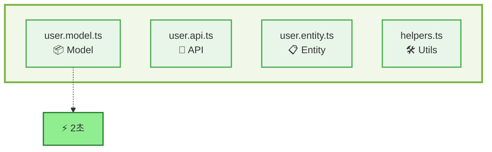
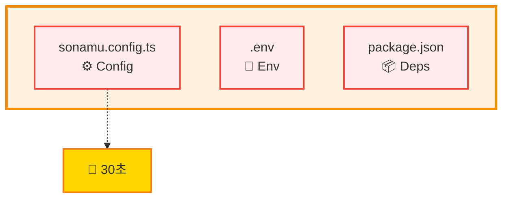

import { FileTree, FileItem } from "../../../snippets/FileTree.jsx";

Boundary는 HMR 시스템이 모듈을 안전하게 교체할 수 있는 경계를 정의합니다. Sonamu로 개발할 때 Boundary를 제대로 이해하면 HMR을 최대한 활용할 수 있습니다.

## Boundary란?

Boundary는 "재로드 가능한 경계"를 의미합니다. HMR 시스템은 다음과 같은 규칙으로 동작합니다:

- **Boundary 파일**: 변경 시 다시 로드될 수 있는 파일 (Model, API, Entity 등)
- **Non-boundary 파일**: 변경 시 전체 서버 재시작이 필요한 파일 (설정, 환경변수 등)

**✅ Boundary 파일**: 수정 시 HMR로 즉시 반영



**❌ Non-boundary 파일**: 수정 시 서버 재시작 필요



### 왜 Boundary가 필요한가?

정적 import는 Node.js 시작 시 한 번만 실행되므로 런타임에 교체할 수 없습니다:

```typescript
// ❌ 정적 import - HMR 불가
import { UserModel } from "./user.model";

// ✅ 동적 import - HMR 가능
const { UserModel } = await import("./user.model");
```

Boundary로 지정된 파일은 **반드시 동적으로 import**되어야 하며, 그래야만 변경 시 최신 코드를 가져올 수 있습니다.

## Sonamu의 Boundary 설정

Sonamu는 기본적으로 프로젝트의 모든 TypeScript 파일을 Boundary로 설정합니다:

```typescript
// hmr-hook-register.ts
await hot.init({
  rootDirectory: process.env.API_ROOT_PATH,
  boundaries: [`./src/**/*.ts`],  // 모든 .ts 파일이 boundary
});
```

이 설정으로 인해 `src/` 아래의 모든 파일은 HMR이 가능하며, 변경 시 자동으로 재로드됩니다.

### Boundary 파일 예시

**Boundary 파일들 (HMR 가능):**

- `user.model.ts` - Model 파일
- `user.api.ts` - API 파일
- `user.entity.ts` - Entity 정의
- `helpers.ts` - 유틸리티 함수
- `constants.ts` - 상수 정의

**Non-boundary 파일들 (재시작 필요):**

- `sonamu.config.ts` - Sonamu 설정
- `.env` - 환경변수
- `package.json` - 의존성

## Boundary 규칙

### 1. 동적 Import 필수

Boundary 파일은 반드시 동적으로 import되어야 합니다.

**❌ 잘못된 예: 정적 import**

```typescript
// server.ts
import { UserModel } from "./application/user/user.model";

// UserModel을 수정해도 반영되지 않음!
app.get("/users", async (req, res) => {
  const users = await UserModel.findMany();
  res.json(users);
});
```

**✅ 올바른 예: 동적 import**

```typescript
// server.ts
app.get("/users", async (req, res) => {
  const { UserModel } = await import("./application/user/user.model");
  
  // UserModel을 수정하면 다음 요청 시 최신 코드가 로드됨!
  const users = await UserModel.findMany();
  res.json(users);
});
```

### Sonamu는 자동으로 처리합니다

다행히 Sonamu의 Syncer는 Entity 기반 파일들을 자동으로 동적 import합니다:

```typescript
// syncer.ts - autoloadModels()
async autoloadModels() {
  for (const entity of entities) {
    const modelPath = `${entity.path}/${entity.id}.model`;
    
    // 동적 import로 로드 ✅
    const module = await import(modelPath);
    this.models[entity.id] = module[`${entity.id}Model`];
  }
}
```

**즉, 일반적인 Sonamu 개발에서는 신경 쓸 필요가 없습니다!**

### 2. Boundary 간 정적 Import 허용

Boundary 파일끼리는 정적 import가 가능합니다 (Sonamu의 개선사항):

```typescript
// user.model.ts (boundary)
import { PostModel } from "./post.model";  // ✅ OK - 둘 다 boundary

export class UserModel extends BaseModelClass {
  async getPosts() {
    return PostModel.findMany({ where: { userId: this.id } });
  }
}
```

이것이 가능한 이유:
- 두 파일 모두 Boundary이므로
- 둘 다 Syncer에 의해 동적으로 로드됨
- 서로 참조해도 HMR이 정상 작동함

### 3. Non-boundary의 Boundary Import 제한

Non-boundary 파일이 Boundary를 정적 import하면 HMR이 작동하지 않습니다:

```typescript
// server.ts (non-boundary)
import { UserModel } from "./user.model";  // ❌ 전체 재시작 필요

// server.ts (non-boundary) - 올바른 방법
async function loadModels() {
  const { UserModel } = await import("./user.model");  // ✅ OK
}
```

## 실전 시나리오

### User-Post 관계에서 HMR 활용하기

**상황**: User Entity의 `role` 필드를 추가하고, Post API에서 작성자 권한 체크를 추가하려고 합니다.

**1단계: Entity 수정**

```typescript
// Sonamu UI에서 User에 role 추가
role: EnumProp<"admin" | "user">
```

저장하면 HMR이 자동으로:
- `user.entity.ts` 업데이트
- `user.types.ts` 재생성
- `UserModel` 재로드

콘솔 출력:

```bash
🔄 Invalidated:
- src/application/user/user.entity.ts
- src/application/user/user.model.ts
```

**2단계: Model 로직 추가**

```typescript
// user.model.ts
export class UserModel extends BaseModelClass {
  isAdmin(): boolean {
    return this.role === "admin";
  }
  
  canCreatePost(): boolean {
    return this.isAdmin() || this.role === "user";
  }
}
```

저장하면 HMR이:
- `UserModel` 재로드
- `UserModel`을 사용하는 모든 API 재로드

**3단계: API에 권한 체크 추가**

```typescript
// post.api.ts
import { UserModel } from "../user/user.model";  // ✅ 둘 다 boundary

@api({ httpMethod: "POST" })
async create(body: PostForm) {
  const user = await UserModel.findById(body.userId);
  
  if (!user.canCreatePost()) {  // 👈 방금 추가한 메서드 바로 사용!
    throw new UnauthorizedError("You don't have permission to create posts");
  }
  
  return PostModel.save(body);
}
```

저장하면 HMR이:
- `PostApi.create` 재등록
- **서버 재시작 없이 바로 테스트 가능!**

```bash
🔄 Invalidated:
- src/application/post/post.api.ts

✨ API re-registered: POST /api/post/create
```

---

**전통적 방식이라면:**

1. Entity 수정
2. Types 파일 수동 생성
3. Model 파일 수정
4. 서버 재시작 (30초)
5. API 파일 수정
6. 서버 재시작 (30초)
7. 테스트

**Sonamu + HMR:**

1. Entity 수정 (자동 생성)
2. Model 파일 수정 (자동 재로드)
3. API 파일 수정 (자동 재로드)
4. 테스트 ✅

**3번의 재시작(90초)이 0번으로!**

### 복잡한 비즈니스 로직 개발

**상황**: 주문 생성 시 재고 확인, 결제 처리, 알림 발송을 구현합니다.

**파일 구조:**

<Card>
<FileTree>
  <FileItem name="src/application/">
    <FileItem name="product/">
      <FileItem name="product.model.ts" description="재고 체크" />
    </FileItem>
    <FileItem name="order/">
      <FileItem name="order.model.ts" description="주문 생성" />
      <FileItem name="order.api.ts" description="API 엔드포인트" />
    </FileItem>
    <FileItem name="payment/">
      <FileItem name="payment.service.ts" description="결제 처리" />
    </FileItem>
    <FileItem name="notification/">
      <FileItem name="notification.service.ts" description="알림 발송" />
    </FileItem>
  </FileItem>
</FileTree>
</Card>

**1단계: 재고 체크 로직**

```typescript
// product.model.ts
export class ProductModel extends BaseModelClass {
  hasStock(quantity: number): boolean {
    return this.stock >= quantity;
  }
  
  async reserveStock(quantity: number) {
    if (!this.hasStock(quantity)) {
      throw new BadRequestError("Out of stock");
    }
    
    await this.update({ stock: this.stock - quantity });
  }
}
```

저장 → 2초 후 → 즉시 반영 ✅

**2단계: 주문 생성 로직**

```typescript
// order.model.ts
import { ProductModel } from "../product/product.model";  // ✅ OK
import { PaymentService } from "../payment/payment.service";

export class OrderModel extends BaseModelClass {
  static async createOrder(productId: number, quantity: number, userId: number) {
    const product = await ProductModel.findById(productId);
    
    // ProductModel.reserveStock()을 바로 사용 가능!
    await product.reserveStock(quantity);
    
    const order = await this.save({
      productId,
      quantity,
      userId,
      totalPrice: product.price * quantity,
      status: "pending",
    });
    
    return order;
  }
}
```

저장 → ProductModel 의존성도 자동 재로드 ✅

**3단계: API 엔드포인트**

```typescript
// order.api.ts
import { OrderModel } from "./order.model";

@api({ httpMethod: "POST" })
async create(body: { productId: number; quantity: number }) {
  const userId = getSonamuContext().userId!;
  
  // OrderModel.createOrder()를 바로 사용!
  const order = await OrderModel.createOrder(
    body.productId,
    body.quantity,
    userId
  );
  
  return order;
}
```

저장 → API 재등록 → **즉시 Postman에서 테스트!**

**HMR 로그:**

```bash
🔄 Invalidated:
- src/application/product/product.model.ts
- src/application/order/order.model.ts
- src/application/order/order.api.ts (with 3 APIs)

✨ API re-registered: POST /api/order/create

✅ All files are synced!
```

## import.meta.hot API

Boundary 파일에서는 `import.meta.hot` API를 사용하여 HMR 동작을 세밀하게 제어할 수 있습니다.

### dispose() - 리소스 정리

모듈이 재로드되기 전에 정리 작업을 수행합니다:

```typescript
// notification.service.ts
export class NotificationService {
  private static timer: NodeJS.Timeout;
  
  static startPolling() {
    this.timer = setInterval(() => {
      console.log("Checking notifications...");
    }, 5000);
  }
}

// 재로드 전 타이머 정리
import.meta.hot?.dispose(() => {
  clearInterval(NotificationService.timer);
  console.log("Cleaned up notification polling timer");
});
```

**리소스 정리가 필요한 경우:**

- 타이머/인터벌 정리
- 이벤트 리스너 제거
- WebSocket 연결 종료
- 데이터베이스 커넥션 풀 정리
- 파일 핸들 닫기

**실제 사용 예시:**

```typescript
// websocket-manager.ts
class WebSocketManager {
  private static connections = new Map<string, WebSocket>();
  
  static connect(url: string) {
    const ws = new WebSocket(url);
    this.connections.set(url, ws);
    return ws;
  }
}

import.meta.hot?.dispose(() => {
  // 모든 WebSocket 연결 종료
  for (const [url, ws] of WebSocketManager.connections) {
    ws.close();
    console.log(`Closed WebSocket: ${url}`);
  }
  WebSocketManager.connections.clear();
});
```

### decline() - 전체 재시작 요구

특정 모듈을 HMR에서 제외하고 전체 재시작을 요구합니다:

```typescript
// config.ts
export const config = {
  database: {
    host: process.env.DB_HOST,
    port: parseInt(process.env.DB_PORT),
  },
  redis: {
    host: process.env.REDIS_HOST,
    port: parseInt(process.env.REDIS_PORT),
  },
};

// 이 파일이 변경되면 전체 재시작
import.meta.hot?.decline();
```

**decline()을 사용해야 하는 경우:**

- 전역 설정 파일
- 데이터베이스 연결 설정
- 초기화가 복잡한 싱글톤
- 상태 관리가 까다로운 모듈

**실제 사용 예시:**

```typescript
// database.config.ts
import { Sonamu } from "@sonamu-kit/sonamu";

export const dbPool = new Pool({
  host: Sonamu.config.database.host,
  port: Sonamu.config.database.port,
  user: Sonamu.config.database.user,
  password: Sonamu.config.database.password,
  database: Sonamu.config.database.database,
});

// DB 연결 설정 변경은 재시작 필요
import.meta.hot?.decline();
```

### boundary 객체 - 상태 공유

Boundary 간 데이터를 공유하여 재로드 후에도 상태를 유지합니다:

```typescript
// cache-manager.ts
const cache = import.meta.hot?.boundary.userCache || new Map();

export class CacheManager {
  static set(key: string, value: any) {
    cache.set(key, value);
  }
  
  static get(key: string) {
    return cache.get(key);
  }
}

// 재로드 시에도 캐시 유지
import.meta.hot?.boundary.userCache = cache;
```

**실제 사용 예시:**

```typescript
// rate-limiter.ts
const requestCounts = import.meta.hot?.boundary.requestCounts || new Map<string, number>();

export class RateLimiter {
  static check(userId: string): boolean {
    const count = requestCounts.get(userId) || 0;
    
    if (count >= 100) {
      return false;  // Rate limit exceeded
    }
    
    requestCounts.set(userId, count + 1);
    return true;
  }
}

// HMR 후에도 요청 카운트 유지
import.meta.hot?.boundary.requestCounts = requestCounts;
```

<Warning>
`boundary` 객체는 HMR 사이클 간 데이터를 유지하지만, 서버 재시작 시에는 초기화됩니다. 영구 저장이 필요한 데이터는 데이터베이스나 Redis를 사용하세요.
</Warning>

## 타입 정의

TypeScript에서 `import.meta.hot`을 사용하려면 타입 정의가 필요합니다:

```typescript
// src/types/import-meta.d.ts
interface ImportMeta {
  readonly hot?: {
    dispose(callback: () => Promise<void> | void): void;
    decline(): void;
    boundary: Record<string, any>;
  };
}
```

Sonamu 프로젝트에는 이미 타입 정의가 포함되어 있으므로 별도 설정이 필요 없습니다.

## 디버깅

### Boundary 설정 확인

특정 파일이 Boundary로 설정되어 있는지 확인:

```typescript
const dump = await hot.dump();
const userModel = dump.find(d => d.nodePath.includes("user.model.ts"));

console.log(`Boundary: ${userModel?.boundary}`);       // true
console.log(`Reloadable: ${userModel?.reloadable}`);   // true
console.log(`Children:`, userModel?.children);          // 의존하는 파일들
```

출력 예시:

```json
{
  "nodePath": "/project/src/application/user/user.model.ts",
  "boundary": true,
  "reloadable": true,
  "children": [
    "/project/src/application/user/user.api.ts",
    "/project/src/application/post/post.api.ts",
    "/project/src/application/admin/admin.api.ts"
  ]
}
```

### 의존성 트리 시각화

```typescript
const dump = await hot.dump();

for (const node of dump) {
  if (node.boundary) {
    console.log(`📦 ${node.nodePath}`);
    
    for (const child of node.children || []) {
      console.log(`   └─ ${child}`);
    }
  }
}
```

출력:

```
📦 /project/src/application/user/user.model.ts
   └─ /project/src/application/user/user.api.ts
   └─ /project/src/application/post/post.api.ts

📦 /project/src/application/post/post.model.ts
   └─ /project/src/application/post/post.api.ts
```

<Tip>
개발 중 HMR이 작동하지 않는다면:
1. 해당 파일이 Boundary로 지정되어 있는지 확인
2. 동적으로 import되는지 확인
3. 순환 의존성이 없는지 확인
</Tip>

## 성능 최적화

### 불필요한 Boundary 제외

모든 파일을 Boundary로 설정하면 의존성 트리가 커져서 느려질 수 있습니다:

```typescript
// hmr-hook-register.ts
await hot.init({
  rootDirectory: process.env.API_ROOT_PATH,
  boundaries: [
    // 자주 변경되는 파일만 Boundary로
    "./src/**/*.model.ts",
    "./src/**/*.api.ts",
    "./src/**/*.service.ts",
  ],
});
```

### 의존성 최소화

Model 간 순환 참조를 피하고, 필요한 것만 import:

```typescript
// ❌ 나쁜 예
import { UserModel } from "../user/user.model";
import { PostModel } from "../post/post.model";
import { CommentModel } from "../comment/comment.model";
// ... 많은 import

// ✅ 좋은 예
import { UserModel } from "../user/user.model";  // 실제로 사용하는 것만
```

## 요약

Sonamu의 Boundary 시스템:

✅ **자동 처리**: Syncer가 Entity 기반 파일을 자동으로 동적 import  
✅ **Boundary 간 참조 가능**: Model끼리 정적 import 허용  
✅ **세밀한 제어**: `import.meta.hot` API로 리소스 정리, 상태 유지  
✅ **디버깅 도구**: `hot.dump()`로 의존성 트리 확인

대부분의 경우 Boundary를 신경 쓸 필요 없이 Sonamu가 자동으로 처리합니다!
