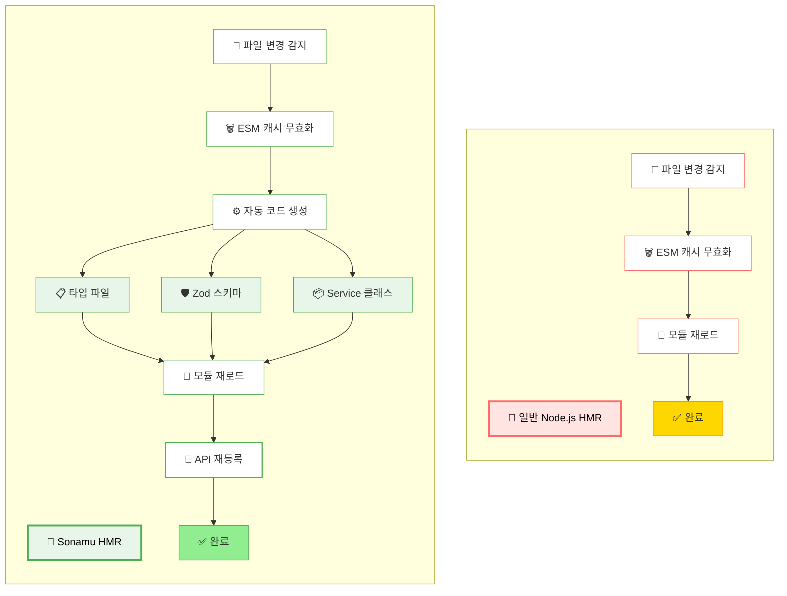
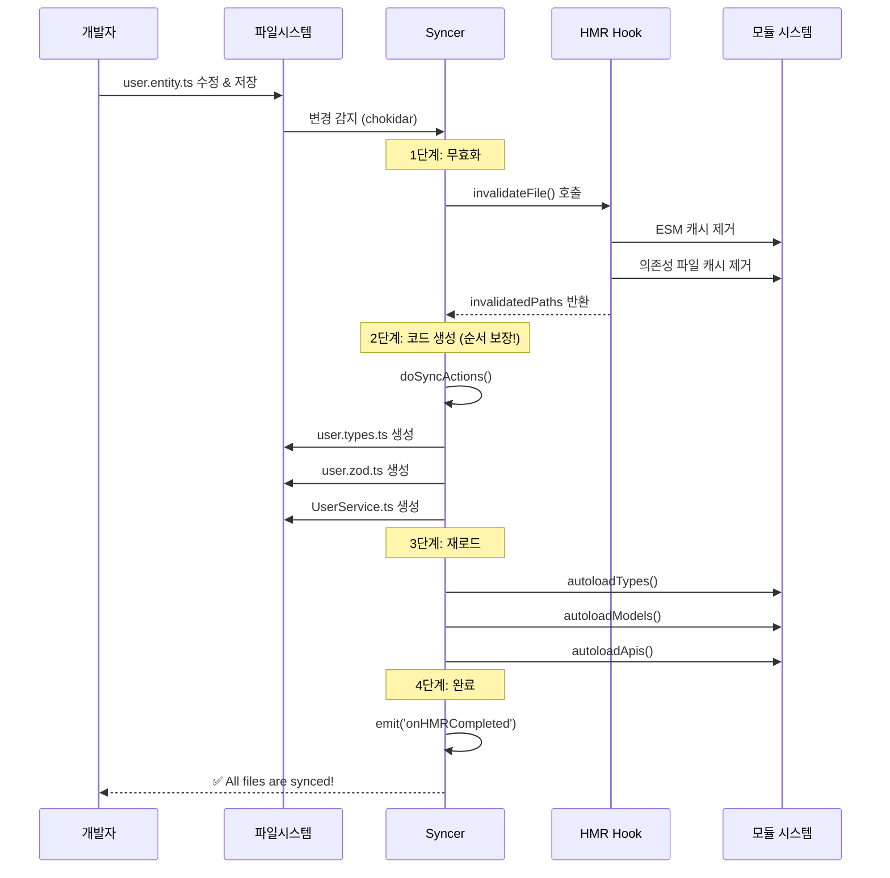
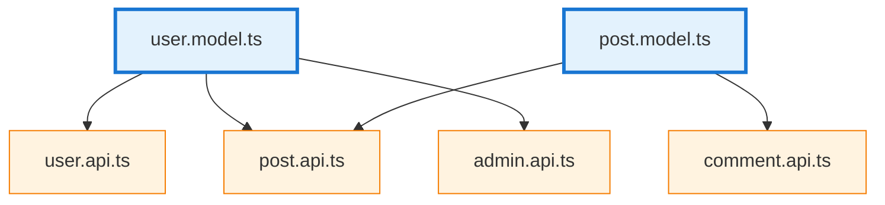

## 서버 재시작 없이 개발하기

Sonamu로 개발할 때는 이렇습니다:

1. 코드 수정
2. 저장 (Cmd+S)
3. **끝!** 👈 바로 반영됨

브라우저를 새로고침하거나, 서버를 재시작하거나, 빌드 명령어를 실행할 필요가 없습니다.

### 실제 개발 속도 차이

**HMR 없이 (전통적 방식):**

```bash
# Entity 수정 → 서버 재시작 → 테스트
1. Sonamu UI에서 Entity 수정
2. Ctrl+C (서버 종료)
3. pnpm dev (서버 재시작)
4. 20~30초 대기...
5. 테스트

반복할 때마다 30초씩 낭비 😫
```

**HMR 있을 때 (Sonamu 방식):**

```bash
# Entity 수정 → 즉시 반영
1. Sonamu UI에서 Entity 수정
2. 2초 후 콘솔에 🔄 Invalidated 로그
3. 테스트

반복해도 2초면 충분 🚀
```

**하루에 Entity/API를 50번 수정한다면?**

- HMR 없이: 50 × 30초 = **25분 낭비**
- HMR 있을 때: 50 × 2초 = **1.7분**

## 다른 프레임워크와의 차이

| 프레임워크 | HMR 지원         | 자동 생성 코드 싱크 | Entity 변경 반영 |
| ---------- | ---------------- | ------------------- | ---------------- |
| NestJS     | ❌ 없음          | -                   | 수동 재시작 필요 |
| Express    | ❌ 없음          | -                   | nodemon 재시작   |
| Fastify    | ⚠️ 부분 지원     | -                   | 수동 재시작 필요 |
| **Sonamu** | **✅ 완전 지원** | **✅ 자동**         | **✅ 즉시 반영** |

### Sonamu만의 특별함

일반적인 Node.js HMR:

- 단순히 파일 재로드만 함
- 자동 생성 코드는 직접 관리 필요
- Entity 변경 시 여러 파일 수동 수정

**Sonamu HMR:**

- 파일 재로드 + Syncer 자동 실행
- Entity 변경 → 모든 관련 코드 자동 생성/업데이트
- 의존하는 모든 파일 자동 재로드
- API 자동 재등록



## 실제 개발 시나리오

### 시나리오 1: Entity 필드 추가하기

User Entity에 `nickname` 필드를 추가하는 과정:

**1단계: Sonamu UI에서 필드 추가**

```typescript
// User Entity에 nickname 추가
nickname: StringProp({ maxLength: 50 });
```

**2단계: 저장하면 즉시**

- `user.entity.ts` 자동 업데이트
- `user.types.ts` 타입 자동 생성
- `user.zod.ts` Zod 스키마 자동 생성
- `UserModel` 자동 재로드
- 모든 UserApi 메서드 자동 재등록
- 프론트엔드 `UserService` 자동 업데이트

**3단계: 콘솔 확인**

```bash
🔄 Invalidated:
- src/application/user/user.entity.ts
- src/application/user/user.model.ts (with 8 APIs)
- src/application/user/user.api.ts

✅ All files are synced!
```

**4단계: 테스트**

```bash
# 서버 재시작 없이 바로 API 호출
curl http://localhost:3000/api/user/1
{
  "id": 1,
  "name": "John",
  "nickname": null  // 👈 새 필드가 즉시 반영됨!
}
```

⏱️ **HMR 있을 때**: 2초  
⏱️ **HMR 없을 때**: 30초 (서버 재시작 + 재컴파일)

### 시나리오 2: API 로직 수정하기

`UserApi.list()`에 페이지네이션과 검색 기능 추가:

```typescript
// user.api.ts 수정 전
@api({ httpMethod: "GET" })
async list() {
  return UserModel.findMany();
}
```

```typescript
// user.api.ts 수정 후
@api({ httpMethod: "GET" })
async list(listParams: ListParams & { keyword?: string }) {
  const where = listParams.keyword
    ? { name: { $like: `%${listParams.keyword}%` } }
    : undefined;

  return UserModel.findMany({
    where,
    limit: listParams.num,
    offset: (listParams.page - 1) * listParams.num,
  });
}
```

저장하면:

```bash
🔄 Invalidated:
- src/application/user/user.api.ts

✨ API re-registered: GET /api/user/list
```

**즉시 Postman/Thunder Client에서 테스트 가능!**

```bash
GET /api/user/list?keyword=john&page=1&num=10
# 바로 동작함 ✅
```

### 시나리오 3: Model 비즈니스 로직 추가

User의 활성 상태 체크 로직 추가:

```typescript
// user.model.ts
export class UserModel extends BaseModelClass {
  static async findActive() {
    return this.findMany({
      where: { status: "active", deletedAt: null },
    });
  }

  isActive(): boolean {
    return this.status === "active" && !this.deletedAt;
  }
}
```

저장 → 2초 후 → 다른 API에서 바로 사용 가능:

```typescript
// post.api.ts
@api({ httpMethod: "POST" })
async create(body: PostForm) {
  const user = await UserModel.findById(body.userId);

  if (!user.isActive()) {  // 👈 방금 추가한 메서드 바로 사용!
    throw new BadRequestError("User is not active");
  }

  return PostModel.save(body);
}
```

## Sonamu HMR의 혁신: Syncer 통합

일반적인 Node.js HMR은 "파일이 바뀌었네? 다시 불러오자"가 전부입니다.

하지만 Sonamu는 다릅니다.

### 문제: 자동 생성 코드의 딜레마

Sonamu는 Entity 기반으로 수많은 코드를 자동 생성합니다:

- TypeScript 타입 파일 (`*.types.ts`)
- Zod 스키마 (`*.zod.ts`)
- API 라우트 등록
- 프론트엔드 Service 클래스

**만약 Syncer와 HMR이 따로 동작한다면:**

```
User Entity 수정
  ↓
Syncer가 파일 생성 시작...
  ↓
HMR이 감지해서 재로드 시작... ← 🚨 아직 생성 중인데!
  ↓
타이밍 꼬임 → 오류 발생
```

### Sonamu의 해결책

Watcher가 모은 파일 이벤트들을 Syncer가 한 진입점(`hmrAndSync`)에서 받아 HMR과 sync를 영역별로
분리해서 처리합니다:

```typescript
// syncer.ts
async hmrAndSync(fileEvents: Map<AbsolutePath, "change" | "add">) {
  // 1. HMR 영역: api/src 모듈 그래프 invalidate
  //    cpg(checksum pattern group) 매칭과 무관하게 진행
  for (const [filePath, event] of fileEvents) {
    await hot.invalidateFile(filePath, event);
  }

  // 2. Sync 영역: cpg에 매칭되는 파일들에 doSyncActions
  //    (자동 생성 코드 싱크 완료 — 순서 보장!)
  await this.doSyncActions(matchedFiles);

  // 3. 이제 안전하게 모듈 재로드
  await this.autoloadTypes();
  await this.autoloadModels();
  await this.autoloadApis();
  await this.autoloadWorkflows();

  // 4. 완료!
  this.eventEmitter.emit("onHMRCompleted");
}
```

**순서가 보장되므로:**

1. 코드 생성이 완전히 끝난 후
2. 재로드가 시작됨
3. 항상 최신 코드가 로드됨 ✅

<Note>
  Watcher는 100ms 전역 batch 큐잉으로 변경 이벤트를 모은 뒤 `hmrAndSync`를 한 번 호출합니다. 한
  시점에 사이클은 하나만 돌도록 직렬화됩니다.
</Note>

이것이 Sonamu HMR이 단순히 "빠른" 것을 넘어 **안전하고 믿을 수 있는** 이유입니다.



## HMR 아키텍처

### 주요 컴포넌트

Sonamu의 HMR 시스템은 세 가지 핵심 컴포넌트로 구성됩니다:

**1. @sonamu-kit/hmr-hook**

[hot-hook](https://github.com/Julien-R44/hot-hook)을 fork하여 Sonamu에 맞게 커스터마이징한 패키지입니다.

```typescript
// hmr-hook-register.ts
if (process.env.HOT === "yes" && process.env.API_ROOT_PATH) {
  const { hot } = await import("@sonamu-kit/hmr-hook");

  await hot.init({
    rootDirectory: process.env.API_ROOT_PATH,
    boundaries: [`./src/**/*.ts`], // 모든 .ts 파일이 HMR 대상
  });

  console.log("🔥 HMR-hook initialized");
}
```

Node.js의 Module Loader API를 사용하여 모듈 로딩 과정에 개입합니다.

**2. Dependency Tree**

파일 간 의존성을 트리 구조로 추적합니다:

```
user.model.ts
  ├─ user.api.ts
  ├─ post.api.ts
  └─ admin.api.ts
```

`user.model.ts`가 변경되면 의존하는 3개 파일도 함께 재로드됩니다.



**예시**: `user.model.ts`가 변경되면 의존하는 3개 파일(`user.api.ts`, `post.api.ts`, `admin.api.ts`)도 함께 재로드됩니다.

**3. Watcher + Syncer**

`syncer/watcher.ts`(chokidar 글루)가 파일 이벤트를 4단 1차 가드로 거른 뒤 100ms 전역 batch로 큐잉,
한 번에 모아서 Syncer의 `hmrAndSync`를 호출합니다:

```typescript
// 1차 가드: 무관한 변경을 watcher 진입에서 거름
//   - isWantedEvent: "change" | "add"만 통과 (unlink 제외)
//   - isConfigChange: sonamu.config.ts는 별도 경로
//   - isOutOfScope: api/src 또는 cpg 매칭 안되면 컷
//   - isLastChangedByMe: self-write echo 차단 (mtime 비교)
const fileEvents = await collectBatch(); // 100ms 전역 trailing debounce

await syncer.hmrAndSync(fileEvents);
```

## HMR 프로세스 상세

개발자가 파일을 수정하면 다음 과정이 자동으로 실행됩니다:

### 1. 파일 변경 감지

```typescript
// chokidar로 파일시스템 감시
watcher.on("change", (filePath) => {
  console.log(`File changed: ${filePath}`);
});
```

### 2. 모듈 무효화

```typescript
// ESM 캐시 제거
const invalidatedPaths = await hot.invalidateFile(diffFilePath, "change");
// ["src/user/user.model.ts", "src/user/user.api.ts", ...]
```

변경된 파일의 ESM import 캐시를 제거하고, Dependency Tree를 탐색하여 의존하는 모든 파일의 캐시도 제거합니다.

### 3. 자동 생성 코드 싱크

Entity나 Model이 변경된 경우, Syncer가 관련 코드를 자동 생성합니다:

```typescript
await this.doSyncActions([diffFilePath]);
```

생성되는 파일:

- TypeScript 타입 파일 (`user.types.ts`)
- Zod 스키마 (`user.zod.ts`)
- 프론트엔드 Service (`UserService.ts`)

### 4. 모듈 재로드

```typescript
await this.autoloadTypes();
await this.autoloadModels();
await this.autoloadApis();
await this.autoloadWorkflows();
```

무효화된 모듈은 캐시가 제거된 상태이므로 최신 코드가 로드됩니다.

### 5. API 재등록

Model 파일이 변경되면 해당 Model의 모든 API를 재등록합니다:

```typescript
removeInvalidatedRegisteredApis(invalidatedPath: AbsolutePath) {
  const entityId = EntityManager.getEntityIdFromPath(invalidatedPath);
  const toRemove = registeredApis.filter((api) => api.modelName === `${entityId}Model`);

  for (const api of toRemove) {
    registeredApis.splice(registeredApis.indexOf(api), 1);
  }

  return toRemove;
}
```

콘솔 출력:

```bash
🔄 Invalidated:
- src/user/user.model.ts (with 8 APIs)
```

## 원본 hot-hook과의 차이점

Sonamu의 `@sonamu-kit/hmr-hook`은 원본 hot-hook을 fork하여 다음과 같이 개선했습니다:

### 1. 변수 기반 동적 Import 허용

```typescript
// 원본 hot-hook: ❌ 불가능
const modelPath = `./models/${entityId}.model`;
await import(modelPath); // 에러 발생!

// Sonamu hmr-hook: ✅ 가능
const modelPath = `./models/${entityId}.model`;
await import(modelPath); // 정상 동작
```

Sonamu는 Entity 기반 구조라 경로를 동적으로 생성해야 하므로 이 기능이 필수적입니다.

### 2. Boundary 간 정적 Import 허용

```typescript
// user.model.ts (boundary)
import { PostModel } from "./post.model"; // 원본: ❌ / Sonamu: ✅

export class UserModel extends BaseModelClass {
  async getPosts() {
    return PostModel.findMany({ where: { userId: this.id } });
  }
}
```

Model 간 참조가 자주 발생하므로 정적 import를 허용했습니다.

### 3. 파일시스템 워처 비활성화

원본은 자체 파일 워처를 사용하지만, Sonamu는 Syncer의 워처만 사용합니다:

```typescript
// Syncer가 파일 변경을 감지하면 HMR에 직접 알림
await hot.invalidateFile(filePath, "change");
```

이를 통해 코드 생성과 모듈 무효화의 **순서를 정확히 제어**합니다.

### 4. ts-loader와의 통합 개선

TypeScript 컴파일 후 `dist/*.js` 경로와 원본 `src/*.ts` 경로의 불일치를 해결했습니다.

## 성능 최적화

### 선택적 무효화

변경된 파일과 그 의존성만 무효화하므로 불필요한 재로드를 방지합니다:

```typescript
// user.types.ts 변경 → user.model.ts만 재로드
// 전체 프로젝트가 아닌 영향받는 파일만!
```

### 체크섬 기반 변경 감지

실제 내용이 변경된 파일만 처리합니다:

```typescript
const changedFiles = await findChangedFilesUsingChecksums();
if (changedFiles.length === 0) {
  console.log(chalk.black.bgGreen("All files are synced!"));
  return;
}
```

파일이 저장되었어도 내용이 같으면 싱크하지 않습니다.

### Graceful Shutdown 처리

싱크 작업 중 프로세스 종료를 방지합니다:

```typescript
await runWithGracefulShutdown(
  async () => {
    await this.doSyncActions(changedFiles);
    await renewChecksums();
  },
  { whenThisHappens: "SIGUSR2", waitForUpTo: 20000 },
);
```

Nodemon 재시작 시그널을 받아도 싱크가 완료될 때까지 20초간 대기합니다.

## HMR 활성화

개발 모드에서 자동으로 활성화됩니다:

```bash
pnpm dev  # HOT=yes가 자동 설정됨
```

환경변수로 제어할 수도 있습니다:

```bash
# HMR 활성화
HOT=yes pnpm dev

# HMR 비활성화 (디버깅 시)
HOT=no pnpm dev
```

<Note>프로덕션 빌드에서는 HMR이 자동으로 비활성화되며, 정적 빌드가 생성됩니다.</Note>

## 개발 팁

### HMR 상태 확인

```typescript
// 터미널에 출력되는 로그 확인
🔥 HMR-hook initialized

// 파일 변경 시
🔄 Invalidated:
- src/user/user.model.ts (with 8 APIs)
- src/user/user.api.ts

✅ All files are synced!
```

### 느려진 것 같다면

파일을 수정했는데 반영이 느려진 것 같다면:

```bash
# 의존성 트리 확인
const dump = await hot.dump();
console.log(`Total modules: ${dump.length}`);
console.log(`Boundaries: ${dump.filter(d => d.boundary).length}`);
```

의존성이 너무 많으면 import 구조를 개선하세요.

### 재시작이 필요한 변경사항

다음 파일들을 수정하면 서버를 재시작해야 합니다:

- `sonamu.config.ts` - 설정 파일
- `.env` - 환경변수
- `package.json` - 의존성

이런 파일들은 `import.meta.hot?.decline()`으로 표시되어 있어 변경 시 자동으로 재시작을 요구합니다.
