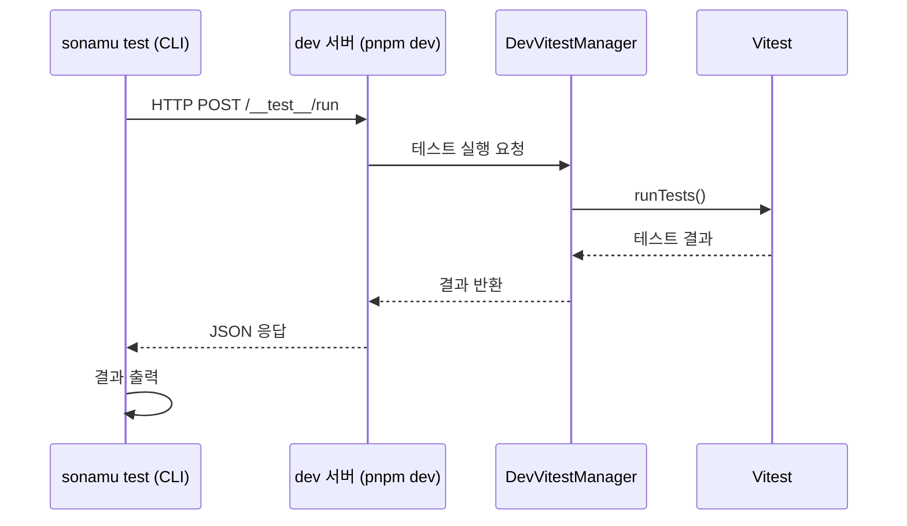

`pnpm sonamu test` 명령어는 실행 중인 **dev 서버의 Vitest 인스턴스**를 통해 테스트를 실행합니다. dev 서버가 이미 로드한 모듈을 재사용하므로 매번 초기화하는 `pnpm test`보다 빠르게 피드백을 받을 수 있습니다.

## 전제조건

이 명령어를 사용하려면 두 가지가 필요합니다:

1. `sonamu.config.ts`에서 `devRunner` 활성화
2. `pnpm dev`로 dev 서버가 실행 중

### sonamu.config.ts 설정

```typescript title="api/src/sonamu.config.ts"
export default defineConfig({
  // ... 다른 설정
  test: {
    devRunner: {
      enabled: true,
      routePrefix: "/__test__",            // 선택, 기본값
      vitestConfigPath: "vitest.config.ts", // 선택, api-root 상대경로
    },
  },
});
```

### 설정 옵션

| 옵션 | 타입 | 기본값 | 설명 |
|------|------|--------|------|
| `enabled` | `boolean` | `false` | DevRunner 활성화 여부 |
| `routePrefix` | `string` | `"/__test__"` | 테스트 엔드포인트 경로 접두사 |
| `vitestConfigPath` | `string` | - | vitest.config.ts 경로 (api-root 상대경로) |

## 기본 사용법

```bash
# 전체 테스트 실행
pnpm sonamu test

# 특정 파일 실행
pnpm sonamu test src/application/user/user.test.ts

# 이름 패턴으로 필터링
pnpm sonamu test --pattern "findMany"

# 파일 + 패턴 조합
pnpm sonamu test src/application/user/user.test.ts --pattern "findById"
```

### 옵션

| 옵션 | 단축 | 설명 |
|------|------|------|
| `--pattern <이름>` | `-p <이름>` | 테스트 이름 패턴으로 필터링 |

<Tip>
파일 경로는 여러 개를 지정할 수 있습니다:
```bash
pnpm sonamu test src/application/user/user.test.ts src/application/post/post.test.ts
```
</Tip>

## 동작 원리

`pnpm sonamu test`는 dev 서버 내부에 상주하는 Vitest 인스턴스를 HTTP 요청으로 호출합니다.



1. CLI가 dev 서버의 `/__test__/run` 엔드포인트에 POST 요청을 보냅니다.
2. dev 서버의 `DevVitestManager`가 상주 Vitest 인스턴스로 테스트를 실행합니다.
3. 결과를 JSON으로 반환하면 CLI가 요약을 출력합니다.

## `pnpm test`와의 비교

| | `pnpm test` | `pnpm sonamu test` |
|---|---|---|
| 서버 필요 | 불필요 | `pnpm dev` 실행 중 필요 |
| 실행 속도 | 매번 초기화 | Vitest 인스턴스 재사용 (빠름) |
| HMR 연동 | 없음 | 코드 변경 즉시 반영 |
| 용도 | CI, 전체 테스트 | 개발 중 빠른 피드백 |

<Info>
**언제 어떤 것을 사용하나요?**

- **개발 중**: `pnpm sonamu test`로 빠르게 피드백을 받으세요. 코드를 수정하고 바로 테스트를 실행할 수 있습니다.
- **CI/CD**: `pnpm test`를 사용하세요. 독립적인 환경에서 전체 테스트를 실행합니다.
</Info>

## 상태 확인

dev 서버의 DevRunner 상태를 확인하려면 `/__test__/status` 엔드포인트를 사용합니다:

```bash
curl http://localhost:3000/__test__/status
```

```json
{
  "ready": true,
  "running": false,
  "lastRunAt": "2026-02-23T10:30:00.000Z"
}
```

| 필드 | 설명 |
|------|------|
| `ready` | Vitest 인스턴스가 준비되었는지 여부 |
| `running` | 현재 테스트가 실행 중인지 여부 |
| `lastRunAt` | 마지막 테스트 실행 시각 |

## 문제 해결

### dev 서버에 연결할 수 없는 경우

```
dev 서버에 연결할 수 없습니다. sonamu dev가 실행 중인지 확인하세요
```

**해결**: `pnpm dev`로 dev 서버를 먼저 시작하세요.

### devRunner가 활성화되지 않은 경우

```
devRunner가 활성화되지 않았습니다. sonamu.config.ts에서 test.devRunner.enabled: true 설정이 필요합니다
```

**해결**: `sonamu.config.ts`의 `test.devRunner.enabled`를 `true`로 설정하고 dev 서버를 재시작하세요.

## 다음 단계

<CardGroup cols={2}>
  <Card title="테스트 구조" icon="vial" href="/testing/writing-tests/test-structure">
    Vitest 기반 테스트 시스템 알아보기
  </Card>
  <Card title="dev" icon="code" href="/tools-and-cli/sonamu-cli/dev">
    개발 서버 자세히 알아보기
  </Card>
</CardGroup>
